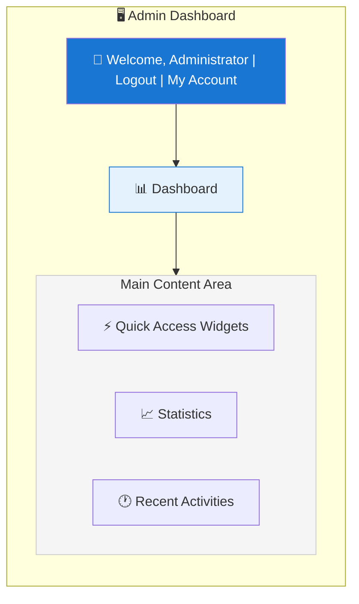
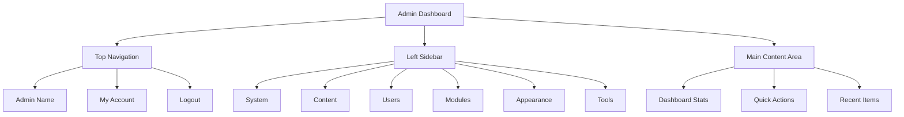

# XOOPS管理パネル概要

XOOPS管理者ダッシュボードへのナビゲーションと使用についての完全なガイド。

## 管理パネルへアクセス

### 管理者ログイン

ブラウザを開いて移動:

```
http://your-domain.com/xoops/admin/
```

またはXOOPSがルートの場合:

```
http://your-domain.com/admin/
```

管理者認証情報を入力:

```
ユーザー名: [管理者ユーザー名]
パスワード: [管理者パスワード]
```

### ログイン後

メイン管理ダッシュボードが表示:



## 管理パネルレイアウト



## ダッシュボードコンポーネント

### トップバー

重要なコントロールが含まれています:

| 要素 | 目的 |
|---|---|
| **管理ロゴ** | ダッシュボードに戻るためクリック |
| **ウェルカムメッセージ** | ログイン中の管理者名を表示 |
| **My Account** | 管理者プロファイルとパスワード編集 |
| **Help** | ドキュメントにアクセス |
| **Logout** | 管理パネルからサインアウト |

### 左ナビゲーションサイドバー

機能別に整理されたメインメニュー:

```
├── System
│   ├── Dashboard
│   ├── Preferences
│   ├── Admin Users
│   ├── Groups
│   ├── Permissions
│   ├── Modules
│   └── Tools
├── Content
│   ├── Pages
│   ├── Categories
│   ├── Comments
│   └── Media Manager
├── Users
│   ├── Users
│   ├── User Requests
│   ├── Online Users
│   └── User Groups
├── Modules
│   ├── Modules
│   ├── Module Settings
│   └── Module Updates
├── Appearance
│   ├── Themes
│   ├── Templates
│   ├── Blocks
│   └── Images
└── Tools
    ├── Maintenance
    ├── Email
    ├── Statistics
    ├── Logs
    └── Backups
```

### メインコンテンツエリア

選択したセクションの情報とコントロールを表示:

- 設定用フォーム
- データテーブル付きリスト
- チャートと統計
- クイックアクションボタン
- ヘルプテキストとツールチップ

### ダッシュボードウィジェット

主要情報へのクイックアクセス:

- **システム情報:** PHPバージョン、MySQLバージョン、XOOPSバージョン
- **クイック統計:** ユーザー数、総投稿数、インストール済みモジュール数
- **最近のアクティビティ:** 最新ログイン、コンテンツ変更、エラー
- **サーバーステータス:** CPU、メモリ、ディスク使用量
- **通知:** システムアラート、保留中の更新

## コア管理機能

### システム管理

**場所:** システム > [各種オプション]

#### 設定

基本的なシステム設定を設定:

```
システム > 設定 > [設定カテゴリー]
```

カテゴリー:
- 一般設定 (サイト名、タイムゾーン)
- ユーザー設定 (登録、プロフィール)
- メール設定 (SMTP設定)
- キャッシュ設定 (キャッシング オプション)
- URL設定 (フレンドリーURL)
- メタタグ (SEO設定)

基本設定とシステム設定を参照してください。

#### 管理者ユーザー

管理者アカウントを管理:

```
システム > 管理者ユーザー
```

機能:
- 新しい管理者を追加
- 管理者プロファイルを編集
- 管理者パスワードを変更
- 管理者アカウントを削除
- 管理者権限を設定

### コンテンツ管理

**場所:** コンテンツ > [各種オプション]

#### ページ/記事

サイトコンテンツを管理:

```
コンテンツ > ページ (またはあなたのモジュール)
```

機能:
- 新しいページを作成
- 既存コンテンツを編集
- ページを削除
- 公開/非公開を切り替え
- カテゴリーを設定
- リビジョンを管理

#### カテゴリー

コンテンツを整理:

```
コンテンツ > カテゴリー
```

機能:
- カテゴリー階層を作成
- カテゴリーを編集
- カテゴリーを削除
- ページに割り当て

#### コメント

ユーザーコメントをモデレーション:

```
コンテンツ > コメント
```

機能:
- すべてのコメントを表示
- コメントを承認
- コメントを編集
- スパムを削除
- コメント投稿者をブロック

### ユーザー管理

**場所:** ユーザー > [各種オプション]

#### ユーザー

ユーザーアカウントを管理:

```
ユーザー > ユーザー
```

機能:
- すべてのユーザーを表示
- 新しいユーザーを作成
- ユーザープロファイルを編集
- アカウントを削除
- パスワードをリセット
- ユーザーステータスを変更
- グループに割り当て

#### オンラインユーザー

アクティブユーザーを監視:

```
ユーザー > オンラインユーザー
```

表示:
- 現在オンラインのユーザー
- 最後のアクティビティ時刻
- IPアドレス
- ユーザーの場所 (設定されている場合)

#### ユーザーグループ

ユーザーの役割と権限を管理:

```
ユーザー > グループ
```

機能:
- カスタムグループを作成
- グループ権限を設定
- グループにユーザーを割り当て
- グループを削除

### モジュール管理

**場所:** モジュール > [各種オプション]

#### モジュール

モジュールをインストール・設定:

```
モジュール > モジュール
```

機能:
- インストール済みモジュールを表示
- モジュールを有効化/無効化
- モジュールを更新
- モジュール設定を設定
- 新しいモジュールをインストール
- モジュールの詳細を表示

#### アップデートを確認

```
モジュール > モジュール > アップデートを確認
```

表示:
- 利用可能なモジュール更新
- 変更ログ
- ダウンロードとインストール オプション

### 外観管理

**場所:** 外観 > [各種オプション]

#### テーマ

サイトテーマを管理:

```
外観 > テーマ
```

機能:
- インストール済みテーマを表示
- デフォルトテーマを設定
- 新しいテーマをアップロード
- テーマを削除
- テーマをプレビュー
- テーマを設定

#### ブロック

コンテンツブロックを管理:

```
外観 > ブロック
```

機能:
- カスタムブロックを作成
- ブロックコンテンツを編集
- ページ上のブロックを配置
- ブロックの表示を設定
- ブロックを削除
- ブロックのキャッシングを設定

#### テンプレート

テンプレートを管理 (高度な機能):

```
外観 > テンプレート
```

高度なユーザーと開発者向け。

### システムツール

**場所:** システム > ツール

#### メンテナンスモード

メンテナンス中のユーザーアクセスを防止:

```
システム > メンテナンスモード
```

設定:
- メンテナンスを有効化/無効化
- カスタムメンテナンスメッセージ
- テスト許可IP (許可)

#### データベース管理

```
システム > データベース
```

機能:
- データベースの一貫性をチェック
- データベース更新を実行
- テーブルを修復
- データベースを最適化
- データベース構造をエクスポート

#### アクティビティログ

```
システム > ログ
```

監視:
- ユーザーアクティビティ
- 管理者アクション
- システムイベント
- エラーログ

## クイックアクション

ダッシュボードからアクセス可能な一般的なタスク:

```
クイックリンク:
├── 新しいページを作成
├── 新しいユーザーを追加
├── コンテンツブロックを作成
├── 画像をアップロード
├── 一括メールを送信
├── すべてのモジュールを更新
└── キャッシュをクリア
```

## 管理パネルキーボードショートカット

素早いナビゲーション:

| ショートカット | アクション |
|---|---|
| `Ctrl+H` | ヘルプに移動 |
| `Ctrl+D` | ダッシュボードに移動 |
| `Ctrl+Q` | クイック検索 |
| `Ctrl+L` | ログアウト |

## ユーザーアカウント管理

### My Account

管理者プロファイルにアクセス:

1. 右上の「My Account」をクリック
2. プロファイル情報を編集:
   - メールアドレス
   - 実名
   - ユーザー情報
   - アバター

### パスワードを変更

管理者パスワードを変更:

1. **My Account**に移動
2. 「パスワードを変更」をクリック
3. 現在のパスワードを入力
4. 新しいパスワードを入力 (2回)
5. 「保存」をクリック

**セキュリティのヒント:**
- 強力なパスワードを使用 (16文字以上)
- 大文字、小文字、数字、シンボルを含める
- 定期的に変更 (90日ごと)
- 管理者認証情報を共有しない

### ログアウト

管理パネルからサインアウト:

1. 右上の「ログアウト」をクリック
2. ログインページにリダイレクト

## 管理パネル統計

### ダッシュボード統計

サイトメトリクスの概要:

| メトリクス | 値 |
|--------|-------|
| オンラインユーザー | 12 |
| 総ユーザー数 | 256 |
| 総投稿数 | 1,234 |
| 総コメント数 | 5,678 |
| 総モジュール数 | 8 |

### システムステータス

サーバーとパフォーマンス情報:

| コンポーネント | バージョン/値 |
|-----------|---------------|
| XOOPSバージョン | 2.5.11 |
| PHPバージョン | 8.2.x |
| MySQLバージョン | 8.0.x |
| サーバーロード | 0.45, 0.42 |
| アップタイム | 45日 |

### 最近のアクティビティ

最近のイベントのタイムライン:

```
12:45 - 管理者ログイン
12:30 - 新規ユーザー登録
12:15 - ページ公開
12:00 - コメント投稿
11:45 - モジュール更新
```

## 通知システム

### 管理者アラート

以下についての通知を受け取る:

- 新規ユーザー登録
- モデレーション待機中のコメント
- 失敗したログイン試行
- システムエラー
- モジュール更新が利用可能
- データベースの問題
- ディスク容量警告

アラートを設定:

**システム > 設定 > メール設定**

```
登録時に管理者に通知: はい
コメント時に管理者に通知: はい
エラー時に管理者に通知: はい
アラートメール: admin@your-domain.com
```

## 一般的な管理者タスク

### 新しいページを作成

1. **コンテンツ > ページ** (または関連モジュール) に移動
2. 「新しいページを追加」をクリック
3. 入力:
   - タイトル
   - コンテンツ
   - 説明
   - カテゴリー
   - メタデータ
4. 「公開」をクリック

### ユーザーを管理

1. **ユーザー > ユーザー**に移動
2. リストの表示:
   - ユーザー名
   - メール
   - 登録日
   - 最後のログイン
   - ステータス

3. ユーザー名をクリックして:
   - プロファイルを編集
   - パスワードを変更
   - グループを編集
   - ユーザーをブロック/ブロック解除

### モジュールを設定

1. **モジュール > モジュール**に移動
2. リストでモジュールを探す
3. モジュール名をクリック
4. 「設定」または「設定」をクリック
5. モジュール オプションを設定
6. 変更を保存

### 新しいブロックを作成

1. **外観 > ブロック**に移動
2. 「新しいブロックを追加」をクリック
3. 入力:
   - ブロックタイトル
   - ブロックコンテンツ (HTMLが許可)
   - ページ上の位置
   - 表示 (すべてのページまたは特定)
   - モジュール (該当する場合)
4. 「送信」をクリック

## 管理パネルヘルプ

### 組み込みドキュメント

管理パネルからヘルプにアクセス:

1. トップバーの「ヘルプ」をクリック
2. 現在のページの状況依存ヘルプ
3. ドキュメントへのリンク
4. よくある質問

### 外部リソース

- XOOPS公式サイト: https://xoops.org/
- コミュニティフォーラム: https://xoops.org/modules/newbb/
- モジュールリポジトリ: https://xoops.org/modules/repository/
- バグ/問題: https://github.com/XOOPS/XoopsCore/issues

## 管理パネルをカスタマイズ

### 管理テーマ

管理インターフェーステーマを選択:

**システム > 設定 > 一般設定**

```
管理テーマ: [テーマを選択]
```

利用可能なテーマ:
- デフォルト (ライト)
- ダークモード
- カスタムテーマ

### ダッシュボードのカスタマイズ

表示されるウィジェットを選択:

**ダッシュボード > カスタマイズ**

選択:
- システム情報
- 統計
- 最近のアクティビティ
- クイックリンク
- カスタムウィジェット

## 管理パネルのパーミッション

異なる管理レベルは異なる権限を持ちます:

| 役割 | 機能 |
|---|---|
| **ウェブマスター** | すべての管理機能へのフルアクセス |
| **管理者** | 制限された管理機能 |
| **モデレーター** | コンテンツモデレーションのみ |
| **編集者** | コンテンツ作成と編集 |

パーミッションを管理:

**システム > パーミッション**

## 管理パネル向けセキュリティベストプラクティス

1. **強力なパスワード:** 16文字以上のパスワードを使用
2. **定期的な変更:** 90日ごとにパスワードを変更
3. **アクセス監視:** 「管理者ユーザー」ログを定期的にチェック
4. **アクセスを制限:** セキュリティ強化のため管理フォルダーを名前変更
5. **HTTPSを使用:** 常にHTTPSで管理にアクセス
6. **IP ホワイトリスト:** 特定のIPに管理アクセスを制限
7. **定期ログアウト:** 完了時にログアウト
8. **ブラウザセキュリティ:** 定期的にブラウザキャッシュをクリア

セキュリティ設定を参照してください。

## 管理パネルのトラブルシューティング

### 管理パネルにアクセスできない

**解決策:**
1. ログイン認証情報を確認
2. ブラウザキャッシュとクッキーをクリア
3. 別のブラウザを試す
4. 管理フォルダーパスが正しいことを確認
5. 管理フォルダーのファイルのパーミッションを確認
6. mainfile.phpのデータベース接続を確認

### 空白の管理ページ

**解決策:**
```bash
# PHPエラーを確認
tail -f /var/log/apache2/error.log

# 一時的にデバッグモードを有効化
sed -i "s/define('XOOPS_DEBUG', 0)/define('XOOPS_DEBUG', 1)/" /var/www/html/xoops/mainfile.php

# ファイルのパーミッションを確認
ls -la /var/www/html/xoops/admin/
```

### 遅い管理パネル

**解決策:**
1. キャッシュをクリア: **システム > ツール > キャッシュをクリア**
2. データベースを最適化: **システム > データベース > 最適化**
3. サーバーリソースを確認: `htop`
4. MySQLで遅いクエリを確認

### モジュールが表示されない

**解決策:**
1. モジュールがインストール済みであることを確認: **モジュール > モジュール**
2. モジュールが有効化されていることを確認
3. パーミッションが割り当てられていることを確認
4. モジュールファイルが存在することを確認
5. エラーログを確認

## 次のステップ

管理パネルに慣れた後:

1. 最初のページを作成
2. ユーザーグループを設定
3. 追加モジュールをインストール
4. 基本的な設定を設定
5. セキュリティを実装

---

**タグ:** #admin-panel #dashboard #navigation #getting-started

**関連記事:**
- ../Configuration/Basic-Configuration
- ../Configuration/System-Settings
- Creating-Your-First-Page
- Managing-Users
- Installing-Modules
