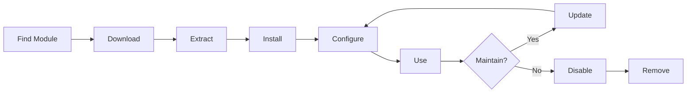

# XOOPSモジュールのインストールと管理

モジュールをインストールし、設定してXOOPS機能を拡張する方法を学びます。

## XOOPSモジュールを理解

### モジュールとは?

モジュールはXOOPSに機能を追加する拡張機能です:

| タイプ | 目的 | 例 |
|---|---|---|
| **コンテンツ** | 特定のコンテンツタイプを管理 | ニュース、ブログ、チケット |
| **コミュニティ** | ユーザー操作 | フォーラム、コメント、レビュー |
| **eCommerce** | 製品販売 | ショップ、カート、支払い |
| **メディア** | ファイル/画像を処理 | ギャラリー、ダウンロード、ビデオ |
| **ユーティリティ** | ツールとヘルパー | メール、バックアップ、分析 |

### コアモジュール vs オプションモジュール

| モジュール | タイプ | 含まれる | 削除可能 |
|---|---|---|---|
| **システム** | コア | はい | いいえ |
| **ユーザー** | コア | はい | いいえ |
| **プロフィール** | 推奨 | はい | はい |
| **PM (プライベートメッセージ)** | 推奨 | はい | はい |
| **WF-Channel** | オプション | よく | はい |
| **ニュース** | オプション | いいえ | はい |
| **フォーラム** | オプション | いいえ | はい |

## モジュールライフサイクル



## モジュールを検索

### XOOPSモジュールリポジトリ

公式XOOPSモジュールリポジトリ:

**訪問:** https://xoops.org/modules/repository/

```
ディレクトリ > モジュール > [カテゴリーを参照]
```

カテゴリー別に参照:
- コンテンツ管理
- コミュニティ
- eCommerce
- マルチメディア
- 開発
- サイト管理

### モジュールを評価

インストール前に確認:

| 基準 | 確認対象 |
|---|---|
| **互換性** | XOOPSバージョンで動作 |
| **評価** | 良いユーザーレビューと評価 |
| **更新** | 最近メンテナンス |
| **ダウンロード** | 人気で広く使用 |
| **要件** | サーバーと互換 |
| **ライセンス** | GPLまたは類似オープンソース |
| **サポート** | アクティブな開発者とコミュニティ |

### モジュール情報を読む

各モジュールリストは以下を表示:

```
モジュール名: [名前]
バージョン: [X.X.X]
必須: XOOPS [バージョン]
著者: [名前]
最終更新: [日付]
ダウンロード数: [数値]
評価: [星]
説明: [簡潔な説明]
互換性: PHP [バージョン], MySQL [バージョン]
```

## モジュールのインストール

### 方法1: 管理パネルインストール

**ステップ1: モジュールセクションにアクセス**

1. 管理パネルにログイン
2. **モジュール > モジュール** に移動
3. **「新しいモジュールをインストール」** または **「モジュールを参照」** をクリック

**ステップ2: モジュールをアップロード**

オプションA - 直接アップロード:
1. **「ファイルを選択」** をクリック
2. コンピュータからモジュール .zipファイルを選択
3. **「アップロード」** をクリック

オプションB - URLアップロード:
1. モジュールURLを貼り付け
2. **「ダウンロードしてインストール」** をクリック

**ステップ3: モジュール情報を確認**

```
モジュール名: [名前表示]
バージョン: [バージョン]
著者: [著者情報]
説明: [完全な説明]
要件: [PHP/MySQLバージョン]
```

「インストール手続きを進める」をレビューしてクリック

**ステップ4: インストールタイプを選択**

```
☐ 新規インストール (新しいインストール)
☐ 更新 (既存をアップグレード)
☐ 削除してからインストール (既存を置換)
```

適切なオプションを選択。

**ステップ5: インストールを確認**

最終確認を確認:
```
モジュールはインストールされます: /modules/modulename/
データベース: xoops_db
続行? [はい] [いいえ]
```

「はい」をクリック確認します。

**ステップ6: インストール完了**

```
インストールが成功しました!

モジュール: [モジュール名]
バージョン: [バージョン]
テーブルが作成: [数値]
ファイルがインストール: [数値]

[モジュール設定に移動]  [モジュールに戻す]
```

### 方法2: 手動インストール (高度)

手動インストールまたはトラブルシューティングの場合:

**ステップ1: モジュールをダウンロード**

1. リポジトリから .zipをダウンロード
2. `/var/www/html/xoops/modules/modulename/` に抽出

```bash
# モジュールを抽出
unzip module_name.zip
cp -r module_name /var/www/html/xoops/modules/

# パーミッションを設定
chmod -R 755 /var/www/html/xoops/modules/module_name
```

**ステップ2: インストールスクリプトを実行**

```
訪問: http://your-domain.com/xoops/modules/module_name/admin/index.php?op=install
```

または管理パネルから (システム > モジュール > DB を更新)。

**ステップ3: インストールを確認**

1. 管理パネルで **モジュール > モジュール** に移動
2. リストでモジュール検索
3. 「アクティブ」として表示されることを確認

## モジュール設定

### モジュール設定にアクセス

1. **モジュール > モジュール** に移動
2. モジュールを探す
3. モジュール名をクリック
4. **「設定」** または **「設定」** をクリック

### 一般的なモジュール設定

ほとんどのモジュール提供:

```
モジュール状態: [有効/無効化]
メニューに表示: [はい/いいえ]
モジュールウェイト: [1-999] (表示順)
ユーザーグループに表示: [ユーザーグループのチェックボックス]
```

### モジュール固有のオプション

各モジュールに一意の設定があります。例:

**ニュースモジュール:**
```
ページあたりのアイテム: 10
著者を表示: はい
コメントを許可: はい
公開前の確認が必須: はい
```

**フォーラムモジュール:**
```
ページあたりのトピック: 20
ページあたりの投稿: 15
最大添付ファイルサイズ: 5MB
署名を有効化: はい
```

**ギャラリーモジュール:**
```
ページあたりの画像: 12
サムネイルサイズ: 150x150
最大アップロード: 10MB
ウォーターマーク: はい/いいえ
```

モジュール ドキュメントで特定のオプションを確認してください。

### 設定を保存

設定を調整後:

1. **「送信」** または **「保存」** をクリック
2. 確認が表示されます:
   ```
   設定が正常に保存されました!
   ```

## モジュールブロックを管理

多くのモジュール ウィジェット ようなコンテンツエリア「ブロック」を作成します。

### モジュールブロックを表示

1. **外観 > ブロック** に移動
2. モジュール ブロックを探す
3. ほとんどのモジュール 「[モジュール名] - [ブロック説明]」を表示

### ブロックを設定

1. ブロック名をクリック
2. 調整:
   - ブロック タイトル
   - 表示 (すべてのページまたは特定)
   - ページ上の位置 (左、中央、右)
   - ブロックを見ることができるユーザーグループ
3. **「送信」** をクリック

### ホームページでブロックを表示

1. **外観 > ブロック** に移動
2. 表示するブロックを探す
3. **「編集」** をクリック
4. 設定:
   - **表示対象:** グループを選択
   - **位置:** 列を選択 (左/中央/右)
   - **ページ:** ホームページまたはすべてのページ
5. **「送信」** をクリック

## 特定モジュール例をインストール

### ニュースモジュールをインストール

**完璧:** ブログ投稿、お知らせ

1. リポジトリからニュースモジュール ダウンロード
2. **モジュール > モジュール > インストール** 経由でアップロード
3. **モジュール > ニュース > 設定** で設定:
   - ページあたりのストーリー: 10
   - コメントを許可: はい
   - 公開前に承認: はい
4. 最新ニュース用ブロックを作成
5. ストーリーの公開を開始!

### フォーラムモジュールをインストール

**完璧:** コミュニティ議論

1. フォーラムモジュール ダウンロード
2. 管理パネル経由でインストール
3. モジュールでフォーラム カテゴリーを作成
4. 設定を行う:
   - トピック/ページ: 20
   - 投稿/ページ: 15
   - モデレーション有効化: はい
5. ユーザーグループの権限を割り当て
6. 最新トピック用ブロック作成

### ギャラリーモジュールをインストール

**完璧:** 画像ショーケース

1. ギャラリーモジュール ダウンロード
2. インストールして設定
3. フォトアルバムを作成
4. 画像をアップロード
5. 表示/アップロード権限を設定
6. ウェブサイトでギャラリー 表示

## モジュールを更新

### アップデートを確認

```
管理パネル > モジュール > モジュール > アップデートを確認
```

表示:
- 利用可能なモジュール更新
- 現在vs新バージョン
- 変更ログ/リリースノート

### モジュールを更新

1. **モジュール > モジュール** に移動
2. 利用可能なアップデート付きモジュール クリック
3. **「更新」** ボタン クリック
4. インストールタイプから **「更新」** 選択
5. インストールウィザード実行
6. モジュール更新!

### 重要な更新メモ

更新前に:

- [ ] データベースをバックアップ
- [ ] モジュール ファイルをバックアップ
- [ ] 変更ログをレビュー
- [ ] スタジング サーバーで最初にテスト
- [ ] カスタム修正をメモ

更新後
- [ ] 機能を確認
- [ ] モジュール設定をチェック
- [ ] 警告/エラーを確認
- [ ] キャッシュをクリア

## モジュール権限

### ユーザーグループアクセスを割り当て

モジュール アクセスできるユーザーグループ制御:

**場所:** システム > パーミッション

各モジュール、以下を設定:

```
モジュール: [モジュール名]

管理アクセス: [グループを選択]
ユーザーアクセス: [グループを選択]
読み取り権限: [表示を許可されるグループ]
書き込み権限: [投稿を許可されるグループ]
削除権限: [管理者のみ]
```

### 一般的な権限レベル

```
公開コンテンツ (ニュース、ページ):
├── 管理アクセス: ウェブマスター
├── ユーザーアクセス: すべてのログイン ユーザー
└── 読み取り権限: すべての人

コミュニティ (フォーラム、コメント):
├── 管理アクセス: ウェブマスター、モデレーター
├── ユーザーアクセス: すべてのログイン ユーザー
└── 書き込み権限: すべてのログイン ユーザー

管理ツール:
├── 管理アクセス: ウェブマスターのみ
└── ユーザーアクセス: 無効化
```

## モジュールを無効化して削除

### モジュール無効化 (ファイルを保持)

モジュール非表示にしてサイトに保持:

1. **モジュール > モジュール** に移動
2. モジュール探す
3. モジュール名をクリック
4. **「無効化」** をクリックまたはステータスを無効化に設定
5. モジュール非表示だが データ保持

再度有効化いつでも:
1. モジュールをクリック
2. **「有効化」** をクリック

### モジュール完全に削除

モジュール とデータ削除:

1. **モジュール > モジュール** に移動
2. モジュール探す
3. **「アンインストール」** または **「削除」** をクリック
4. 確認: 「モジュール とすべてのデータを削除?」
5. **「はい」** 確認をクリック

**警告:** アンインストールはすべてモジュール データ削除!

### アンインストール後再インストール

モジュール アンインストール後:
- モジュール ファイル 削除
- データベース テーブル削除
- すべてのデータ 喪失
- 再度使用するには再インストール必要
- バックアップから復元可能

## トラブルシューティング モジュール インストール

### インストール後にモジュールが表示されない

**症状:** モジュール がリストされているがサイトに表示されない

**解決策:**
```
1. モジュール「アクティブ」確認 (モジュール > モジュール)
2. モジュール ブロック有効化 (外観 > ブロック)
3. ユーザー権限確認 (システム > パーミッション)
4. キャッシュをクリア (システム > ツール > キャッシュをクリア)
5. .htaccess がモジュール ブロック確認
```

### インストールエラー: 「テーブルが既に存在」

**症状:** モジュール インストール中エラー

**解決策:**
```
1. モジュール 以前部分的にインストール
2. 「削除してからインストール」オプション試す
3. または最初にアンインストール、次に新規インストール
4. 既存テーブル確認
   mysql> SHOW TABLES LIKE 'xoops_module%';
```

### モジュール不足な依存関係

**症状:** モジュール はインストール 他のモジュール必須

**解決策:**
```
1. エラー メッセージから必須モジュール メモ
2. 必須モジュール 最初にインストール
3. モジュール のインストール
4. 正しい順序でインストール
```

### モジュール にアクセス時のブランク ページ

**症状:** モジュール ロードしますが何も表示しない

**解決策:**
```
1. mainfile.php でデバッグ モード有効化:
   define('XOOPS_DEBUG', 1);

2. PHPエラー ログ確認:
   tail -f /var/log/php_errors.log

3. ファイル パーミッション確認:
   chmod -R 755 /var/www/html/xoops/modules/modulename

4. モジュール 設定でデータベース接続確認

5. モジュール 無効化と再インストール
```

### モジュール がサイト を壊す

**症状:** モジュール インストール ウェブサイト が壊れた

**解決策:**
```
1. 問題のあるモジュール すぐに無効化:
   管理 > モジュール > [モジュール] > 無効化

2. キャッシュをクリア:
   rm -rf /var/www/html/xoops/cache/*
   rm -rf /var/www/html/xoops/templates_c/*

3. 必要に応じてバックアップから復元

4. ルート原因をエラー ログで確認

5. モジュール 開発者に連絡
```

## モジュール セキュリティ上の考慮事項

### 信頼されたソースからのみインストール

```
✓ 公式 XOOPS リポジトリ
✓ GitHub 公式 XOOPS モジュール
✓ 信頼できるモジュール 開発者
✗ 未知のウェブサイト
✗ 確認されていないソース
```

### モジュール 権限を確認

インストール後:

1. 疑わしいアクティビティ のモジュール コードをレビュー
2. 異常 のためデータベース テーブル チェック
3. ファイル 変更を監視
4. モジュール を更新 保持
5. 不要なモジュール 削除

### パーミッション ベストプラクティス

```
モジュール ディレクトリ: 755 (読み取り可能、web サーバーで書き込み不可)
モジュール ファイル: 644 (読み取り のみ)
モジュール データ: データベース によって保護
```

## モジュール 開発リソース

### モジュール 開発を学ぶ

- 公式 ドキュメント: https://xoops.org/
- GitHub リポジトリ: https://github.com/XOOPS/
- コミュニティ フォーラム: https://xoops.org/modules/newbb/
- 開発ガイド: docs フォルダー で利用可能

## モジュール ベストプラクティス

1. **一度に 1 つインストール:** 競合 監視
2. **インストール後テスト:** 機能を確認
3. **カスタム 設定を ドキュメント:** 設定 をメモ
4. **最新 を保つ:** モジュール 更新をプロンプトに インストール
5. **不要な削除:** 不要なモジュール 削除
6. **インストール前にバックアップ:** 常にバックアップ
7. **ドキュメント を読む:** モジュール の指示 確認
8. **コミュニティに参加:** 必要な場合は支援を求める

## モジュール インストール チェックリスト

各モジュール インストール の場合:

- [ ] 調査とレビュー を読む
- [ ] XOOPS バージョン 互換性を確認
- [ ] データベース とファイル をバックアップ
- [ ] 最新バージョンをダウンロード
- [ ] 管理パネル 経由でインストール
- [ ] 設定を設定
- [ ] ブロック を作成/配置
- [ ] ユーザー 権限を設定
- [ ] 機能をテスト
- [ ] 設定をドキュメント
- [ ] 更新のスケジュール

## 次のステップ

モジュール のインストール後:

1. モジュール 用コンテンツ を作成
2. ユーザー グループを設定
3. 管理 機能を探索
4. パフォーマンス を最適化
5. 必要に応じて追加 モジュール をインストール

---

**タグ:** #modules #installation #extension #management

**関連記事:**
- Admin-Panel-Overview
- Managing-Users
- Creating-Your-First-Page
- ../Configuration/System-Settings
