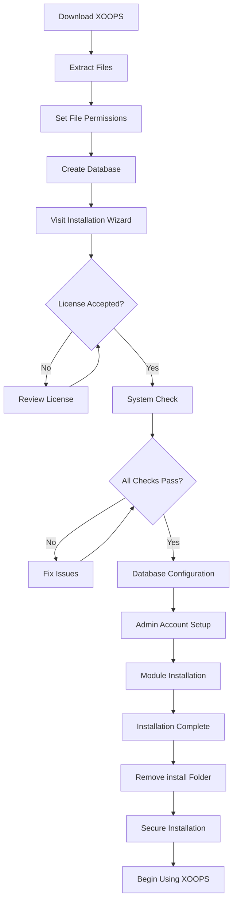

# 完全XOOPS インストールガイド

このガイドは、インストールウィザードを使用してXOOPSをゼロからインストールするための包括的なチュートリアルを提供します。

## 前提条件

インストールを開始する前に、以下があることを確認してください：

- FTPまたはSSH経由でウェブサーバーにアクセス
- データベースサーバーへの管理者アクセス
- 登録されたドメイン名
- サーバー要件を確認
- バックアップツールが利用可能

## インストール プロセス



## ステップバイステップ インストール

### ステップ 1: XOOPSをダウンロード

最新バージョンを [https://xoops.org/](https://xoops.org/) からダウンロード：

```bash
# Using wget
wget https://xoops.org/download/xoops-2.5.8.zip

# Using curl
curl -O https://xoops.org/download/xoops-2.5.8.zip
```

### ステップ 2: ファイルを展開

XOOPSアーカイブをウェブルートに展開：

```bash
# Navigate to web root
cd /var/www/html

# Extract XOOPS
unzip xoops-2.5.8.zip

# Rename folder (optional, but recommended)
mv xoops-2.5.8 xoops
cd xoops
```

### ステップ 3: ファイルパーミッションを設定

XOOPSディレクトリに適切なパーミッションを設定：

```bash
# Make directories writable (755 for dirs, 644 for files)
find . -type d -exec chmod 755 {} \;
find . -type f -exec chmod 644 {} \;

# Make specific directories writable by web server
chmod 777 uploads/
chmod 777 templates_c/
chmod 777 var/
chmod 777 cache/

# Secure mainfile.php after installation
chmod 644 mainfile.php
```

### ステップ 4: データベースを作成

MySQLを使用してXOOP用の新しいデータベースを作成：

```sql
-- Create database
CREATE DATABASE xoops_db CHARACTER SET utf8mb4 COLLATE utf8mb4_unicode_ci;

-- Create user
CREATE USER 'xoops_user'@'localhost' IDENTIFIED BY 'secure_password_here';

-- Grant privileges
GRANT ALL PRIVILEGES ON xoops_db.* TO 'xoops_user'@'localhost';
FLUSH PRIVILEGES;
```

またはphpMyAdminを使用：

1. phpMyAdminにログイン
2. 「データベース」タブをクリック
3. データベース名を入力: `xoops_db`
4. 「utf8mb4_unicode_ci」コレーションを選択
5. 「作成」をクリック
6. データベースと同じ名前のユーザーを作成
7. すべての権限を付与

### ステップ 5: インストールウィザードを実行

ブラウザを開いて以下にアクセス：

```
http://your-domain.com/xoops/install/
```

#### システムチェックフェーズ

ウィザードはサーバー構成をチェック：

- PHP version >= 5.6.0
- MySQL/MariaDbが利用可能
- 必要なPHP拡張機能（GD、PDOなど）
- ディレクトリのパーミッション
- データベース接続

**チェックが失敗した場合：**

一般的なインストールの問題のセクションを参照してください。

#### データベース構成

データベース認証情報を入力：

```
Database Host: localhost
Database Name: xoops_db
Database User: xoops_user
Database Password: [your_secure_password]
Table Prefix: xoops_
```

**重要な注記：**
- データベースホストがlocalhostと異なる場合（例：リモートサーバー）、正しいホスト名を入力
- テーブルプレフィックスは1つのデータベースで複数のXOOPSインスタンスを実行している場合に役立ちます
- 大文字、数字、記号が混在した強力なパスワードを使用してください

#### 管理者アカウント設定

管理者アカウントを作成：

```
Admin Username: admin (or choose custom)
Admin Email: admin@your-domain.com
Admin Password: [strong_unique_password]
Confirm Password: [repeat_password]
```

**ベストプラクティス：**
- ユニークなユーザー名を使用し、「admin」ではない
- 16文字以上のパスワードを使用
- 認証情報を安全なパスワードマネージャーに保存
- 管理者認証情報を共有しない

#### モジュールインストール

デフォルトモジュールをインストール選択：

- **System Module** (必須) - XOOPSコア機能
- **User Module** (必須) - ユーザー管理
- **Profile Module** (推奨) - ユーザープロファイル
- **PM (Private Message) Module** (推奨) - 内部メッセージング
- **WF-Channel Module** (オプション) - コンテンツ管理

完全なインストールのためにすべての推奨モジュールを選択してください。

### ステップ 6: インストール完了

すべてのステップの後、確認画面が表示されます：

```
Installation Complete!

Your XOOPS installation is ready to use.
Admin Panel: http://your-domain.com/xoops/admin/
User Panel: http://your-domain.com/xoops/
```

### ステップ 7: インストールを保護

#### インストール フォルダを削除

```bash
# Remove the install directory (CRITICAL for security)
rm -rf /var/www/html/xoops/install/

# Or rename it
mv /var/www/html/xoops/install/ /var/www/html/xoops/install.bak
```

**警告：** 本番環境でインストールフォルダにアクセスできるままにしないでください！

#### mainfile.phpを保護

```bash
# Make mainfile.php read-only
chmod 644 /var/www/html/xoops/mainfile.php

# Set ownership
chown www-data:www-data /var/www/html/xoops/mainfile.php
```

#### 適切なファイルパーミッションを設定

```bash
# Recommended production permissions
find . -type f -name "*.php" -exec chmod 644 {} \;
find . -type d -exec chmod 755 {} \;

# Writable directories for web server
chmod 777 uploads/ var/ cache/ templates_c/
```

#### HTTPS/SSLを有効化

ウェブサーバー（nginxまたはApache）でSSLを設定します。

**Apache:**
```apache
<VirtualHost *:443>
    ServerName your-domain.com
    DocumentRoot /var/www/html/xoops

    SSLEngine on
    SSLCertificateFile /etc/ssl/certs/your-cert.crt
    SSLCertificateKeyFile /etc/ssl/private/your-key.key

    # Force HTTPS redirect
    <IfModule mod_rewrite.c>
        RewriteEngine On
        RewriteCond %{HTTPS} off
        RewriteRule ^(.*)$ https://%{HTTP_HOST}%{REQUEST_URI} [L,R=301]
    </IfModule>
</VirtualHost>
```

## インストール後の構成

### 1. 管理パネルにアクセス

次にアクセス：
```
http://your-domain.com/xoops/admin/
```

管理者認証情報でログイン。

### 2. 基本設定を構成

以下を構成：

- サイト名と説明
- 管理者メールアドレス
- タイムゾーンと日付形式
- 検索エンジン最適化

### 3. インストール テスト

- [ ] ホームページにアクセス
- [ ] モジュールが読み込まれることを確認
- [ ] ユーザー登録が機能することを確認
- [ ] 管理パネル機能をテスト
- [ ] SSL/HTTPSが機能することを確認

### 4. バックアップをスケジュール

自動バックアップをセットアップ：

```bash
# Create backup script (backup.sh)
#!/bin/bash
DATE=$(date +%Y%m%d_%H%M%S)
BACKUP_DIR="/backups/xoops"
XOOPS_DIR="/var/www/html/xoops"

# Backup database
mysqldump -u xoops_user -p[password] xoops_db > $BACKUP_DIR/db_$DATE.sql

# Backup files
tar -czf $BACKUP_DIR/files_$DATE.tar.gz $XOOPS_DIR

echo "Backup completed: $DATE"
```

cronでスケジュール：
```bash
# Daily backup at 2 AM
0 2 * * * /usr/local/bin/backup.sh
```

## 一般的なインストール の問題

### 問題: パーミッション拒否エラー

**症状：** ファイルをアップロードまたは作成する際に「パーミッション拒否」

**解決策：**
```bash
# Check web server user
ps aux | grep apache  # For Apache
ps aux | grep nginx   # For Nginx

# Fix permissions (replace www-data with your web server user)
chown -R www-data:www-data /var/www/html/xoops
chmod -R 755 /var/www/html/xoops
chmod 777 uploads/ var/ cache/ templates_c/
```

### 問題: データベース接続エラー

**症状：** 「データベースサーバーに接続できません」

**解決策：**
1. インストールウィザードでデータベース認証情報を確認
2. MySQL/MariaDBが実行されていることを確認：
   ```bash
   service mysql status  # or mariadb
   ```
3. データベースが存在することを確認：
   ```sql
   SHOW DATABASES;
   ```
4. コマンドラインから接続をテスト：
   ```bash
   mysql -h localhost -u xoops_user -p xoops_db
   ```

### 問題: 白い空白画面

**症状：** XOOPSにアクセスするとブランクページが表示される

**解決策：**
1. PHPエラーログを確認：
   ```bash
   tail -f /var/log/apache2/error.log
   ```
2. mainfile.phpでデバッグモードを有効化：
   ```php
   define('XOOPS_DEBUG', 1);
   ```
3. mainfile.phpと設定ファイルのファイルパーミッションを確認
4. PHP-MySQL拡張がインストールされていることを確認

### 問題: アップロード ディレクトリに書き込めない

**症状：** アップロード機能が失敗し、「uploads/に書き込めません」

**解決策：**
```bash
# Check current permissions
ls -la uploads/

# Fix permissions
chmod 777 uploads/
chown www-data:www-data uploads/

# For specific files
chmod 644 uploads/*
```

### 問題: PHP拡張 が不足

**症状：** システムチェックが不足している拡張機能で失敗（GD、MySQLなど）

**解決策 (Ubuntu/Debian):**
```bash
# Install PHP GD library
apt-get install php-gd

# Install PHP MySQL support
apt-get install php-mysql

# Restart web server
systemctl restart apache2  # or nginx
```

**解決策 (CentOS/RHEL):**
```bash
# Install PHP GD library
yum install php-gd

# Install PHP MySQL support
yum install php-mysql

# Restart web server
systemctl restart httpd
```

### 問題: インストール プロセスが遅い

**症状：** インストールウィザードがタイムアウトするか非常に遅く実行される

**解決策：**
1. php.iniでPHPタイムアウトを増加：
   ```ini
   max_execution_time = 300  # 5 minutes
   ```
2. MySQLの最大許可パケットを増加：
   ```sql
   SET GLOBAL max_allowed_packet = 256M;
   ```
3. サーバーリソースを確認：
   ```bash
   free -h  # Check RAM
   df -h    # Check disk space
   ```

### 問題: 管理 パネルにアクセス できない

**症状：** インストール後に管理パネルにアクセスできない

**解決策：**
1. データベースに管理ユーザーが存在することを確認：
   ```sql
   SELECT * FROM xoops_users WHERE uid = 1;
   ```
2. ブラウザキャッシュとクッキーをクリア
3. セッションフォルダが書き込み可能か確認：
   ```bash
   chmod 777 var/
   ```
4. htaccessルールが管理アクセスをブロックしていないか確認

## 検証チェックリスト

インストール後、確認：

- [x] XOOPSホームページが正しく読み込まれる
- [x] 管理パネルは /xoops/admin/ でアクセス可能
- [x] SSL/HTTPSが機能している
- [x] インストールフォルダが削除されたか、アクセスできない
- [x] ファイルパーミッションが安全（ファイルは644、ディレクトリは755）
- [x] データベースバックアップがスケジュール済み
- [x] モジュールはエラーなく読み込まれる
- [x] ユーザー登録システムが機能
- [x] ファイルアップロード機能が機能
- [x] メール通知が正しく送信される

## 次のステップ

インストール完了後：

1. 基本構成ガイドを読む
2. インストールを保護
3. 管理パネルを探索
4. 追加モジュールをインストール
5. ユーザーグループとパーミッションをセットアップ

---

**Tags:** #installation #setup #getting-started #troubleshooting

**Related Articles:**
- Server-Requirements
- Upgrading-XOOPS
- ../Configuration/Security-Configuration
