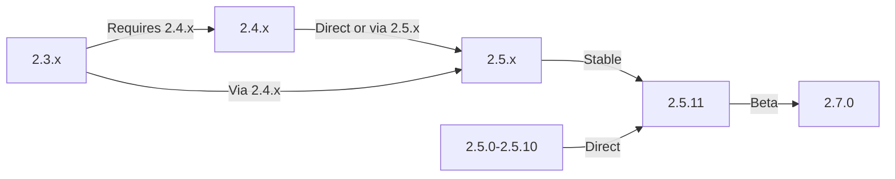

このガイドは、データと カスタマイズを保存しながら、XOOPSを古いバージョンから最新リリースにアップグレードする方法をカバーしています。

> **バージョン情報**
> - **Stable:** XOOPS 2.5.11
> - **Beta:** XOOPS 2.7.0 (テスト中)
> - **Future:** XOOPS 4.0 (開発中 - ロードマップを参照)

## アップグレード前のチェックリスト

アップグレードを開始する前に、次の内容を確認してください：

- [ ] 現在のXOOPSバージョンが記録されている
- [ ] ターゲットXOOPSバージョンが識別されている
- [ ] 完全なシステムバックアップが完了している
- [ ] データベースバックアップが検証されている
- [ ] インストールされたモジュールリストが記録されている
- [ ] カスタム修正が文書化されている
- [ ] テスト環境が利用可能
- [ ] アップグレードパスが確認されている（一部のバージョンは中間リリースをスキップ）
- [ ] サーバーリソースが検証されている（十分なディスク容量、メモリ）
- [ ] メンテナンスモードが有効

## アップグレード パス ガイド

現在のバージョンに応じて異なるアップグレードパス：



**重要：** メジャーバージョンをスキップしないでください。2.3.xからアップグレードする場合、まず2.4.xにアップグレードしてから2.5.xにアップグレードしてください。

## ステップ 1: 完全なシステム バックアップ

### データベース バックアップ

mysqldumpを使用してデータベースをバックアップ：

```bash
# Full database backup
mysqldump -u xoops_user -p xoops_db > /backups/xoops_db_backup_$(date +%Y%m%d_%H%M%S).sql

# Compressed backup
mysqldump -u xoops_user -p xoops_db | gzip > /backups/xoops_db_backup_$(date +%Y%m%d_%H%M%S).sql.gz
```

またはphpMyAdminを使用：

1. XOOPSデータベースを選択
2. 「エクスポート」タブをクリック
3. 「SQL」形式を選択
4. 「ファイルとして保存」を選択
5. 「実行」をクリック

バックアップファイルを確認：

```bash
# Check backup size
ls -lh /backups/xoops_db_backup*.sql

# Verify backup integrity (uncompressed)
head -20 /backups/xoops_db_backup_*.sql

# Verify compressed backup
zcat /backups/xoops_db_backup_*.sql.gz | head -20
```

### ファイル システム バックアップ

すべてのXOOPSファイルをバックアップ：

```bash
# Compressed file backup
tar -czf /backups/xoops_files_$(date +%Y%m%d_%H%M%S).tar.gz /var/www/html/xoops

# Uncompressed (faster, requires more disk space)
tar -cf /backups/xoops_files_$(date +%Y%m%d_%H%M%S).tar /var/www/html/xoops

# Show backup progress
tar -czf /backups/xoops_files_$(date +%Y%m%d_%H%M%S).tar.gz --verbose /var/www/html/xoops | tail
```

バックアップを安全に保存：

```bash
# Secure backup storage
chmod 600 /backups/xoops_*
ls -lah /backups/

# Optional: Copy to remote storage
scp /backups/xoops_* user@backup-server:/secure/backups/
```

### バックアップ復元をテスト

**重要：** 常にバックアップが機能することをテスト：

```bash
# Verify tar archive contents
tar -tzf /backups/xoops_files_*.tar.gz | head -20

# Extract to test location
mkdir /tmp/restore_test
cd /tmp/restore_test
tar -xzf /backups/xoops_files_*.tar.gz

# Verify key files exist
ls -la xoops/mainfile.php
ls -la xoops/install/
```

## ステップ 2: メンテナンス モードを有効化

アップグレード中にサイトへのユーザーアクセスを防止：

### オプション 1: XOOPS管理 パネル

1. 管理パネルにログイン
2. System > Maintenanceに移動
3. 「Site Maintenance Mode」を有効化
4. メンテナンスメッセージを設定
5. 保存

### オプション 2: マニュアル メンテナンス モード

ウェブルートにメンテナンスファイルを作成：

```html
<!-- /var/www/html/maintenance.html -->
<!DOCTYPE html>
<html>
<head>
    <title>Under Maintenance</title>
    <style>
        body { font-family: Arial; text-align: center; padding: 50px; }
        h1 { color: #333; }
        p { color: #666; margin: 20px 0; }
    </style>
</head>
<body>
    <h1>Site Under Maintenance</h1>
    <p>We're currently upgrading our site.</p>
    <p>Expected time: approximately 30 minutes.</p>
    <p>Thank you for your patience!</p>
</body>
</html>
```

Apacheでメンテナンスページを表示するよう設定：

```apache
# In .htaccess or vhost config
ErrorDocument 503 /maintenance.html

# Redirect all traffic to maintenance page
<IfModule mod_rewrite.c>
    RewriteEngine On
    RewriteCond %{REMOTE_ADDR} !^192\.168\.1\.100$  # Your IP
    RewriteRule ^(.*)$ - [R=503,L]
</IfModule>
```

## ステップ 3: 新しいバージョンをダウンロード

公式サイトからXOOPSをダウンロード：

```bash
# Download latest version
cd /tmp
wget https://xoops.org/download/xoops-2.5.8.zip

# Verify checksum (if provided)
sha256sum xoops-2.5.8.zip
# Compare with official SHA256 hash

# Extract to temporary location
unzip xoops-2.5.8.zip
cd xoops-2.5.8
```

## ステップ 4: アップグレード前のファイル準備

### カスタム修正 を識別

カスタマイズされたコアファイルをチェック：

```bash
# Look for modified files (files with newer mtime)
find /var/www/html/xoops -type f -newer /var/www/html/xoops/install.php

# Check for custom themes
ls /var/www/html/xoops/themes/
# Note any custom themes

# Check for custom modules
ls /var/www/html/xoops/modules/
# Note any custom modules created by you
```

### 現在の状態を文書化

アップグレードレポートを作成：

```bash
cat > /tmp/upgrade_report.txt << EOF
=== XOOPS Upgrade Report ===
Date: $(date)
Current Version: 2.5.6
Target Version: 2.5.8

=== Installed Modules ===
$(ls /var/www/html/xoops/modules/)

=== Custom Modifications ===
[Document any custom theme or module modifications]

=== Themes ===
$(ls /var/www/html/xoops/themes/)

=== Plugin Status ===
[List any custom code modifications]

EOF
```

## ステップ 5: 新しいファイルを現在のインストール とマージ

### 戦略: カスタム ファイルを保持

XOOPSコアファイルは置き換えるが、以下を保持：
- `mainfile.php` (データベース設定)
- `themes/` のカスタムテーマ
- `modules/` のカスタムモジュール
- `uploads/` のユーザーアップロード
- `var/` のサイトデータ

### 手動 マージ プロセス

```bash
# Set variables
XOOPS_OLD="/var/www/html/xoops"
XOOPS_NEW="/tmp/xoops-2.5.8"
BACKUP="/backups/pre-upgrade"

# Create pre-upgrade backup in place
mkdir -p $BACKUP
cp -r $XOOPS_OLD/* $BACKUP/

# Copy new files (but preserve sensitive files)
# Copy everything except protected directories
rsync -av --exclude='mainfile.php' \
    --exclude='modules/custom*' \
    --exclude='themes/custom*' \
    --exclude='uploads' \
    --exclude='var' \
    --exclude='cache' \
    --exclude='templates_c' \
    $XOOPS_NEW/ $XOOPS_OLD/

# Verify critical files preserved
ls -la $XOOPS_OLD/mainfile.php
```

### upgrade.phpを使用（利用可能な場合）

一部のXOOPSバージョンには自動化されたアップグレードスクリプトが含まれています：

```bash
# Copy new files with installer
cp -r /tmp/xoops-2.5.8/* /var/www/html/xoops/

# Run upgrade wizard
# Visit: http://your-domain.com/xoops/upgrade/
```

### マージ後のファイル パーミッション

適切なパーミッションを復元：

```bash
# Set ownership
chown -R www-data:www-data /var/www/html/xoops

# Set directory permissions
find /var/www/html/xoops -type d -exec chmod 755 {} \;

# Set file permissions
find /var/www/html/xoops -type f -exec chmod 644 {} \;

# Make writable directories
chmod 777 /var/www/html/xoops/cache
chmod 777 /var/www/html/xoops/templates_c
chmod 777 /var/www/html/xoops/uploads
chmod 777 /var/www/html/xoops/var

# Secure mainfile.php
chmod 644 /var/www/html/xoops/mainfile.php
```

## ステップ 6: データベース 移行

### データベース 変更を確認

XOOPSリリースノートでデータベース構造の変更を確認：

```bash
# Extract and review SQL migration files
find /tmp/xoops-2.5.8 -name "*.sql" -type f
# Document all .sql files found
```

### データベース アップデート を実行

### オプション 1: 自動 アップデート（利用可能な場合）

管理パネルを使用：

1. 管理者にログイン
2. **System > Database** に移動
3. 「Check Updates」をクリック
4. 保留中の変更を確認
5. 「Apply Updates」をクリック

### オプション 2: 手動 データベース アップデート

マイグレーションSQLファイルを実行：

```bash
# Connect to database
mysql -u xoops_user -p xoops_db

# View pending changes (varies by version)
SELECT * FROM xoops_config WHERE conf_name LIKE '%version%';

# Run migration scripts manually if needed
SOURCE /tmp/xoops-2.5.8/migrate_2.5.6_to_2.5.8.sql;
```

### データベース 検証

アップデート後にデータベースの整合性を確認：

```sql
-- Check database consistency
REPAIR TABLE xoops_users;
OPTIMIZE TABLE xoops_users;

-- Verify key tables exist
SHOW TABLES LIKE 'xoops_%';

-- Check row counts (should increase or stay same)
SELECT COUNT(*) FROM xoops_users;
SELECT COUNT(*) FROM xoops_posts;
```

## ステップ 7: アップグレード を検証

### ホームページ チェック

XOOPSホームページにアクセス：

```
http://your-domain.com/xoops/
```

予想：ページはエラーなく読み込まれ、正しく表示される

### 管理 パネル チェック

管理者にアクセス：

```
http://your-domain.com/xoops/admin/
```

確認：
- [ ] 管理パネルが読み込まれる
- [ ] ナビゲーションが機能
- [ ] ダッシュボードが正しく表示される
- [ ] ログにデータベースエラーがない

### モジュール 検証

インストール されたモジュールをチェック：

1. 管理者で **Modules > Modules** に移動
2. すべてのモジュールがまだインストールされていることを確認
3. エラーメッセージがないか確認
4. 無効化されたモジュールを有効化

### ログ ファイル チェック

システムログでエラーを確認：

```bash
# Check web server error log
tail -50 /var/log/apache2/error.log

# Check PHP error log
tail -50 /var/log/php_errors.log

# Check XOOPS system log (if available)
# In admin panel: System > Logs
```

### コア 機能のテスト

- [ ] ユーザーログイン/ログアウトが機能
- [ ] ユーザー登録が機能
- [ ] ファイルアップロード機能
- [ ] メール通知送信
- [ ] 検索機能が機能
- [ ] 管理機能が運用可能
- [ ] モジュール機能が維持されている

## ステップ 8: アップグレード後のクリーンアップ

### 一時 ファイルを削除

```bash
# Remove extraction directory
rm -rf /tmp/xoops-2.5.8

# Clear template cache (safe to delete)
rm -rf /var/www/html/xoops/templates_c/*

# Clear site cache
rm -rf /var/www/html/xoops/cache/*
```

### メンテナンス モードを削除

サイトの通常のアクセスを再度有効化：

```apache
# Remove maintenance mode redirect from .htaccess
# Or delete maintenance.html file
rm /var/www/html/maintenance.html
```

### ドキュメント を更新

アップグレードノートを更新：

```bash
# Document successful upgrade
cat >> /tmp/upgrade_report.txt << EOF

=== Upgrade Results ===
Status: SUCCESS
Upgrade Date: $(date)
New Version: 2.5.8
Duration: [time in minutes]

Post-Upgrade Tests:
- [x] Homepage loads
- [x] Admin panel accessible
- [x] Modules functional
- [x] User registration works
- [x] Database optimized

EOF
```

## アップグレード のトラブルシューティング

### 問題: アップグレード後に白い空白画面

**症状：** ホームページに何も表示されない

**解決策：**
```bash
# Check PHP errors
tail -f /var/log/apache2/error.log

# Enable debug mode temporarily
echo "define('XOOPS_DEBUG', 1);" >> /var/www/html/xoops/mainfile.php

# Check file permissions
ls -la /var/www/html/xoops/mainfile.php

# Restore from backup if needed
cp /backups/xoops_files_*.tar.gz /tmp/
cd /tmp && tar -xzf xoops_files_*.tar.gz
```

### 問題: データベース 接続エラー

**症状：** 「データベースに接続できません」メッセージ

**解決策：**
```bash
# Verify database credentials in mainfile.php
grep -i "database\|host\|user" /var/www/html/xoops/mainfile.php

# Test connection
mysql -h localhost -u xoops_user -p xoops_db -e "SELECT 1"

# Check MySQL status
systemctl status mysql

# Verify database still exists
mysql -u xoops_user -p -e "SHOW DATABASES" | grep xoops
```

### 問題: 管理 パネルにアクセス できない

**症状：** /xoops/admin/ にアクセスできない

**解決策：**
```bash
# Check .htaccess rules
cat /var/www/html/xoops/.htaccess

# Verify admin files exist
ls -la /var/www/html/xoops/admin/

# Check mod_rewrite enabled
apache2ctl -M | grep rewrite

# Restart web server
systemctl restart apache2
```

### 問題: モジュール が読み込まれない

**症状：** モジュールがエラーを表示または無効化されている

**解決策：**
```bash
# Verify module files exist
ls /var/www/html/xoops/modules/

# Check module permissions
ls -la /var/www/html/xoops/modules/*/

# Check module configuration in database
mysql -u xoops_user -p xoops_db -e "SELECT * FROM xoops_modules WHERE module_status = 0"

# Reactivate modules in admin panel
# System > Modules > Click module > Update Status
```

### 問題: パーミッション 拒否エラー

**症状：** アップロード またはファイル保存時に「パーミッション拒否」

**解決策：**
```bash
# Check file ownership
ls -la /var/www/html/xoops/ | head -20

# Fix ownership
chown -R www-data:www-data /var/www/html/xoops

# Fix directory permissions
find /var/www/html/xoops -type d -exec chmod 755 {} \;

# Make cache/uploads writable
chmod 777 /var/www/html/xoops/cache
chmod 777 /var/www/html/xoops/templates_c
chmod 777 /var/www/html/xoops/uploads
chmod 777 /var/www/html/xoops/var
```

### 問題: ページ 読み込みが遅い

**症状：** アップグレード後にページの読み込みが非常に遅い

**解決策：**
```bash
# Clear all caches
rm -rf /var/www/html/xoops/cache/*
rm -rf /var/www/html/xoops/templates_c/*

# Optimize database
mysql -u xoops_user -p xoops_db << EOF
OPTIMIZE TABLE xoops_users;
OPTIMIZE TABLE xoops_posts;
OPTIMIZE TABLE xoops_config;
ANALYZE TABLE xoops_users;
EOF

# Check PHP error log for warnings
grep -i "deprecated\|warning" /var/log/php_errors.log | tail -20

# Increase PHP memory/execution time temporarily
# Edit php.ini:
memory_limit = 256M
max_execution_time = 300
```

## ロールバック プロシージャ

アップグレードが重大に失敗した場合、バックアップから復元：

### データベース を復元

```bash
# Restore from backup
mysql -u xoops_user -p xoops_db < /backups/xoops_db_backup_YYYYMMDD_HHMMSS.sql

# Or from compressed backup
gunzip < /backups/xoops_db_backup_YYYYMMDD_HHMMSS.sql.gz | mysql -u xoops_user -p xoops_db

# Verify restoration
mysql -u xoops_user -p xoops_db -e "SELECT COUNT(*) FROM xoops_users"
```

### ファイル システム を復元

```bash
# Stop web server
systemctl stop apache2

# Remove current installation
rm -rf /var/www/html/xoops/*

# Extract backup
cd /var/www/html
tar -xzf /backups/xoops_files_YYYYMMDD_HHMMSS.tar.gz

# Fix permissions
chown -R www-data:www-data xoops/
find xoops -type d -exec chmod 755 {} \;
find xoops -type f -exec chmod 644 {} \;
chmod 777 xoops/cache xoops/templates_c xoops/uploads xoops/var

# Start web server
systemctl start apache2

# Verify restoration
# Visit http://your-domain.com/xoops/
```

## アップグレード 検証チェックリスト

アップグレード完了後、確認：

- [ ] XOOPSバージョンが更新されている（admin > System infoを確認）
- [ ] ホームページはエラーなく読み込まれる
- [ ] すべてのモジュールが機能している
- [ ] ユーザーログインが機能
- [ ] 管理パネルがアクセス可能
- [ ] ファイルアップロードが機能
- [ ] メール通知が機能
- [ ] データベースの整合性が確認された
- [ ] ファイルパーミッションが正しい
- [ ] メンテナンスモードが削除された
- [ ] バックアップが保護され、テストされている
- [ ] パフォーマンスが許容できる
- [ ] SSL/HTTPSが機能している
- [ ] ログにエラーメッセージがない

## 次のステップ

成功したアップグレード後：

1. カスタムモジュールを最新バージョンに更新
2. 非推奨機能についてリリースノートを確認
3. パフォーマンス最適化を検討
4. セキュリティ設定を更新
5. すべての機能を徹底的にテスト
6. バックアップファイルを安全に保管

---

**Tags:** #upgrade #maintenance #backup #database-migration

**Related Articles:**
- ../../06-Publisher-Module/User-Guide/Installation
- Server-Requirements
- ../Configuration/Basic-Configuration
- ../Configuration/Security-Configuration
