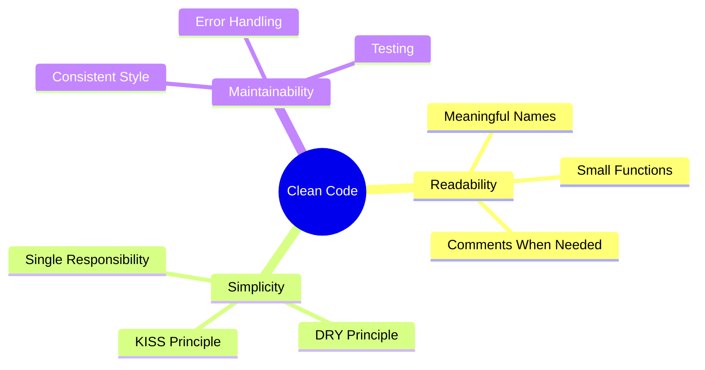

## 概要

クリーンコードは読みやすく、理解しやすく、保守しやすいコードです。このガイドはXOOPSモジュール開発に特化したクリーンコード原則をカバーしています。

## コア原則



## 意味のある名前

### 変数

```php
// 悪い例
$d = new DateTime();
$u = $memberHandler->getUser($id);
$arr = [];

// 良い例
$createdDate = new DateTime();
$currentUser = $memberHandler->getUser($userId);
$publishedArticles = [];
```

### 関数

```php
// 悪い例
function process($data) { ... }
function handle($item) { ... }
function doStuff($x, $y) { ... }

// 良い例
function publishArticle(Article $article): void { ... }
function calculateTotalPrice(array $items): float { ... }
function sendNotificationEmail(User $user, string $subject): bool { ... }
```

### クラス

```php
// 悪い例
class Manager { ... }
class Helper { ... }
class Utils { ... }

// 良い例
class ArticleRepository { ... }
class NotificationService { ... }
class PermissionChecker { ... }
```

## 小さな関数

### 単一責任

```php
// 悪い例 - 複数のことをしている
function processArticle($data) {
    // 検証
    if (empty($data['title'])) {
        throw new Exception('Title required');
    }
    // 保存
    $article = new Article();
    $article->setTitle($data['title']);
    $this->repository->save($article);
    // 通知
    $this->mailer->send($article->getAuthor(), 'Article published');
    // ログ
    $this->logger->info('Article created');
    return $article;
}

// 良い例 - 各関数が1つのことをする
function validateArticleData(array $data): void
{
    if (empty($data['title'])) {
        throw new ValidationException('Title required');
    }
}

function createArticle(array $data): Article
{
    $this->validateArticleData($data);
    return Article::create($data['title'], $data['content']);
}

function publishArticle(Article $article): void
{
    $this->repository->save($article);
    $this->notifyAuthor($article);
    $this->logArticleCreation($article);
}
```

### 関数の長さ

関数は短く保つ - 理想的には20行未満:

```php
// 良い例 - フォーカスされた関数
public function getPublishedArticles(int $limit = 10): array
{
    $criteria = new CriteriaCompo();
    $criteria->add(new Criteria('status', 'published'));
    $criteria->setSort('published_at');
    $criteria->setOrder('DESC');
    $criteria->setLimit($limit);

    return $this->repository->getObjects($criteria);
}
```

## DRY原則（繰り返さない）

### 共通コードの抽出

```php
// 悪い例 - 重複コード
function getActiveUsers() {
    $criteria = new CriteriaCompo();
    $criteria->add(new Criteria('level', 0, '>'));
    $criteria->setSort('uname');
    return $this->userHandler->getObjects($criteria);
}

function getActiveAdmins() {
    $criteria = new CriteriaCompo();
    $criteria->add(new Criteria('level', 0, '>'));
    $criteria->add(new Criteria('is_admin', 1));
    $criteria->setSort('uname');
    return $this->userHandler->getObjects($criteria);
}

// 良い例 - 共有ロジックを抽出
function getUsers(CriteriaCompo $criteria): array
{
    $criteria->add(new Criteria('level', 0, '>'));
    $criteria->setSort('uname');
    return $this->userHandler->getObjects($criteria);
}

function getActiveUsers(): array
{
    return $this->getUsers(new CriteriaCompo());
}

function getActiveAdmins(): array
{
    $criteria = new CriteriaCompo();
    $criteria->add(new Criteria('is_admin', 1));
    return $this->getUsers($criteria);
}
```

## エラーハンドリング

### 例外を適切に使用

```php
// 悪い例 - 汎用的な例外
throw new Exception('Error');

// 良い例 - 特定の例外
throw new ArticleNotFoundException($articleId);
throw new PermissionDeniedException('Cannot edit article');
throw new ValidationException(['title' => 'Title is required']);
```

### エラーを適切にハンドル

```php
public function findArticle(string $id): ?Article
{
    try {
        return $this->repository->findById($id);
    } catch (DatabaseException $e) {
        $this->logger->error('Database error finding article', [
            'id' => $id,
            'error' => $e->getMessage()
        ]);
        throw new ServiceException('Unable to retrieve article', 0, $e);
    }
}
```

## コメント

### コメントする時機

```php
// 悪い例 - 明白なコメント
// カウンターをインクリメント
$counter++;

// 良い例 - なぜかを説明、何かではなく
// ピークトラフィック時のデータベース負荷を軽減するため1時間キャッシュ
$cache->set($key, $data, 3600);

// 良い例 - 複雑なアルゴリズムを文書化
/**
 * TF-IDFアルゴリズムを使用して記事の関連性スコアを計算します。
 * スコアが高いほど検索用語との一致度が高いことを示します。
 */
function calculateRelevanceScore(Article $article, array $terms): float
{
    // ...
}
```

## コード組織

### クラス構造

```php
class ArticleService
{
    // 1. 定数
    private const MAX_TITLE_LENGTH = 255;

    // 2. プロパティ
    private ArticleRepository $repository;
    private EventDispatcher $events;

    // 3. コンストラクタ
    public function __construct(
        ArticleRepository $repository,
        EventDispatcher $events
    ) {
        $this->repository = $repository;
        $this->events = $events;
    }

    // 4. パブリックメソッド
    public function publish(Article $article): void { ... }
    public function archive(Article $article): void { ... }

    // 5. プライベートメソッド
    private function validateForPublication(Article $article): void { ... }
}
```

## クリーンコードチェックリスト

- [ ] 名前は意味のあるものであり、発音可能である
- [ ] 関数は1つのことだけを行う
- [ ] 関数は小さい（20行未満）
- [ ] 重複コードはない
- [ ] 特定の例外を使用した適切なエラーハンドリング
- [ ] コメントは「何」ではなく「なぜ」を説明
- [ ] 一貫性のある形式とスタイル
- [ ] マジックナンバーまたは文字列がない
- [ ] 依存関係は注入され、作成されていない

## 関連ドキュメント

- コード組織
- エラーハンドリング
- テストのベストプラクティス
- PHP標準
