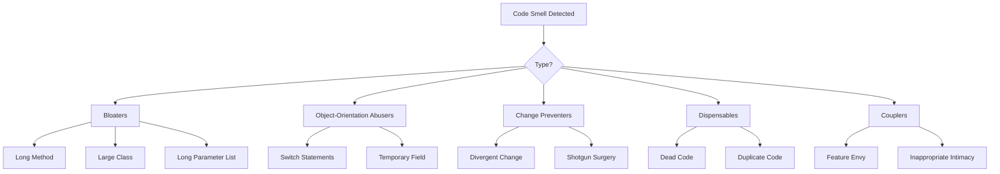

## 概要

コードスメルはコード内の潜在的な問題の指標です。これは必ずしもコードが壊れていることを意味しませんが、リファクタリングの恩恵を受ける可能性のある領域を示唆しています。

## 一般的なコードスメル



## ブロッカー（膨張型スメル）

### 長いメソッド

```php
// スメル: メソッドが多くのことをしている
function processArticleSubmission($data) {
    // 100行以上の検証、保存、通知など
}

// 解決策: フォーカスされたメソッドに抽出
function processArticleSubmission(array $data): Article
{
    $this->validateInput($data);
    $article = $this->createArticle($data);
    $this->saveArticle($article);
    $this->notifySubscribers($article);
    return $article;
}
```

### 大きなクラス（神クラス）

```php
// スメル: クラスが全てをしている
class ArticleManager {
    public function create() { ... }
    public function delete() { ... }
    public function sendEmail() { ... }
    public function generatePDF() { ... }
    public function exportToExcel() { ... }
    public function validateUser() { ... }
    public function checkPermissions() { ... }
    // ... さらに50個のメソッド
}

// 解決策: フォーカスされたクラスに分割
class ArticleService { ... }
class ArticleExporter { ... }
class ArticleNotifier { ... }
class PermissionChecker { ... }
```

### 長いパラメーターリスト

```php
// スメル: パラメーターが多すぎる
function createArticle($title, $content, $author, $category, $tags, $status, $publishDate, $featured, $image) { ... }

// 解決策: パラメーターオブジェクトを使用
class CreateArticleCommand {
    public string $title;
    public string $content;
    public int $authorId;
    public int $categoryId;
    public array $tags;
    public string $status;
    public ?DateTime $publishDate;
    public bool $featured;
    public ?string $image;
}

function createArticle(CreateArticleCommand $command): Article { ... }
```

## オブジェクト指向の濫用

### Switch文

```php
// スメル: Switch文による型チェック
function getDiscount($userType) {
    switch ($userType) {
        case 'regular':
            return 0;
        case 'premium':
            return 10;
        case 'vip':
            return 20;
        default:
            return 0;
    }
}

// 解決策: ポリモーフィズムを使用
interface UserType {
    public function getDiscount(): int;
}

class RegularUser implements UserType {
    public function getDiscount(): int { return 0; }
}

class PremiumUser implements UserType {
    public function getDiscount(): int { return 10; }
}

class VipUser implements UserType {
    public function getDiscount(): int { return 20; }
}
```

### 一時的なフィールド

```php
// スメル: 特定の状況でのみ使用されるフィールド
class Article {
    private $tempCalculatedScore;

    public function search($terms) {
        $this->tempCalculatedScore = $this->calculateScore($terms);
        // ... スコアを使用
    }
}

// 解決策: パラメーターまたは戻り値として渡す
class Article {
    public function getSearchScore(array $terms): float {
        return $this->calculateScore($terms);
    }
}
```

## 変更を防ぐもの

### 発散した変更

```php
// スメル: 1つのクラスが多くの異なる理由で変更される
class Article {
    public function save() { ... } // データベース変更
    public function toJson() { ... } // API形式変更
    public function validate() { ... } // ビジネスルール変更
    public function render() { ... } // UI変更
}

// 解決策: 責任を分離
class Article { ... } // ドメインオブジェクトのみ
class ArticleRepository { public function save() { ... } }
class ArticleSerializer { public function toJson() { ... } }
class ArticleValidator { public function validate() { ... } }
```

### ショットガン手術

```php
// スメル: 1つの変更で多くのファイルを編集する必要
// 日付形式の変更には以下を編集が必要:
// - ArticleController.php
// - ArticleView.php
// - ArticleAPI.php
// - ArticleExport.php

// 解決策: 一元化
class DateFormatter {
    public function format(DateTime $date): string {
        return $date->format($this->config->get('date_format'));
    }
}
```

## 除去可能なもの

### デッドコード

```php
// スメル: 到達不可能なコードまたは未使用コード
function processData($data) {
    if (true) {
        return $this->handleData($data);
    }
    // これは実行されない
    return $this->legacyHandler($data);
}

// まだコードベースにある未使用メソッド
function oldMethod() {
    // どこからも呼び出されていない
}

// 解決策: デッドコードを削除
function processData($data) {
    return $this->handleData($data);
}
```

### 重複コード

```php
// スメル: 複数の場所に同じロジック
class ArticleHandler {
    public function getActive() {
        $criteria = new CriteriaCompo();
        $criteria->add(new Criteria('status', 'active'));
        return $this->getObjects($criteria);
    }
}

class NewsHandler {
    public function getActive() {
        $criteria = new CriteriaCompo();
        $criteria->add(new Criteria('status', 'active'));
        return $this->getObjects($criteria);
    }
}

// 解決策: 共通の振る舞いを抽出
trait ActiveRecordsTrait {
    public function getActive(): array {
        $criteria = new CriteriaCompo();
        $criteria->add(new Criteria('status', 'active'));
        return $this->getObjects($criteria);
    }
}
```

## カップラー（結合型スメル）

### フィーチャーエンビー

```php
// スメル: メソッドが別のオブジェクトのデータを自分のデータより多く使用
class Invoice {
    public function calculateTotal(Customer $customer) {
        $total = 0;
        foreach ($this->items as $item) {
            $total += $item->price;
        }
        // 顧客データを広く使用
        if ($customer->isPremium()) {
            $total *= (1 - $customer->getDiscountRate());
        }
        if ($customer->getCountry() === 'US') {
            $total *= 1.08; // 税
        }
        return $total;
    }
}

// 解決策: 振る舞いをデータを持つオブジェクトに移動
class Customer {
    public function applyDiscount(float $amount): float {
        return $this->isPremium()
            ? $amount * (1 - $this->discountRate)
            : $amount;
    }

    public function applyTax(float $amount): float {
        return $this->country === 'US'
            ? $amount * 1.08
            : $amount;
    }
}
```

## リファクタリングチェックリスト

コードスメルを見つけたときは:

1. **識別** - それはどのスメルか?
2. **評価** - 影響の深刻さは?
3. **計画** - どのリファクタリング技術が適用される?
4. **テスト** - リファクタリング前にテストが存在するか確認
5. **リファクタリング** - 小さく段階的な変更を加える
6. **検証** - 各変更後にテストを実行

## 関連ドキュメント

- クリーンコード原則
- コード組織
- テストのベストプラクティス
