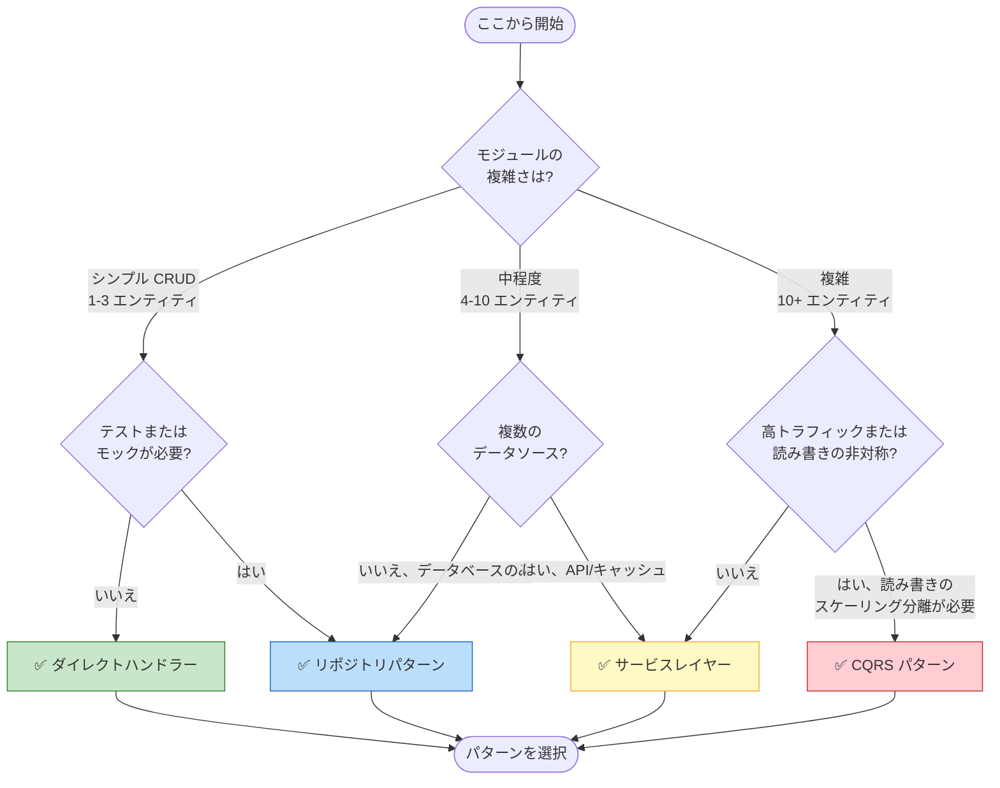
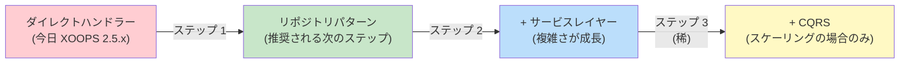

<span class="version-badge version-25x">2.5.x ✅</span> <span class="version-badge version-40x">4.0.x ✅</span>

> **どのパターンを使うべき?** この判定木は、ダイレクトハンドラー、リポジトリパターン、サービスレイヤー、CQRS の選択に役立ちます。

---

## クイック判定木



---

## パターン比較

| 基準 | ダイレクトハンドラー | リポジトリ | サービスレイヤー | CQRS |
|----------|---------------|------------|---------------|------|
| **複雑さ** | ⭐ | ⭐⭐ | ⭐⭐⭐ | ⭐⭐⭐⭐⭐ |
| **テスト可能性** | ❌ 難しい | ✅ 良好 | ✅ 優れている | ✅ 優れている |
| **柔軟性** | ❌ 低い | ✅ 中程度 | ✅ 高い | ✅ 非常に高い |
| **XOOPS 2.5.x** | ✅ ネイティブ | ✅ 動作 | ✅ 動作 | ⚠️ 複雑 |
| **XOOPS 4.0** | ⚠️ 非推奨 | ✅ 推奨 | ✅ 推奨 | ✅ スケール時 |
| **チームサイズ** | 1 開発者 | 1-3 開発者 | 2-5 開発者 | 5+ 開発者 |
| **保守性** | ❌ 高い | ✅ 中程度 | ✅ 低い | ⚠️ 専門知識が必要 |

---

## 各パターンを使う時期

### ✅ ダイレクトハンドラー (`XoopsPersistableObjectHandler`)

**最適:** シンプルなモジュール、クイックプロトタイプ、XOOPS 学習中

```php
// シンプルで直接的 - 小さなモジュールに適している
$handler = xoops_getModuleHandler('article', 'news');
$articles = $handler->getObjects(new Criteria('status', 1));
```

**このパターンを選ぶ:**
- 1-3 個のデータベーステーブルを持つシンプルなモジュール構築
- クイックプロトタイプを作成
- テストが不要で、唯一の開発者の場合
- モジュールが大きく成長しない場合

**制限:**
- ユニットテストが難しい (グローバル依存性)
- XOOPS データベースレイヤーへのタイトなカップリング
- ビジネスロジックがコントローラーに漏れやすい

---

### ✅ リポジトリパターン

**最適:** ほとんどのモジュール、テスト可能性を望むチーム

```php
// 抽象化によりテストのモッキングが可能
interface ArticleRepositoryInterface {
    public function findPublished(): array;
    public function save(Article $article): void;
}

class XoopsArticleRepository implements ArticleRepositoryInterface {
    private $handler;

    public function __construct() {
        $this->handler = xoops_getModuleHandler('article', 'news');
    }

    public function findPublished(): array {
        return $this->handler->getObjects(new Criteria('status', 1));
    }
}
```

**このパターンを選ぶ:**
- ユニットテストを書きたい場合
- データソースが後で変わる可能性がある場合
- 2 人以上の開発者で作業
- 配布用のモジュールを構築

**アップグレードパス:** XOOPS 4.0 準備に推奨されるパターンです。

---

### ✅ サービスレイヤー

**最適:** 複雑なビジネスロジックを持つモジュール

```php
// サービスは複数のリポジトリを調整し、ビジネスルールを含む
class ArticlePublicationService {
    public function __construct(
        private ArticleRepositoryInterface $articles,
        private NotificationServiceInterface $notifications,
        private CacheInterface $cache
    ) {}

    public function publish(int $articleId): void {
        $article = $this->articles->find($articleId);
        $article->setStatus('published');
        $article->setPublishedAt(new DateTime());

        $this->articles->save($article);
        $this->notifications->notifySubscribers($article);
        $this->cache->invalidate("article:{$articleId}");
    }
}
```

**このパターンを選ぶ:**
- 操作が複数のデータソースにまたがる場合
- ビジネスルールが複雑な場合
- トランザクション管理が必要な場合
- アプリのさまざまな部分で同じ操作を行う場合

**アップグレードパス:** 堅牢なアーキテクチャのためにリポジトリと組み合わせます。

---

### ⚠️ CQRS (コマンドクエリ責任分離)

**最適:** 読み書き非対称性のある高スケールモジュール

```php
// コマンドは状態を変更
class PublishArticleCommand {
    public function __construct(
        public readonly int $articleId,
        public readonly int $publisherId
    ) {}
}

// クエリは状態を読み取る (正規化されていない読み取りモデルを使用可能)
class GetPublishedArticlesQuery {
    public function __construct(
        public readonly int $limit = 10
    ) {}
}
```

**このパターンを選ぶ:**
- 読み込みが書き込みを大きく上回る場合 (100:1 以上)
- 読み取りと書き込みのスケーリングを分離する必要がある場合
- 複雑なレポート/分析要件がある場合
- イベントソーシングがドメインに役立つ場合

**警告:** CQRS は相当な複雑さを追加します。ほとんどの XOOPS モジュールはこれを必要としません。

---

## 推奨アップグレードパス



### ステップ 1: ハンドラーをリポジトリで ラップ (2-4 時間)

1. データアクセスニーズのインターフェースを作成
2. 既存のハンドラーを使用してそれを実装
3. `xoops_getModuleHandler()` を直接呼び出すのではなく、リポジトリを注入

### ステップ 2: 必要に応じてサービスレイヤーを追加 (1-2 日)

1. ビジネスロジックがコントローラーに現れたら、サービスに抽出
2. サービスはリポジトリを使用し、ハンドラーは使用しない
3. コントローラーはシン (ルート → サービス → レスポンス)

### ステップ 3: 必要な場合のみ CQRS を検討 (稀)

1. 1 日あたり数百万の読み込みがある場合
2. 読み取りと書き込みモデルが大きく異なる場合
3. 監査証跡についてイベントソーシングが必要な場合
4. CQRS の経験豊富なチームがある場合

---

## クイックリファレンスカード

| 質問 | 回答 |
|----------|--------|
| **「データを保存/読み込むだけ」** | ダイレクトハンドラー |
| **「テストを書きたい」** | リポジトリパターン |
| **「複雑なビジネスルールがある」** | サービスレイヤー |
| **「読み込みを別々にスケーリングする必要がある」** | CQRS |
| **「XOOPS 4.0 に備える」** | リポジトリ + サービスレイヤー |

---

## 関連ドキュメント

- [リポジトリパターンガイド](Patterns/Repository-Pattern.md)
- [サービスレイヤーパターンガイド](Patterns/Service-Layer-Pattern.md)
- [CQRS パターンガイド](../07-XOOPS-4.0/Implementation-Guides/CQRS-Pattern-Guide.md) *(高度)*
- [ハイブリッドモードコントラクト](../07-XOOPS-4.0/Specifications/Hybrid-Mode-Contract.md)

---

#patterns #data-access #decision-tree #best-practices #xoops
