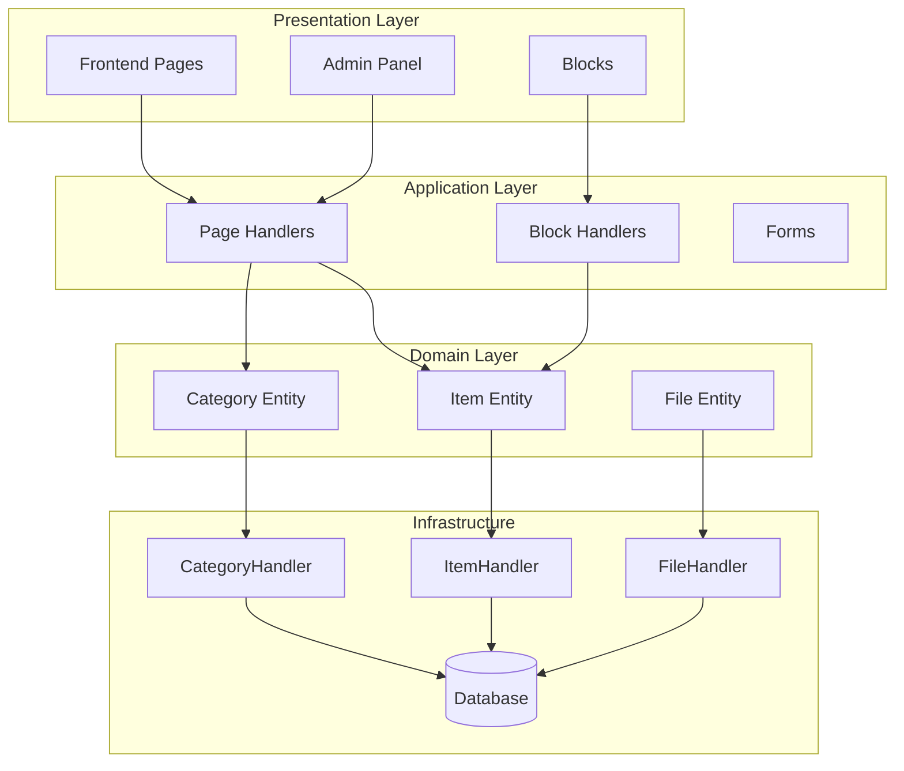
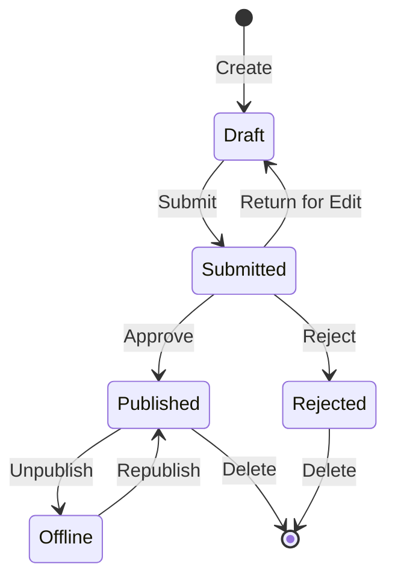

## 概要

このドキュメントは、Publisherモジュールのアーキテクチャ、パターン、および実装の詳細に関する技術的な分析を提供します。本番品質のXOOPSモジュールがどのように構造化されているかを理解するためのリファレンスとして使用してください。

## アーキテクチャ概要



## ディレクトリ構造

```
publisher/
├── admin/
│   ├── index.php           # 管理画面ダッシュボード
│   ├── item.php            # 記事管理
│   ├── category.php        # カテゴリ管理
│   ├── permission.php      # パーミッション
│   ├── file.php            # ファイルマネージャー
│   └── menu.php            # 管理メニュー
├── assets/
│   ├── css/
│   ├── js/
│   └── images/
├── class/
│   ├── Category.php        # カテゴリエンティティ
│   ├── CategoryHandler.php # カテゴリデータアクセス
│   ├── Item.php            # 記事エンティティ
│   ├── ItemHandler.php     # 記事データアクセス
│   ├── File.php            # ファイル添付
│   ├── FileHandler.php     # ファイルデータアクセス
│   ├── Form/               # フォームクラス
│   ├── Common/             # ユーティリティ
│   └── Helper.php          # モジュールヘルパー
├── include/
│   ├── common.php          # 初期化
│   ├── functions.php       # ユーティリティ関数
│   ├── oninstall.php       # インストールフック
│   ├── onupdate.php        # アップデートフック
│   └── search.php          # 検索統合
├── language/
├── templates/
├── sql/
└── xoops_version.php
```

## エンティティ分析

### Item（記事）エンティティ

```php
class Item extends \XoopsObject
{
    // フィールド
    public function initVar(): void
    {
        $this->initVar('itemid', XOBJ_DTYPE_INT, null, false);
        $this->initVar('categoryid', XOBJ_DTYPE_INT, 0, false);
        $this->initVar('title', XOBJ_DTYPE_TXTBOX, '', true);
        $this->initVar('subtitle', XOBJ_DTYPE_TXTBOX, '');
        $this->initVar('summary', XOBJ_DTYPE_TXTAREA, '');
        $this->initVar('body', XOBJ_DTYPE_TXTAREA, '', true);
        $this->initVar('uid', XOBJ_DTYPE_INT, 0);
        $this->initVar('status', XOBJ_DTYPE_INT, 0);
        $this->initVar('datesub', XOBJ_DTYPE_INT, time());
        // ... その他のフィールド
    }

    // ビジネスメソッド
    public function isPublished(): bool
    {
        return $this->getVar('status') == _PUBLISHER_STATUS_PUBLISHED;
    }

    public function canEdit(int $userId): bool
    {
        return $this->getVar('uid') == $userId
            || $this->isAdmin($userId);
    }
}
```

### ハンドラーパターン

```php
class ItemHandler extends \XoopsPersistableObjectHandler
{
    public function __construct(\XoopsDatabase $db)
    {
        parent::__construct(
            $db,
            'publisher_items',
            Item::class,
            'itemid',
            'title'
        );
    }

    public function getPublishedItems(int $limit = 10): array
    {
        $criteria = new \CriteriaCompo();
        $criteria->add(new \Criteria('status', _PUBLISHER_STATUS_PUBLISHED));
        $criteria->setSort('datesub');
        $criteria->setOrder('DESC');
        $criteria->setLimit($limit);

        return $this->getObjects($criteria);
    }
}
```

## パーミッションシステム

### パーミッションタイプ

| パーミッション | 説明 |
|------------|-------------|
| `publisher_view` | カテゴリ/記事の表示 |
| `publisher_submit` | 新しい記事の投稿 |
| `publisher_approve` | 自動承認 |
| `publisher_moderate` | 保留中の記事のレビュー |
| `publisher_global` | グローバルモジュールパーミッション |

### パーミッションチェック

```php
class PermissionHandler
{
    public function isGranted(string $permission, int $categoryId): bool
    {
        $userId = $GLOBALS['xoopsUser']?->uid() ?? 0;
        $groups = $this->getUserGroups($userId);

        return $this->grouppermHandler->checkRight(
            $permission,
            $categoryId,
            $groups,
            $this->helper->getModule()->mid()
        );
    }
}
```

## ワークフロー状態



## テンプレート構造

### フロントエンドテンプレート

| テンプレート | 目的 |
|----------|---------|
| `publisher_index.tpl` | モジュールホームページ |
| `publisher_item.tpl` | 単一記事 |
| `publisher_category.tpl` | カテゴリリスト |
| `publisher_submit.tpl` | 投稿フォーム |
| `publisher_search.tpl` | 検索結果 |

### ブロックテンプレート

| テンプレート | 目的 |
|----------|---------|
| `publisher_block_latest.tpl` | 最新記事 |
| `publisher_block_spotlight.tpl` | 注目記事 |
| `publisher_block_category.tpl` | カテゴリメニュー |

## 使用されているキーパターン

1. **ハンドラーパターン** - データアクセスのカプセル化
2. **バリューオブジェクト** - ステータス定数
3. **テンプレートメソッド** - フォーム生成
4. **ストラテジー** - 異なる表示モード
5. **オブザーバー** - イベント時の通知

## モジュール開発のレッスン

1. CRUDにはXoopsPersistableObjectHandlerを使用する
2. きめ細かいパーミッションを実装する
3. プレゼンテーションとロジックを分離する
4. クエリにはCriteriaを使用する
5. 複数のコンテンツステータスをサポートする
6. XOOPSの通知システムと統合する

## 関連ドキュメント

- Creating-Articles - 記事管理
- Managing-Categories - カテゴリシステム
- Permissions-Setup - パーミッション設定
- Developer-Guide/Hooks-and-Events - 拡張ポイント
