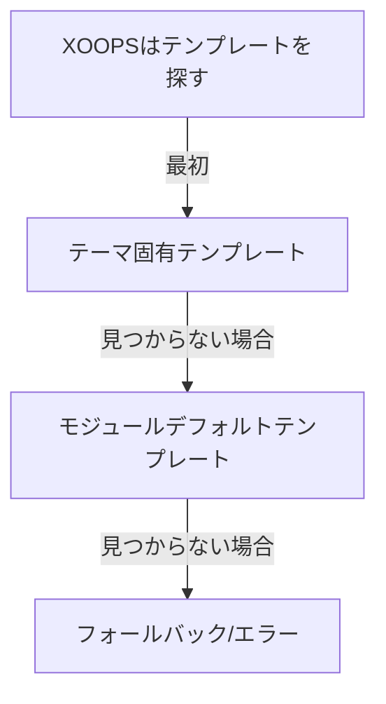

# Publisherのカスタムテンプレート

> Smarty、CSS、HTMLオーバーライドを使用してPublisherテンプレートを作成およびカスタマイズするガイド。

---

## テンプレートシステム概要

### テンプレートとは

テンプレートはPublisherがコンテンツを表示する方法を制御します:

```
テンプレートがレンダリングするもの:
  ├── 記事表示
  ├── カテゴリリスト
  ├── アーカイブページ
  ├── 記事リスト
  ├── コメントセクション
  ├── 検索結果
  ├── ブロック
  └── 管理ページ
```

### テンプレートタイプ

```
ベーステンプレート:
  ├── publisher_index.tpl (モジュールホーム)
  ├── publisher_item.tpl (単一記事)
  ├── publisher_category.tpl (カテゴリページ)
  └── publisher_archive.tpl (アーカイブビュー)

ブロックテンプレート:
  ├── publisher_block_latest.tpl
  ├── publisher_block_categories.tpl
  ├── publisher_block_archives.tpl
  └── publisher_block_top.tpl

管理テンプレート:
  ├── admin_articles.tpl
  ├── admin_categories.tpl
  └── admin_*
```

---

## テンプレートディレクトリ

### テンプレートファイル構造

```
XOOPS インストール:
├── modules/publisher/
│   └── templates/
│       ├── Publisher/ (ベーステンプレート)
│       │   ├── publisher_index.tpl
│       │   ├── publisher_item.tpl
│       │   ├── publisher_category.tpl
│       │   ├── blocks/
│       │   │   ├── publisher_block_latest.tpl
│       │   │   └── publisher_block_categories.tpl
│       │   └── css/
│       │       └── publisher.css
│       └── Themes/ (テーマ固有)
│           ├── Classic/
│           ├── Modern/
│           └── Dark/

themes/yourtheme/
└── modules/
    └── publisher/
        ├── templates/
        │   └── publisher_custom.tpl
        ├── css/
        │   └── custom.css
        └── images/
            └── icons/
```

### テンプレート階層



---

## カスタムテンプレートを作成

### テンプレートをテーマにコピー

**方法1: ファイルマネージャー経由**

```
1. /themes/yourtheme/modules/publisher/に移動
2. ディレクトリが存在しない場合は作成:
   - templates/
   - css/
   - js/ (オプション)
3. モジュールテンプレートファイルをコピー:
   modules/publisher/templates/Publisher/publisher_item.tpl
   → themes/yourtheme/modules/publisher/templates/publisher_item.tpl
4. テーマコピーを編集（モジュールコピーではない！）
```

**方法2: FTP/SSH経由**

```bash
# テーマオーバーライドディレクトリを作成
mkdir -p /path/to/xoops/themes/yourtheme/modules/publisher/templates

# テンプレートファイルをコピー
cp /path/to/xoops/modules/publisher/templates/Publisher/*.tpl \
   /path/to/xoops/themes/yourtheme/modules/publisher/templates/

# ファイルがコピーされたことを確認
ls /path/to/xoops/themes/yourtheme/modules/publisher/templates/
```

### カスタムテンプレートを編集

テーマコピーをテキストエディターで開きます:

```
ファイル: /themes/yourtheme/modules/publisher/templates/publisher_item.tpl

編集:
  1. Smarty変数を変更しない
  2. HTMLを修正
  3. カスタムCSSクラスを追加
  4. 表示ロジックを調整
```

---

## Smartyテンプレート基礎

### Smarty変数

Publisherはテンプレートに変数を提供します:

#### 記事変数

```smarty
{* 単一記事の変数 *}
<h1>{$item->title()}</h1>
<p>{$item->description()}</p>
<p>{$item->body()}</p>
<p>By {$item->uname()} on {$item->date('l, F j, Y')}</p>
<p>Category: {$item->category}</p>
<p>Views: {$item->views()}</p>
```

#### カテゴリ変数

```smarty
{* カテゴリ変数 *}
<h2>{$category->name()}</h2>
<p>{$category->description()}</p>
image()}" alt="{$category->name()}">
<p>Articles: {$category->itemCount()}</p>
```

#### ブロック変数

```smarty
{* 最新記事ブロック *}
{foreach from=$items item=item}
  <div class="article">
    <h3>{$item->title()}</h3>
    <p>{$item->summary()}</p>
  </div>
{/foreach}
```

### 共通Smarty構文

```smarty
{* 変数 *}
{$variable}
{$array.key}
{$object->method()}

{* 条件 *}
{if $condition}
  <p>条件が真の場合に表示</p>
{else}
  <p>条件が偽の場合に表示</p>
{/if}

{* ループ *}
{foreach from=$array item=item}
  <li>{$item}</li>
{/foreach}

{* 関数 *}
{$variable|truncate:100:"..."}
{$date|date_format:"%Y-%m-%d"}
{$text|htmlspecialchars}

{* コメント *}
{* これはSmartyコメント、表示されない *}
```

---

## テンプレート例

### 単一記事テンプレート

**ファイル: publisher_item.tpl**

```smarty
<!-- 記事詳細ビュー -->
<div class="publisher-item">

  <!-- ヘッダーセクション -->
  <div class="article-header">
    <h1>{$item->title()}</h1>

    {if $item->subtitle()}
      <h2 class="article-subtitle">{$item->subtitle()}</h2>
    {/if}

    <div class="article-meta">
      <span class="author">
        By <a href="{$item->authorUrl()}">{$item->uname()}</a>
      </span>
      <span class="date">
        {$item->date('l, F j, Y')}
      </span>
      <span class="category">
        <a href="{$item->categoryUrl()}">
          {$item->category}
        </a>
      </span>
      <span class="views">
        {$item->views()} views
      </span>
    </div>
  </div>

  <!-- フィーチャー画像 -->
  {if $item->image()}
    <div class="article-featured-image">
      image()}"
           alt="{$item->title()}"
           class="img-fluid">
    </div>
  {/if}

  <!-- 記事本文 -->
  <div class="article-content">
    {$item->body()}
  </div>

  <!-- タグ -->
  {if $item->tags()}
    <div class="article-tags">
      <strong>Tags:</strong>
      {foreach from=$item->tags() item=tag}
        <span class="tag">
          <a href="{$tag->url()}">{$tag->name()}</a>
        </span>
      {/foreach}
    </div>
  {/if}

  <!-- フッターセクション -->
  <div class="article-footer">
    <div class="article-actions">
      {if $canEdit}
        <a href="{$editUrl}" class="btn btn-primary">Edit</a>
      {/if}
      {if $canDelete}
        <a href="{$deleteUrl}" class="btn btn-danger">Delete</a>
      {/if}
    </div>

    {if $allowRatings}
      <div class="article-rating">
        <!-- 評価コンポーネント -->
      </div>
    {/if}
  </div>

</div>

<!-- コメントセクション -->
{if $allowComments}
  <div class="article-comments">
    <h3>Comments</h3>
    {include file="publisher_comments.tpl"}
  </div>
{/if}
```

### カテゴリリストテンプレート

**ファイル: publisher_category.tpl**

```smarty
<!-- カテゴリページ -->
<div class="publisher-category">

  <!-- カテゴリヘッダー -->
  <div class="category-header">
    <h1>{$category->name()}</h1>

    {if $category->image()}
      image()}"
           alt="{$category->name()}"
           class="category-image">
    {/if}

    {if $category->description()}
      <p class="category-description">
        {$category->description()}
      </p>
    {/if}
  </div>

  <!-- サブカテゴリ -->
  {if $subcategories}
    <div class="subcategories">
      <h3>Subcategories</h3>
      <ul>
        {foreach from=$subcategories item=sub}
          <li>
            <a href="{$sub->url()}">{$sub->name()}</a>
            ({$sub->itemCount()} articles)
          </li>
        {/foreach}
      </ul>
    </div>
  {/if}

  <!-- 記事リスト -->
  <div class="articles-list">
    <h2>Articles</h2>

    {if count($items) > 0}
      {foreach from=$items item=item}
        <article class="article-preview">
          {if $item->image()}
            <div class="article-image">
              <a href="{$item->url()}">
                image()}" alt="{$item->title()}">
              </a>
            </div>
          {/if}

          <div class="article-content">
            <h3>
              <a href="{$item->url()}">{$item->title()}</a>
            </h3>

            <div class="article-meta">
              <span class="date">{$item->date('M d, Y')}</span>
              <span class="author">by {$item->uname()}</span>
            </div>

            <p class="article-excerpt">
              {$item->description()|truncate:200:"..."}
            </p>

            <a href="{$item->url()}" class="read-more">
              Read More →
            </a>
          </div>
        </article>
      {/foreach}

      <!-- ページネーション -->
      {if $pagination}
        <nav class="pagination">
          {$pagination}
        </nav>
      {/if}
    {else}
      <p class="no-articles">
        No articles in this category yet.
      </p>
    {/if}
  </div>

</div>
```

### 最新記事ブロックテンプレート

**ファイル: publisher_block_latest.tpl**

```smarty
<!-- 最新記事ブロック -->
<div class="publisher-block-latest">
  <h3>{$block_title|default:"Latest Articles"}</h3>

  {if count($items) > 0}
    <ul class="article-list">
      {foreach from=$items item=item name=articles}
        <li class="article-item">
          <a href="{$item->url()}" title="{$item->title()}">
            {$item->title()}
          </a>
          <span class="date">
            {$item->date('M d, Y')}
          </span>

          {if $show_summary && $item->description()}
            <p class="summary">
              {$item->description()|truncate:80:"..."}
            </p>
          {/if}
        </li>
      {/foreach}
    </ul>
  {else}
    <p>No articles available.</p>
  {/if}
</div>
```

---

## CSSでスタイリング

### カスタムCSSファイル

テーマ内にカスタムCSSを作成:

```
/themes/yourtheme/modules/publisher/css/custom.css
```

### ベーステンプレート構造

HTMLの構造を理解します:

```html
<!-- Publisherモジュール -->
<div class="publisher-module">

  <!-- アイテムビュー -->
  <div class="publisher-item">
    <div class="article-header">...</div>
    <div class="article-featured-image">...</div>
    <div class="article-content">...</div>
    <div class="article-footer">...</div>
  </div>

  <!-- カテゴリビュー -->
  <div class="publisher-category">
    <div class="category-header">...</div>
    <div class="articles-list">...</div>
  </div>

  <!-- ブロック -->
  <div class="publisher-block-latest">
    <ul class="article-list">...</ul>
  </div>

</div>
```

### CSS例

```css
/* 記事コンテナ */
.publisher-item {
  background: #fff;
  border: 1px solid #ddd;
  border-radius: 4px;
  padding: 20px;
  margin-bottom: 20px;
}

/* 記事ヘッダー */
.article-header {
  border-bottom: 2px solid #f0f0f0;
  padding-bottom: 15px;
  margin-bottom: 20px;
}

.article-header h1 {
  font-size: 2.5em;
  margin: 0 0 10px 0;
  color: #333;
}

.article-subtitle {
  font-size: 1.3em;
  color: #666;
  font-style: italic;
  margin: 0;
}

/* 記事メタ情報 */
.article-meta {
  font-size: 0.9em;
  color: #999;
}

.article-meta span {
  margin-right: 20px;
}

.article-meta a {
  color: #0066cc;
  text-decoration: none;
}

.article-meta a:hover {
  text-decoration: underline;
}

/* 記事フィーチャー画像 */
.article-featured-image {
  margin: 20px 0;
  text-align: center;
}

.article-featured-image img {
  max-width: 100%;
  height: auto;
  border-radius: 4px;
}

/* 記事コンテンツ */
.article-content {
  font-size: 1.1em;
  line-height: 1.8;
  color: #333;
}

.article-content h2 {
  font-size: 1.8em;
  margin: 30px 0 15px 0;
  color: #222;
}

.article-content h3 {
  font-size: 1.4em;
  margin: 20px 0 10px 0;
  color: #444;
}

.article-content p {
  margin-bottom: 15px;
}

.article-content ul,
.article-content ol {
  margin: 15px 0 15px 30px;
}

.article-content li {
  margin-bottom: 8px;
}

/* 記事タグ */
.article-tags {
  margin-top: 20px;
  padding-top: 20px;
  border-top: 1px solid #f0f0f0;
}

.tag {
  display: inline-block;
  background: #f0f0f0;
  padding: 5px 10px;
  margin: 5px 5px 5px 0;
  border-radius: 3px;
  font-size: 0.9em;
}

.tag a {
  color: #0066cc;
  text-decoration: none;
}

.tag a:hover {
  text-decoration: underline;
}

/* カテゴリ記事リスト */
.publisher-category .articles-list {
  margin-top: 30px;
}

.article-preview {
  display: flex;
  margin-bottom: 30px;
  padding-bottom: 30px;
  border-bottom: 1px solid #f0f0f0;
}

.article-preview:last-child {
  border-bottom: none;
}

.article-image {
  flex: 0 0 200px;
  margin-right: 20px;
}

.article-image img {
  width: 100%;
  height: 150px;
  object-fit: cover;
  border-radius: 4px;
}

.article-content {
  flex: 1;
}

/* レスポンシブ */
@media (max-width: 768px) {
  .article-preview {
    flex-direction: column;
  }

  .article-image {
    flex: 1;
    margin: 0 0 15px 0;
  }

  .article-header h1 {
    font-size: 1.8em;
  }
}
```

---

## テンプレート変数リファレンス

### Item（記事）オブジェクト

```smarty
{* 記事プロパティ *}
{$item->id()}              {* 記事ID *}
{$item->title()}           {* 記事タイトル *}
{$item->description()}     {* 短い説明 *}
{$item->body()}            {* 全文コンテンツ *}
{$item->subtitle()}        {* サブタイトル *}
{$item->uname()}           {* 著者ユーザー名 *}
{$item->authorId()}        {* 著者ユーザーID *}
{$item->date()}            {* 公開日 *}
{$item->modified()}        {* 最後修正日 *}
{$item->image()}           {* フィーチャー画像URL *}
{$item->views()}           {* ビュー数 *}
{$item->categoryId()}      {* カテゴリID *}
{$item->category()}        {* カテゴリ名 *}
{$item->categoryUrl()}     {* カテゴリURL *}
{$item->url()}             {* 記事URL *}
{$item->status()}          {* 記事ステータス *}
{$item->rating()}          {* 平均評価 *}
{$item->comments()}        {* コメント数 *}
{$item->tags()}            {* 記事タグ配列 *}

{* フォーマットメソッド *}
{$item->date('Y-m-d')}               {* フォーマット済み日付 *}
{$item->description()|truncate:100}  {* 短縮済み *}
```

### Categoryオブジェクト

```smarty
{* カテゴリプロパティ *}
{$category->id()}          {* カテゴリID *}
{$category->name()}        {* カテゴリ名 *}
{$category->description()} {* 説明 *}
{$category->image()}       {* 画像URL *}
{$category->parentId()}    {* 親カテゴリID *}
{$category->itemCount()}   {* 記事数 *}
{$category->url()}         {* カテゴリURL *}
{$category->status()}      {* ステータス *}
```

### ブロック変数

```smarty
{$items}           {* アイテム配列 *}
{$categories}      {* カテゴリ配列 *}
{$pagination}      {* ページネーションHTML *}
{$total}           {* 合計数 *}
{$limit}           {* ページあたりアイテム数 *}
{$page}            {* 現在のページ *}
```

---

## テンプレート条件文

### 共通条件チェック

```smarty
{* 変数が存在し、空でないかチェック *}
{if $variable}
  <p>{$variable}</p>
{/if}

{* 配列にアイテムがあるかチェック *}
{if count($items) > 0}
  {foreach from=$items item=item}
    <li>{$item->title()}</li>
  {/foreach}
{else}
  <p>No items available.</p>
{/if}

{* ユーザーパーミッションをチェック *}
{if $canEdit}
  <a href="edit.php?id={$item->id()}">Edit</a>
{/if}

{if $isAdmin}
  <a href="delete.php?id={$item->id()}">Delete</a>
{/if}

{* モジュール設定をチェック *}
{if $allowComments}
  {include file="publisher_comments.tpl"}
{/if}

{* ステータスをチェック *}
{if $item->status() == 1}
  <span class="published">Published</span>
{elseif $item->status() == 0}
  <span class="draft">Draft</span>
{/if}
```

---

## 高度なテンプレート技術

### 他のテンプレートをインクルード

```smarty
{* 別のテンプレートをインクルード *}
{include file="publisher_comments.tpl"}

{* 変数付きでインクルード *}
{include file="publisher_article_preview.tpl" item=$item}

{* 存在する場合インクルード *}
{include file="custom_header.tpl"|default:"header.tpl"}
```

### テンプレート内で変数を割り当て

```smarty
{* 後で使用する変数を割り当て *}
{assign var="articleTitle" value=$item->title()}

{* 割り当てられた変数を使用 *}
<h1>{$articleTitle}</h1>

{* 複雑な値を割り当て *}
{assign var="count" value=$items|count}
{if $count > 0}
  <p>Found {$count} articles</p>
{/if}
```

### テンプレートフィルター

```smarty
{* テキストフィルター *}
{$text|htmlspecialchars}        {* HTMLをエスケープ *}
{$text|strip_tags}              {* HTMLタグを削除 *}
{$text|truncate:100:"..."}     {* テキストを短縮 *}
{$text|upper}                   {* 大文字 *}
{$text|lower}                   {* 小文字 *}

{* 日付フィルター *}
{$date|date_format:"%Y-%m-%d"}  {* 日付をフォーマット *}
{$date|date_format:"%l, %F %j, %Y"} {* 全形式 *}

{* 数値フィルター *}
{$number|string_format:"%.2f"}  {* 数値をフォーマット *}
{$number|number_format}         {* 区切り文字を追加 *}

{* 配列フィルター *}
{$array|implode:", "}           {* 配列を結合 *}
{$array|count}                  {* アイテムをカウント *}
```

---

## テンプレートのデバッグ

### Smarty変数を表示

デバッグ用（本番環境では削除）:

```smarty
{* 変数値を表示 *}
<pre>{$variable|print_r}</pre>

{* 利用可能なすべての変数を表示 *}
<pre>{$smarty.all|print_r}</pre>

{* 変数が存在するかチェック *}
{if isset($variable)}
  Variable exists
{/if}

{* デバッグ情報を表示 *}
{if $debug}
  Item: {$item->id()}<br>
  Title: {$item->title()}<br>
  Category: {$item->categoryId()}<br>
{/if}
```

### デバッグモードを有効化

`/modules/publisher/xoops_version.php`または管理設定で:

```php
// デバッグを有効化
define('PUBLISHER_DEBUG', true);
```

---

## テンプレート移行

### 古いPublisherバージョンから

古いバージョンからアップグレードする場合:

1. 古い新しいテンプレートファイルを比較
2. カスタム変更をマージ
3. 新しい変数名を使用
4. 徹底的にテスト
5. 古いテンプレートをバックアップ

### アップグレードパス

```
古いテンプレート          新しいテンプレート          アクション
publisher_item.tpl → publisher_item.tpl   カスタマイズをマージ
publisher_cat.tpl  → publisher_category.tpl 名前変更、マージ
block_latest.tpl   → publisher_block_latest.tpl 名前変更、チェック
```

---

## ベストプラクティス

### テンプレートガイドライン

```
✓ ビジネスロジックはPHPに、表示ロジックはテンプレートに
✓ 意味のあるCSSクラス名を使用
✓ 複雑なセクションをコメント
✓ レスポンシブデザインをテスト
✓ HTML出力を検証
✓ ユーザーデータをエスケープ
✓ セマンティックHTMLを使用
✓ テンプレートをDRY（Don't Repeat Yourself）に保つ
```

### パフォーマンスのヒント

```
✓ テンプレートでのデータベースクエリを最小化
✓ コンパイルされたテンプレートをキャッシュ
✓ 画像を遅延ロード
✓ CSS/JavaScriptを最小化
✓ アセットにCDNを使用
✓ 画像を最適化
✗ 複雑なSmartyロジックを回避
```

---

## 関連ドキュメント

- APIリファレンス
- フックとイベント
- 設定
- 記事作成

---

## リソース

- [Smarty Documentation](https://www.smarty.net/documentation)
- [Publisher GitHub](https://github.com/XoopsModules25x/publisher)
- [XOOPSテンプレートガイド](../../02-Core-Concepts/Templates/Smarty-Basics.md)

---

#publisher #templates #smarty #customization #themeing #xoops
