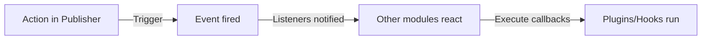

# Publisherフックとイベント

> イベント、フック、プラグインを使用してPublisher機能を拡張するための完全なガイド。

---

## イベントシステム概要

### イベントとは

イベントは他のモジュールがPublisherアクションに反応することを許可します:

```
Publisherアクション → イベントをトリガー → 他のモジュールがリッスン/反応

例:
  - 記事作成 → 通知メールを送信
  - 記事公開 → ソーシャルメディア更新
  - コメント投稿 → 著者に通知
  - カテゴリ作成 → 検索インデックス更新
```

### イベントフロー



---

## 利用可能なイベント

### アイテム（記事）イベント

#### publisher.item.created

新しい記事が作成されたときにトリガーされます。

```php
// Publisherのトリガーポイント
xoops_events()->trigger('publisher.item.created', array(
    'item' => $item,
    'itemid' => $item->getVar('itemid'),
    'title' => $item->getVar('title'),
    'uid' => $item->getVar('uid')
));
```

**リスナー例:**

```php
// 記事作成をリッスン
xoops_events()->attach('publisher.item.created', 'onArticleCreated');

function onArticleCreated($item) {
    $itemId = $item['itemid'];
    $title = $item['title'];
    $uid = $item['uid'];

    // メール通知を送信
    sendEmailNotification($uid, "New article: $title");

    // アクティビティをログ
    logActivity('Article created', $itemId);

    // 検索インデックスを更新
    updateSearchIndex($itemId);
}
```

#### publisher.item.updated

記事が更新されたときにトリガーされます。

```php
xoops_events()->trigger('publisher.item.updated', array(
    'item' => $item,
    'itemid' => $itemId,
    'changes' => $changes
));
```

#### publisher.item.deleted

記事が削除されたときにトリガーされます。

```php
xoops_events()->trigger('publisher.item.deleted', array(
    'itemid' => $itemId,
    'title' => $title,
    'categoryid' => $categoryId
));
```

#### publisher.item.published

記事ステータスが公開に変更されたときにトリガーされます。

```php
xoops_events()->trigger('publisher.item.published', array(
    'item' => $item,
    'itemid' => $itemId
));
```

#### publisher.item.approved

保留中の記事が承認されたときにトリガーされます。

```php
xoops_events()->trigger('publisher.item.approved', array(
    'item' => $item,
    'itemid' => $itemId,
    'uid' => $uid
));
```

#### publisher.item.rejected

記事が却下されたときにトリガーされます。

```php
xoops_events()->trigger('publisher.item.rejected', array(
    'item' => $item,
    'itemid' => $itemId,
    'reason' => $reason
));
```

### カテゴリイベント

#### publisher.category.created

カテゴリが作成されたときにトリガーされます。

```php
xoops_events()->trigger('publisher.category.created', array(
    'category' => $category,
    'categoryid' => $categoryId,
    'name' => $name
));
```

#### publisher.category.updated

カテゴリが更新されたときにトリガーされます。

```php
xoops_events()->trigger('publisher.category.updated', array(
    'category' => $category,
    'categoryid' => $categoryId
));
```

#### publisher.category.deleted

カテゴリが削除されたときにトリガーされます。

```php
xoops_events()->trigger('publisher.category.deleted', array(
    'categoryid' => $categoryId,
    'name' => $name,
    'itemCount' => $itemCount
));
```

### コメントイベント

#### publisher.comment.created

コメントが投稿されたときにトリガーされます。

```php
xoops_events()->trigger('publisher.comment.created', array(
    'comment' => $comment,
    'commentid' => $commentId,
    'itemid' => $itemId
));
```

#### publisher.comment.approved

コメントが承認されたときにトリガーされます。

```php
xoops_events()->trigger('publisher.comment.approved', array(
    'comment' => $comment,
    'commentid' => $commentId
));
```

#### publisher.comment.deleted

コメントが削除されたときにトリガーされます。

```php
xoops_events()->trigger('publisher.comment.deleted', array(
    'commentid' => $commentId,
    'itemid' => $itemId
));
```

---

## イベントのリッスン

### イベントリスナーを登録

モジュールまたはプラグイン内で:

```php
<?php
// xoops_version.phpまたは初期化ファイルでリスナーを登録
xoops_events()->attach(
    'publisher.item.created',
    array('MyModuleListener', 'onPublisherItemCreated')
);

// または関数名を使用
xoops_events()->attach(
    'publisher.item.created',
    'my_module_on_item_created'
);
?>
```

### リスナークラスメソッド

```php
<?php
class MyModuleListener {
    public static function onPublisherItemCreated($data) {
        $itemId = $data['itemid'];
        $title = $data['title'];

        // アクションを実行
        self::notifySubscribers($itemId, $title);
    }

    protected static function notifySubscribers($itemId, $title) {
        // 実装
    }
}
?>
```

### リスナー関数

```php
<?php
function my_module_on_item_created($data) {
    $itemId = $data['itemid'];
    $title = $data['title'];
    $uid = $data['uid'];

    // 通知を送信
    notifyUser($uid, "Article created: $title");
}
?>
```

---

## イベント例

### 例1: 記事作成時にメールを送信

```php
<?php
// 記事作成をリッスン
xoops_events()->attach(
    'publisher.item.created',
    'send_article_notification_email'
);

function send_article_notification_email($data) {
    $itemId = $data['itemid'];
    $title = $data['title'];
    $uid = $data['uid'];

    // ユーザーオブジェクトを取得
    $userHandler = xoops_getHandler('user');
    $user = $userHandler->get($uid);

    if (!$user) {
        return;
    }

    // 管理者メールを取得
    $config = xoops_getModuleConfig();
    $adminEmails = $config['admin_emails'];

    // メールを準備
    $subject = "New Article: $title";
    $message = "A new article has been created:\n\n";
    $message .= "Title: $title\n";
    $message .= "Author: " . $user->getVar('uname') . "\n";
    $message .= "Date: " . date('Y-m-d H:i:s') . "\n";
    $message .= "ID: $itemId\n\n";
    $message .= "Link: " . XOOPS_URL . "/modules/publisher/?op=showitem&itemid=$itemId\n";

    // 管理者に送信
    foreach (explode(',', $adminEmails) as $email) {
        xoops_mail($email, $subject, $message);
    }
}
?>
```

### 例2: 検索インデックスを更新

```php
<?php
// 記事公開イベントをリッスン
xoops_events()->attach(
    'publisher.item.published',
    'update_search_index'
);

function update_search_index($data) {
    $itemId = $data['itemid'];
    $item = $data['item'];

    // 検索インデックスを更新
    $searchHandler = xoops_getModuleHandler('Search');
    $searchHandler->indexArticle($itemId, array(
        'title' => $item->getVar('title'),
        'content' => $item->getVar('body'),
        'author' => $item->getVar('uname'),
        'date' => $item->getVar('datesub')
    ));
}
?>
```

### 例3: ソーシャルメディアへの自動投稿

```php
<?php
// 記事公開をリッスン
xoops_events()->attach(
    'publisher.item.published',
    'post_to_social_media'
);

function post_to_social_media($data) {
    $item = $data['item'];
    $itemId = $data['itemid'];

    // 設定を取得
    $config = xoops_getModuleConfig();

    if ($config['post_to_twitter']) {
        postToTwitter(
            $item->getVar('title'),
            XOOPS_URL . '/modules/publisher/?op=showitem&itemid=' . $itemId
        );
    }

    if ($config['post_to_facebook']) {
        postToFacebook(
            $item->getVar('title'),
            $item->getVar('description')
        );
    }
}

function postToTwitter($text, $url) {
    // Twitter API統合
    // Twitter OAuthライブラリを使用
}

function postToFacebook($title, $description) {
    // Facebook API統合
}
?>
```

### 例4: 外部システムと同期

```php
<?php
// 記事作成と更新をリッスン
xoops_events()->attach(
    'publisher.item.created',
    'sync_external_system'
);

xoops_events()->attach(
    'publisher.item.updated',
    'sync_external_system'
);

function sync_external_system($data) {
    $item = $data['item'];
    $itemId = $data['itemid'];

    // 外部API設定を取得
    $config = xoops_getModuleConfig();
    $apiUrl = $config['external_api_url'];
    $apiKey = $config['external_api_key'];

    // ペイロードを準備
    $payload = json_encode(array(
        'id' => $itemId,
        'title' => $item->getVar('title'),
        'content' => $item->getVar('body'),
        'date' => date('c', $item->getVar('datesub'))
    ));

    // 外部システムに送信
    $ch = curl_init($apiUrl);
    curl_setopt($ch, CURLOPT_POST, true);
    curl_setopt($ch, CURLOPT_POSTFIELDS, $payload);
    curl_setopt($ch, CURLOPT_HTTPHEADER, array(
        'Content-Type: application/json',
        'Authorization: Bearer ' . $apiKey
    ));
    curl_exec($ch);
    curl_close($ch);
}
?>
```

---

## フックシステム

### Publisherフック

フックはPublisherの動作を変更することを許可します:

#### publisher.view.article.start

記事がレンダリングされる前に呼び出されます。

```php
xoops_events()->attach(
    'publisher.view.article.start',
    'modify_article_before_display'
);

function modify_article_before_display(&$item) {
    // 表示前にアイテムを修正
    $title = $item->getVar('title');
    $item->setVar('title', '[FEATURED] ' . $title);
}
```

#### publisher.view.article.end

記事がレンダリングされた後に呼び出されます。

```php
xoops_events()->attach(
    'publisher.view.article.end',
    'append_to_article'
);

function append_to_article(&$article) {
    // 記事後にコンテンツを追加
    $article .= '<div class="related-articles">';
    $article .= '<!-- Related articles content -->';
    $article .= '</div>';
}
```

#### publisher.permission.check

パーミッションをチェックするときに呼び出されます。

```php
xoops_events()->attach(
    'publisher.permission.check',
    'custom_permission_logic'
);

function custom_permission_logic(&$allowed, $permission, $itemId) {
    // カスタムパーミッションロジック
    if (custom_rule_applies($itemId)) {
        $allowed = true;
    }
}
```

---

## プラグインシステム

### プラグインを作成

プラグインはPublisher機能を拡張します:

**ファイル構造:**

```
modules/publisher/plugins/
├── myplugin/
│   ├── plugin.php (メインファイル)
│   ├── language/
│   │   └── english.php
│   ├── templates/
│   └── css/
```

**plugin.php:**

```php
<?php
// プラグイン情報
define('MYPLUGIN_NAME', 'My Publisher Plugin');
define('MYPLUGIN_VERSION', '1.0.0');
define('MYPLUGIN_DESCRIPTION', 'Extends Publisher with custom features');

// フック/イベントを登録
xoops_events()->attach(
    'publisher.item.created',
    'myplugin_on_item_created'
);

xoops_events()->attach(
    'publisher.view.article.end',
    'myplugin_append_content'
);

// プラグイン関数
function myplugin_on_item_created($data) {
    // アイテム作成を処理
}

function myplugin_append_content(&$content) {
    // 記事にコンテンツを追加
    $content .= '<div class="myplugin-content">Custom content</div>';
}

// プラグインAPI
class MyPublisherPlugin {
    public static function getArticles($limit = 10) {
        $itemHandler = xoops_getModuleHandler('Item', 'publisher');
        return $itemHandler->getRecent($limit);
    }

    public static function getCategoryTree() {
        $catHandler = xoops_getModuleHandler('Category', 'publisher');
        return $catHandler->getRoots();
    }
}
?>
```

### プラグインをロード

Publisherの初期化で:

```php
<?php
// プラグインをロード
$pluginPath = XOOPS_ROOT_PATH . '/modules/publisher/plugins/myplugin/plugin.php';
if (file_exists($pluginPath)) {
    include_once $pluginPath;
}
?>
```

---

## フィルター

### コンテンツフィルター

フィルターは処理前後のデータを修正します:

```php
<?php
// 記事タイトルをフィルター
$title = apply_filters('publisher_item_title', $title, $itemId);

// 記事本文をフィルター
$body = apply_filters('publisher_item_body', $body, $itemId);

// 記事表示をフィルター
$display = apply_filters('publisher_item_display', $display, $item);
?>
```

### フィルターを登録

```php
<?php
// フィルターを追加
add_filter('publisher_item_title', 'my_title_filter');

function my_title_filter($title, $itemId) {
    // タイトルを修正
    return strtoupper($title);
}

// 優先度付きでフィルターを追加
add_filter(
    'publisher_item_body',
    'my_body_filter',
    10,  // 優先度（低いほど早い）
    2    // 引数の数
);

function my_body_filter($body, $itemId) {
    // 本文にウォーターマークを追加
    return $body . '<p class="watermark">© ' . date('Y') . '</p>';
}
?>
```

---

## アクションフック

### カスタムアクション

特定のポイントでコードを実行:

```php
<?php
// アクションを実行
do_action('publisher_article_saved', $itemId, $item);

// 引数付きでアクションを実行
do_action('publisher_comment_approved', $commentId, $comment);

// アクションをリッスン
add_action('publisher_article_saved', 'my_action_handler');

function my_action_handler($itemId, $item) {
    // コードを実行
    log_article_save($itemId);
    update_statistics();
}
?>
```

---

## プラグインで拡張

### プラグイン例: 関連記事

```php
<?php
// ファイル: modules/publisher/plugins/related-articles/plugin.php

class RelatedArticlesPlugin {
    public static function init() {
        xoops_events()->attach(
            'publisher.view.article.end',
            array(__CLASS__, 'displayRelated')
        );
    }

    public static function displayRelated(&$content) {
        // 関連記事を取得
        $related = self::getRelatedArticles();

        if (count($related) > 0) {
            $html = '<div class="related-articles">';
            $html .= '<h3>Related Articles</h3>';
            $html .= '<ul>';

            foreach ($related as $article) {
                $html .= '<li>';
                $html .= '<a href="' . $article->url() . '">';
                $html .= $article->title();
                $html .= '</a>';
                $html .= '</li>';
            }

            $html .= '</ul>';
            $html .= '</div>';

            $content .= $html;
        }
    }

    protected static function getRelatedArticles() {
        // 現在の記事を取得
        global $itemId;

        $itemHandler = xoops_getModuleHandler('Item', 'publisher');
        $item = $itemHandler->get($itemId);

        if (!$item) {
            return array();
        }

        // 同じカテゴリの記事を取得
        $related = $itemHandler->getByCategory(
            $item->getVar('categoryid'),
            $limit = 5
        );

        // 現在の記事を削除
        $related = array_filter($related, function($article) {
            global $itemId;
            return $article->getVar('itemid') != $itemId;
        });

        return array_slice($related, 0, 3);
    }
}

// プラグインを初期化
RelatedArticlesPlugin::init();
?>
```

---

## ベストプラクティス

### イベントリスナーガイドライン

```php
✓ リスナーをパフォーマンス重視に保つ
  - イベント内で重い処理をしない
  - 可能な限り結果をキャッシュ

✓ エラーを適切に処理
  - try/catchを使用
  - エラーをログに記録
  - メインフローを中断しない

✓ 意味のある名前を使用
  - my_module_on_publisher_item_created
  - 代わりに: process_event_1

✓ イベントをドキュメント化
  - トリガーポイントをコメント
  - 予想されるデータをリスト
  - 使用例を表示

✓ リスナーを適切にアンロード
  - モジュール削除時にクリーンアップ
  - 不要になったフックを削除
```

### パフォーマンスのヒント

```
✗ リスナーでデータベースクエリを回避
✗ 遅い操作で実行を停止しない
✗ 不必要にデータを修正しない

✓ 長時間実行タスクをキュー
✓ 外部APIコールをキャッシュ
✓ 依存関係に遅延ロードを使用
✓ データベース操作をバッチ処理
```

---

## イベントのデバッグ

### デバッグモードを有効化

```php
<?php
// モジュール初期化で
if (defined('XOOPS_DEBUG')) {
    xoops_events()->attach(
        'publisher.item.created',
        'publisher_debug_event'
    );
}

function publisher_debug_event($data) {
    error_log('Publisher Event: ' . print_r($data, true));
}
?>
```

### イベントをログ

```php
<?php
// イベントデータをログ
xoops_events()->attach(
    'publisher.item.created',
    'log_publisher_events'
);

function log_publisher_events($data) {
    $log = XOOPS_ROOT_PATH . '/var/log/publisher.log';
    $entry = date('Y-m-d H:i:s') . ' - ';
    $entry .= 'Event: publisher.item.created' . "\n";
    $entry .= 'Data: ' . json_encode($data) . "\n\n";
    file_put_contents($log, $entry, FILE_APPEND);
}
?>
```

---

## 関連ドキュメント

- APIリファレンス
- カスタムテンプレート
- 記事作成

---

## リソース

- [Publisher GitHub](https://github.com/XoopsModules25x/publisher)
- [XOOPSイベントシステム](../../03-Module-Development/Module-Development.md)
- [プラグイン開発](../../03-Module-Development/Module-Development.md)

---

#publisher #hooks #events #plugins #extensions #customization #xoops
