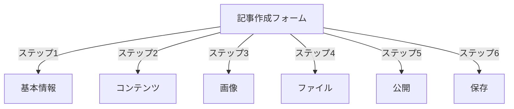
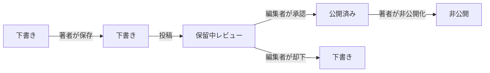
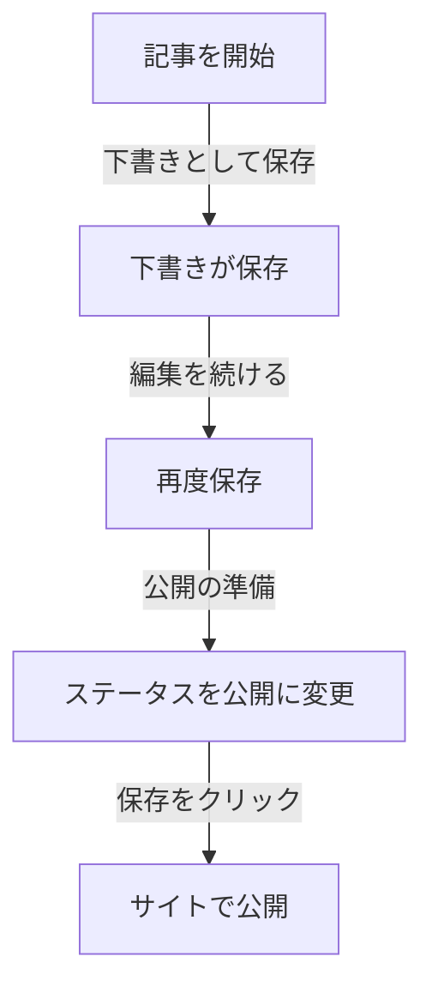

# パブリッシャーで記事を作成

> パブリッシャーモジュールで記事を作成、編集、フォーマット、公開する手順ガイド。

---

## 記事管理にアクセス

### 管理パネルナビゲーション

```
管理パネル
└── モジュール
    └── パブリッシャー
        └── 記事
            ├── 新規作成
            ├── 編集
            ├── 削除
            └── 公開
```

### クイックパス

1. **管理者**としてログイン
2. 管理バーで**モジュール**をクリック
3. **パブリッシャー**を見つける
4. **管理**リンクをクリック
5. 左メニューから**記事**をクリック
6. **記事を追加**ボタンをクリック

---

## 記事作成フォーム

### 基本情報

記事を新規作成する場合、以下のセクションに入力：



---

## ステップ1：基本情報

### 必須フィールド

#### 記事タイトル

```
フィールド: タイトル
タイプ: テキスト入力（必須）
最大文字数: 255文字
例: 「良い写真撮影のための上位5つのヒント」
```

**ガイドライン：**
- 説明的で具体的
- キーワード含む（SEO）
- すべて大文字を避ける
- 最適表示のため60文字以下

#### カテゴリを選択

```
フィールド: カテゴリ
タイプ: ドロップダウン（必須）
オプション: 作成したカテゴリのリスト
例: 写真 > チュートリアル
```

**ヒント：**
- 親とサブカテゴリが利用可能
- 最も関連性の高いカテゴリを選ぶ
- 記事ごとに1つのカテゴリのみ
- 後で変更可能

#### 記事サブタイトル（オプション）

```
フィールド: サブタイトル
タイプ: テキスト入力（オプション）
最大文字数: 255文字
例: 「5つの簡単なステップで写真技法を習う」
```

**用途：**
- サマリー見出し
- ティザーテキスト
- 拡張タイトル

### 記事説明

#### 短い説明

```
フィールド: 短い説明
タイプ: テキストエリア（オプション）
最大文字数: 500文字
```

**目的：**
- 記事プレビューテキスト
- カテゴリリスティングに表示
- 検索結果に使用
- SEOメタ説明

**例：**
```
「平凡から素晴らしいへ写真を変える必須写真技法を発見。
構成、照明、露出設定をカバーする包括的なガイド。」
```

#### 完全なコンテンツ

```
フィールド: 記事本文
タイプ: WYSIWYGエディタ（必須）
最大文字数: 無制限
形式: HTML
```

メインの記事コンテンツ領域でリッチテキスト編集。

---

## ステップ2：コンテンツをフォーマット

### WYSIWYGエディタを使用

#### テキストフォーマット

```
太字:           Ctrl+B またはクリック [B] ボタン
イタリック:     Ctrl+I またはクリック [I] ボタン
下線:          Ctrl+U またはクリック [U] ボタン
打ち消し:      Alt+Shift+D またはクリック [S] ボタン
上付き:        Ctrl+, （コンマ）
下付き:        Ctrl+. （ピリオド）
```

#### 見出し構造

適切なドキュメント階層を作成：

```html
<h1>記事タイトル</h1>      <!-- 上部に1回のみ使用 -->
<h2>メインセクション</h2>        <!-- 主要セクション用 -->
<h3>サブセクション</h3>          <!-- サブトピック用 -->
<h4>サブサブセクション</h4>      <!-- 詳細用 -->
```

**エディタ内：**
- **形式**ドロップダウンをクリック
- 見出しレベルを選択（H1～H6）
- 見出しを入力

#### リスト

**順序なしリスト（箇条書き）：**

```markdown
• ポイント1
• ポイント2
• ポイント3
```

手順：
1. [≡] 箇条書きボタンをクリック
2. 各項目を入力
3. 次の項目のためにEnterを押す
4. リストを終了するためにBackspaceを2回押す

**順序付きリスト（番号付き）：**

```markdown
1. 最初のステップ
2. 2番目のステップ
3. 3番目のステップ
```

エディタ内手順：
1. [1.] 番号付きリストボタンをクリック
2. 各項目を入力
3. 次へEnterを押す
4. リストを終了するためにBackspaceを2回押す

**ネストされたリスト：**

```markdown
1. メインポイント
   a. サブポイント
   b. サブポイント
2. 次のポイント
```

手順：
1. 最初のリストを作成
2. Tabを押してインデント
3. ネストされた項目を作成
4. Shift+Tabを押してアウトデント

#### リンク

**ハイパーリンクを追加：**

1. リンク対象のテキストを選択
2. **[🔗] リンク**ボタンをクリック
3. URLを入力: `https://example.com`
4. オプション：タイトル/ターゲットを追加
5. **リンクを挿入**をクリック

**リンクを削除：**

1. リンク内をクリック
2. **[🔗] リンクを削除**ボタンをクリック

#### コードと引用

**引用：**

```
「専門家からの重要な引用」
- 帰属
```

手順：
1. 引用テキストを入力
2. **[❝] 引用**ボタンをクリック
3. テキストがインデント・スタイル化

**コードブロック：**

```python
def hello_world():
    print("Hello, World!")
```

手順：
1. **形式 → コード**をクリック
2. コードを貼り付け
3. 言語を選択（オプション）
4. 構文強調でコードを表示

---

## ステップ3：画像を追加

### フィーチャー画像（ヒーロー画像）

```
フィールド: フィーチャー画像 / メイン画像
タイプ: 画像アップロード
形式: JPG、PNG、GIF、WebP
最大サイズ: 5MB
推奨: 600x400 px
```

**アップロード方法：**

1. **画像をアップロード**ボタンをクリック
2. コンピュータから画像を選択
3. 必要に応じてトリミング/リサイズ
4. **この画像を使用**をクリック

**画像配置：**
- 記事上部に表示
- カテゴリリスティングで使用
- アーカイブに表示
- ソーシャル共有で使用

### インライン画像

記事テキスト内に画像を挿入：

1. エディタで画像を配置する場所にカーソルを配置
2. **[🖼️] 画像**ボタンをツールバーでクリック
3. アップロードオプションを選択：
   - 新しい画像をアップロード
   - ギャラリーから選択
   - 画像URLを入力
4. 構成：
   ```
   画像サイズ:
   - 幅: 300～600 px
   - 高さ: 自動（比率保持）
   - 配置: 左/中央/右
   ```
5. **画像を挿入**をクリック

**テキストを画像の周りに折り返す：**

挿入後、エディタで：

```html
<!-- 画像は左にフロート、テキストが周囲に折り返す -->

```

### 画像ギャラリー

複数画像ギャラリーを作成：

1. **ギャラリー**ボタンをクリック（利用可能な場合）
2. 複数の画像をアップロード：
   - シングルクリック：1つ追加
   - ドラッグ&ドロップ：複数追加
3. ドラッグして順序を並べ替え
4. 各画像にキャプションを設定
5. **ギャラリーを作成**をクリック

---

## ステップ4：ファイルを添付

### ファイル添付を追加

```
フィールド: ファイル添付
タイプ: ファイルアップロード（複数許可）
サポート: PDF、DOC、XLS、ZIP等
ファイルあたり最大: 10MB
記事あたり最大: 5ファイル
```

**添付方法：**

1. **ファイルを追加**ボタンをクリック
2. コンピュータからファイルを選択
3. オプション：ファイル説明を追加
4. **ファイルを添付**をクリック
5. 複数ファイルの場合は繰り返す

**ファイル例：**
- PDFガイド
- Excelスプレッドシート
- Wordドキュメント
- ZIPアーカイブ
- ソースコード

### 添付ファイルを管理

**ファイルを編集：**

1. ファイル名をクリック
2. 説明を編集
3. **保存**をクリック

**ファイルを削除：**

1. リストでファイルを見つける
2. **[×] 削除**アイコンをクリック
3. 削除を確認

---

## ステップ5：公開とステータス

### 記事ステータス

```
フィールド: ステータス
タイプ: ドロップダウン
オプション:
  - 下書き: 非公開、著者のみ表示
  - 保留中: 承認待ち
  - 公開済み: サイトで公開
  - アーカイブ済み: 古いコンテンツ
  - 非公開: 公開されていたが非表示
```

**ステータスワークフロー：**



### 公開オプション

#### すぐに公開

```
ステータス: 公開済み
開始日: 今日（自動入力）
終了日: （有効期限がない場合は空白）
```

#### 後で予定

```
ステータス: 予定済み
開始日: 将来の日付/時刻
例: 2024年2月15日 午前9:00
```

記事は指定した時間に自動公開。

#### 有効期限を設定

```
有効期限を有効化: はい
有効期限日: 将来の日付
アクション: アーカイブ/非表示/削除
例: 2024年4月1日（記事は自動アーカイブ）
```

### 可視性オプション

```yaml
記事を表示:
  - フロントページに表示: はい/いいえ
  - カテゴリに表示: はい/いいえ
  - 検索に含める: はい/いいえ
  - 最新記事に含める: はい/いいえ

フィーチャー記事:
  - フィーチャーにマーク: はい/いいえ
  - フィーチャーセクション位置: （番号）
```

---

## ステップ6：SEOとメタデータ

### SEO設定

```
フィールド: SEO設定（セクションを展開）
```

#### メタ説明

```
フィールド: メタ説明
タイプ: テキスト（160文字推奨）
検索エンジンと使用: ソーシャルメディア

例:
「5つの簡単なステップで写真の基本を習う。
構成、照明、露出技法を発見。」
```

#### メタキーワード

```
フィールド: メタキーワード
タイプ: コンマ区切りリスト
最大: 5～10キーワード

例: 写真、チュートリアル、構成、照明、露出
```

#### URLスラッグ

```
フィールド: URLスラッグ（タイトルから自動生成）
タイプ: テキスト
形式: 小文字、ハイフン、スペースなし

自動: "top-5-tips-for-better-photography"
編集: 公開前に変更可
```

#### Open Graphタグ

記事情報から自動生成：
- タイトル
- 説明
- フィーチャー画像
- 記事URL
- 公開日

Facebook、LinkedIn、WhatsAppで使用。

---

## ステップ7：コメントとインタラクション

### コメント設定

```yaml
コメントを許可:
  - 有効: はい/いいえ
  - デフォルト: 環境設定から継承
  - オーバーライド: この記事固有

コメントをモデレート:
  - 承認が必要: はい/いいえ
  - デフォルト: 環境設定から継承
```

### 評価設定

```yaml
評価を許可:
  - 有効: はい/いいえ
  - スケール: 5つ星（デフォルト）
  - 平均を表示: はい/いいえ
  - 数を表示: はい/いいえ
```

---

## ステップ8：詳細オプション

### 著者とバイライン

```
フィールド: 著者
タイプ: ドロップダウン
デフォルト: 現在のユーザー
オプション: 著者権限を持つすべてのユーザー

表示:
  - 著者名を表示: はい/いいえ
  - 著者バイオを表示: はい/いいえ
  - 著者アバターを表示: はい/いいえ
```

### 編集ロック

```
フィールド: 編集ロック
目的: 偶発的な変更を防止

記事をロック:
  - ロック: はい/いいえ
  - ロック理由: 「最終版」
  - ロック解除日: （オプション）
```

### リビジョン履歴

記事の自動保存バージョン：

```
リビジョンを表示:
  - 「リビジョン履歴」をクリック
  - すべての保存バージョンを表示
  - バージョンを比較
  - 前のバージョンを復元
```

---

## 保存と公開

### 保存ワークフロー



### 記事を保存

**自動保存：**
- 60秒ごとにトリガー
- 自動的に下書きとして保存
- 「最後に保存: 2分前」と表示

**手動保存：**
- **保存して続ける**をクリックして編集継続
- **保存して表示**をクリックして公開版を見る
- **保存**をクリックして保存して終了

### 記事を公開

1. **ステータス**を設定：公開済み
2. **開始日**を設定：今（または将来の日付）
3. **保存**または**公開**をクリック
4. 確認メッセージが表示
5. 記事は公開中（またはスケジュール済み）

---

## 既存記事を編集

### 記事エディタにアクセス

1. **管理 → パブリッシャー → 記事**に移動
2. リストで記事を見つける
3. **編集**アイコン/ボタンをクリック
4. 変更を加える
5. **保存**をクリック

### 一括編集

複数の記事を一度に編集：

```
1. 記事リストに移動
2. チェックボックスで記事を選択
3. ドロップダウンから「一括編集」を選択
4. 選択したフィールドを変更
5. 「すべてを更新」をクリック

利用可能な場合：
  - ステータス
  - カテゴリ
  - フィーチャー（はい/いいえ）
  - 著者
```

### 記事をプレビュー

公開前に：

1. **プレビュー**ボタンをクリック
2. 読者の表示方法を確認
3. フォーマットをチェック
4. リンクをテスト
5. エディタに戻って調整

---

## 記事管理

### すべての記事を表示

**記事リストビュー：**

```
管理 → パブリッシャー → 記事

列:
  - タイトル
  - カテゴリ
  - 著者
  - ステータス
  - 作成日
  - 修正日
  - アクション（編集、削除、プレビュー）

ソート:
  - タイトル（A～Z）
  - 日付（新規/古い）
  - ステータス（公開済み/下書き）
  - カテゴリ
```

### 記事をフィルタリング

```
フィルタオプション:
  - カテゴリ別
  - ステータス別
  - 著者別
  - 日付範囲別
  - タイトルで検索

例: 「ニュース」カテゴリの「ジョン」著「下書き」記事をすべて表示
```

### 記事を削除

**ソフト削除（推奨）：**

1. **ステータス**を変更：非公開
2. **保存**をクリック
3. 記事は非表示（削除されていない）
4. 後で復元可能

**ハード削除：**

1. リストで記事を選択
2. **削除**ボタンをクリック
3. 削除を確認
4. 記事は永続的に削除

---

## コンテンツベストプラクティス

### 質の高い記事を書く

```
構造:
  ✓ 説得力のあるタイトル
  ✓ 明確なサブタイトル/説明
  ✓ 魅力的なオープニング段落
  ✓ 見出しを含む論理的セクション
  ✓ サポートする視覚的
  ✓ 結論/要約
  ✓ 行動喚起

長さ:
  - ブログ記事: 500～2000字
  - ニュース: 300～800字
  - ガイド: 2000～5000字
  - 最小: 300字
```

### SEO最適化

```
タイトル最適化:
  ✓ プライマリキーワード含む
  ✓ 60文字以下に保つ
  ✓ キーワードを最初に置く
  ✓ 説明的で具体的

コンテンツ最適化:
  ✓ 見出しを使用（H1、H2、H3）
  ✓ 見出しにキーワード含む
  ✓ 重要な用語を太字にする
  ✓ 説明的なリンクを追加
  ✓ 代替テキスト付きで画像を含める

メタ説明:
  ✓ プライマリキーワード含む
  ✓ 155～160文字
  ✓ アクション指向的
  ✓ 記事ごとにユニーク
```

### フォーマットのヒント

```
可読性:
  ✓ 短い段落（2～4文）
  ✓ リストに箇条書きを使用
  ✓ 300語ごとに小見出し
  ✓ 太字の余白
  ✓ セクション間の改行

ビジュアルアピール:
  ✓ 上部にフィーチャー画像
  ✓ コンテンツ内のインライン画像
  ✓ すべての画像に代替テキスト
  ✓ 技術的にはコードブロック
  ✓ 強調のための引用
```

---

## キーボードショートカット

### エディタショートカット

```
太字:               Ctrl+B
イタリック:         Ctrl+I
下線:              Ctrl+U
リンク:             Ctrl+K
下書きを保存:       Ctrl+S
```

### テキストショートカット

```
-- →  （ダッシュからダッシュへ）
... → … （3つのドットから楕円形へ）
(c) → © （著作権）
(r) → ® （登録商標）
(tm) → ™ （商標）
```

---

## 一般的なタスク

### 記事をコピー

1. 記事を開く
2. **複製**または**クローン**ボタンをクリック
3. 記事が下書きとしてコピー
4. タイトルとコンテンツを編集
5. 公開

### 記事をスケジュール

1. 記事を作成
2. **開始日**を設定：将来の日付/時刻
3. **ステータス**を設定：公開済み
4. **保存**をクリック
5. 記事は指定時刻に自動公開

### 一括公開

1. 下書きとして記事を作成
2. 公開日を設定
3. 記事は指定時刻に自動公開
4. 「スケジュール済み」ビューで監視

### カテゴリ間で移動

1. 記事を編集
2. **カテゴリ**ドロップダウンを変更
3. **保存**をクリック
4. 記事が新しいカテゴリに表示

---

## トラブルシューティング

### 問題：記事を保存できない

**解決方法：**
```
1. 必須フィールドのフォームをチェック
2. カテゴリが選択されていることを確認
3. PHPメモリ制限を確認
4. まず下書きとして保存してみる
5. ブラウザキャッシュをクリア
```

### 問題：画像が表示されない

**解決方法：**
```
1. 画像アップロードが成功したことを確認
2. 画像ファイル形式を確認（JPG、PNG）
3. データベース内の画像パスを確認
4. アップロードディレクトリのパーミッションを確認
5. 画像を再度アップロードしてみる
```

### 問題：エディタツールバーが表示されない

**解決方法：**
```
1. ブラウザキャッシュをクリア
2. 別のブラウザを試す
3. ブラウザ拡張機能を無効化
4. JavaScriptコンソールでエラーを確認
5. エディタプラグインがインストール済みか確認
```

### 問題：記事が公開されない

**解決方法：**
```
1. ステータス = 「公開済み」を確認
2. 開始日が今日以前か確認
3. 公開を許可する権限を確認
4. カテゴリが公開されているか確認
5. モジュールキャッシュをクリア
```

---

## 関連ガイド

- 構成ガイド
- カテゴリ管理
- 権限セットアップ
- カスタムテンプレート

---

## 次のステップ

- 最初の記事を作成
- カテゴリをセットアップ
- 権限を構成
- テンプレートカスタマイズを確認

---

#publisher #articles #content #creation #formatting #editing #xoops
