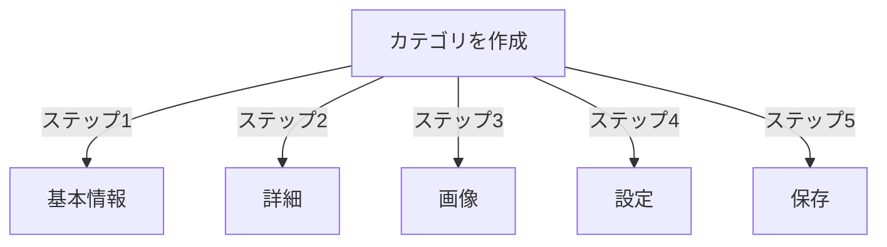

# パブリッシャーのカテゴリ管理

> パブリッシャーモジュールでカテゴリを作成、整理し、管理するための完全ガイド。

---

## カテゴリ基本

### カテゴリとは

カテゴリは記事を論理的なグループに整理します：

```
例：構造

  ニュース（メインカテゴリ）
    ├── テクノロジー
    ├── スポーツ
    └── エンタメ

  チュートリアル（メインカテゴリ）
    ├── 写真
    │   ├── 基本
    │   └── 詳細
    └── 執筆
        └── ブログ
```

### 良好なカテゴリ構造の利点

```
✓ ユーザーナビゲーション向上
✓ コンテンツ整理
✓ SEO改善
✓ コンテンツ管理を簡単に
✓ より良い編集ワークフロー
```

---

## カテゴリ管理にアクセス

### 管理パネルナビゲーション

```
管理パネル
└── モジュール
    └── パブリッシャー
        └── カテゴリ
            ├── 新規作成
            ├── 編集
            ├── 削除
            ├── 権限
            └── 整理
```

### クイックアクセス

1. **管理者**としてログイン
2. **管理 → モジュール**に移動
3. **パブリッシャー → 管理**をクリック
4. 左メニューから**カテゴリ**をクリック

---

## カテゴリを作成

### カテゴリ作成フォーム



### ステップ1：基本情報

#### カテゴリ名

```
フィールド: カテゴリ名
タイプ: テキスト入力（必須）
最大文字数: 100文字
ユニーク性: ユニークであるべき
例: 「写真」
```

**ガイドライン：**
- 説明的で単数形または複数形で一貫
- 適切に大文字化
- 特殊文字を避ける
- 合理的に短く

#### カテゴリ説明

```
フィールド: 説明
タイプ: テキストエリア（オプション）
最大文字数: 500文字
用途: カテゴリリスティングページ、カテゴリブロック
```

**目的：**
- カテゴリの内容を説明
- カテゴリリスティングページの上部に表示
- ユーザーが範囲を理解するのに役立つ
- SEOメタ説明に使用

**例：**
```
「すべてのスキルレベル向けの写真チップス、チュートリアル、インスピレーション。
構成の基本から詳細な照明技法まで、あなたのスキルをマスターしてください。」
```

### ステップ2：親カテゴリ

#### 階層を作成

```
フィールド: 親カテゴリ
タイプ: ドロップダウン
オプション: なし（ルート）、または既存カテゴリ
```

**階層例：**

```
フラット構造:
  ニュース
  チュートリアル
  レビュー

ネストされた構造:
  ニュース
    テクノロジー
    ビジネス
    スポーツ
  チュートリアル
    写真
      基本
      詳細
    執筆
```

**サブカテゴリを作成：**

1. **親カテゴリ**ドロップダウンをクリック
2. 親（例「ニュース」）を選択
3. カテゴリ名を入力
4. 保存
5. 新しいカテゴリが子として表示

### ステップ3：カテゴリ画像

#### カテゴリ画像をアップロード

```
フィールド: カテゴリ画像
タイプ: 画像アップロード（オプション）
形式: JPG、PNG、GIF、WebP
最大サイズ: 5MB
推奨: 300x200 px（またはテーマサイズ）
```

**アップロード方法：**

1. **画像をアップロード**ボタンをクリック
2. コンピュータから画像を選択
3. 必要に応じてトリミング/リサイズ
4. **この画像を使用**をクリック

**使用場所：**
- カテゴリリスティングページ
- カテゴリブロックヘッダー
- パンくずリスト（テーマによって）
- ソーシャルメディア共有

### ステップ4：カテゴリ設定

#### 表示設定

```yaml
ステータス:
  - 有効: はい/いいえ
  - 非表示: はい/いいえ（メニューから非表示、アクセス可）

表示オプション:
  - 説明を表示: はい/いいえ
  - 画像を表示: はい/いいえ
  - 記事数を表示: はい/いいえ
  - サブカテゴリを表示: はい/いいえ

レイアウト:
  - ページあたりのアイテム数: 10～50
  - 表示順序: 日付/タイトル/著者
  - 表示方向: 昇順/降順
```

#### カテゴリ権限

```yaml
誰が表示できるか:
  - 匿名: はい/いいえ
  - 登録: はい/いいえ
  - 特定のグループ: グループごとに構成

誰が投稿できるか:
  - 登録: はい/いいえ
  - 特定のグループ: グループごとに構成
  - 著者は以下が必要: 「記事投稿」権限
```

### ステップ5：SEO設定

#### メタタグ

```
フィールド: メタ説明
タイプ: テキスト（160文字）
目的: 検索エンジンの説明

フィールド: メタキーワード
タイプ: コンマ区切りリスト
例: 写真、チュートリアル、ヒント、技法
```

#### URL構成

```
フィールド: URLスラッグ
タイプ: テキスト
自動生成: カテゴリ名から
例: 「写真」から「photography」
カスタマイズ可: 保存前
```

### カテゴリを保存

1. すべての必須フィールドに入力：
   - カテゴリ名 ✓
   - 説明（推奨）
2. オプション：画像をアップロード、SEOを設定
3. **カテゴリを保存**をクリック
4. 確認メッセージが表示
5. カテゴリが利用可能

---

## カテゴリ階層

### ネストされた構造を作成

```
例：ニュース → テクノロジーサブカテゴリを作成

1. カテゴリ管理に移動
2. 「カテゴリを追加」をクリック
3. 名前: 「ニュース」
4. 親: （空白のままにする - これはルート）
5. 保存
6. 「カテゴリを追加」を再度クリック
7. 名前: 「テクノロジー」
8. 親: 「ニュース」を選択
9. 保存
```

### 階層ツリーを表示

```
カテゴリビューは構造を表示：

📁 ニュース
  📄 テクノロジー
  📄 スポーツ
  📄 エンタメ
📁 チュートリアル
  📄 写真
    📄 基本
    📄 詳細
  📄 執筆
```

矢印展開をクリックしてサブカテゴリを表示/非表示。

### カテゴリを再整理

#### カテゴリを移動

1. カテゴリリストに移動
2. カテゴリの**編集**をクリック
3. **親カテゴリ**を変更
4. **保存**をクリック
5. カテゴリが新しい位置に移動

#### カテゴリを並べ替え

ドラッグ&ドロップが利用可能な場合：

1. カテゴリリストに移動
2. カテゴリをドラッグ
3. 新しい位置にドロップ
4. 順序が自動保存

#### カテゴリを削除

**オプション1：ソフト削除（非表示）**

1. カテゴリを編集
2. **ステータス**: 無効化に設定
3. **保存**をクリック
4. カテゴリは非表示だが削除されない

**オプション2：ハード削除**

1. カテゴリリストに移動
2. カテゴリの**削除**をクリック
3. 記事のアクションを選択：
   ```
   ☐ 記事を親カテゴリに移動
   ☐ 記事をルート（ニュース）に移動
   ☐ カテゴリ内のすべての記事を削除
   ```
4. 削除を確認

---

## カテゴリ操作

### カテゴリを編集

1. **管理 → パブリッシャー → カテゴリ**に移動
2. カテゴリの**編集**をクリック
3. フィールドを変更：
   - 名前
   - 説明
   - 親カテゴリ
   - 画像
   - 設定
4. **保存**をクリック

### カテゴリ権限を編集

1. カテゴリリストに移動
2. カテゴリの**権限**をクリック（またはカテゴリをクリックして権限をクリック）
3. グループを構成：

```
各グループについて:
  ☐ このカテゴリの記事を表示
  ☐ このカテゴリに記事を投稿
  ☐ 自分の記事を編集
  ☐ すべての記事を編集
  ☐ 記事を承認/モデレート
  ☐ カテゴリを管理
```

4. **権限を保存**をクリック

### カテゴリ画像を設定

**新しい画像をアップロード：**

1. カテゴリを編集
2. **画像を変更**をクリック
3. 画像をアップロードまたは選択
4. トリミング/リサイズ
5. **画像を使用**をクリック
6. **カテゴリを保存**をクリック

**画像を削除：**

1. カテゴリを編集
2. **画像を削除**をクリック（利用可能な場合）
3. **カテゴリを保存**をクリック

---

## カテゴリ権限

### 権限マトリックス

```
                 匿名  登録  編集者  管理者
カテゴリを表示    ✓    ✓     ✓      ✓
記事を投稿        ✗    ✓     ✓      ✓
自分の記事を編集  ✗    ✓     ✓      ✓
すべての記事を編集✗    ✗     ✓      ✓
記事をモデレート  ✗    ✗     ✓      ✓
カテゴリを管理    ✗    ✗     ✗      ✓
```

### カテゴリレベルの権限を設定

#### カテゴリごとのアクセス制御

1. **カテゴリ**リストに移動
2. カテゴリを選択
3. **権限**をクリック
4. 各グループについて権限を選択：

```
例: ニュースカテゴリ
  匿名:   表示のみ
  登録:   記事を投稿
  編集者: 記事を承認
  管理者: フル制御
```

5. **保存**をクリック

#### フィールドレベルの権限

ユーザーが表示/編集できるフォームフィールドを制御：

```
例: 登録ユーザー用の可視性を制限

登録ユーザーが見る/編集できるもの:
  ✓ タイトル
  ✓ 説明
  ✓ コンテンツ
  ✗ 著者（現在のユーザーに自動設定）
  ✗ スケジュール日（編集者のみ）
  ✗ フィーチャー（管理者のみ）
```

**構成：**
- カテゴリ権限で
- 「フィールド可視性」セクションを探す

---

## カテゴリのベストプラクティス

### カテゴリ構造

```
✓ 階層を2～3レベルの深さに保つ
✗ 多くのトップレベルカテゴリを作成しない
✗ 1つの記事があるカテゴリを作成しない

✓ 一貫した命名を使用（複数形または単数形）
✗ あいまいな名前を避ける（「もの」、「その他」）

✓ 記事が存在するカテゴリを作成
✗ 事前に空のカテゴリを作成しない
```

### 命名ガイドライン

```
良い名前:
  「写真」
  「ウェブ開発」
  「旅行ヒント」
  「ビジネスニュース」

避けるべき:
  「記事」（あいまい）
  「コンテンツ」（冗長）
  「ニュース&アップデート」（不一貫）
  「写真のもの」（フォーマット）
```

### 整理のヒント

```
トピック別:
  ニュース
    テクノロジー
    スポーツ
    エンタメ

タイプ別:
  チュートリアル
    ビデオ
    テキスト
    インタラクティブ

オーディエンス別:
  初心者向け
  エキスパート向け
  ケーススタディ

地理的:
  北米
    米国
    カナダ
  ヨーロッパ
```

---

## カテゴリブロック

### パブリッシャーカテゴリブロック

サイトのカテゴリリスティングを表示：

1. **管理 → ブロック**に移動
2. **パブリッシャー - カテゴリ**を見つける
3. **編集**をクリック
4. 構成：

```
ブロックタイトル: 「ニュースカテゴリ」
サブカテゴリを表示: はい/いいえ
記事数を表示: はい/いいえ
高さ: （ピクセルまたは自動）
```

5. **保存**をクリック

### カテゴリ記事ブロック

特定のカテゴリから最新記事を表示：

1. **管理 → ブロック**に移動
2. **パブリッシャー - カテゴリ記事**を見つける
3. **編集**をクリック
4. 以下を選択：

```
カテゴリ: ニュース（または特定のカテゴリ）
記事数: 5
画像を表示: はい/いいえ
説明を表示: はい/いいえ
```

5. **保存**をクリック

---

## カテゴリ分析

### カテゴリ統計を表示

カテゴリ管理から：

```
各カテゴリが表示：
  - 合計記事数: 45
  - 公開済み: 42
  - 下書き: 2
  - 承認待ち: 1
  - 合計ビュー: 5,234
  - 最新記事: 2時間前
```

### カテゴリトラフィックを表示

分析が有効な場合：

1. カテゴリ名をクリック
2. **統計**タブをクリック
3. 表示：
   - ページビュー
   - 人気の記事
   - トラフィックトレンド
   - 使用された検索用語

---

## カテゴリテンプレート

### カテゴリ表示をカスタマイズ

カスタムテンプレートを使用する場合、各カテゴリは以下をオーバーライドできます：

```
publisher_category.tpl
  ├── カテゴリヘッダー
  ├── カテゴリ説明
  ├── カテゴリ画像
  ├── 記事リスティング
  └── ページネーション
```

**カスタマイズするには：**

1. テンプレートファイルをコピー
2. HTMLをカスタマイズ
3. 管理でカテゴリに割り当て
4. カテゴリがカスタムテンプレートを使用

---

## 一般的なタスク

### ニュース階層を作成

```
管理 → パブリッシャー → カテゴリ
1. 「ニュース」を作成（親）
2. 「テクノロジー」を作成（親: ニュース）
3. 「スポーツ」を作成（親: ニュース）
4. 「エンタメ」を作成（親: ニュース）
```

### カテゴリ間で記事を移動

1. **記事**管理に移動
2. 記事を選択（チェックボックス）
3. ドロップダウンから**「カテゴリを変更」**を選択
4. 新しいカテゴリを選択
5. **すべてを更新**をクリック

### カテゴリを削除せずに非表示

1. カテゴリを編集
2. **ステータス**: 無効化/非表示に設定
3. 保存
4. カテゴリはメニューに表示されない（URLからはアクセス可）

### 下書き用カテゴリを作成

```
ベストプラクティス:

「レビュー中」カテゴリを作成
  ├── 目的: 承認待ちの記事
  ├── 権限: 公開から非表示
  ├── 管理者/編集者のみが表示
  ├── 承認まで記事をここに移動
  └── 公開時に「ニュース」に移動
```

---

## カテゴリをインポート/エクスポート

### カテゴリをエクスポート

利用可能な場合：

1. **カテゴリ**管理に移動
2. **エクスポート**をクリック
3. 形式を選択：CSV/JSON/XML
4. ファイルをダウンロード
5. バックアップが保存

### カテゴリをインポート

利用可能な場合：

1. カテゴリ付きファイルを準備
2. **カテゴリ**管理に移動
3. **インポート**をクリック
4. ファイルをアップロード
5. 更新戦略を選択：
   - 新規のみ作成
   - 既存を更新
   - すべてを置換
6. **インポート**をクリック

---

## カテゴリトラブルシューティング

### 問題：サブカテゴリが表示されない

**解決方法：**
```
1. 親カテゴリのステータスが「有効」か確認
2. 権限が表示を許可しているか確認
3. サブカテゴリがステータス「有効」か確認
4. キャッシュをクリア: 管理 → ツール → キャッシュをクリア
5. テーマがサブカテゴリを表示しているか確認
```

### 問題：カテゴリを削除できない

**解決方法：**
```
1. カテゴリに記事がないはず
2. 記事を最初に移動/削除：
   管理 → 記事
   カテゴリ内の記事を選択
   別のカテゴリに変更
3. その後、空のカテゴリを削除
4. または削除時に「記事を移動」オプションを選択
```

### 問題：カテゴリ画像が表示されない

**解決方法：**
```
1. 画像がアップロードしたことを確認
2. ファイル形式を確認（JPG、PNG）
3. アップロードディレクトリのパーミッションを確認
4. テーマがカテゴリ画像を表示しているか確認
5. 画像を再度アップロード
6. ブラウザキャッシュをクリア
```

### 問題：権限が有効にならない

**解決方法：**
```
1. カテゴリの権限を確認
2. グローバルパブリッシャー権限を確認
3. ユーザーが構成されたグループに属しているか確認
4. セッションキャッシュをクリア
5. ログアウトしてログインし直す
6. 権限モジュールがインストール済みか確認
```

---

## カテゴリベストプラクティスチェックリスト

配備前に確認：

- [ ] 階層は2～3レベルの深さ
- [ ] 各カテゴリに5以上の記事がある
- [ ] カテゴリ名が一貫している
- [ ] 権限が適切
- [ ] カテゴリ画像が最適化
- [ ] 説明が完全
- [ ] SEOメタデータが入力
- [ ] URLが良好
- [ ] フロントエンドでカテゴリがテストされた
- [ ] ドキュメントが更新

---

## 関連ガイド

- 記事作成
- 権限管理
- モジュール構成
- インストールガイド

---

## 次のステップ

- カテゴリで記事を作成
- 権限を構成
- カスタムテンプレートでカスタマイズ

---

#publisher #categories #organization #hierarchy #management #xoops
