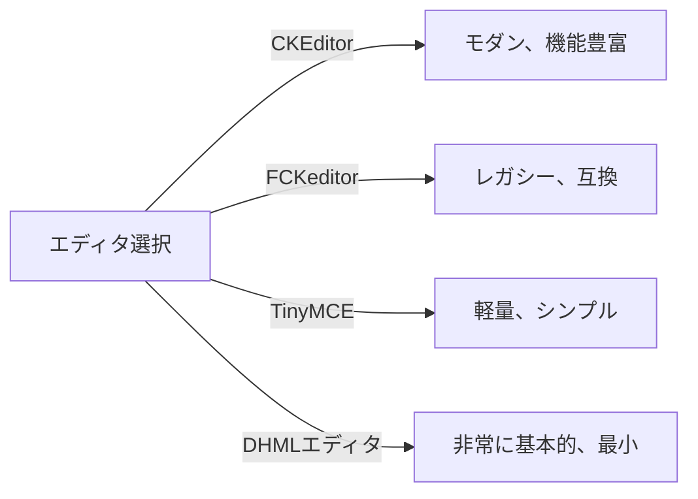
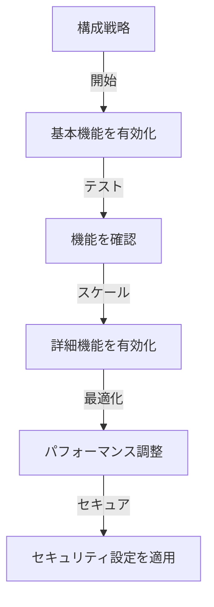

# パブリッシャー 基本構成

> XOOPS インストール用パブリッシャーモジュールの設定、環境設定、および一般的なオプションを構成します。

---

## 構成にアクセス

### 管理パネルナビゲーション

```
XOOPS 管理パネル
└── モジュール
    └── パブリッシャー
        ├── 環境設定
        ├── 設定
        └── 構成
```

1. **管理者**としてログイン
2. **管理パネル → モジュール**に移動
3. **パブリッシャー**モジュールを見つける
4. **環境設定**または**管理**リンクをクリック

---

## 一般設定

### アクセス構成

```
管理パネル → モジュール → パブリッシャー
```

歯車アイコンまたは**設定**をクリックして、以下のオプション：

#### 表示オプション

| 設定 | オプション | デフォルト | 説明 |
|---------|---------|---------|-------------|
| **ページあたりのアイテム数** | 5～50 | 10 | リストに表示される記事 |
| **パンくずリストを表示** | はい/いいえ | はい | ナビゲーション表示 |
| **ページ割りを使用** | はい/いいえ | はい | 長いリストをページ割り |
| **日付を表示** | はい/いいえ | はい | 記事日付を表示 |
| **カテゴリを表示** | はい/いいえ | はい | 記事カテゴリを表示 |
| **著者を表示** | はい/いいえ | はい | 記事著者を表示 |
| **ビューを表示** | はい/いいえ | はい | 記事ビュー数を表示 |

**例：構成**

```yaml
ページあたりのアイテム数: 15
パンくずリストを表示: はい
ページ割りを使用: はい
日付を表示: はい
カテゴリを表示: はい
著者を表示: はい
ビューを表示: はい
```

#### 著者オプション

| 設定 | デフォルト | 説明 |
|---------|---------|-------------|
| **著者名を表示** | はい | 本名またはユーザー名を表示 |
| **ユーザー名を使用** | いいえ | 本名の代わりにユーザー名を表示 |
| **著者メールを表示** | いいえ | 著者の連絡先メールを表示 |
| **著者アバターを表示** | はい | ユーザーアバターを表示 |

---

## エディタ構成

### WYSIWYGエディタを選択

パブリッシャーは複数のエディタをサポート：

#### 利用可能なエディタ



### CKEditor（推奨）

**最適対象：** ほとんどのユーザー、モダンブラウザ、完全な機能

1. **環境設定**に移動
2. **エディタ**を設定：CKEditor
3. オプションを構成：

```
エディタ: CKEditor 4.x
ツールバー: フル
高さ: 400px
幅: 100%
削除プラグイン: []
プラグイン追加: [mathjax, codesnippet]
```

### FCKeditor

**最適対象：** 互換性、古いシステム

```
エディタ: FCKeditor
ツールバー: デフォルト
カスタム設定: （オプション）
```

### TinyMCE

**最適対象：** 最小フットプリント、基本編集

```
エディタ: TinyMCE
プラグイン: [paste, table, link, image]
ツールバー: 最小
```

---

## ファイル・アップロード設定

### アップロードディレクトリを構成

```
管理 → パブリッシャー → 環境設定 → アップロード設定
```

#### ファイルタイプ設定

```yaml
許可するファイルタイプ:
  画像:
    - jpg
    - jpeg
    - gif
    - png
    - webp
  ドキュメント:
    - pdf
    - doc
    - docx
    - xls
    - xlsx
    - ppt
    - pptx
  アーカイブ:
    - zip
    - rar
    - 7z
  メディア:
    - mp3
    - mp4
    - webm
    - mov
```

#### ファイルサイズ制限

| ファイルタイプ | 最大サイズ | 注記 |
|-----------|----------|-------|
| **画像** | 5MB | ファイルあたり |
| **ドキュメント** | 10MB | PDFおよびOfficeファイル |
| **メディア** | 50MB | ビデオ/オーディオファイル |
| **すべてのファイル** | 100MB | アップロードあたり合計 |

**構成：**

```
最大画像アップロードサイズ: 5MB
最大ドキュメントアップロードサイズ: 10MB
最大メディアアップロードサイズ: 50MB
合計アップロードサイズ: 100MB
記事あたりの最大ファイル数: 5
```

### 画像リサイズ

パブリッシャーは一貫性のために画像を自動リサイズ：

```yaml
サムネイルサイズ:
  幅: 150
  高さ: 150
  モード: トリミング/リサイズ

カテゴリ画像サイズ:
  幅: 300
  高さ: 200
  モード: リサイズ

記事フィーチャー画像:
  幅: 600
  高さ: 400
  モード: リサイズ
```

---

## コメント・インタラクション設定

### コメント構成

```
環境設定 → コメントセクション
```

#### コメントオプション

```yaml
コメントを許可:
  - 有効: はい/いいえ
  - デフォルト: はい
  - 記事ごとにオーバーライド: はい

コメント モデレーション:
  - モデレートコメント: はい/いいえ
  - ゲストコメントのみモデレート: はい/いいえ
  - スパムフィルタ: 有効
  - 1日あたりの最大コメント数: （無制限）

コメント表示:
  - 表示形式: スレッド/フラット
  - ページあたりのコメント数: 10
  - 日付形式: 全日時/時間経過
  - コメント数を表示: はい/いいえ
```

### 評価構成

```yaml
評価を許可:
  - 有効: はい/いいえ
  - デフォルト: はい
  - 記事ごとにオーバーライド: はい

評価オプション:
  - 評価スケール: 5つ星（デフォルト）
  - ユーザーが自分を評価可能: いいえ
  - 平均評価を表示: はい
  - 評価数を表示: はい
```

---

## SEOおよびURL設定

### 検索エンジン最適化

```
環境設定 → SEO設定
```

#### URL構成

```yaml
SEO URL:
  - 有効: いいえ（SEO URLの場合ははいに設定）
  - URLリライト: なし/Apache mod_rewrite/IISリライト

URL形式:
  - カテゴリ: /category/news
  - 記事: /article/welcome-to-site
  - アーカイブ: /archive/2024/01

メタ説明:
  - 自動生成: はい
  - 最大文字数: 160文字

メタキーワード:
  - 自動生成: はい
  - 由来: 記事タグ、タイトル
```

### SEO URLを有効化（詳細）

**前提条件：**
- Apache と `mod_rewrite` 有効
- `.htaccess` サポート有効

**構成手順：**

1. **環境設定 → SEO設定**に移動
2. **SEO URL**: はいに設定
3. **URLリライト**: Apache mod_rewrite に設定
4. パブリッシャーフォルダに `.htaccess` ファイルが存在することを確認

**.htaccess構成：**

```apache
<IfModule mod_rewrite.c>
    RewriteEngine On
    RewriteBase /modules/publisher/

    # カテゴリリライト
    RewriteRule ^category/([0-9]+)-(.*)\.html$ index.php?op=showcategory&categoryid=$1 [L,QSA]

    # 記事リライト
    RewriteRule ^article/([0-9]+)-(.*)\.html$ index.php?op=showitem&itemid=$1 [L,QSA]

    # アーカイブリライト
    RewriteRule ^archive/([0-9]+)/([0-9]+)/$ index.php?op=archive&year=$1&month=$2 [L,QSA]
</IfModule>
```

---

## キャッシュ・パフォーマンス

### キャッシング構成

```
環境設定 → キャッシュ設定
```

```yaml
キャッシュを有効化:
  - 有効: はい
  - キャッシュタイプ: ファイル（またはメモキャッシュ）

キャッシュ有効期間:
  - カテゴリリスト: 3600秒（1時間）
  - 記事リスト: 1800秒（30分）
  - 1つの記事: 7200秒（2時間）
  - 最新記事ブロック: 900秒（15分）

キャッシュクリア:
  - 手動クリア: 管理で利用可能
  - 記事保存時に自動クリア: はい
  - カテゴリ変更時にクリア: はい
```

### キャッシュをクリア

**手動キャッシュクリア：**

1. **管理 → パブリッシャー → ツール**に移動
2. **キャッシュをクリア**をクリック
3. クリアするキャッシュタイプを選択：
   - [ ] カテゴリキャッシュ
   - [ ] 記事キャッシュ
   - [ ] ブロックキャッシュ
   - [ ] すべてのキャッシュ
4. **選択をクリア**をクリック

**コマンドラインオプション：**

```bash
# すべてのパブリッシャーキャッシュをクリア
php /path/to/xoops/admin/cache_manage.php publisher

# またはキャッシュファイルを直接削除
rm -rf /path/to/xoops/var/cache/publisher/*
```

---

## 通知とワークフロー

### メール通知

```
環境設定 → 通知
```

```yaml
新しい記事で管理者に通知:
  - 有効: はい
  - 受信者: 管理メールアドレス
  - 概要を含める: はい

モデレーターに通知:
  - 有効: はい
  - 新規投稿時: はい
  - 保留中の記事時: はい

著者に通知:
  - 承認時: はい
  - 却下時: はい
  - コメント時: いいえ（オプション）
```

### 投稿ワークフロー

```yaml
承認を要求:
  - 有効: はい
  - 編集者承認: はい
  - 管理者承認: いいえ

下書き保存:
  - 自動保存間隔: 60秒
  - ローカルバージョン保存: はい
  - リビジョン履歴: 最後の5バージョン
```

---

## コンテンツ設定

### デフォルト公開設定

```
環境設定 → コンテンツ設定
```

```yaml
デフォルト記事ステータス:
  - 下書き/公開済み: 下書き
  - デフォルトでフィーチャー: いいえ
  - 自動公開時間: なし

デフォルト可視性:
  - 公開/非公開: 公開
  - フロントページに表示: はい
  - カテゴリに表示: はい

スケジュール公開:
  - 有効: はい
  - 記事ごとに許可: はい

コンテンツ有効期限:
  - 有効: いいえ
  - 古いコンテンツを自動アーカイブ: いいえ
  - 日数後にアーカイブ: （無制限）
```

### WYSIWYG コンテンツオプション

```yaml
HTMLを許可:
  - 記事内: はい
  - コメント内: いいえ

埋め込みメディアを許可:
  - ビデオ（iframe）: はい
  - 画像: はい
  - プラグイン: いいえ

コンテンツフィルタリング:
  - タグを削除: いいえ
  - XSSフィルタ: はい（推奨）
```

---

## 検索エンジン設定

### 検索統合を構成

```
環境設定 → 検索設定
```

```yaml
記事インデックスを有効化:
  - サイト検索に含める: はい
  - インデックスタイプ: 全文/タイトルのみ

検索オプション:
  - タイトルで検索: はい
  - コンテンツで検索: はい
  - コメントで検索: はい

メタタグ:
  - 自動生成: はい
  - OGタグ（ソーシャル）: はい
  - Twitterカード: はい
```

---

## 詳細設定

### デバッグモード（開発のみ）

```
環境設定 → 詳細
```

```yaml
デバッグモード:
  - 有効: いいえ（開発環境のみ！）

開発機能:
  - SQLクエリを表示: いいえ
  - エラーをログ: はい
  - エラーメール: admin@example.com
```

### データベース最適化

```
管理 → ツール → データベースを最適化
```

```bash
# 手動最適化
mysql> OPTIMIZE TABLE publisher_items;
mysql> OPTIMIZE TABLE publisher_categories;
mysql> OPTIMIZE TABLE publisher_comments;
```

---

## モジュールカスタマイズ

### テーマテンプレート

```
環境設定 → 表示 → テンプレート
```

テンプレートセットを選択：
- デフォルト
- クラシック
- モダン
- ダーク
- カスタム

各テンプレートが制御：
- 記事レイアウト
- カテゴリリスティング
- アーカイブ表示
- コメント表示

---

## 構成のヒント

### ベストプラクティス



1. **シンプルに開始** - まずコア機能を有効化
2. **各変更をテスト** - 進める前に確認
3. **キャッシングを有効化** - パフォーマンス向上
4. **最初にバックアップ** - 大きな変更前に設定をエクスポート
5. **ログを監視** - エラーログを定期的に確認

### パフォーマンス最適化

```yaml
より良いパフォーマンスのため:
  - キャッシング有効化: はい
  - キャッシュ有効期間: 3600秒
  - ページあたりのアイテム数制限: 10～15
  - 画像圧縮: はい
  - CSS/JS縮小化: はい（利用可能な場合）
```

### セキュリティ強化

```yaml
より良いセキュリティのため:
  - コメントをモデレート: はい
  - コメント内HTMLを無効化: はい
  - XSSフィルタリング: はい
  - ファイルタイプホワイトリスト: 厳格
  - 最大アップロードサイズ: 適切な制限
```

---

## 設定のエクスポート/インポート

### 構成をバックアップ

```
管理 → ツール → 設定をエクスポート
```

**現在の構成をバックアップするには：**

1. **構成をエクスポート**をクリック
2. ダウンロード中の `.cfg` ファイルを保存
3. 安全な場所に保存

**復元するには：**

1. **構成をインポート**をクリック
2. `.cfg` ファイルを選択
3. **復元**をクリック

---

## 関連構成ガイド

- カテゴリ管理
- 記事作成
- 権限構成
- インストールガイド

---

## 構成トラブルシューティング

### 設定が保存されない

**解決方法：**
1. `/var/config/`ディレクトリのパーミッションを確認
2. PHPの書き込みアクセスを確認
3. PHPエラーログで問題を確認
4. ブラウザキャッシュをクリアして再試行

### エディタが表示されない

**解決方法：**
1. エディタプラグインがインストール済みか確認
2. XOOPS エディタ構成を確認
3. 別のエディタオプションを試す
4. ブラウザコンソールでJavaScriptエラーを確認

### パフォーマンス問題

**解決方法：**
1. キャッシングを有効化
2. ページあたりのアイテム数を削減
3. 画像を圧縮
4. データベース最適化を確認
5. スロークエリログを確認

---

## 次のステップ

- グループ権限を構成
- 最初の記事を作成
- カテゴリを設定
- カスタムテンプレートを確認

---

#publisher #configuration #preferences #settings #xoops
