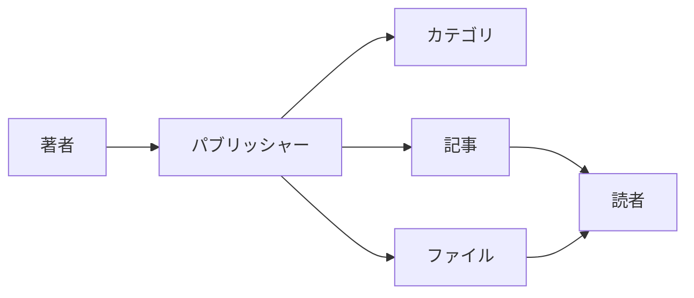
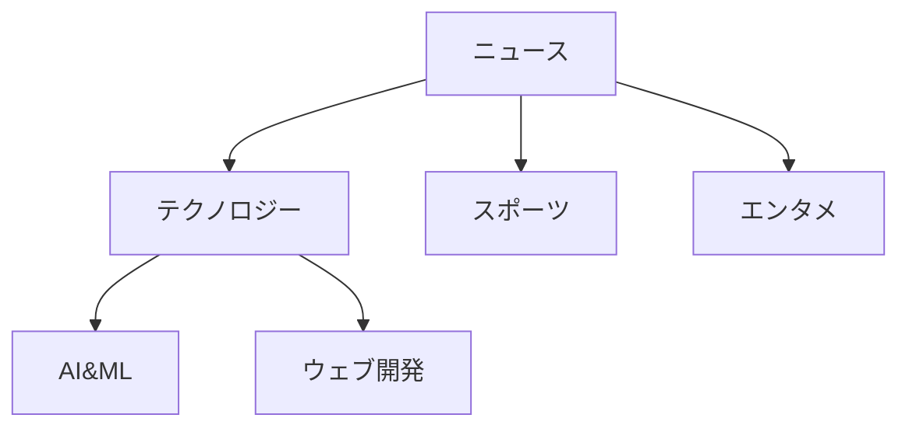
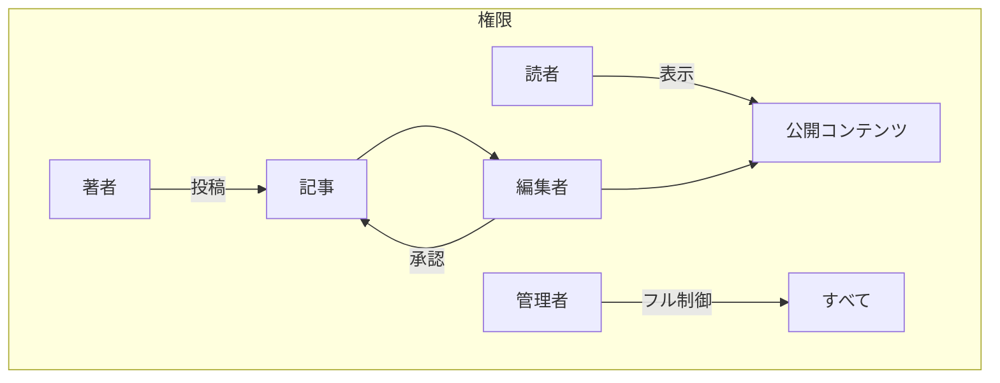
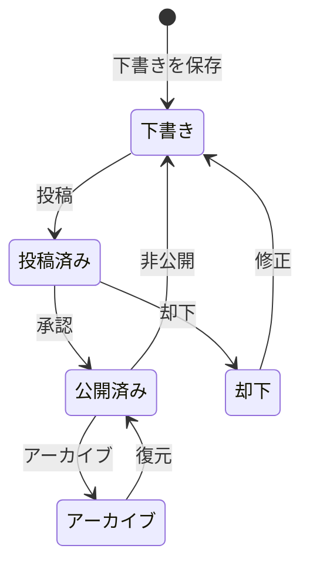

# パブリッシャーを始める

> パブリッシャーニュース/ブログモジュールのセットアップと使用方法のステップバイステップガイド。

---

## パブリッシャーとは

パブリッシャーはXOOPSの最高峰のコンテンツ管理モジュールで、以下のために設計されています：

- **ニュースサイト** - カテゴリ付き記事発行
- **ブログ** - 個人またはマルチオーサーブログ
- **ドキュメント** - 体系的なナレッジベース
- **コンテンツポータル** - 混合メディアコンテンツ



---

## クイックセットアップ

### ステップ1：パブリッシャーをインストール

1. [GitHub](https://github.com/XoopsModules25x/publisher)からダウンロード
2. `modules/publisher/`にアップロード
3. 管理者 → モジュール → インストール

### ステップ2：カテゴリを作成



1. 管理者 → パブリッシャー → カテゴリ
2. 「カテゴリを追加」をクリック
3. 以下を入力：
   - **名前**: カテゴリ名
   - **説明**: このカテゴリの内容
   - **画像**: オプション（カテゴリ画像）
4. 権限を設定（誰が投稿・閲覧できるか）
5. 保存

### ステップ3：設定を構成

1. 管理者 → パブリッシャー → 環境設定
2. 主要な設定：

| 設定 | 推奨 | 説明 |
|---------|-------------|-------------|
| ページあたりのアイテム数 | 10～20 | インデックスに表示される記事 |
| エディタ | TinyMCE/CKEditor | リッチテキストエディタ |
| 評価を許可 | はい | 読者フィードバック |
| コメントを許可 | はい | 議論 |
| 自動承認 | いいえ | 編集管理 |

### ステップ4：最初の記事を作成

1. メインメニュー → パブリッシャー → 記事を投稿
2. フォームに入力：
   - **タイトル**: 記事見出し
   - **カテゴリ**: 属するカテゴリ
   - **要約**: 短い説明
   - **本文**: 完全な記事内容
3. オプション要素を追加：
   - フィーチャー画像
   - ファイル添付
   - SEO設定
4. レビュー用に投稿または公開

---

## ユーザーロール



### 読者
- 公開記事を表示
- 評価とコメント
- コンテンツを検索

### 著者
- 新しい記事を投稿
- 自分の記事を編集
- ファイルを添付

### 編集者
- 投稿を承認/却下
- どの記事でも編集
- カテゴリを管理

### 管理者
- モジュール完全制御
- 設定を構成
- 権限を管理

---

## 記事を書く

### 記事エディタ

```
┌─────────────────────────────────────────────────────┐
│ タイトル: [あなたの記事タイトル                        ] │
├─────────────────────────────────────────────────────┤
│ カテゴリ: [カテゴリを選択          ▼]              │
├─────────────────────────────────────────────────────┤
│ 要約:                                            │
│ ┌─────────────────────────────────────────────────┐ │
│ │ リスティングに表示される簡潔な説明...          │ │
│ └─────────────────────────────────────────────────┘ │
├─────────────────────────────────────────────────────┤
│ 本文:                                               │
│ ┌─────────────────────────────────────────────────┐ │
│ │ [B] [I] [U] [リンク] [画像] [コード]               │ │
│ ├─────────────────────────────────────────────────┤ │
│ │                                                  │ │
│ │ 完全な記事コンテンツがここに入ります...               │ │
│ │                                                  │ │
│ └─────────────────────────────────────────────────┘ │
├─────────────────────────────────────────────────────┤
│ [投稿] [プレビュー] [下書きを保存]                     │
└─────────────────────────────────────────────────────┘
```

### ベストプラクティス

1. **説得力のあるタイトル** - 明確で魅力的な見出し
2. **良い要約** - 読者をクリックするよう促す
3. **構造化コンテンツ** - 見出し、リスト、画像を使用
4. **適切な分類** - 読者がコンテンツを見つけやすく
5. **SEO最適化** - タイトルと内容にキーワード

---

## コンテンツ管理

### 記事ステータスフロー



### ステータス説明

| ステータス | 説明 |
|--------|-------------|
| 下書き | 進行中 |
| 投稿済み | レビュー待ち |
| 公開済み | サイトで公開 |
| 期限切れ | 期限を過ぎた |
| 却下 | 修正が必要 |
| アーカイブ | リスティングから削除 |

---

## ナビゲーション

### パブリッシャーへのアクセス

- **メインメニュー** → パブリッシャー
- **直接URL**: `yoursite.com/modules/publisher/`

### キーページ

| ページ | URL | 目的 |
|------|-----|---------|
| インデックス | `/modules/publisher/` | 記事リスティング |
| カテゴリ | `/modules/publisher/category.php?id=X` | カテゴリ記事 |
| 記事 | `/modules/publisher/item.php?itemid=X` | 1つの記事 |
| 投稿 | `/modules/publisher/submit.php` | 新規記事 |
| 検索 | `/modules/publisher/search.php` | 記事検索 |

---

## ブロック

パブリッシャーはサイト向けのいくつかのブロックを提供します：

### 最新記事
最新公開記事を表示

### カテゴリメニュー
カテゴリ別ナビゲーション

### 人気記事
最も閲覧されたコンテンツ

### ランダム記事
ランダムコンテンツを紹介

### スポットライト
フィーチャー記事

---

## 関連ドキュメント

- 記事の作成と編集
- カテゴリの管理
- パブリッシャーを拡張

---

#xoops #publisher #user-guide #getting-started #cms
