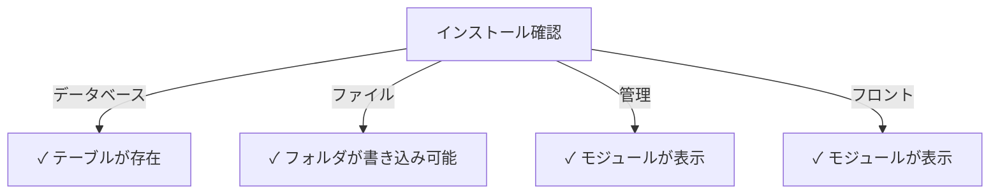

# パブリッシャー インストールガイド

> XOOPSコンテンツマネジメントシステムのパブリッシャーモジュールのインストールと構成に関する完全な手順。

---

## システム要件

### 最小要件

| 要件 | バージョン | 注記 |
|-------------|---------|-------|
| XOOPS | 2.5.10+ | コアCMSプラットフォーム |
| PHP | 7.1+ | PHP 8.x推奨 |
| MySQL | 5.7+ | データベースサーバー |
| ウェブサーバー | Apache/Nginx | リライト機能対応 |

### PHP拡張機能

```
- PDO（PHPデータオブジェクト）
- pdo_mysql または mysqli
- mb_string（マルチバイト文字列）
- curl（外部コンテンツ用）
- json
- gd（画像処理）
```

### ディスク容量

- **モジュールファイル**: 約5MB
- **キャッシュディレクトリ**: 50MB以上推奨
- **アップロードディレクトリ**: コンテンツに応じた容量

---

## インストール前のチェックリスト

パブリッシャーをインストールする前に確認：

- [ ] XOOPSコアがインストール・実行中
- [ ] 管理アカウントがモジュール管理権限を持有
- [ ] データベースのバックアップを作成
- [ ] `/modules/`ディレクトリへの書き込み権限がある
- [ ] PHPメモリ制限が最低128MB以上
- [ ] ファイルアップロード制限が10MB以上（最小）

---

## インストール手順

### ステップ1：パブリッシャーをダウンロード

#### オプションA：GitHubから（推奨）

```bash
# モジュールディレクトリに移動
cd /path/to/xoops/htdocs/modules/

# リポジトリをクローン
git clone https://github.com/XoopsModules25x/publisher.git

# ダウンロード確認
ls -la publisher/
```

#### オプションB：手動ダウンロード

1. [GitHub Publisher Releases](https://github.com/XoopsModules25x/publisher/releases)にアクセス
2. 最新の`.zip`ファイルをダウンロード
3. `modules/publisher/`に展開

### ステップ2：ファイルパーミッションを設定

```bash
# 適切な所有権を設定
chown -R www-data:www-data /path/to/xoops/htdocs/modules/publisher

# ディレクトリパーミッションを設定（755）
find publisher -type d -exec chmod 755 {} \;

# ファイルパーミッションを設定（644）
find publisher -type f -exec chmod 644 {} \;

# スクリプトを実行可能にする
chmod 755 publisher/admin/index.php
chmod 755 publisher/index.php
```

### ステップ3：XOOPSアドミンからインストール

1. **XOOPSアドミンパネル**に管理者としてログイン
2. **システム → モジュール**に移動
3. **モジュールをインストール**をクリック
4. リストから**パブリッシャー**を見つける
5. **インストール**ボタンをクリック
6. インストール完了を待つ（データベーステーブル作成表示）

```
インストール進行状況:
✓ テーブル作成
✓ 設定初期化
✓ 権限設定
✓ キャッシュ削除
インストール完了！
```

---

## 初期セットアップ

### ステップ1：パブリッシャー管理にアクセス

1. **アドミンパネル → モジュール**に移動
2. **パブリッシャー**モジュールを見つける
3. **管理**リンクをクリック
4. パブリッシャー管理画面に入ります

### ステップ2：モジュール設定を構成

1. 左メニューから**環境設定**をクリック
2. 基本設定を構成：

```
一般設定:
- エディタ: WYSIWYG エディタを選択
- ページあたりのアイテム数: 10
- パンくずリストを表示: はい
- コメントを許可: はい
- 評価を許可: はい

SEO設定:
- SEO URL: いいえ（後で有効化が必要な場合）
- URLリライト: なし

アップロード設定:
- 最大アップロードサイズ: 5MB
- 許可するファイル形式: jpg, png, gif, pdf, doc, docx
```

3. **設定を保存**をクリック

### ステップ3：最初のカテゴリを作成

1. 左メニューから**カテゴリ**をクリック
2. **カテゴリを追加**をクリック
3. フォームに入力：

```
カテゴリ名: ニュース
説明: 最新ニュースと更新
画像: （オプション）カテゴリ画像をアップロード
親カテゴリ: （空白のままにして最上位）
ステータス: 有効
```

4. **カテゴリを保存**をクリック

### ステップ4：インストールを確認

チェック項目：



#### データベース確認

```bash
mysql -u xoops_user -p xoops_database
mysql> SHOW TABLES LIKE 'publisher%';

# 表示されるテーブル：
# - publisher_categories
# - publisher_items
# - publisher_comments
# - publisher_files
```

#### フロントエンド確認

1. XOOPSホームページにアクセス
2. **パブリッシャー**または**ニュース**ブロックを探す
3. 最新記事が表示されるはず

---

## インストール後の構成

### エディタ選択

パブリッシャーは複数のWYSIWYGエディタをサポート：

| エディタ | 利点 | 欠点 |
|--------|------|------|
| FCKeditor | 機能豊富 | 古い、容量大 |
| CKEditor | モダン標準 | 構成複雑 |
| TinyMCE | 軽量 | 機能制限 |
| DHMLエディタ | 基本的 | 非常に基本的 |

**エディタを変更するには：**

1. **環境設定**に移動
2. **エディタ**設定までスクロール
3. ドロップダウンから選択
4. 保存してテスト

### アップロードディレクトリセットアップ

```bash
# アップロードディレクトリを作成
mkdir -p /path/to/xoops/uploads/publisher/
mkdir -p /path/to/xoops/uploads/publisher/categories/
mkdir -p /path/to/xoops/uploads/publisher/images/
mkdir -p /path/to/xoops/uploads/publisher/files/

# パーミッションを設定
chmod 755 /path/to/xoops/uploads/publisher/
chmod 755 /path/to/xoops/uploads/publisher/*
```

### 画像サイズを構成

環境設定で、サムネイルサイズを設定：

```
カテゴリ画像サイズ: 300 x 200 px
記事画像サイズ: 600 x 400 px
サムネイルサイズ: 150 x 100 px
```

---

## インストール後のステップ

### 1. グループ権限を設定

1. **権限**に移動
2. グループのアクセスを構成：
   - 匿名: 表示のみ
   - 登録ユーザー: 記事投稿
   - 編集者: 記事承認/編集
   - 管理者: フルアクセス

### 2. モジュールの可視性を構成

1. XOOPS管理の**ブロック**に移動
2. パブリッシャーブロックを探す：
   - パブリッシャー - 最新記事
   - パブリッシャー - カテゴリ
   - パブリッシャー - アーカイブ
3. ページごとにブロック可視性を構成

### 3. テストコンテンツをインポート（オプション）

テストの場合：

1. **パブリッシャー管理 → インポート**に移動
2. **サンプルコンテンツ**を選択
3. **インポート**をクリック

### 4. SEO URLを有効化（オプション）

検索エンジンに優しいURLの場合：

1. **環境設定**に移動
2. **SEO URL**: はいに設定
3. **.htaccess**リライトを有効化
4. パブリッシャーフォルダに`.htaccess`ファイルが存在することを確認

```apache
# .htaccess例
<IfModule mod_rewrite.c>
    RewriteEngine On
    RewriteBase /modules/publisher/
    RewriteRule ^category/([0-9]+)-(.*)\.html$ index.php?op=showcategory&categoryid=$1 [L]
    RewriteRule ^article/([0-9]+)-(.*)\.html$ index.php?op=showitem&itemid=$1 [L]
</IfModule>
```

---

## インストールトラブルシューティング

### 問題：モジュールが管理画面に表示されない

**解決方法：**
```bash
# ファイルパーミッションを確認
ls -la /path/to/xoops/modules/publisher/

# xoops_version.phpが存在することを確認
ls /path/to/xoops/modules/publisher/xoops_version.php

# PHP構文を確認
php -l /path/to/xoops/modules/publisher/xoops_version.php
```

### 問題：データベーステーブルが作成されない

**解決方法：**
1. MySQLユーザーがCREATE TABLE権限を持つことを確認
2. データベースエラーログを確認：
   ```bash
   mysql> SHOW WARNINGS;
   ```
3. SQLを手動でインポート：
   ```bash
   mysql -u user -p database < modules/publisher/sql/mysql.sql
   ```

### 問題：ファイルアップロードが失敗

**解決方法：**
```bash
# ディレクトリが存在して書き込み可能か確認
stat /path/to/xoops/uploads/publisher/

# パーミッションを修正
chmod 777 /path/to/xoops/uploads/publisher/

# PHPの設定を確認
php -i | grep upload_max_filesize
```

### 問題：「ページが見つかりません」エラー

**解決方法：**
1. `.htaccess`ファイルが存在することを確認
2. Apache `mod_rewrite`が有効か確認：
   ```bash
   a2enmod rewrite
   systemctl restart apache2
   ```
3. Apacheの設定で`AllowOverride All`を確認

---

## 以前のバージョンからのアップグレード

### Publisher 1.xから2.xへ

1. **現在のインストールをバックアップ：**
   ```bash
   cp -r modules/publisher/ modules/publisher-backup/
   mysqldump -u user -p database > publisher-backup.sql
   ```

2. **Publisher 2.xをダウンロード**

3. **ファイルを上書き：**
   ```bash
   rm -rf modules/publisher/
   unzip publisher-2.0.zip -d modules/
   ```

4. **アップデート実行：**
   - **管理 → パブリッシャー → アップデート**に移動
   - **データベースをアップデート**をクリック
   - 完了を待つ

5. **確認：**
   - すべての記事が正しく表示されることを確認
   - 権限が保持されていることを確認
   - ファイルアップロードをテスト

---

## セキュリティに関する考慮事項

### ファイルパーミッション

```
- コアファイル: 644（ウェブサーバーが読み込み可能）
- ディレクトリ: 755（ウェブサーバーが閲覧可能）
- アップロードディレクトリ: 755 または 777
- 設定ファイル: 600（ウェブから読み込み不可）
```

### 機密ファイルへの直接アクセスを無効化

アップロードディレクトリに`.htaccess`を作成：

```apache
<FilesMatch "\.(php|phtml|php3|php4|php5|phtml)$">
    Deny from all
</FilesMatch>
```

### データベースセキュリティ

```bash
# 強力なパスワードを使用
ALTER USER 'publisher_user'@'localhost' IDENTIFIED BY 'strong_password_here';

# 最小限の権限を付与
GRANT SELECT, INSERT, UPDATE, DELETE ON publisher_db.* TO 'publisher_user'@'localhost';
FLUSH PRIVILEGES;
```

---

## 検証チェックリスト

インストール後に検証：

- [ ] モジュールが管理モジュールリストに表示
- [ ] パブリッシャー管理セクションにアクセス可能
- [ ] カテゴリを作成可能
- [ ] 記事を作成可能
- [ ] 記事がフロントエンドに表示
- [ ] ファイルアップロードが機能
- [ ] 画像が正しく表示
- [ ] 権限が適用されている
- [ ] データベーステーブルが作成される
- [ ] キャッシュディレクトリが書き込み可能

---

## 次のステップ

インストール成功後：

1. 基本構成ガイドを読む
2. 最初の記事を作成
3. グループ権限を設定
4. カテゴリ管理を確認

---

## サポートとリソース

- **GitHubイシュー**: [Publisher Issues](https://github.com/XoopsModules25x/publisher/issues)
- **XOOPSフォーラム**: [コミュニティサポート](https://www.xoops.org/modules/newbb/)
- **GitHub Wiki**: [インストールヘルプ](https://github.com/XoopsModules25x/publisher/wiki)

---

#publisher #installation #setup #xoops #module #configuration
