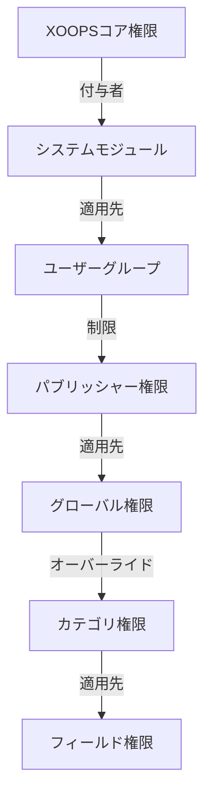

# パブリッシャー 権限セットアップ

> パブリッシャーのグループ権限、アクセス制御、ユーザーアクセス管理を構成するための完全ガイド。

---

## 権限基本

### 権限とは

権限は、XOOPSのパブリッシャーで異なるユーザーグループが実行できる操作を制御します：

```
誰が:
  - 記事を表示
  - 記事を投稿
  - 記事を編集
  - 記事を承認
  - カテゴリを管理
  - 設定を構成
```

### 権限レベル

```
匿名
  └── 公開記事のみを表示

登録ユーザー
  ├── 記事を表示
  ├── 記事を投稿（承認待ち）
  └── 自分の記事を編集

編集者/モデレータ
  ├── すべての登録権限
  ├── 記事を承認
  ├── どの記事でも編集
  └── カテゴリを管理

管理者
  └── すべてにフルアクセス
```

---

## 権限管理にアクセス

### ナビゲーション

```
管理パネル
└── モジュール
    └── パブリッシャー
        ├── 権限
        ├── カテゴリ権限
        └── グループ管理
```

### クイックアクセス

1. **管理者**としてログイン
2. **管理 → モジュール**に移動
3. **パブリッシャー → 管理**をクリック
4. 左メニューから**権限**をクリック

---

## グローバル権限

### モジュールレベルの権限

パブリッシャーモジュールとフィーチャーへのアクセスを制御：

```
権限構成ビュー:
┌─────────────────────────────────────┐
│ 権限             │ 匿名 │ 登録 │ 編集者 │ 管理者 │
├────────────────────┼──────┼─────┼────────┼───────┤
│ 記事を表示        │  ✓   │  ✓  │   ✓    │  ✓   │
│ 記事を投稿        │  ✗   │  ✓  │   ✓    │  ✓   │
│ 自分の記事を編集  │  ✗   │  ✓  │   ✓    │  ✓   │
│ すべての記事を編集│  ✗   │  ✗  │   ✓    │  ✓   │
│ 記事を承認        │  ✗   │  ✗  │   ✓    │  ✓   │
│ カテゴリを管理    │  ✗   │  ✗  │   ✗    │  ✓   │
│ 管理パネルアクセス│  ✗   │  ✗  │   ✓    │  ✓   │
└─────────────────────────────────────┘
```

### 権限説明

| 権限 | ユーザー | 効果 |
|------------|-------|--------|
| **記事を表示** | すべてのグループ | フロントエンドで公開記事を表示できる |
| **記事を投稿** | 登録+編集者 | 新しい記事を作成できる（承認待ち） |
| **自分の記事を編集** | 登録+編集者 | 自分の記事を編集/削除できる |
| **すべての記事を編集** | 編集者+ | どのユーザーの記事でも編集できる |
| **記事を削除（自分の）** | 登録+ | 自分の未公開記事を削除できる |
| **記事を削除（すべて）** | 編集者+ | どの記事でも削除できる |
| **記事を承認** | 編集者+ | 保留中記事を公開できる |
| **カテゴリを管理** | 管理者 | カテゴリを作成、編集、削除 |
| **管理アクセス** | 編集者+ | 管理インターフェースにアクセス |

---

## グローバル権限を構成

### ステップ1：権限設定にアクセス

1. **管理 → モジュール**に移動
2. **パブリッシャー**を見つける
3. **権限**をクリック（または管理リンクをクリック）
4. 権限マトリックスを表示

### ステップ2：グループ権限を設定

各グループについて、何ができるかを構成：

#### 匿名ユーザー

```yaml
匿名グループ権限:
  記事を表示: ✓ はい
  記事を投稿: ✗ いいえ
  記事を編集: ✗ いいえ
  記事を削除: ✗ いいえ
  記事を承認: ✗ いいえ
  カテゴリを管理: ✗ いいえ
  管理アクセス: ✗ いいえ

結果: 匿名ユーザーは公開コンテンツのみを表示
```

#### 登録ユーザー

```yaml
登録グループ権限:
  記事を表示: ✓ はい
  記事を投稿: ✓ はい（承認が必要）
  自分の記事を編集: ✓ はい
  すべての記事を編集: ✗ いいえ
  自分の記事を削除: ✓ はい（下書きのみ）
  すべての記事を削除: ✗ いいえ
  記事を承認: ✗ いいえ
  カテゴリを管理: ✗ いいえ
  管理アクセス: ✗ いいえ

結果: 登録ユーザーは承認後にコンテンツを寄稿
```

#### エディタグループ

```yaml
エディタグループ権限:
  記事を表示: ✓ はい
  記事を投稿: ✓ はい
  自分の記事を編集: ✓ はい
  すべての記事を編集: ✓ はい
  自分の記事を削除: ✓ はい
  すべての記事を削除: ✓ はい
  記事を承認: ✓ はい
  カテゴリを管理: ✓ 制限
  管理アクセス: ✓ はい
  設定を構成: ✗ いいえ

結果: エディタはコンテンツを管理するが、設定は管理しない
```

#### 管理者

```yaml
管理者グループ権限:
  ✓ すべての機能にフルアクセス

  - すべてのエディタ権限
  - すべてのカテゴリを管理
  - すべての設定を構成
  - 権限を管理
  - インストール/アンインストール
```

### ステップ3：権限を保存

1. 各グループの権限を構成
2. 許可されたアクションのボックスをチェック
3. 拒否されたアクションのボックスをアンチェック
4. **権限を保存**をクリック
5. 確認メッセージが表示

---

## カテゴリレベルの権限

### カテゴリアクセスを設定

特定のカテゴリを表示/投稿できるユーザーを制御：

```
管理 → パブリッシャー → カテゴリ
→ カテゴリを選択 → 権限
```

### カテゴリ権限マトリックス

```
                 匿名  登録  編集者  管理者
カテゴリを表示    ✓    ✓     ✓      ✓
カテゴリに投稿    ✗    ✓     ✓      ✓
カテゴリで編集    ✗    ✓     ✓      ✓
カテゴリで編集全  ✗    ✗     ✓      ✓
カテゴリで承認    ✗    ✗     ✓      ✓
カテゴリを管理    ✗    ✗     ✗      ✓
```

### カテゴリ権限を構成

1. **カテゴリ**管理に移動
2. カテゴリを見つける
3. **権限**ボタンをクリック
4. 各グループについて以下を選択：
   - [ ] このカテゴリを表示
   - [ ] 記事を投稿
   - [ ] 自分の記事を編集
   - [ ] すべての記事を編集
   - [ ] 記事を承認
   - [ ] カテゴリを管理
5. **保存**をクリック

### カテゴリ権限例

#### パブリック ニュースカテゴリ

```
匿名: 表示のみ
登録: 表示 + 投稿（承認待ち）
編集者: 承認 + 編集
管理者: フル制御
```

#### 内部アップデートカテゴリ

```
匿名: アクセスなし
登録: 表示のみ
編集者: 投稿 + 承認
管理者: フル制御
```

#### ゲストブログカテゴリ

```
匿名: 表示のみ
登録: 投稿（承認待ち）
編集者: 承認
管理者: フル制御
```

---

## フィールドレベル権限

### フォームフィールド可視性を制御

ユーザーが表示/編集できるフォームフィールドを制限：

```
管理 → パブリッシャー → 権限 → フィールド
```

### フィールドオプション

```yaml
登録ユーザー向けの表示フィールド:
  ✓ タイトル
  ✓ 説明
  ✓ コンテンツ（本文）
  ✓ フィーチャー画像
  ✓ カテゴリ
  ✓ タグ
  ✗ 著者（自動設定）
  ✗ 公開日（編集者のみ）
  ✗ スケジュール日（編集者のみ）
  ✗ フィーチャーフラグ（編集者のみ）
  ✗ 権限（管理者のみ）
```

### 例

#### 登録向けの制限投稿

登録ユーザーは少数のオプションのみ表示：

```
利用可能フィールド:
  - タイトル ✓
  - 説明 ✓
  - コンテンツ ✓
  - フィーチャー画像 ✓
  - カテゴリ ✓

非表示フィールド:
  - 著者（現在のユーザーに自動設定）
  - 公開日（編集者が決定）
  - スケジュール日（管理者のみ）
  - フィーチャーステータス（編集者が選択）
```

#### エディタ用フルフォーム

エディタはすべてのオプションを表示：

```
利用可能フィールド:
  - すべての基本フィールド
  - すべてのメタデータ
  - 著者選択 ✓
  - 公開日/時刻 ✓
  - スケジュール日 ✓
  - フィーチャーステータス ✓
  - 有効期限日 ✓
  - 権限 ✓
```

---

## ユーザーグループ構成

### カスタムグループを作成

1. **管理 → ユーザー → グループ**に移動
2. **グループを作成**をクリック
3. グループ詳細を入力：

```
グループ名: 「コミュニティブロガー」
グループ説明: 「ブログコンテンツを寄稿するユーザー」
タイプ: 通常グループ
```

4. **グループを保存**をクリック
5. パブリッシャー権限に戻る
6. 新しいグループの権限を設定

### グループ例

```
提案されるパブリッシャーグループ:

グループ: 寄稿者
  - 記事を投稿
  - 自分の記事を編集
  - 記事を承認不可

グループ: レビュアー
  - 投稿された記事を表示
  - 記事を承認/却下
  - 他のユーザー記事を削除不可

グループ: エディタ
  - どの記事でも編集
  - 記事を承認
  - コメントをモデレート
  - カテゴリを管理

グループ: パブリッシャー
  - どの記事でも編集
  - 承認なしで直接公開
  - すべてのカテゴリを管理
  - 設定を構成
```

---

## 権限階層

### 権限フロー



### 権限継承

```
ベース: グローバルモジュール権限
  ↓
カテゴリ: 特定カテゴリの上書き
  ↓
フィールド: さらに利用可能フィールドを制限
  ↓
ユーザー: すべてのレベルがALLを許可する場合のみ権限あり
```

**例：**

```
ユーザーが記事を編集したい:
1. ユーザーグループが「記事を編集」権限を持つ必要
2. カテゴリがカテゴリレベル編集を許可する必要
3. フィールド制限が該当する必要
4. ユーザーが著者またはエディタである必要

ANY レベルが拒否 → 権限拒否
```

---

## 承認ワークフロー権限

### 投稿承認を構成

記事が承認が必要かを制御：

```
管理 → パブリッシャー → 環境設定 → ワークフロー
```

#### 承認オプション

```yaml
投稿ワークフロー:
  承認が必要: はい

  登録ユーザー向け:
    - 新規記事: 下書き（承認待ち）
    - エディタが承認
    - ユーザーが保留中に編集可
    - 承認後：ユーザーがまだ編集可

  エディタ向け:
    - 新規記事: 直接公開（オプション）
    - 承認をスキップ
    - またはいつでも承認が必要
```

#### グループごとに構成

1. 環境設定に移動
2. 「投稿ワークフロー」を探す
3. 各グループについて以下を設定：

```
グループ: 登録ユーザー
  承認が必要: ✓ はい
  デフォルトステータス: 下書き
  保留中に変更可: ✓ はい

グループ: エディタ
  承認が必要: ✗ いいえ
  デフォルトステータス: 公開済み
  公開後に変更可: ✓ はい
```

4. **保存**をクリック

---

## 記事をモデレート

### 保留中の記事を承認

「記事を承認」権限を持つユーザー向け：

1. **管理 → パブリッシャー → 記事**に移動
2. **ステータス**でフィルタ：保留中
3. 記事をクリックしてレビュー
4. コンテンツ品質をチェック
5. **ステータス**を設定：公開済み
6. オプション：編集ノートを追加
7. **保存**をクリック

### 記事を却下

基準を満たさない場合：

1. 記事を開く
2. **ステータス**を設定：下書き
3. 却下理由を追加（コメントまたはメール）
4. **保存**をクリック
5. 著者に却下の理由を説明するメッセージを送信

### コメントをモデレート

コメントをモデレートする場合：

1. **管理 → パブリッシャー → コメント**に移動
2. **ステータス**でフィルタ：保留中
3. コメントをレビュー
4. オプション：
   - 承認：**承認**をクリック
   - 却下：**削除**をクリック
   - 編集：**編集**をクリック、修正、保存
5. **保存**をクリック

---

## ユーザーアクセスを管理

### ユーザーグループを表示

グループに属するユーザーを表示：

```
管理 → ユーザー → ユーザーグループ

各ユーザー:
  - プライマリグループ（1つ）
  - セカンダリグループ（複数）

権限はすべてのグループから適用（共用）
```

### グループにユーザーを追加

1. **管理 → ユーザー**に移動
2. ユーザーを見つける
3. **編集**をクリック
4. **グループ**下でグループをチェック
5. **保存**をクリック

### ユーザー権限を変更

個別ユーザー向け（サポート対象の場合）：

1. ユーザー管理に移動
2. ユーザーを見つける
3. **編集**をクリック
4. 個別権限上書きを探す
5. 必要に応じて構成
6. **保存**をクリック

---

## 一般的な権限シナリオ

### シナリオ1：オープンブログ

誰でも投稿可能：

```
匿名: 表示
登録: 投稿、自分を編集、自分を削除
編集者: 承認、すべてを編集、すべてを削除
管理者: フル制御

結果: オープンコミュニティブログ
```

### シナリオ2：モデレートニュースサイト

厳密な承認プロセス：

```
匿名: 表示のみ
登録: 投稿不可
編集者: 投稿、他を承認
管理者: フル制御

結果: 承認プロフェッショナルのみが公開
```

### シナリオ3：スタッフブログ

従業員が寄稿可能：

```
グループを作成: 「スタッフ」
匿名: 表示
登録: 表示のみ（非スタッフ）
スタッフ: 投稿、自分を編集、直接公開
管理者: フル制御

結果: スタッフオーサーブログ
```

### シナリオ4：複数カテゴリ異なる編集者

異なる編集者がカテゴリを管理：

```
ニュースカテゴリ:
  エディタグループA: フル制御

レビューカテゴリ:
  エディタグループB: フル制御

チュートリアルカテゴリ:
  エディタグループC: フル制御

結果: 分散編集管理
```

---

## 権限テスト

### 権限が機能することを確認

1. 各グループでテストユーザーを作成
2. 各テストユーザーとしてログイン
3. 試してみて：
   - 記事を表示
   - 記事を投稿（許可された場合）
   - 記事を編集（自分と他の）
   - 記事を削除
   - 管理パネルにアクセス
   - カテゴリにアクセス

4. 結果が期待の権限と一致することを確認

### 一般的なテストケース

```
テストケース1: 匿名ユーザー
  [ ] 公開記事を表示: ✓
  [ ] 記事を投稿不可: ✓
  [ ] 管理にアクセス不可: ✓

テストケース2: 登録ユーザー
  [ ] 記事を投稿可: ✓
  [ ] 記事が下書きになる: ✓
  [ ] 自分の記事を編集可: ✓
  [ ] 他を編集不可: ✓
  [ ] 管理にアクセス不可: ✓

テストケース3: エディタ
  [ ] どの記事でも承認可: ✓
  [ ] どの記事でも編集可: ✓
  [ ] 管理にアクセス可: ✓
  [ ] すべてを削除不可: ✓（または可）

テストケース4: 管理者
  [ ] すべて実行可: ✓
```

---

## 権限トラブルシューティング

### 問題：ユーザーが記事を投稿できない

**確認：**
```
1. ユーザーグループが「記事を投稿」権限を持つ
   管理 → パブリッシャー → 権限

2. ユーザーが許可されたグループに属する
   管理 → ユーザー → ユーザーを編集 → グループ

3. カテゴリがグループから投稿を許可
   管理 → パブリッシャー → カテゴリ → 権限

4. ユーザーが登録（匿名でない）
```

**解決方法：**
```bash
1. 登録ユーザーグループが投稿権限を持つことを確認
2. ユーザーを適切なグループに追加
3. カテゴリ権限を確認
4. ユーザーセッションキャッシュをクリア
```

### 問題：エディタが記事を承認できない

**確認：**
```
1. エディタグループが「記事を承認」権限を持つ
2. 承認待ちの記事が存在する
3. エディタが正しいグループに属する
4. カテゴリが承認グループを許可
```

**解決方法：**
```bash
1. 権限で「記事を承認」がエディタグループに対してチェックされていることを確認
2. テスト記事を作成、下書きに設定
3. エディタとして承認を試みる
4. システムログでエラーを確認
```

### 問題：権限が変更されても機能しない

**解決方法：**
```bash
1. キャッシュをクリア: 管理 → ツール → キャッシュをクリア
2. セッションをクリア: ユーザーをログアウトしてログインし直す
3. 別のブラウザ/プライベートウィンドウを試す
4. ブラウザキャッシュをクリア
5. 権限が実際に保存されたことを確認
```

---

## 権限バックアップとエクスポート

### 権限をエクスポート

いくつかのシステムでは以下を許可：

1. **管理 → パブリッシャー → ツール**に移動
2. **権限をエクスポート**をクリック
3. `.xml`または`.json`ファイルを保存
4. バックアップとして保存

### 権限をインポート

バックアップから復元：

1. **管理 → パブリッシャー → ツール**に移動
2. **権限をインポート**をクリック
3. バックアップファイルを選択
4. 変更をレビュー
5. **インポート**をクリック

---

## ベストプラクティス

### 権限構成チェックリスト

- [ ] ユーザーグループを決定
- [ ] グループに明確な名前を割り当て
- [ ] 各グループの基本権限を設定
- [ ] 各権限レベルをテスト
- [ ] 権限構造をドキュメント化
- [ ] 承認ワークフローを作成
- [ ] エディタをモデレーション訓練
- [ ] 権限使用を監視
- [ ] 権限を四半期ごとにレビュー
- [ ] 権限設定をバックアップ

### セキュリティベストプラクティス

```
✓ 最小権限の原則
  - 必要な最小権限のみを付与

✓ ロールベースのアクセス
  - ロール（エディタ、モデレータなど）にグループを使用

✓ 権限を監査
  - 誰がどのアクセス権を持つかを確認

✓ 職務の分離
  - 投稿者、承認者、公開者は異なる

✓ 定期的なレビュー
  - 四半期ごとに権限をレビュー
  - ユーザーが去るときにアクセスを削除
  - 新しい要件に更新
```

---

## 関連ガイド

- 記事作成
- カテゴリ管理
- 基本構成
- インストール

---

## 次のステップ

- 権限を設定
- 記事を作成して権限をテスト
- カテゴリに権限を構成
- ユーザーを訓練

---

#publisher #permissions #groups #access-control #security #moderation #xoops
