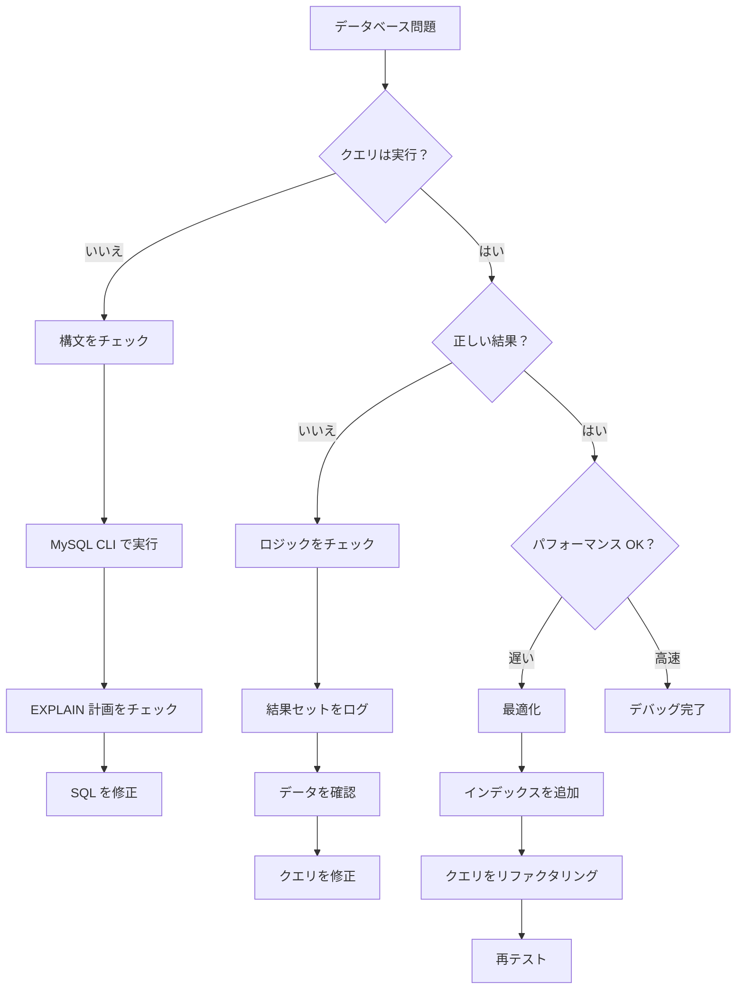
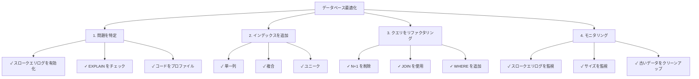

# データベースデバッグテクニック

> XOOPSアプリケーションの SQL クエリとデータベース問題をデバッグするための方法とツール。

---

## 診断フローチャート



---

## クエリログを有効化

### 方法 1：XOOPS デバッグモード

```php
<?php
// mainfile.php 内
define('XOOPS_DEBUG_LEVEL', 2);

// これですべてのクエリが xoops_log テーブルに表示
// またはファイル：xoops_data/logs/
?>
```

結果を確認：
```bash
# ログを表示
tail -100 xoops_data/logs/*.log

# またはデータベースをクエリ
SELECT * FROM xoops_log ORDER BY created DESC LIMIT 20;
```

---

### 方法 2：MySQL スロークエリログ

`/etc/mysql/my.cnf` で有効化：

```ini
[mysqld]
# スロークエリログを有効化
slow_query_log = 1
slow_query_log_file = /var/log/mysql/slow.log
long_query_time = 1          # 1秒を超えるクエリをログ
log_queries_not_using_indexes = 1
```

MySQL を再起動：
```bash
sudo systemctl restart mysql
# または
sudo systemctl restart mariadb
```

ログを表示：
```bash
tail -100 /var/log/mysql/slow.log

# または mysqldumpslow で分析
mysqldumpslow -s t -t 10 /var/log/mysql/slow.log
```

---

### 方法 3：一般クエリログ

すべてのクエリを有効化（注意：大きなログファイル）：

```sql
-- 有効化
SET GLOBAL general_log = 'ON';
SET GLOBAL log_output = 'FILE';
SET GLOBAL general_log_file = '/var/log/mysql/general.log';

-- 無効化
SET GLOBAL general_log = 'OFF';

-- 表示
SHOW VARIABLES LIKE 'general_log%';
```

---

## コード内で SQL をデバッグ

### クエリ実行をログ

```php
<?php
require_once 'mainfile.php';

$ray = ray();  // Ray デバッガを使用している場合

// クエリを実行
$query = "SELECT u.uid, u.uname, COUNT(a.id) as total_articles
          FROM xoops_users u
          LEFT JOIN xoops_articles a ON u.uid = a.author_id
          GROUP BY u.uid
          ORDER BY total_articles DESC";

$ray->label('Query')->info($query);

$result = $GLOBALS['xoopsDB']->query($query);

if (!$result) {
    $ray->error("SQL Error: " . $GLOBALS['xoopsDB']->error);
    exit;
}

// 結果をログ
$data = [];
while ($row = $result->fetch_assoc()) {
    $data[] = $row;
}

$ray->label('Results')->dump($data);
$ray->info("Found " . count($data) . " rows");
?>
```

---

### クエリパフォーマンスを計測

```php
<?php
$db = $GLOBALS['xoopsDB'];
$ray = ray();

// 実行時間を計測
$start = microtime(true);

$query = "SELECT * FROM xoops_articles LIMIT 1000";
$result = $db->query($query);

$exec_time = (microtime(true) - $start) * 1000;  // ミリ秒

$ray->info("Query executed in: {$exec_time}ms");

// 遅いクエリをログ
if ($exec_time > 100) {  // 100ms より上の場合にアラート
    $ray->warning("Slow query detected: {$exec_time}ms");
    $ray->info($query);
}
?>
```

---

### クエリ結果を確認

```php
<?php
$db = $GLOBALS['xoopsDB'];
$ray = ray();

$query = "SELECT * FROM xoops_articles WHERE author_id = 5";
$result = $db->query($query);

// クエリが成功したかを確認
if (!$result) {
    $ray->error("Query failed: " . $db->error);
    exit;
}

// 行数を取得
$count = $result->num_rows;
$ray->info("Query returned: $count rows");

// 結果を取得
$articles = [];
while ($row = $result->fetch_assoc()) {
    $articles[] = $row;
}

// データを確認
if (empty($articles)) {
    $ray->warning("No articles found for author 5");
} else {
    $ray->success("Found " . count($articles) . " articles");
    $ray->dump($articles);
}
?>
```

---

## クエリパフォーマンスを分析

### EXPLAIN コマンド

EXPLAIN を使用してクエリ実行を分析：

```sql
-- クエリを分析
EXPLAIN SELECT * FROM xoops_articles WHERE author_id = 5;

-- 拡張情報付き
EXPLAIN EXTENDED SELECT * FROM xoops_articles WHERE author_id = 5;

-- JSON 形式（詳細情報を表示）
EXPLAIN FORMAT=JSON SELECT * FROM xoops_articles WHERE author_id = 5\G
```

**チェックするキーフィールド：**

```
type: ALL           （悪い）- フルテーブルスキャン
      INDEX         （OK）- インデックススキャン
      ref/const     （良い）- 直接インデックスルックアップ
      range         （OK）- インデックスを使用した範囲スキャン

possible_keys:      利用可能なインデックス
key:                実際に使用されたインデックス
key_len:            使用されたインデックスの長さ
rows:               推定検査行数
Extra:              追加情報（Using where、Using index など）
```

### 例：分析

```sql
-- インデックスなしの遅いクエリ
EXPLAIN SELECT * FROM xoops_articles WHERE author_id = 5;

+----+-------------+----------+------+---------------+------+---------+------+-------+-------------+
| id | select_type | table    | type | possible_keys | key  | key_len | rows | Extra |
+----+-------------+----------+------+---------------+------+---------+------+-------+-------------+
|  1 | SIMPLE      | articles | ALL  | NULL          | NULL | NULL    | 1000 | Using where |
+----+-------------+----------+------+---------------+------+-------+------+-------+-------------+
                                      ↑
                          インデックスが利用できません！

-- インデックスを追加した後
ALTER TABLE xoops_articles ADD INDEX (author_id);

EXPLAIN SELECT * FROM xoops_articles WHERE author_id = 5;

+----+-------------+----------+------+---------------+-----------+---------+-------+------+
| id | select_type | table    | type | possible_keys | key       | key_len | rows  | Extra|
+----+-------------+----------+------+---------------+-----------+---------+-------+------+
|  1 | SIMPLE      | articles | ref  | author_id     | author_id | 4       | 10    |
+----+-------------+----------+------+---------------+-----------+---------+-------+------+
                                                              ↑
                                      インデックスを使用 - はるかに高速！
```

---

## 一般的な SQL 問題

### 1. N+1 クエリ問題

**問題：**
```php
<?php
// 誤り：ループ内で複数のクエリ
$authors = $db->query("SELECT uid FROM xoops_users LIMIT 100");
while ($author = $authors->fetch_assoc()) {
    // これは100回実行！
    $articles = $db->query(
        "SELECT COUNT(*) FROM xoops_articles WHERE author_id = " . $author['uid']
    );
    echo $articles->fetch_row()[0];
}
?>
```

**解決策：JOIN を使用**
```php
<?php
// 正しい：1つのクエリ
$result = $db->query("
    SELECT u.uid, u.uname, COUNT(a.id) as total
    FROM xoops_users u
    LEFT JOIN xoops_articles a ON u.uid = a.author_id
    GROUP BY u.uid
    LIMIT 100
");

while ($row = $result->fetch_assoc()) {
    echo $row['total'];
}
?>
```

---

### 2. インデックスが見つかりません

**特定：**
```sql
-- すべての行をスキャンするクエリを見つけて
SELECT * FROM xoops_log
WHERE info LIKE '%type: ALL%'
ORDER BY created DESC;
```

**インデックスを追加：**
```sql
-- 単一列インデックス
ALTER TABLE xoops_articles ADD INDEX (author_id);
ALTER TABLE xoops_articles ADD INDEX (created);

-- 複合インデックス
ALTER TABLE xoops_articles ADD INDEX (author_id, created);

-- ユニークインデックス
ALTER TABLE xoops_articles ADD UNIQUE INDEX (slug);
```

---

### 3. 非効率な WHERE 条件

**問題：**
```sql
-- 誤り：関数はインデックスを使用できません
SELECT * FROM xoops_articles
WHERE YEAR(created) = 2024;

-- 誤り：異なる列の OR
SELECT * FROM xoops_articles
WHERE category = 'tech' OR author_id = 5;
```

**解決策：**
```sql
-- 正しい：範囲を使用
SELECT * FROM xoops_articles
WHERE created >= '2024-01-01' AND created < '2025-01-01';

-- 正しい：異なる列に UNION を使用
SELECT * FROM xoops_articles WHERE category = 'tech'
UNION
SELECT * FROM xoops_articles WHERE author_id = 5;
```

---

## 特定の問題をデバッグ

### 問題：クエリが間違った結果を返す

```php
<?php
$ray = ray();

// サンプルデータでテスト
$author_id = 5;
$ray->info("Searching for author_id = $author_id");

$query = "SELECT * FROM xoops_articles WHERE author_id = ?";
$stmt = $db->prepare($query);
$stmt->bind_param("i", $author_id);
$stmt->execute();

$result = $stmt->get_result();
$count = $result->num_rows;

$ray->info("Found: $count articles");

// パラメータ化クエリが助けになるかをチェック
if ($count == 0) {
    // パラメータなしでテストしてデバッグ
    $debug_query = "SELECT * FROM xoops_articles WHERE author_id = $author_id";
    $ray->warning("Debug query: $debug_query");
}

// 最初の結果をダンプ
if ($row = $result->fetch_assoc()) {
    $ray->label('First Result')->dump($row);
}
?>
```

---

### 問題：遅い JOIN クエリ

```php
<?php
$ray = ray();

$query = "
    SELECT a.id, a.title, u.uname, u.email
    FROM xoops_articles a
    LEFT JOIN xoops_users u ON a.author_id = u.uid
    WHERE a.status = 1
    ORDER BY a.created DESC
    LIMIT 50
";

$ray->info("Running join query");
$ray->measure(function() use ($query) {
    $result = $GLOBALS['xoopsDB']->query($query);
    return $result;
});

// EXPLAIN で分析
$ray->label('Query Analysis')->info($query);
?>
```

EXPLAIN を実行：
```sql
EXPLAIN SELECT a.id, a.title, u.uname, u.email
FROM xoops_articles a
LEFT JOIN xoops_users u ON a.author_id = u.uid
WHERE a.status = 1
ORDER BY a.created DESC
LIMIT 50\G

-- 探すもの：
-- - type: ALL （インデックスが必要）
-- - Extra: Using temporary; Using filesort （非効率）
-- 修正：複合インデックスを追加
ALTER TABLE xoops_articles ADD INDEX (status, created);
```

---

## デバッグクエリログを作成

```php
<?php
// modules/yourmodule/QueryLogger.php を作成

class QueryLogger {
    private static $queries = [];
    private static $times = [];

    public static function log($query) {
        self::$queries[] = $query;
        self::$times[] = microtime(true);
    }

    public static function execute($query) {
        $start = microtime(true);
        $result = $GLOBALS['xoopsDB']->query($query);
        $time = (microtime(true) - $start) * 1000;

        self::log($query);
        self::$times[count(self::$times) - 1] = $time;

        return $result;
    }

    public static function report() {
        echo "<h1>クエリレポート</h1>";
        echo "<table>";
        echo "<tr><th>Query</th><th>Time (ms)</th></tr>";

        foreach (self::$queries as $i => $query) {
            $time = self::$times[$i] ?? 0;
            echo "<tr>";
            echo "<td><pre>" . htmlspecialchars(substr($query, 0, 100)) . "</pre></td>";
            echo "<td>" . number_format($time, 2) . "</td>";
            echo "</tr>";
        }

        echo "</table>";
    }

    public static function getTotalQueries() {
        return count(self::$queries);
    }

    public static function getTotalTime() {
        return array_sum(self::$times);
    }
}
?>
```

使用：
```php
<?php
require_once 'QueryLogger.php';

$result = QueryLogger::execute("SELECT * FROM xoops_articles");

// 後で...
echo "Total queries: " . QueryLogger::getTotalQueries();
echo "Total time: " . QueryLogger::getTotalTime() . "ms";
QueryLogger::report();
?>
```

---

## データベース最適化チェックリスト



---

## 便利な MySQL クエリ

```sql
-- 遅いテーブルを見つけ
SELECT * FROM xoops_log
WHERE info LIKE '%type: ALL%'
ORDER BY created DESC LIMIT 20;

-- すべてのインデックスを表示
SHOW INDEX FROM xoops_articles;

-- 重複インデックスを見つけ
SELECT a.table_name, a.index_name, a.seq_in_index, a.column_name
FROM information_schema.statistics a
JOIN information_schema.statistics b
  ON a.table_name = b.table_name
  AND a.seq_in_index = b.seq_in_index
  AND a.column_name = b.column_name
  AND a.index_name != b.index_name
WHERE a.table_name LIKE 'xoops_%';

-- テーブルサイズ
SELECT table_name,
       ROUND(((data_length + index_length) / 1024 / 1024), 2) AS size_mb
FROM information_schema.tables
WHERE table_schema = 'xoops_db'
ORDER BY size_mb DESC;

-- 使用されていないインデックスを見つけ
SELECT * FROM performance_schema.table_io_waits_summary_by_index_usage
WHERE object_schema != 'mysql'
AND count_star = 0
ORDER BY object_name;
```

---

## 関連ドキュメント

- デバッグモードを有効化
- Ray デバッガの使用
- パフォーマンス FAQ
- データベース基礎

---

#xoops #database #debugging #sql #optimization #mysql
