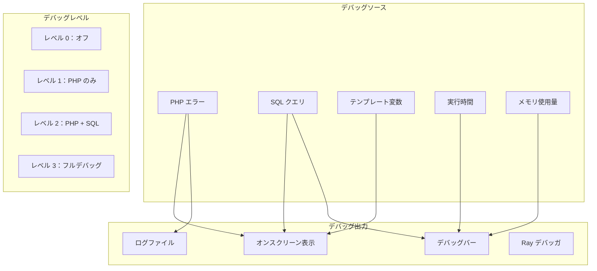
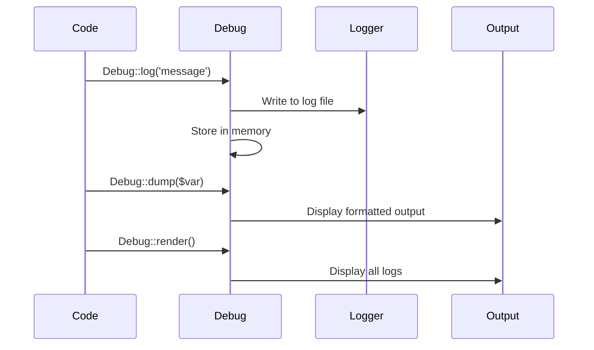

> XOOPSデバッグ機能とツールの包括的なガイド。

---

## デバッグアーキテクチャ



---

## XOOPS デバッグレベル

### mainfile.php で有効化

```php
<?php
// デバッグレベル設定
define('XOOPS_DEBUG_LEVEL', 2);

// レベル 0：デバッグオフ（本番環境）
// レベル 1：PHP デバッグのみ
// レベル 2：PHP + SQL クエリ
// レベル 3：PHP + SQL + Smarty テンプレート
```

### レベルの詳細

| レベル | PHP エラー | SQL クエリ | テンプレート変数 | 推奨用途 |
|-------|------------|-------------|---------------|---------|
| 0 | 非表示 | いいえ | いいえ | 本番環境 |
| 1 | 表示 | いいえ | いいえ | クイックチェック |
| 2 | 表示 | ログ | いいえ | 開発環境 |
| 3 | 表示 | ログ | 表示 | 詳細デバッグ |

---

## PHP エラー表示

### 開発設定

```php
// 開発時に mainfile.php に追加
error_reporting(E_ALL);
ini_set('display_errors', '1');
ini_set('display_startup_errors', '1');
ini_set('log_errors', '1');
ini_set('error_log', XOOPS_VAR_PATH . '/logs/php_errors.log');
```

### 本番環境の設定

```php
// 本番環境のセキュアな設定
error_reporting(E_ALL & ~E_NOTICE & ~E_DEPRECATED);
ini_set('display_errors', '0');
ini_set('log_errors', '1');
ini_set('error_log', XOOPS_VAR_PATH . '/logs/php_errors.log');
```

---

## SQL クエリデバッグ

### デバッグモードでクエリを表示

`XOOPS_DEBUG_LEVEL` を 2 以上に設定すると、SQL クエリはページ下部に表示されます。

### 手動クエリログ

```php
// 特定のクエリをログ
$sql = "SELECT * FROM " . $GLOBALS['xoopsDB']->prefix('mymodule_items');

// 実行する前に
error_log("SQL Query: " . $sql);

$result = $GLOBALS['xoopsDB']->query($sql);

// クエリ時間をログ
$start = microtime(true);
$result = $GLOBALS['xoopsDB']->query($sql);
$time = microtime(true) - $start;
error_log("Query took: " . number_format($time * 1000, 2) . "ms");
```

### XoopsLogger を使用

```php
// ロガーにアクセス
$logger = $GLOBALS['xoopsLogger'];

// すべてのクエリを取得
$queries = $logger->queries;
foreach ($queries as $query) {
    echo "SQL: " . $query['sql'] . "\n";
    echo "Time: " . $query['time'] . "s\n";
    echo "---\n";
}

// カスタムメッセージをログ
$logger->addExtra('My Debug', 'Custom debug message');
```

---

## Smarty テンプレートデバッグ

### Smarty デバッグコンソールを有効化

```php
// モジュールまたはテンプレートで
{debug}

// または PHP で
$GLOBALS['xoopsTpl']->debugging = true;
$GLOBALS['xoopsTpl']->debugging_ctrl = 'URL';  // URL に SMARTY_DEBUG を追加
```

### 割り当てられた変数を表示

```smarty
{* テンプレート内、すべての割り当てられた変数を表示 *}
<pre>
{$smarty.template_object->tpl_vars|print_r}
</pre>

{* 特定の変数を表示 *}
{$myvar|@debug_print_var}
```

### PHP でデバッグ

```php
// テンプレートを表示する前に
echo "<pre>";
print_r($GLOBALS['xoopsTpl']->getTemplateVars());
echo "</pre>";
```

---

## Ray デバッガ統合

### インストール

```bash
composer require spatie/ray
```

### 設定

```php
// XOOPS ルートの ray.php
return [
    'enable' => true,
    'host' => 'localhost',
    'port' => 23517,
    'remote_path' => null,
    'local_path' => null,
];
```

### 使用例

```php
// 基本出力
ray('Hello from XOOPS');

// 変数の検査
ray($item)->label('Item Object');

// 展開表示
ray($complexArray)->expand();

// 実行時間を計測
ray()->measure();
// ... 計測するコード ...
ray()->measure();

// SQL クエリ
ray()->showQueries();

// 色分け
ray('Error occurred')->red();
ray('Success!')->green();
ray('Warning')->orange();

// スタックトレース
ray()->trace();

// 実行を一時停止（ブレークポイント）
ray()->pause();
```

### データベースクエリをデバッグ

```php
// すべてのクエリをログ
ray()->showQueries();

// または特定のクエリ
$sql = "SELECT * FROM items WHERE status = 'active'";
ray($sql)->label('Query');

$result = $db->query($sql);
ray($result)->label('Result');
```

---

## PHP デバッグバー

### インストール

```bash
composer require maximebf/debugbar
```

### 統合

```php
<?php
// include/debugbar.php

use DebugBar\StandardDebugBar;

$debugbar = new StandardDebugBar();
$debugbarRenderer = $debugbar->getJavascriptRenderer();

// ヘッダーに追加
echo $debugbarRenderer->renderHead();

// メッセージをログ
$debugbar['messages']->addMessage('Hello World!');

// 例外をログ
$debugbar['exceptions']->addException(new Exception('Test'));

// 操作を計測
$debugbar['time']->startMeasure('operation', 'My Operation');
// ... コード ...
$debugbar['time']->stopMeasure('operation');

// フッターに追加
echo $debugbarRenderer->render();
```

---

## カスタムデバッグヘルパー

```php
<?php
// class/Debug.php

namespace XoopsModules\MyModule;

class Debug
{
    private static bool $enabled = true;
    private static array $logs = [];
    private static float $startTime;

    public static function init(): void
    {
        self::$startTime = microtime(true);
        self::$enabled = (defined('XOOPS_DEBUG_LEVEL') && XOOPS_DEBUG_LEVEL > 0);
    }

    public static function log(string $message, string $level = 'info'): void
    {
        if (!self::$enabled) return;

        self::$logs[] = [
            'time' => microtime(true) - self::$startTime,
            'level' => $level,
            'message' => $message,
            'memory' => memory_get_usage(true)
        ];

        // ファイルにも書き込み
        $logFile = XOOPS_VAR_PATH . '/logs/debug_' . date('Y-m-d') . '.log';
        $logMessage = sprintf(
            "[%s] [%s] [%.4fs] [%s MB] %s\n",
            date('H:i:s'),
            strtoupper($level),
            microtime(true) - self::$startTime,
            round(memory_get_usage(true) / 1024 / 1024, 2),
            $message
        );
        error_log($logMessage, 3, $logFile);
    }

    public static function dump($var, string $label = ''): void
    {
        if (!self::$enabled) return;

        $output = $label ? "$label: " : '';
        $output .= print_r($var, true);
        self::log($output, 'dump');

        if (php_sapi_name() !== 'cli') {
            echo "<pre style='background:#f5f5f5;padding:10px;margin:10px;border:1px solid #ddd;'>";
            if ($label) echo "<strong>$label:</strong>\n";
            var_dump($var);
            echo "</pre>";
        }
    }

    public static function time(string $label): callable
    {
        $start = microtime(true);
        return function() use ($start, $label) {
            $elapsed = microtime(true) - $start;
            self::log("$label: " . number_format($elapsed * 1000, 2) . "ms", 'timing');
        };
    }

    public static function render(): string
    {
        if (!self::$enabled || empty(self::$logs)) return '';

        $html = '<div style="background:#333;color:#fff;padding:20px;margin:20px;font-family:monospace;font-size:12px;">';
        $html .= '<h3 style="margin-top:0;">デバッグログ</h3>';
        $html .= '<table style="width:100%;border-collapse:collapse;">';

        foreach (self::$logs as $log) {
            $color = match($log['level']) {
                'error' => '#ff6b6b',
                'warning' => '#ffd93d',
                'dump' => '#6bcb77',
                'timing' => '#4d96ff',
                default => '#fff'
            };

            $html .= sprintf(
                '<tr style="border-bottom:1px solid #555;">
                    <td style="padding:5px;width:80px;">%.4fs</td>
                    <td style="padding:5px;width:80px;color:%s">%s</td>
                    <td style="padding:5px;">%s</td>
                    <td style="padding:5px;width:100px;">%s MB</td>
                </tr>',
                $log['time'],
                $color,
                strtoupper($log['level']),
                htmlspecialchars($log['message']),
                round($log['memory'] / 1024 / 1024, 2)
            );
        }

        $html .= '</table></div>';
        return $html;
    }
}

// 使用法
Debug::init();
Debug::log('Page started');
$timer = Debug::time('Database query');
// ... クエリ ...
$timer();
Debug::dump($result, 'Query Result');
echo Debug::render();
```

---

## デバッグ出力フロー



---

## 関連ドキュメント

- ホワイトスクリーン
- Ray デバッガの使用
- セキュリティベストプラクティス

---

#xoops #debugging #troubleshooting #development #logging
