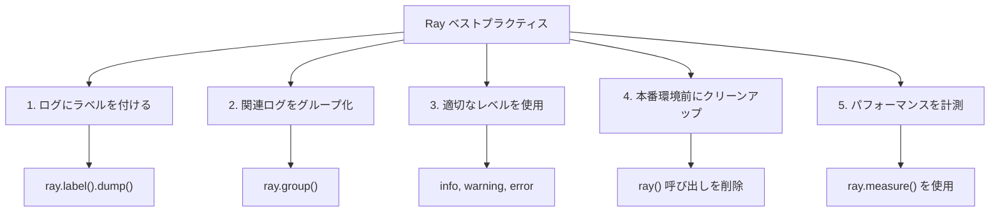

# XOOPS での Ray デバッガの使用

> Modern debugging with Ray: 変数を検査し、メッセージをログし、SQL クエリを追跡し、パフォーマンスをプロファイルしてください。

---

## Ray とは

Ray は、実行を停止したり、ブレークポイントを使用したりせずに、アプリケーション状態を検査できる軽量デバッグツールです。XOOPS 開発に最適です。

**機能：**
- メッセージと変数をログ
- SQL クエリを検査
- パフォーマンスを追跡
- コードをプロファイル
- 関連ログをグループ化
- 視覚的なタイムライン

**要件：**
- PHP 7.4+
- Ray アプリケーション（無料版が利用可能）
- Composer

---

## インストール

### ステップ 1：Ray パッケージをインストール

```bash
cd /path/to/xoops

# Composer 経由で Ray をインストール
composer require spatie/ray

# またはグローバルにインストール
composer global require spatie/ray
```

### ステップ 2：Ray アプリをダウンロード

[ray.so](https://ray.so) からダウンロード：
- Mac: Ray.app
- Windows: Ray.exe
- Linux: ray (AppImage)

### ステップ 3：ファイアウォール設定（必要な場合）

Ray はデフォルトでポート 23517 を使用：

```bash
# UFW
sudo ufw allow 23517/udp

# iptables
sudo iptables -A INPUT -p udp --dport 23517 -j ACCEPT
```

---

## 基本的な使用法

### シンプルなログ

```php
<?php
require_once 'mainfile.php';
require 'vendor/autoload.php';

// Ray を初期化
$ray = ray();

// シンプルなメッセージをログ
$ray->info('Page loaded');

// 変数をログ
$user = ['name' => 'John', 'email' => 'john@example.com'];
$ray->dump($user);

// ラベル付きでログ
$ray->label('User Data')->dump($user);
?>
```

**Ray アプリの出力：**
```
ℹ Page loaded
👁 User Data: ['name' => 'John', 'email' => 'john@example.com']
```

---

### 異なるログレベル

```php
<?php
$ray = ray();

// 情報
$ray->info('Informational message');

// 成功
$ray->success('Operation completed');

// 警告
$ray->warning('Potential issue');

// エラー
$ray->error('An error occurred');

// デバッグ
$ray->debug('Debug information');

// 注意
$ray->notice('Notice message');
?>
```

---

### 変数をダンプ

```php
<?php
$ray = ray();

// シンプルなダンプ
$ray->dump($variable);

// 複数のダンプ
$ray->dump($var1, $var2, $var3);

// ラベル付き
$ray->label('User')->dump($user);
$ray->label('Post')->dump($post);

// フォーマット付き配列をダンプ
$config = [
    'debug' => true,
    'cache' => 'redis',
    'db_host' => 'localhost'
];
$ray->label('Configuration')->dump($config);
?>
```

---

## 高度な機能

### SQL クエリを追跡

```php
<?php
$ray = ray();

// データベースクエリをログ
$ray->notice('Running query');
$result = $GLOBALS['xoopsDB']->query("SELECT * FROM xoops_users LIMIT 10");

// 結果をログ
while ($row = $result->fetch_assoc()) {
    $ray->dump($row);
}

// またはラベル付きでログ
$query = "SELECT COUNT(*) as total FROM xoops_articles";
$ray->label('Article Count Query')->info($query);
$result = $GLOBALS['xoopsDB']->query($query);
?>
```

### パフォーマンスをプロファイル

```php
<?php
$ray = ray();

// プロファイルを開始
$ray->showQueries();  // すべてのクエリを表示

// コード
$start = microtime(true);
expensive_operation();
$end = microtime(true);

$ray->label('Execution Time')->info(($end - $start) . ' seconds');

// または直接計測
$ray->measure(function() {
    expensive_operation();
});
?>
```

---

## XOOPS 固有のデバッグ

### モジュールデバッグ

```php
<?php
// modules/mymodule/index.php
require_once '../../mainfile.php';
require_once XOOPS_ROOT_PATH . '/vendor/autoload.php';

$ray = ray();

// モジュール初期化をログ
$ray->group('Module Initialization');
    $ray->info('Module: ' . XOOPS_MODULE_NAME);

    // モジュールがアクティブであることを確認
    if (is_object($xoopsModule)) {
        $ray->success('Module loaded');
        $ray->dump($xoopsModule->getValues());
    }

    // ユーザーパーミッションをチェック
    if (xoops_isUser()) {
        $ray->info('User: ' . $xoopsUser->getVar('uname'));
    } else {
        $ray->warning('Anonymous user');
    }
$ray->groupEnd();

// モジュール設定を取得
$config_handler = xoops_getHandler('config');
$module = xoops_getHandler('module')->getByDirname(XOOPS_MODULE_NAME);
$settings = $config_handler->getConfigsByCat(0, $module->mid());

$ray->label('Module Settings')->dump($settings);
?>
```

### テンプレートデバッグ

```php
<?php
// テンプレートまたは PHP コード
$ray = ray();

// 割り当てられた変数をログ
$tpl = new XoopsTpl();
$ray->label('Template Variables')->dump($tpl->get_template_vars());

// 特定の変数をログ
$ray->label('User Variable')->dump($tpl->get_template_vars('user'));

// Smarty エンジンの状態をログ
$ray->label('Smarty Config')->dump([
    'compile_dir' => $tpl->getCompileDir(),
    'cache_dir' => $tpl->getCacheDir(),
    'debugging' => $tpl->debugging
]);
?>
```

---

## カスタム Ray 関数

### ヘルパー関数を作成

```php
<?php
// class/rayhelper.php を作成

class RayHelper {
    public static function init() {
        return ray();
    }

    public static function module($module_name) {
        $ray = ray();
        $module = xoops_getHandler('module')->getByDirname($module_name);

        if (!$module) {
            $ray->error("Module '$module_name' not found");
            return;
        }

        $ray->group("Module: $module_name");
        $ray->dump([
            'name' => $module->getVar('name'),
            'version' => $module->getVar('version'),
            'active' => $module->getVar('isactive'),
            'mid' => $module->getVar('mid')
        ]);
        $ray->groupEnd();
    }

    public static function user() {
        global $xoopsUser;
        $ray = ray();

        if (!$xoopsUser) {
            $ray->info('Anonymous user');
            return;
        }

        $ray->group('User Information');
        $ray->dump([
            'uname' => $xoopsUser->getVar('uname'),
            'uid' => $xoopsUser->getVar('uid'),
            'email' => $xoopsUser->getVar('email'),
            'admin' => $xoopsUser->isAdmin()
        ]);
        $ray->groupEnd();
    }

    public static function config($module_name) {
        $ray = ray();

        $module = xoops_getHandler('module')->getByDirname($module_name);
        if (!$module) {
            $ray->error("Module '$module_name' not found");
            return;
        }

        $config_handler = xoops_getHandler('config');
        $settings = $config_handler->getConfigsByCat(0, $module->mid());

        $ray->label("$module_name Configuration")->dump($settings);
    }
}
?>
```

使用：
```php
<?php
require 'class/rayhelper.php';

RayHelper::user();
RayHelper::module('mymodule');
RayHelper::config('mymodule');
?>
```

---

## ベストプラクティス



### クリーンアップスクリプト

```php
<?php
// 本番環境から Ray を削除

function remove_ray_calls($file) {
    $content = file_get_contents($file);

    // ray() 呼び出しを削除
    $content = preg_replace('/\$ray\s*=\s*ray\(\);/', '', $content);
    $content = preg_replace('/\$?ray\->[a-zA-Z_][a-zA-Z0-9_]*\([^)]*\);?/', '', $content);
    $content = preg_replace('/ray\(\)->[a-zA-Z_][a-zA-Z0-9_]*\([^)]*\);?/', '', $content);

    file_put_contents($file, $content);
}

// ray() を含むすべての PHP ファイルを見つけて削除
$files = glob('modules/**/*.php', GLOB_RECURSIVE);
foreach ($files as $file) {
    if (strpos(file_get_contents($file), 'ray()') !== false) {
        remove_ray_calls($file);
        echo "Cleaned: $file\n";
    }
}
?>
```

---

## トラブルシューティング

### Q：Ray がメッセージを受け取りません

**A：**
1. Ray アプリが実行されていることを確認
2. ファイアウォールがポート 23517 を許可していることを確認
3. Ray がインストールされていることを確認：
```bash
composer require spatie/ray
```

### Q：SQL クエリが見えません

**A：**
```php
<?php
// クエリを手動でログ
$ray = ray();

$query = "SELECT * FROM xoops_users";
$ray->info("Query: $query");

$result = $GLOBALS['xoopsDB']->query($query);

if (!$result) {
    $ray->error($GLOBALS['xoopsDB']->error);
}
?>
```

### Q：Ray のパフォーマンス影響

**A：** Ray には最小限のオーバーヘッドがあります。本番環境では Ray 呼び出しを削除するか、無効化：
```php
<?php
// 本番環境では Ray を無効化
if (defined('ENVIRONMENT') && ENVIRONMENT == 'production') {
    function ray(...$args) {
        return new class {
            public function __call($name, $args) { return $this; }
        };
    }
}
?>
```

---

## 関連ドキュメント

- デバッグモードを有効化
- データベースデバッグ
- パフォーマンス FAQ
- トラブルシューティングガイド

---

#xoops #debugging #ray #profiling #monitoring
