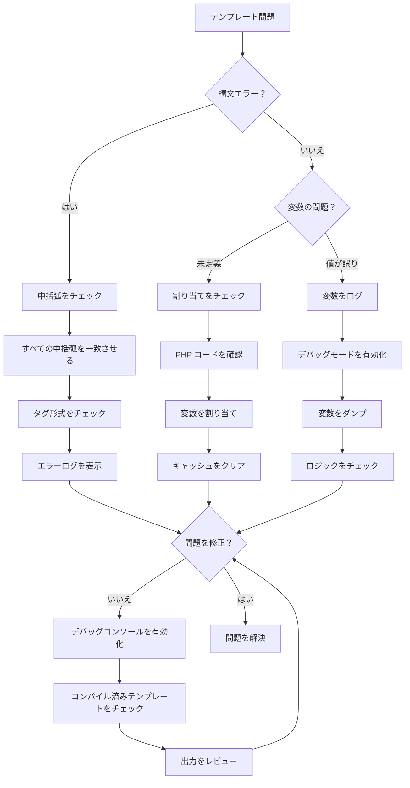
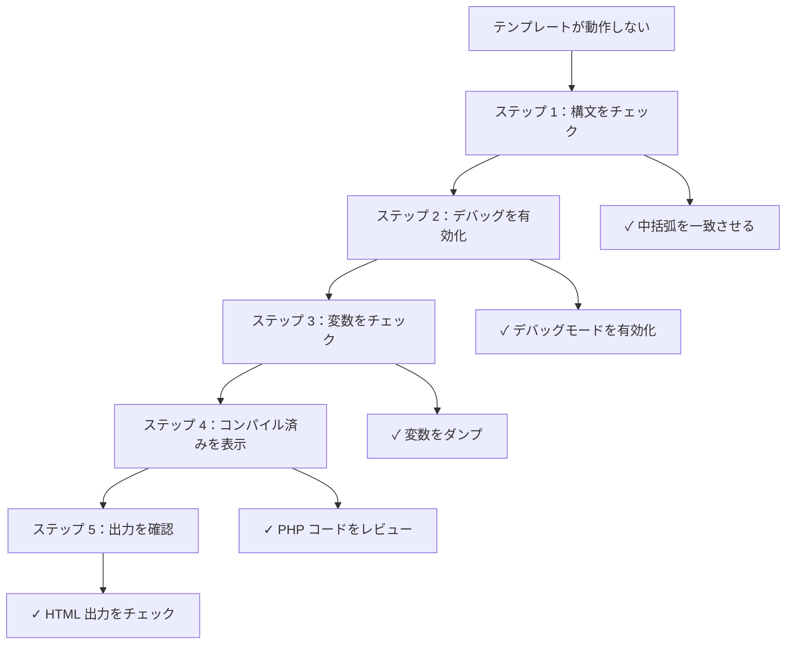

> XOOPSのテーマとモジュールで Smarty テンプレートをデバッグするための高度なテクニック。

---

## 診断フローチャート



---

## Smarty デバッグモードを有効化

### 方法 1：管理パネル

XOOPS 管理 > 設定 > パフォーマンス：
- 「デバッグ出力」を有効化
- 「デバッグレベル」を 2 に設定

---

### 方法 2：コード設定

```php
<?php
// mainfile.php またはモジュールコード
require_once XOOPS_ROOT_PATH . '/class/smarty/Smarty.class.php';

$tpl = new XoopsTpl();

// デバッグモードを有効化
$tpl->debugging = true;

// オプション：カスタムデバッグテンプレートを設定
$tpl->debug_tpl = XOOPS_ROOT_PATH . '/class/smarty/debug.tpl';

// テンプレートを表示
$tpl->display('file:template.html');
?>
```

---

### 方法 3：ブラウザのデバッグポップアップ

```smarty
{* テンプレートに追加してデバッグをフッターで有効化 *}
{debug}
```

これはすべての割り当てられた変数を含むポップアップを表示します。

---

## 一般的な Smarty デバッグテクニック

### すべての変数をダンプ

```php
<?php
// PHP コード
$tpl = new XoopsTpl();

// すべての割り当てられた変数を取得
$variables = $tpl->get_template_vars();

echo "<pre>";
print_r($variables);
echo "</pre>";
?>
```

テンプレート内：
```smarty
{* デバッグ情報を表示 *}
<div style="border: 1px red solid; background: #ffffcc; padding: 10px;">
    <h3>デバッグ情報</h3>
    {debug}
</div>
```

---

### 特定の変数をログ

```php
<?php
$tpl = new XoopsTpl();

// 変数が存在するかをチェック
$user = $tpl->get_template_var('user');

if ($user === null) {
    error_log("Variable 'user' not assigned to template");
} else {
    error_log("User data: " . json_encode($user));
}
?>
```

---

### テンプレートで変数をチェック

```smarty
{* デバッグ用に変数をダンプ *}
<pre>
{$variable|print_r}
</pre>

{* または ラベル付き *}
<pre>
ユーザーデータ：
{$user|print_r}
</pre>

{* 変数が存在するかをチェック *}
{if isset($user)}
    <p>ユーザー：{$user.name}</p>
{else}
    <p style="color: red;">エラー：user 変数が設定されていません</p>
{/if}
```

---

## コンパイル済みテンプレートを表示

Smarty はパフォーマンス用にテンプレートを PHP にコンパイルします。コンパイル済みコードを表示してデバッグ：

```bash
# コンパイル済みテンプレートを見つけ
ls -la xoops_data/caches/smarty_compile/

# コンパイル済みテンプレートを表示
cat xoops_data/caches/smarty_compile/filename.php
```

```php
<?php
// デバッグスクリプトを作成して最新のコンパイル済みテンプレートを表示
$compile_dir = XOOPS_CACHE_PATH . '/smarty_compile';

// 最新のコンパイル済みファイルを取得
$files = glob($compile_dir . '/*.php');
usort($files, function($a, $b) {
    return filemtime($b) - filemtime($a);
});

if ($files) {
    echo "<h1>最新のコンパイル済みテンプレート</h1>";
    echo "<pre>";
    echo htmlspecialchars(file_get_contents($files[0]));
    echo "</pre>";
}
?>
```

---

## テンプレートコンパイルを分析

```php
<?php
// modules/yourmodule/debug_smarty.php を作成

require_once '../../mainfile.php';
require_once XOOPS_ROOT_PATH . '/vendor/autoload.php';

$tpl = new XoopsTpl();
$ray = ray();  // Ray デバッガを使用している場合

$ray->group('Smarty Configuration');

// Smarty パスを取得
$ray->label('Compile Dir')->info($tpl->getCompileDir());
$ray->label('Cache Dir')->info($tpl->getCacheDir());
$ray->label('Template Dirs')->dump($tpl->getTemplateDir());

// コンパイル済みテンプレートをチェック
$compile_dir = $tpl->getCompileDir();
$compiled_files = glob($compile_dir . '*.php');
$ray->label('Compiled Templates')->info(count($compiled_files) . " files");

// コンパイル統計を表示
$total_size = 0;
foreach ($compiled_files as $file) {
    $total_size += filesize($file);
}
$ray->label('Compiled Cache Size')->info(round($total_size / 1024 / 1024, 2) . " MB");

// キャッシュディレクトリをチェック
$cache_dir = $tpl->getCacheDir();
$cache_files = glob($cache_dir . '*.php');
$ray->label('Cached Templates')->info(count($cache_files) . " files");

$ray->groupEnd();
?>
```

---

## 特定の問題をデバッグ

### 問題 1：変数が空で表示

```php
<?php
$tpl = new XoopsTpl();

// 何が割り当てられているかをチェック
$user = $tpl->get_template_var('user');

if ($user === null) {
    error_log("エラー：'user' が割り当てられていません");
} elseif (empty($user)) {
    error_log("警告：'user' が空です");
} else {
    error_log("user data: " . json_encode($user));
}

// またはテンプレートでもチェック
?>
```

テンプレートデバッグ：
```smarty
{if !isset($user)}
    <span style="color: red;">エラー：user 変数が設定されていません</span>
{elseif empty($user)}
    <span style="color: orange;">警告：user が空です</span>
{else}
    <p>ユーザー：{$user.name}</p>
{/if}
```

---

### 問題 2：配列キーが見つかりません

```smarty
{* 安全な配列アクセスを使用 *}

{* 誤り - 未定義インデックス通知を引き起こします *}
{$array.key}

{* 正しい - 最初をチェック *}
{if isset($array.key)}
    {$array.key}
{else}
    <span style="color: red;">配列内で 'key' が見つかりません</span>
{/if}

{* またはデフォルトを使用 *}
{$array.key|default:'key が見つかりません'}
```

PHP でデバッグ：
```php
<?php
$array = $tpl->get_template_var('array');

if (!isset($array['key'])) {
    error_log("配列にキーが見つかりません：" . json_encode(array_keys($array)));
}
?>
```

---

### 問題 3：プラグイン/修飾子が見つかりません

```php
<?php
// カスタム修飾子を作成：plugins/modifier.debug.php

function smarty_modifier_debug($var) {
    return '<pre style="background: #ffffcc; border: 1px solid red;">' .
           htmlspecialchars(json_encode($var, JSON_PRETTY_PRINT)) .
           '</pre>';
}
?>
```

コード内で登録：
```php
<?php
$tpl = new XoopsTpl();
$tpl->addPluginDir(XOOPS_ROOT_PATH . '/modules/yourmodule/plugins');
$tpl->register_modifier('debug', 'smarty_modifier_debug');
?>
```

テンプレートで使用：
```smarty
{$data|debug}
```

---

### 問題 4：ネストされた配列を表示

```smarty
{* ネストされた配列をデバッグ *}
<div style="background: #f5f5f5; padding: 10px; border: 1px solid #ccc;">
    <h3>データデバッグ</h3>
    <pre>{$data|@json_encode}</pre>
</div>

{* または反復処理して表示 *}
<h3>ユーザーデータ：</h3>
{foreach $user as $key => $value}
    <p><strong>{$key}:</strong> {$value|escape}</p>
{/foreach}

{* 特定のキーをチェック *}
<h3>検証：</h3>
<ul>
    <li>Has 'name': {if isset($user.name)}✓{else}✗{/if}</li>
    <li>Has 'email': {if isset($user.email)}✓{else}✗{/if}</li>
    <li>Has 'id': {if isset($user.id)}✓{else}✗{/if}</li>
</ul>
```

---

## デバッグテンプレートを作成

```smarty
{* themes/mytheme/debug.html を作成 *}
{strip}

<div style="background: #fff3cd; border: 2px solid #ff0000; padding: 20px; margin: 20px 0;">
    <h2 style="color: #ff0000;">🔍 SMARTY デバッグモード</h2>

    <h3>割り当てられた変数：</h3>
    <div style="background: white; padding: 10px; border: 1px solid #999; overflow-x: auto; max-height: 400px;">
        {* すべての変数を表示 *}
        {debug output='html'}
    </div>

    <h3>テンプレート情報：</h3>
    <table style="width: 100%; border-collapse: collapse;">
        <tr>
            <td style="border: 1px solid #999; padding: 5px;"><strong>現在のテンプレート：</strong></td>
            <td style="border: 1px solid #999; padding: 5px;">{$smarty.template}</td>
        </tr>
        <tr>
            <td style="border: 1px solid #999; padding: 5px;"><strong>Smarty バージョン：</strong></td>
            <td style="border: 1px solid #999; padding: 5px;">{$smarty.version}</td>
        </tr>
        <tr>
            <td style="border: 1px solid #999; padding: 5px;"><strong>現在時刻：</strong></td>
            <td style="border: 1px solid #999; padding: 5px;">{$smarty.now|date_format:"%Y-%m-%d %H:%M:%S"}</td>
        </tr>
    </table>

    <p style="color: #ff0000;"><strong>⚠️ 本番環境に行く前にこのデバッグコードを削除してください！</strong></p>
</div>

{/strip}
```

---

## パフォーマンスデバッグ

### テンプレート表示を計測

```php
<?php
$start = microtime(true);

$tpl->display('file:template.html');

$render_time = (microtime(true) - $start) * 1000;

error_log("Template rendered in: {$render_time}ms");

if ($render_time > 100) {
    error_log("WARNING: Slow template rendering");
}
?>
```

### キャッシュの効果をチェック

```php
<?php
$compile_dir = XOOPS_CACHE_PATH . '/smarty_compile';
$cache_dir = XOOPS_CACHE_PATH . '/smarty_cache';

// ファイル数
$compiled = count(glob($compile_dir . '*.php'));
$cached = count(glob($cache_dir . '*.php'));

// サイズ
$compile_size = 0;
foreach (glob($compile_dir . '*') as $file) {
    $compile_size += filesize($file);
}

$cache_size = 0;
foreach (glob($cache_dir . '*') as $file) {
    $cache_size += filesize($file);
}

echo "Compiled: $compiled files (" . round($compile_size/1024/1024, 2) . "MB)";
echo "Cached: $cached files (" . round($cache_size/1024/1024, 2) . "MB)";

// ファイルの年齢
$oldest_compile = min(array_map('filemtime', glob($compile_dir . '*')));
$oldest_cache = min(array_map('filemtime', glob($cache_dir . '*')));

echo "Oldest compiled: " . date('Y-m-d H:i:s', $oldest_compile);
echo "Oldest cached: " . date('Y-m-d H:i:s', $oldest_cache);
?>
```

---

## キャッシュをクリアして再構築

```php
<?php
// すべてのテンプレートを強制再構築

$tpl = new XoopsTpl();

// キャッシュをクリア
$tpl->clearCache();
$tpl->clearCompiledTemplate();

// 再コンパイルを強制
$tpl->force_compile = true;

// すべてのモジュールテンプレートをレンダリング
$modules = ['mymodule', 'publisher', 'downloads'];

foreach ($modules as $module) {
    $template = "file:" . XOOPS_ROOT_PATH . "/modules/$module/templates/index.html";

    try {
        $tpl->display($template);
        error_log("Compiled: $module");
    } catch (Exception $e) {
        error_log("Error compiling $module: " . $e->getMessage());
    }
}

// 完了後に強制コンパイルを無効化
$tpl->force_compile = false;
?>
```

---

## デバッグワークフロー

### ステップバイステップなデバッグプロセス



---

## 関連ドキュメント

- デバッグモードを有効化
- テンプレートエラー
- Ray デバッガの使用
- Smarty テンプレート

---

#xoops #templates #smarty #debugging #troubleshooting
