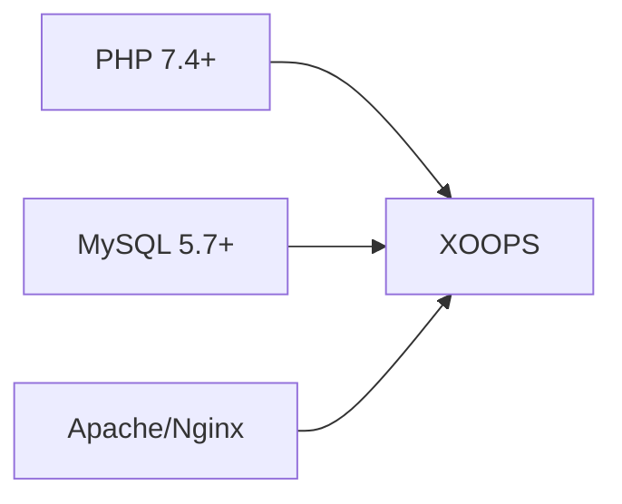
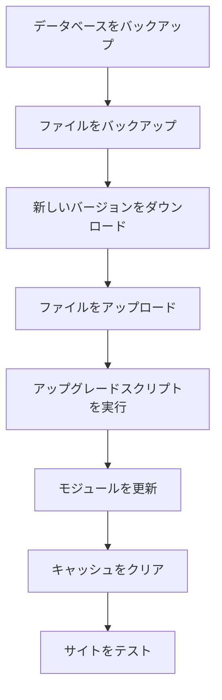

> XOOPS をインストールするためのよくある質問と回答。

---

## インストール前

### Q: 最小サーバー要件は何ですか？

**A:** XOOPS 2.5.x には以下が必要です：
- PHP 7.4 以上（PHP 8.x 推奨）
- MySQL 5.7+ または MariaDB 10.3+
- mod_rewrite 対応の Apache または Nginx
- 最低 64MB PHP メモリ制限（128MB 以上推奨）



### Q: 共有ホスティングで XOOPS をインストールできますか？

**A:** はい、要件を満たすほとんどの共有ホスティングで動作します。ホストが以下を提供していることを確認してください：
- 必要な拡張機能（mysqli、gd、curl、json、mbstring）を備えた PHP
- MySQL データベースへのアクセス
- ファイルアップロード機能
- .htaccess サポート（Apache の場合）

### Q: 必要な PHP 拡張機能は何ですか？

**A:** 必要な拡張機能：
- `mysqli` - データベース接続
- `gd` - 画像処理
- `json` - JSON 処理
- `mbstring` - マルチバイト文字列サポート

推奨：
- `curl` - 外部 API 呼び出し
- `zip` - モジュールのインストール
- `intl` - 国際化

---

## インストールプロセス

### Q: インストールウィザードに空白ページが表示される

**A:** 通常、PHP エラーです。試してください：

1. エラー表示を一時的に有効化：
```php
// htdocs/install/index.php の最上部に追加
error_reporting(E_ALL);
ini_set('display_errors', 1);
```

2. PHP エラーログを確認
3. PHP バージョン互換性を確認
4. すべての必要な拡張機能がロードされていることを確認

### Q: "mainfile.php に書き込めません" というエラーが出ます

**A:** インストール前に書き込みパーミッションを設定：

```bash
chmod 666 mainfile.php
# インストール後、セキュアにする：
chmod 444 mainfile.php
```

### Q: データベーステーブルが作成されない

**A:** 確認事項：

1. MySQL ユーザーに CREATE TABLE 権限がある：
```sql
GRANT ALL PRIVILEGES ON xoopsdb.* TO 'xoopsuser'@'localhost';
FLUSH PRIVILEGES;
```

2. データベースが存在する：
```sql
CREATE DATABASE xoopsdb CHARACTER SET utf8mb4 COLLATE utf8mb4_unicode_ci;
```

3. ウィザード内の認証情報がデータベース設定と一致している

### Q: インストールは完了しましたが、サイトにエラーが表示される

**A:** よくあるインストール後の修正：

1. インストールディレクトリを削除または名前変更：
```bash
mv htdocs/install htdocs/install.bak
```

2. 適切なパーミッションを設定：
```bash
chmod -R 755 htdocs/
chmod -R 777 xoops_data/
chmod 444 mainfile.php
```

3. キャッシュをクリア：
```bash
rm -rf xoops_data/caches/smarty_cache/*
rm -rf xoops_data/caches/smarty_compile/*
```

---

## 設定

### Q: 設定ファイルはどこですか？

**A:** メイン設定は XOOPS ルートの `mainfile.php` にあります。主要な設定：

```php
define('XOOPS_ROOT_PATH', '/path/to/htdocs');
define('XOOPS_VAR_PATH', '/path/to/xoops_data');
define('XOOPS_URL', 'https://yoursite.com');
define('XOOPS_DB_HOST', 'localhost');
define('XOOPS_DB_USER', 'username');
define('XOOPS_DB_PASS', 'password');
define('XOOPS_DB_NAME', 'database');
define('XOOPS_DB_PREFIX', 'xoops');
```

### Q: サイトの URL を変更するには？

**A:** `mainfile.php` を編集：

```php
define('XOOPS_URL', 'https://newdomain.com');
```

その後、キャッシュをクリアして、データベース内のハードコードされた URL を更新します。

### Q: XOOPS を別のディレクトリに移動するには？

**A:**

1. ファイルを新しい場所に移動
2. `mainfile.php` のパスを更新：
```php
define('XOOPS_ROOT_PATH', '/new/path/to/htdocs');
define('XOOPS_VAR_PATH', '/new/path/to/xoops_data');
```
3. 必要に応じてデータベースを更新
4. すべてのキャッシュをクリア

---

## アップグレード

### Q: XOOPS をアップグレードするには？

**A:**



1. **すべてをバックアップ** （データベース + ファイル）
2. 新しい XOOPS バージョンをダウンロード
3. ファイルをアップロード（`mainfile.php` は上書きしない）
4. 提供されている場合は `htdocs/upgrade/` を実行
5. 管理パネルからモジュールを更新
6. すべてのキャッシュをクリア
7. 徹底的にテスト

### Q: アップグレード時にバージョンをスキップできますか？

**A:** 通常はいいえ。データベースマイグレーションが正しく実行されるように、メジャーバージョンを順序立てて段階的にアップグレードしてください。具体的なガイダンスについては、リリースノートを確認してください。

### Q: モジュールがアップグレード後に動作しなくなった

**A:**

1. モジュールが新しい XOOPS バージョンと互換性があるか確認
2. モジュールを最新版に更新
3. テンプレートを再生成：管理者 → システム → メンテナンス → テンプレート
4. すべてのキャッシュをクリア
5. PHP エラーログで具体的なエラーを確認

---

## トラブルシューティング

### Q: 管理パスワードを忘れた

**A:** データベース経由でリセット：

```sql
-- 新しいパスワードハッシュを生成
UPDATE xoops_users
SET pass = MD5('newpassword')
WHERE uname = 'admin';
```

または、メール設定済みの場合はパスワード リセット機能を使用します。

### Q: インストール後、サイトが非常に遅い

**A:**

1. 管理者 → システム → 環境設定 でキャッシングを有効化
2. データベースを最適化：
```sql
OPTIMIZE TABLE xoops_session;
OPTIMIZE TABLE xoops_online;
```
3. デバッグモードでスロークエリを確認
4. PHP OpCache を有効化

### Q: 画像/CSS が読み込まれない

**A:**

1. ファイルパーミッションを確認（ファイルは 644、ディレクトリは 755）
2. `mainfile.php` の `XOOPS_URL` が正しいことを確認
3. .htaccess の書き換えの競合を確認
4. ブラウザコンソールで 404 エラーを確認

---

## 関連ドキュメント

- インストールガイド
- 基本設定
- ホワイトスクリーン

---

#xoops #faq #installation #troubleshooting
