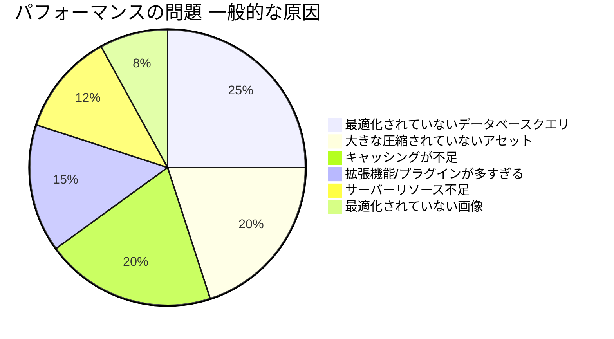
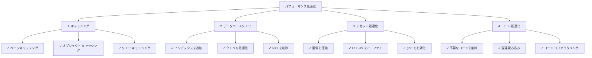
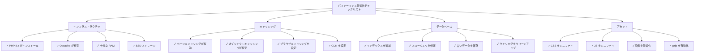

# パフォーマンス よくある質問

> XOOPS パフォーマンス最適化とスローサイトの診断についてのよくある質問と回答。

---

## 一般的なパフォーマンス

### Q: XOOPS サイトが遅いかどうかを判断するには？

**A:** これらのツールとメトリクスを使用：

1. **ページロード時間**:
```bash
# curl を使用して応答時間を計測
curl -w "@curl-format.txt" -o /dev/null -s https://yoursite.com

# またはオンラインツール
# - PageSpeed Insights（Google）
# - GTmetrix
# - WebPageTest
```

2. **ターゲットメトリクス**:
- First Contentful Paint（FCP）: < 1.8秒
- Largest Contentful Paint（LCP）: < 2.5秒
- Time to First Byte（TTFB）: < 0.6秒
- ページ合計サイズ: < 2-3 MB

3. **サーバーログを確認**:
```bash
# Apache
tail -100 /var/log/apache2/access.log

# Nginx
tail -100 /var/log/nginx/access.log

# スロー リクエストを探す（> 1 秒）
```

---

### Q: 最も一般的なパフォーマンスの問題は何ですか？

**A:**


---

### Q: 最適化をどこに集中させるべきですか？

**A:** 最適化の優先順位に従う：



---

## キャッシング

### Q: XOOPS でキャッシングを有効化するには？

**A:** XOOPS にはビルトインキャッシングがあります。管理者 > 設定 > パフォーマンス で設定：

```php
<?php
// mainfile.php または管理画面でキャッシュ設定を確認
// 一般的なキャッシュタイプ：
// 1. file - ファイルベースのキャッシュ（デフォルト）
// 2. memcache - Memcached（インストール済みの場合）
// 3. redis - Redis（インストール済みの場合）

// コード内でキャッシュを使用：
$cache = xoops_cache_handler::getInstance();

// キャッシュから読み込み
$data = $cache->read('cache_key');

if ($data === false) {
    // キャッシュにない場合、ソースから取得
    $data = expensive_operation();

    // キャッシュに書き込み（3600 = 1 時間）
    $cache->write('cache_key', $data, 3600);
}
?>
```

---

### Q: どのタイプのキャッシングを使用すべきですか？

**A:**
- **ファイル キャッシュ**: デフォルト、シンプル、セットアップ不要。小規模サイトに最適。
- **Memcache**: より高速、メモリベース。トラフィック多いサイトに最適。
- **Redis**: 最も強力、より多くのデータタイプをサポート。スケーリングに最適。

インストールと有効化：
```bash
# Memcached をインストール
sudo apt-get install memcached php-memcached

# または Redis をインストール
sudo apt-get install redis-server php-redis

# PHP-FPM または Apache を再起動
sudo systemctl restart php-fpm
sudo systemctl restart apache2
```

その後、XOOPS 管理で有効化します。

---

### Q: XOOPS キャッシュをクリアするには？

**A:**
```bash
# すべてのキャッシュをクリア
rm -rf xoops_data/caches/*

# Smarty キャッシュを具体的にクリア
rm -rf xoops_data/caches/smarty_cache/*
rm -rf xoops_data/caches/smarty_compile/*

# または管理パネル
管理者 > システム > メンテナンス > キャッシュをクリア に移動
```

コード内：
```php
<?php
$cache = xoops_cache_handler::getInstance();
$cache->deleteAll();

// または特定のキーをクリア
$cache->delete('cache_key');
?>
```

---

### Q: データをどのくらいの期間キャッシュすべきですか？

**A:** データの鮮度要件に応じて：

```php
<?php
// 5 分 - 頻繁に変更するデータ
$cache->write('key', $data, 300);

// 1 時間 - 半静的データ
$cache->write('key', $data, 3600);

// 24 時間 - 静的データ、画像など
$cache->write('key', $data, 86400);

// 有効期限なし（手動クリアまで）
$cache->write('key', $data, 0);

// 現在のリクエスト中のみキャッシュ
$cache->write('key', $data, 1);
?>
```

---

## データベース最適化

### Q: スロー データベースクエリを見つけるには？

**A:** クエリログを有効化：

```php
<?php
// mainfile.php 内
define('XOOPS_DB_DEBUGMODE', true);
define('XOOPS_SQL_DEBUG', true);

// その後 xoops_log テーブルを確認
SELECT * FROM xoops_log WHERE logid > SOME_NUMBER
ORDER BY created DESC LIMIT 20;
?>
```

または MySQL スロークエリログを使用：
```bash
# /etc/mysql/my.cnf で有効化
[mysqld]
slow_query_log = 1
slow_query_log_file = /var/log/mysql/slow.log
long_query_time = 1  # 1 秒を超えるクエリをログ

# スロークエリを表示
tail -100 /var/log/mysql/slow.log
```

---

### Q: データベースクエリを最適化するには？

**A:** これらの手順に従う：

**1. データベース インデックスを追加**
```sql
-- よく検索される列にインデックスを追加
ALTER TABLE `xoops_articles` ADD INDEX `author_id` (`author_id`);
ALTER TABLE `xoops_articles` ADD INDEX `created` (`created`);

-- インデックスが役立つか確認
ANALYZE TABLE `xoops_articles`;
EXPLAIN SELECT * FROM xoops_articles WHERE author_id = 5;
```

**2. LIMIT とページネーションを使用**
```php
<?php
// 誤り - すべてのレコードを取得
$result = $db->query("SELECT * FROM xoops_articles");

// 正しい - オフセットから 10 レコードを取得
$limit = 10;
$offset = 0;  // ページネーションで変更
$result = $db->query(
    "SELECT * FROM xoops_articles LIMIT $limit OFFSET $offset"
);
?>
```

**3. 必要な列のみを選択**
```php
<?php
// 誤り
$result = $db->query("SELECT * FROM xoops_articles");

// 正しい
$result = $db->query(
    "SELECT id, title, author_id, created FROM xoops_articles"
);
?>
```

**4. N+1 クエリを避ける**
```php
<?php
// 誤り - N+1 問題
$articles = $db->query("SELECT * FROM xoops_articles");
while ($article = $articles->fetch_assoc()) {
    // このクエリは記事ごと 1 回実行！
    $author = $db->query(
        "SELECT * FROM xoops_users WHERE uid = " . $article['author_id']
    );
}

// 正しい - JOIN を使用
$result = $db->query("
    SELECT a.*, u.uname, u.email
    FROM xoops_articles a
    JOIN xoops_users u ON a.author_id = u.uid
");

while ($row = $result->fetch_assoc()) {
    echo $row['title'] . " by " . $row['uname'];
}
?>
```

**5. EXPLAIN を使用してクエリを分析**
```sql
EXPLAIN SELECT * FROM xoops_articles WHERE author_id = 5 AND status = 1;

-- 確認項目：
-- - type: ALL（悪い）、INDEX（OK）、const/ref（良い）
-- - possible_keys: 利用可能なインデックスを表示
-- - key: 最適なインデックスを使用
-- - rows: 低い数値になるべき
```

---

### Q: データベースロードを減らすには？

**A:**
1. **クエリ結果をキャッシュ**:
```php
<?php
$cache = xoops_cache_handler::getInstance();
$articles = $cache->read('all_articles');

if ($articles === false) {
    $result = $db->query("SELECT * FROM xoops_articles");
    $articles = $result->fetch_all();
    $cache->write('all_articles', $articles, 3600);
}
?>
```

2. **古いデータを別テーブルに保存**
3. **ログを定期的にクリーンアップ**:
```bash
# 30 日より古いログエントリを削除
DELETE FROM xoops_log WHERE created < NOW() - INTERVAL 30 DAY;
```

4. **クエリキャッシュを有効化**（MySQL）:
```sql
SET GLOBAL query_cache_type = 1;
SET GLOBAL query_cache_size = 268435456;  -- 256 MB
```

---

## アセット最適化

### Q: CSS と JavaScript を最適化するには？

**A:**

**1. ファイルをミニファイ**:
```bash
# オンラインツール
# - cssminifier.com
# - javascript-minifier.com
# - minify.org

# またはコマンドラインツール
sudo apt-get install yui-compressor closure-compiler
yui-compressor file.css -o file.min.css
```

**2. 関連ファイルを結合**:
```html
{* 多くのファイルの代わり *}
<link rel="stylesheet" href="{$xoops_url}/themes/{$xoops_theme}/style1.css">
<link rel="stylesheet" href="{$xoops_url}/themes/{$xoops_theme}/style2.css">
<link rel="stylesheet" href="{$xoops_url}/themes/{$xoops_theme}/style3.css">

{* 1 つに結合 *}
<link rel="stylesheet" href="{$xoops_url}/themes/{$xoops_theme}/style.css">
```

**3. 重要でない JavaScript を遅延読み込み**:
```html
{* 重要な JS - すぐに読み込み *}
<script src="critical.js"></script>

{* 重要でない JS - ページ後に読み込み *}
<script src="analytics.js" defer></script>
<script src="ads.js" async></script>
```

**4. Gzip 圧縮を有効化**（.htaccess）:
```apache
<IfModule mod_deflate.c>
    AddOutputFilterByType DEFLATE text/html
    AddOutputFilterByType DEFLATE text/plain
    AddOutputFilterByType DEFLATE text/xml
    AddOutputFilterByType DEFLATE text/css
    AddOutputFilterByType DEFLATE text/javascript
    AddOutputFilterByType DEFLATE application/javascript
    AddOutputFilterByType DEFLATE application/xml
</IfModule>
```

---

### Q: 画像を最適化するには？

**A:**

**1. 正しい形式を選択**:
- JPG: 写真と複雑な画像
- PNG: グラフィックと透過度のある画像
- WebP: モダンブラウザ、より良い圧縮
- AVIF: 最新、最適な圧縮

**2. 画像を圧縮**:
```bash
# ImageMagick を使用
convert image.jpg -quality 85 image-compressed.jpg

# ImageOptim を使用
imageoptim image.jpg

# オンラインツール
# - imagecompressor.com
# - tinypng.com
```

**3. レスポンシブ画像を提供**:
```html
{* 異なるサイズを提供 *}
<picture>
    <source srcset="image-large.webp" type="image/webp" media="(min-width: 1200px)">
    <source srcset="image-medium.webp" type="image/webp" media="(min-width: 768px)">
    <source srcset="image-small.webp" type="image/webp">
    
</picture>
```

**4. 画像を遅延読み込み**:
```html
{* ネイティブ遅延読み込み *}


{* または JavaScript ライブラリで *}
<script src="https://cdn.jsdelivr.net/npm/lazysizes@5/lazysizes.min.js"></script>

```

---

## サーバー設定

### Q: サーバーパフォーマンスを確認するには？

**A:**

```bash
# CPU とメモリ
top -b -n 1 | head -20
free -h
df -h

# PHP-FPM プロセスを確認
ps aux | grep php-fpm

# Apache/Nginx 接続を確認
netstat -an | grep ESTABLISHED | wc -l

# リアルタイムで監視
watch 'free -h && echo "---" && df -h'
```

---

### Q: XOOPS 用に PHP を最適化するには？

**A:** `/etc/php/8.x/fpm/php.ini` を編集：

```ini
; XOOPS 用に制限を増やす
max_execution_time = 300         ; デフォルト 30 秒
memory_limit = 512M              ; デフォルト 128MB
upload_max_filesize = 100M       ; デフォルト 2MB
post_max_size = 100M             ; デフォルト 8MB

; パフォーマンス用に opcache を有効化
opcache.enable = 1
opcache.memory_consumption = 256
opcache.max_accelerated_files = 20000
opcache.validate_timestamps = 0   ; 本番環境: 0（再起動時に再読み込み）
opcache.revalidate_freq = 0       ; 本番環境: 0 または高い数字

; データベース
default_socket_timeout = 60
mysqli.default_socket = /run/mysqld/mysqld.sock
```

その後 PHP を再起動：
```bash
sudo systemctl restart php8.2-fpm
# または
sudo systemctl restart apache2
```

---

### Q: HTTP/2 と圧縮を有効化するには？

**A:** Apache（.htaccess）:
```apache
# HTTPS を有効化（HTTP/2 に必要）
<IfModule mod_ssl.c>
    Protocols h2 http/1.1
</IfModule>

# 圧縮を有効化
<IfModule mod_deflate.c>
    AddOutputFilterByType DEFLATE text/html text/plain text/css text/javascript application/javascript
</IfModule>

# ブラウザキャッシングを有効化
<IfModule mod_expires.c>
    ExpiresActive On
    ExpiresByType image/jpeg "access plus 1 year"
    ExpiresByType image/png "access plus 1 year"
    ExpiresByType text/css "access plus 1 month"
    ExpiresByType text/javascript "access plus 1 month"
</IfModule>
```

Nginx（nginx.conf）:
```nginx
http {
    # gzip を有効化
    gzip on;
    gzip_types text/plain text/css text/javascript application/json;
    gzip_min_length 1000;

    # HTTP/2 を有効化
    listen 443 ssl http2;

    # ブラウザキャッシング
    expires 1y;
    add_header Cache-Control "public, immutable";
}
```

---

## 監視と診断

### Q: 時間経過に伴い XOOPS パフォーマンスを監視するには？

**A:**

**1. Google Analytics を使用**:
- Core Web Vitals
- ページロード時間
- ユーザー動作

**2. サーバー監視ツールを使用**:
```bash
# Glances（システム監視）をインストール
sudo apt-get install glances
glances

# または New Relic、DataDog など
```

**3. リクエストをログして分析**:
```bash
# 平均応答時間を取得
grep "GET /index.php" /var/log/apache2/access.log | \
  awk '{print $NF}' | \
  sort -n | \
  awk '{sum+=$1; count++} END {print "平均: " sum/count " ms"}'
```

---

### Q: メモリリークを特定するには？

**A:**

```php
<?php
// コード内でメモリ使用量を追跡
$start_memory = memory_get_usage();

// 操作を実行
for ($i = 0; $i < 1000; $i++) {
    $array[] = expensive_operation();
}

$end_memory = memory_get_usage();
$used = ($end_memory - $start_memory) / 1024 / 1024;

if ($used > 50) {  // > 50MB の場合にアラート
    error_log("メモリリークが検出された: " . $used . " MB");
}

// ピークメモリを確認
$peak = memory_get_peak_usage();
echo "ピークメモリ: " . ($peak / 1024 / 1024) . " MB";
?>
```

---

## パフォーマンス チェックリスト



---

## 関連ドキュメント

- データベースデバッグ
- デバッグモードを有効化
- モジュール FAQ
- パフォーマンス最適化

---

#xoops #performance #optimization #faq #troubleshooting #caching
