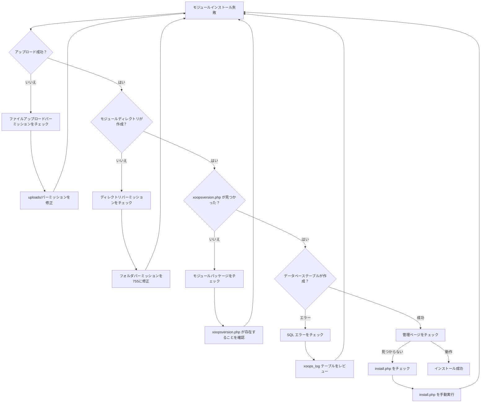
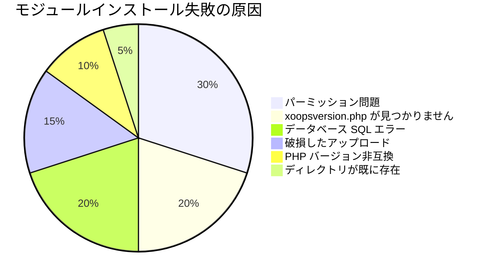
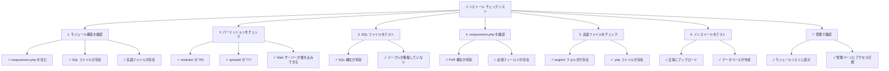

> XOOPSでのモジュールインストール問題を解決するための一般的な問題と解決策。

---

## 診断フローチャート



---

## 一般的な原因と解決策



---

## 1. ファイルアップロードパーミッション拒否

**症状：**
- 「パーミッション拒否」でアップロード失敗
- モジュールフォルダが作成されない
- modules ディレクトリに書き込みができない

**エラーメッセージ：**
```
Warning: move_uploaded_file(): Unable to move file
Permission denied (13)
```

**解決策：**

```bash
# 現在のパーミッションをチェック
ls -ld /path/to/xoops/modules
ls -ld /path/to/xoops/uploads

# モジュールディレクトリのパーミッションを修正
chmod 755 /path/to/xoops/modules

# 一時的なアップロードディレクトリを修正
chmod 777 /path/to/xoops/uploads
chmod 777 /tmp  # 必要な場合

# 所有権を修正（別のユーザーとして実行している場合）
chown -R www-data:www-data /path/to/xoops/modules
chown -R www-data:www-data /path/to/xoops/uploads
```

---

## 2. xoopsversion.php が見つかりません

**症状：**
- モジュールがリストに表示されるがアクティベートできない
- インストールが開始してから停止
- 管理ページが作成されていない

**xoops_log 内のエラー：**
```
Module xoopsversion.php not found
```

**解決策：**

モジュールパッケージ構造を確認：

```bash
# 抽出してモジュールの内容をチェック
unzip module.zip
ls -la mymodule/

# 以下を含む必要があります：
# - xoopsversion.php
# - language/
# - sql/
# - admin/ （オプションだが推奨）
```

**有効な xoopsversion.php の構造：**

```php
<?php
$modversion['name'] = 'My Module';
$modversion['version'] = '1.0.0';
$modversion['description'] = 'Module description';
$modversion['author'] = 'Author Name';
$modversion['author_mail'] = 'author@example.com';
$modversion['author_website_url'] = 'https://example.com';
$modversion['credits'] = 'Credits';
$modversion['license'] = 'GPL 2.0 or later';
$modversion['official'] = 0;
$modversion['image'] = 'images/icon.png';
$modversion['dirname'] = basename(__DIR__);
$modversion['modpath'] = __DIR__;

// コアモジュール情報
$modversion['hasMain'] = 1;
$modversion['hasAdmin'] = 1;
$modversion['hasSearch'] = 0;
$modversion['hasNotification'] = 0;

// データベーステーブル
$modversion['sqlfile']['mysql'] = 'sql/mysql.sql';
$modversion['tables'] = ['table_name'];
```

---

## 3. データベース SQL 実行エラー

**症状：**
- アップロード成功だがデータベーステーブルが作成されない
- 管理ページが読み込まれない
- 「テーブルが存在しません」エラー

**エラーメッセージ：**
```
SQL Error: Table 'xoops_module_table' already exists
Syntax error in SQL statement
```

**解決策：**

### SQL ファイル構文をチェック

```bash
# SQL ファイルを表示
cat modules/mymodule/sql/mysql.sql

# 構文の問題をチェック
# 確認：
# - すべての CREATE TABLE ステートメントが ; で終わる
# - 識別子に対する適切なバッククォート
# - 有効なフィールドタイプ（INT、VARCHAR、TEXT など）
```

**正しい SQL 形式：**

```sql
CREATE TABLE `xoops_module_table` (
  `id` INT(11) NOT NULL AUTO_INCREMENT,
  `name` VARCHAR(255) NOT NULL,
  `description` TEXT,
  `created` INT(11) NOT NULL,
  `updated` INT(11) NOT NULL,
  PRIMARY KEY (`id`)
) ENGINE=InnoDB DEFAULT CHARSET=utf8mb4;
```

### SQL を手動で実行

```php
<?php
// ファイルを作成：modules/mymodule/test_sql.php
require_once '../../mainfile.php';

$sql_file = __DIR__ . '/sql/mysql.sql';
$sql_content = file_get_contents($sql_file);

// ステートメントを分割
$statements = array_filter(array_map('trim', explode(';', $sql_content)));

foreach ($statements as $statement) {
    if (empty($statement)) continue;

    try {
        $GLOBALS['xoopsDB']->query($statement);
        echo "✓ 実行：" . substr($statement, 0, 50) . "...<br>";
    } catch (Exception $e) {
        echo "✗ エラー：" . $e->getMessage() . "<br>";
        echo "ステートメント：" . substr($statement, 0, 100) . "...<br>";
    }
}
?>
```

---

## 4. 破損したモジュールアップロード

**症状：**
- ファイルが部分的にアップロードされた
- ランダムな .php ファイルが見つかりません
- インストール後、モジュールが不安定になる

**解決策：**

```bash
# 新しいコピーを再アップロード
rm -rf /path/to/xoops/modules/mymodule

# チェックサムで確認（提供されている場合）
md5sum -c mymodule.md5

# 抽出前にアーカイブ整合性を確認
unzip -t mymodule.zip

# /tmp に抽出、確認してから移動
unzip -d /tmp mymodule.zip
find /tmp/mymodule -name "*.php" | wc -l
# 予想されるファイル数を表示する必要があります
```

---

## 5. PHP バージョン非互換

**症状：**
- インストールがすぐに失敗
- xoopsversion.php のパースエラー
- 「予期しないトークン」エラー

**エラーメッセージ：**
```
Parse error: syntax error, unexpected 'fn' (T_FN)
```

**解決策：**

```bash
# XOOPS がサポートする PHP バージョンを確認
grep -r "php_require" /path/to/xoops/

# モジュール要件を確認
grep -i "php\|version" modules/mymodule/xoopsversion.php

# サーバーの PHP バージョンを確認
php --version
```

**モジュール互換性をテスト：**

```php
<?php
// modules/mymodule/check_compat.php を作成
$required_php = '7.4.0';
$current_php = PHP_VERSION;

echo "PHP 必須版：$required_php<br>";
echo "現在の PHP：$current_php<br>";

if (version_compare(PHP_VERSION, $required_php, '<')) {
    echo "✗ PHP バージョンが古い<br>";
} else {
    echo "✓ PHP バージョン互換<br>";
}

// 必要な拡張機能をチェック
$required_ext = ['mysqli', 'json', 'mb_string'];
foreach ($required_ext as $ext) {
    echo extension_loaded($ext) ? "✓" : "✗";
    echo " $ext<br>";
}
?>
```

---

## 6. モジュールディレクトリが既に存在

**症状：**
- モジュールディレクトリが存在する場合、インストールが失敗
- モジュールを再インストール、更新できない
- 「ディレクトリが既に存在」エラー

**エラーメッセージ：**
```
The specified directory already exists
```

**解決策：**

```bash
# 既存モジュールをバックアップ
cp -r modules/mymodule modules/mymodule.backup

# 古いインストールを完全に削除
rm -rf modules/mymodule

# モジュール関連のキャッシュをクリア
rm -rf xoops_data/caches/*

# 管理パネルからインストールを再試行
```

---

## 7. 管理ページ生成が失敗

**症状：**
- モジュールがインストールされるが管理ページがない
- 管理パネルにモジュールが表示されない
- モジュール設定にアクセスできない

**解決策：**

```php
<?php
// modules/mymodule/admin/index.php を作成
<?php
/**
 * モジュール管理インデックス
 */

include_once XOOPS_ROOT_PATH . '/kernel/module.php';

if (!is_object($xoopsModule) || !is_object($xoopsUser) || !$xoopsUser->isAdmin($xoopsModule->mid())) {
    exit("Access Denied");
}

// 管理ヘッダーを含む
xoops_cp_header();

// 管理コンテンツを追加
echo "<h1>モジュール管理</h1>";
echo "<p>モジュール管理へようこそ</p>";

// 管理フッターを含む
xoops_cp_footer();
?>
```

---

## 8. 言語ファイルが見つかりません

**症状：**
- モジュールが変数名の代わりにテキストを表示
- 管理ページが「[LANG_CONSTANT]」スタイルのテキストを表示
- インストール完了するが、インターフェースが壊れています

**解決策：**

```bash
# 言語ファイル構造を確認
ls -la modules/mymodule/language/

# 以下を含む必要があります：
# english/ （最小限）
#   admin.php
#   index.php
#   modinfo.php
```

**言語ファイルを作成：**

```php
<?php
// modules/mymodule/language/english/index.php
<?php
define('_AM_MYMODULE_INSTALLED', 'Module installed successfully');
define('_AM_MYMODULE_UPDATED', 'Module updated successfully');
define('_AM_MYMODULE_ERROR', 'An error occurred');
?>
```

---

## インストール チェックリスト



---

## デバッグスクリプト

`modules/mymodule/debug_install.php` を作成：

```php
<?php
/**
 * モジュールインストール デバッガ
 * トラブルシューティング後に削除してください！
 */

require_once '../../mainfile.php';

echo "<h1>モジュールインストール デバッグ</h1>";

// 1. ファイル構造をチェック
echo "<h2>1. ファイル構造</h2>";
$required_files = [
    'xoopsversion.php',
    'language/english/modinfo.php',
    'language/english/index.php',
    'language/english/admin.php'
];

foreach ($required_files as $file) {
    $path = __DIR__ . '/' . $file;
    echo file_exists($path) ? "✓" : "✗";
    echo " $file<br>";
}

// 2. xoopsversion.php をチェック
echo "<h2>2. xoopsversion.php コンテンツ</h2>";
$version_file = __DIR__ . '/xoopsversion.php';
if (file_exists($version_file)) {
    $modversion = [];
    include $version_file;
    echo "<pre>";
    echo "Name: " . ($modversion['name'] ?? 'NOT SET') . "\n";
    echo "Version: " . ($modversion['version'] ?? 'NOT SET') . "\n";
    echo "Dirname: " . ($modversion['dirname'] ?? 'NOT SET') . "\n";
    echo "Has SQL: " . (isset($modversion['sqlfile']) ? "YES" : "NO") . "\n";
    echo "Has Tables: " . (isset($modversion['tables']) ? count($modversion['tables']) : 0) . "\n";
    echo "</pre>";
}

// 3. SQL ファイルをチェック
echo "<h2>3. SQL ファイル</h2>";
$sql_file = __DIR__ . '/sql/mysql.sql';
if (file_exists($sql_file)) {
    $content = file_get_contents($sql_file);
    $tables = substr_count($content, 'CREATE TABLE');
    echo "✓ SQL ファイルが存在<br>";
    echo "✓ $tables CREATE TABLE ステートメントを含む<br>";
    echo "<pre>" . htmlspecialchars(substr($content, 0, 300)) . "...</pre>";
} else {
    echo "✗ SQL ファイルが見つかりません<br>";
}

// 4. 言語ファイルをチェック
echo "<h2>4. 言語ファイル</h2>";
$lang_files = [
    'language/english/modinfo.php',
    'language/english/index.php',
    'language/english/admin.php'
];

foreach ($lang_files as $file) {
    $path = __DIR__ . '/' . $file;
    if (file_exists($path)) {
        $size = filesize($path);
        echo "✓ $file ($size bytes)<br>";
    } else {
        echo "✗ $file が見つかりません<br>";
    }
}

// 5. パーミッションをチェック
echo "<h2>5. ディレクトリパーミッション</h2>";
echo "Module dir: " . substr(sprintf('%o', fileperms(__DIR__)), -4) . "<br>";

// 6. データベース接続をテスト
echo "<h2>6. データベース接続</h2>";
if (is_object($GLOBALS['xoopsDB'])) {
    echo "✓ データベースに接続<br>";

    // テストテーブルを作成してみる
    $test_sql = "CREATE TEMPORARY TABLE test_install (id INT PRIMARY KEY)";
    if ($GLOBALS['xoopsDB']->query($test_sql)) {
        echo "✓ テーブルを作成できます<br>";
    } else {
        echo "✗ テーブルを作成できません：" . $GLOBALS['xoopsDB']->error . "<br>";
    }
} else {
    echo "✗ データベースに接続されていません<br>";
}

echo "<p><strong>テスト後にこのファイルを削除してください！</strong></p>";
?>
```

---

## 予防とベストプラクティス

1. **常にバックアップ** 新しいモジュールをインストールする前に
2. **ローカルでテスト** 本番環境にデプロイする前に
3. **モジュール構造を確認** アップロードする前に
4. **パーミッションをチェック** アップロード直後に
5. **xoops_log テーブルをレビュー** インストールエラーの場合
6. **バックアップを保持** 機能するモジュールバージョンの

---

## 関連ドキュメント

- デバッグモードを有効化
- モジュール FAQ
- モジュール構造
- データベース接続エラー

---

#xoops #troubleshooting #modules #installation #debugging
