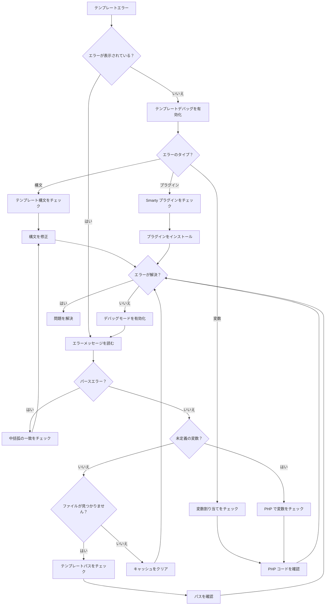
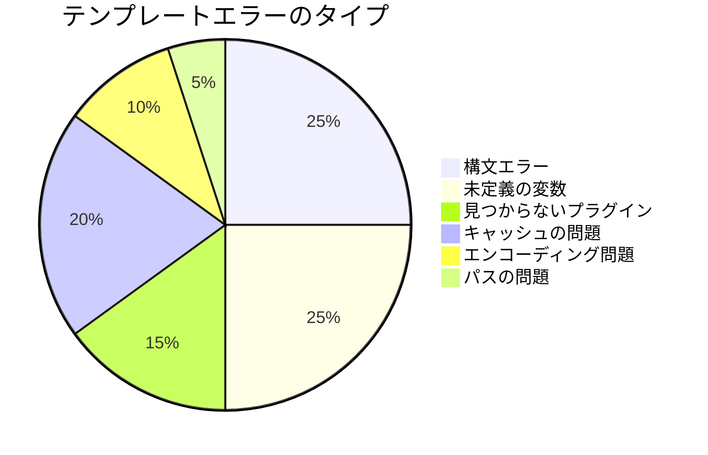

# テンプレートエラー（Smartyデバッグ）

> XOOPSテーマとモジュールの一般的なSmartyテンプレート問題とデバッグテクニック。

---

## 診断フローチャート



---

## 一般的なSmartyテンプレートエラー



---

## 1. 構文エラー

**症状：**
- 「Smarty 構文エラー」メッセージ
- テンプレートがコンパイルされない
- 出力のない空白ページ

**エラーメッセージ：**
```
Syntax error: unrecognized tag 'myfunction'
Unexpected "}" near end of template
```

### 一般的な構文問題

**終了タグが見つかりません：**
```smarty
{* 誤り *}
{if $user}
User: {$user.name}
{* {/if} がありません *}

{* 正しい *}
{if $user}
User: {$user.name}
{/if}
```

**変数構文が誤っています：**
```smarty
{* 誤り *}
{$user->name}          {* . を使用、-> ではなく *}
{$array[key]}          {* キーを引用符で囲む *}
{$func()}              {* 関数を直接呼び出せません *}

{* 正しい *}
{$user.name}
{$array.key}
{$array['key']}
{$user|@function}      {* 修飾子の代わりに使用 *}
```

**引用符が一致していません：**
```smarty
{* 誤り *}
{if $name == 'John}     {* 引用符が一致していません *}
{assign var="user' value="John"}

{* 正しい *}
{if $name == 'John'}
{assign var="user" value="John"}
```

**解決策：**

```smarty
{* 常に中括弧のバランスを取る *}
{if condition}
  ...
{elseif condition}
  ...
{else}
  ...
{/if}

{* タグ形式を確認 *}
{foreach $items as $item}
  ...
{/foreach}

{* すべての変数が定義されていることを確認 *}
{if isset($variable)}
  {$variable}
{/if}
```

---

## 2. 未定義の変数エラー

**症状：**
- 「未定義の変数」警告
- 変数が空として表示
- エラーログの PHP 通知

**エラーメッセージ：**
```
Notice: Undefined variable: myvar
Smarty notice: variable "$user" not available
```

**デバッグスクリプト：**

```php
<?php
// テンプレートファイルまたは PHP コード内
// modules/yourmodule/debug_template.php を作成

require_once '../../mainfile.php';

// テンプレートエンジンを取得
$tpl = new XoopsTpl();

// テンプレートに割り当てられている変数を確認
echo "<h1>テンプレート変数</h1>";
echo "<pre>";
print_r($tpl->get_template_vars());
echo "</pre>";

// または Smarty オブジェクトをダンプ
echo "<h1>Smarty デバッグ</h1>";
echo "<pre>";
$tpl->debug_vars();
echo "</pre>";
?>
```

**PHP で修正：**

```php
<?php
// レンダリング前に変数が割り当てられていることを確認
$xoopsTpl = new XoopsTpl();

// 誤り - 変数が割り当てられていない
$xoopsTpl->display('file:templates/page.html');

// 正しい - 変数を割り当ててからレンダリング
$user = [
    'name' => 'John',
    'email' => 'john@example.com'
];
$xoopsTpl->assign('user', $user);
$xoopsTpl->display('file:templates/page.html');
?>
```

**テンプレート内で修正：**

```smarty
{* 使用する前に変数が存在するかを確認 *}
{if isset($user)}
    <p>User: {$user.name}</p>
{else}
    <p>ユーザーデータがありません</p>
{/if}

{* デフォルト値を使用 *}
<p>Name: {$user.name|default:"No name"}</p>

{* 配列キーが存在するかをチェック *}
{if isset($array.key)}
    {$array.key}
{/if}
```

---

## 3. 見つからないまたは誤った修飾子

**症状：**
- データが正しくフォーマットされない
- テキストが HTML として表示される
- 大文字小文字が正確でない

**エラーメッセージ：**
```
Warning: undefined modifier 'stripslashes'
```

**一般的な修飾子：**

```smarty
{* 文字列操作 *}
{$text|upper}                    {* 大文字 *}
{$text|lower}                    {* 小文字 *}
{$text|capitalize}               {* 最初の文字が大文字 *}
{$text|truncate:20:"..."}        {* 20文字に切り詰め *}
{$text|strip_tags}               {* HTMLタグを削除 *}

{* HTML/フォーマット *}
{$html|escape}                   {* HTML エスケープ *}
{$html|escape:'html'}
{$url|escape:'url'}              {* URL エスケープ *}
{$text|nl2br}                    {* 改行を <br> に *}

{* 配列 *}
{$array|@count}                  {* 配列数 *}
{$array|@implode:', '}           {* 配列を結合 *}

{* デフォルト値 *}
{$var|default:"No value"}

{* 日付フォーマット *}
{$date|date_format:"%Y-%m-%d"}   {* 日付をフォーマット *}

{* 数学操作 *}
{$number|math:'+':10}            {* 数学操作 *}
```

**カスタム修飾子を登録：**

```php
<?php
// モジュール内で登録
$xoopsTpl = new XoopsTpl();
$xoopsTpl->register_modifier('mymodifier', 'my_modifier_function');

function my_modifier_function($string) {
    return strtoupper($string);
}
?>
```

---

## 4. キャッシュの問題

**症状：**
- テンプレートの変更が表示されない
- 古いコンテンツが引き続き表示される
- 古いインクルードまたはリソース

**解決策：**

```bash
# Smarty キャッシュディレクトリをクリア
rm -rf /path/to/xoops/xoops_data/caches/smarty_cache/*
rm -rf /path/to/xoops/xoops_data/caches/smarty_compile/*

# 特定のモジュールキャッシュをクリア
rm -rf /path/to/xoops/xoops_data/caches/smarty_cache/modules/*
```

**コード内でキャッシュをクリア：**

```php
<?php
// すべての Smarty キャッシュをクリア
$xoopsTpl = new XoopsTpl();
$xoopsTpl->clear_cache();
$xoopsTpl->clear_compiled_tpl();

// 特定のテンプレートキャッシュをクリア
$xoopsTpl->clear_cache('file:templates/page.html');

// すべてのキャッシュされたファイルをクリア
require_once XOOPS_ROOT_PATH . '/class/xoopsfile.php';
$dh = opendir(XOOPS_CACHE_PATH . '/smarty_cache');
while (($file = readdir($dh)) !== false) {
    if (is_file(XOOPS_CACHE_PATH . '/smarty_cache/' . $file)) {
        unlink(XOOPS_CACHE_PATH . '/smarty_cache/' . $file);
    }
}
closedir($dh);
?>
```

---

## 5. プラグインが見つかりません

**症状：**
- 「不明な修飾子」または「不明なプラグイン」
- カスタム関数が動作しない
- プラグインでのコンパイルエラー

**エラーメッセージ：**
```
Fatal error: Call to undefined function smarty_modifier_custom
Unknown modifier 'myfunction'
```

**カスタムプラグインを作成：**

```php
<?php
// 作成：modules/yourmodule/plugins/modifier.custom.php

/**
 * Smarty {$var|custom} 修飾子プラグイン
 */
function smarty_modifier_custom($string, $param = '') {
    // カスタムコード
    return strtoupper($string) . $param;
}
?>
```

**プラグインを登録：**

```php
<?php
// モジュールの初期化コード内
$xoopsTpl = new XoopsTpl();

// Smarty にプラグインディレクトリを追加
$xoopsTpl->addPluginDir(
    XOOPS_ROOT_PATH . '/modules/yourmodule/plugins'
);

// または手動で登録
$xoopsTpl->register_modifier(
    'custom',
    'smarty_modifier_custom'
);
?>
```

**プラグインのタイプ：**

```php
<?php
// 修飾子プラグイン：modifier.name.php
function smarty_modifier_name($string) {
    return $string;
}

// ブロックプラグイン：block.name.php
function smarty_block_name($params, $content, &$smarty, &$repeat) {
    if (!isset($smarty->security_settings['IF_FUNCS'])) {
        $smarty->security_settings['IF_FUNCS'] = [];
    }
    return $content;
}

// 関数プラグイン：function.name.php
function smarty_function_name($params, &$smarty) {
    return 'output';
}

// フィルタプラグイン：filter.name.php
function smarty_filter_name($code, &$smarty) {
    return $code;
}
?>
```

---

## 6. テンプレート インクルード/拡張の問題

**症状：**
- 含まれるテンプレートが読み込まれない
- 親テンプレートが見つからない
- CSS/JS が読み込まれない

**エラーメッセージ：**
```
Template file 'file:path/to/template.html' not found
Can't find template file 'header.html'
```

**正しいインクルード構文：**

```smarty
{* テンプレートをインクルード *}
{include file="file:templates/header.html"}

{* 変数でインクルード *}
{include file="file:templates/header.html" title="My Page"}

{* テンプレート継承 *}
{extends file="file:templates/base.html"}

{* 名前付きブロック *}
{block name="content"}
    ページコンテンツ
{/block}

{* 静的リソース *}
<link rel="stylesheet" href="{$xoops_url}/themes/{$xoops_theme}/style.css">
<script src="{$xoops_url}/modules/{$xoops_module_dir}/js/script.js"></script>
```

**テンプレートパスを確認：**

```bash
# テンプレートファイルが存在することを確認
ls -la /path/to/xoops/themes/mytheme/templates/
ls -la /path/to/xoops/modules/mymodule/templates/

# パーミッションをチェック
stat /path/to/xoops/themes/mytheme/templates/header.html
```

---

## 7. 変数配列/オブジェクトアクセス

**症状：**
- 配列値にアクセスできない
- オブジェクトプロパティが表示されない
- 複雑な変数が失敗する

**エラーメッセージ：**
```
Undefined variable: user.profile.name
```

**正しい構文：**

```smarty
{* 配列アクセス *}
{$array.key}                     {* キーに . を使用 *}
{$array['key']}
{$array.0}                       {* 数値インデックス *}
{$array.$variable_key}           {* 動的キー *}

{* ネストされた配列 *}
{$user.profile.name}
{$data.items.0.title}

{* オブジェクトプロパティ *}
{$object.property}
{$object.method|escape}          {* メソッド呼び出し *}

{* isset で安全にアクセス *}
{if isset($array.key)}
    {$array.key}
{/if}

{* 長さを確認 *}
{if count($array) > 0}
    Items found
{/if}
```

---

## 8. 文字エンコーディング問題

**症状：**
- テンプレート内の文字が文字化けしている
- 特殊文字が正しく表示されない
- UTF-8 文字が壊れている

**解決策：**

**テンプレートファイルエンコーディング：**

```smarty
{* メタタグで charset を設定 *}
<meta charset="UTF-8">

{* または HTML ヘッドで *}
<meta http-equiv="Content-Type" content="text/html; charset=utf-8">

{* 適切な PHP 宣言 *}
header('Content-Type: text/html; charset=utf-8');
```

**PHP コード：**

```php
<?php
// 出力エンコーディングを設定
header('Content-Type: text/html; charset=utf-8');

// データベースが UTF-8 を使用していることを確認
$conn = new mysqli('localhost', 'user', 'pass', 'db');
$conn->set_charset('utf8mb4');

// または SQL で
SET NAMES utf8mb4;
SET CHARACTER SET utf8mb4;

// データを適切に割り当て
$text = mb_convert_encoding($text, 'UTF-8', 'UTF-8');
$xoopsTpl->assign('text', $text);
?>
```

---

## デバッグモード設定

**テンプレートデバッグを有効化：**

```php
<?php
// mainfile.php 内
define('XOOPS_DEBUG_LEVEL', 2);

// Smarty 設定
$xoopsTpl->debugging = true;
$xoopsTpl->debug_tpl = SMARTY_DIR . 'debug.tpl';

// またはモジュール内
$tpl = new XoopsTpl();
$tpl->debugging = true;
?>
```

**デバッグコンソール出力：**

```php
<?php
// modules/yourmodule/debug_smarty.php を作成

require_once '../../mainfile.php';
require_once XOOPS_ROOT_PATH . '/class/smarty/Smarty.class.php';

$smarty = new Smarty();
$smarty->debugging = true;

// コンパイル済みテンプレートをチェック
$compiled_dir = $smarty->getCompileDir();
echo "<h1>コンパイル済みテンプレート</h1>";
$files = glob($compiled_dir . '/*.php');
foreach ($files as $file) {
    echo "<p>" . basename($file) . "</p>";
}

// コンパイル済みコードを表示
echo "<h1>コンパイル済みコード</h1>";
echo "<pre>";
$latest = max(array_map('filemtime', $files));
foreach ($files as $file) {
    if (filemtime($file) == $latest) {
        echo htmlspecialchars(file_get_contents($file));
        break;
    }
}
echo "</pre>";
?>
```

---

## テンプレート検証チェックリスト

```mermaid
graph TD
    A[テンプレート検証] --> B["1. 構文チェック"]
    A --> C["2. 変数確認"]
    A --> D["3. プラグインチェック"]
    A --> E["4. ファイルパス"]
    A --> F["5. エンコーディング"]
    A --> G["6. キャッシュ"]

    B --> B1["✓ すべての中括弧が一致"]
    B --> B2["✓ すべてのタグが閉じている"]
    B --> B3["✓ 適切な構文"]

    C --> C1["✓ 変数が割り当てられている"]
    C --> C2["✓ 正しいプロパティアクセス"]
    C --> C3["✓ デフォルト値が設定されている"]

    D --> D1["✓ 修飾子が利用可能"]
    D --> D2["✓ プラグインが登録"]
    D --> D3["✓ カスタム関数が動作"]

    E --> E1["✓ 相対パスが正しい"]
    E --> E2["✓ ファイルが存在"]
    E --> E3["✓ パーミッションが正しい"]

    F --> F1["✓ UTF-8 が宣言"]
    F --> F2["✓ HTML charset が設定"]
    F --> F3["✓ データベース UTF-8"]

    G --> G1["✓ キャッシュをクリア"]
    G --> G2["✓ 新たにコンパイル"]
```



---

## 予防とベストプラクティス

1. **開発中にデバッグを有効化**
2. **デプロイ前にテンプレートを検証**
3. **変更後にキャッシュをクリア**
4. **git を使用してテンプレート変更を追跡**
5. **複数のブラウザでエンコーディング問題をテスト**
6. **カスタムプラグインとフィルタを文書化**
7. **テンプレート継承で一貫性を確保**

---

## 関連ドキュメント

- Smarty デバッグガイド
- Smarty テンプレート
- デバッグモードを有効化
- テーマ FAQ

---

#xoops #troubleshooting #templates #smarty #debugging
