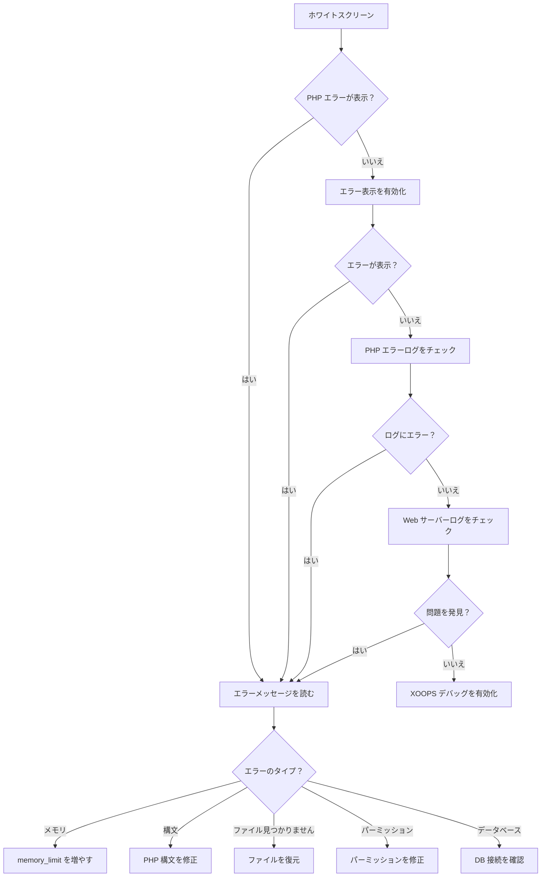
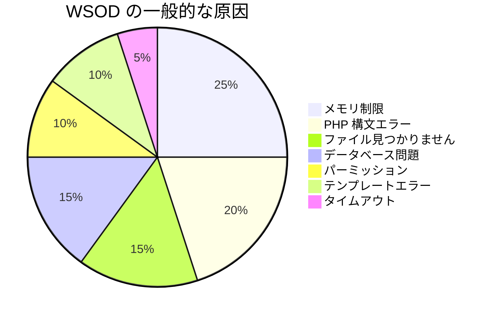
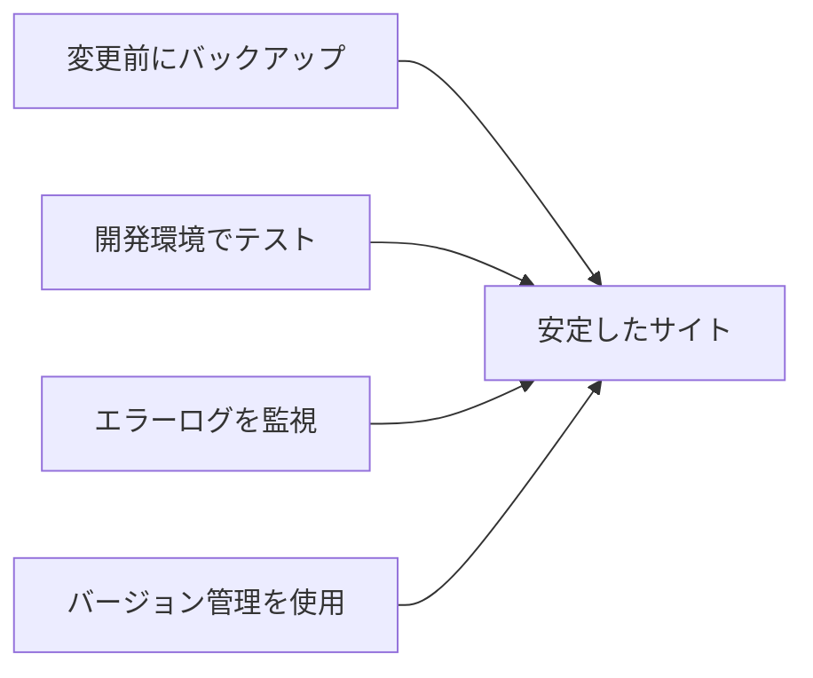

> XOOPSの空白のホワイトページを診断および修正する方法。

---

## 診断フローチャート



---

## クイック診断

### ステップ 1：PHP エラー表示を有効化

`mainfile.php` に一時的に追加：

```php
<?php
// 最初の <?php の直後に追加
error_reporting(E_ALL);
ini_set('display_errors', '1');
ini_set('display_startup_errors', '1');
```

### ステップ 2：PHP エラーログをチェック

```bash
# 一般的なログの場所
tail -100 /var/log/php/error.log
tail -100 /var/log/apache2/error.log
tail -100 /var/log/nginx/error.log

# または PHP 情報でログの場所を確認
php -i | grep error_log
```

### ステップ 3：XOOPS デバッグを有効化

```php
// mainfile.php 内
define('XOOPS_DEBUG_LEVEL', 2);
```

---

## 一般的な原因と解決策



### 1. メモリ制限超過

**症状：**
- 大規模な操作で空白ページ
- 小規模データでは動作、大規模データでは失敗

**エラー：**
```
Fatal error: Allowed memory size of 134217728 bytes exhausted
```

**解決策：**

```php
// mainfile.php 内
ini_set('memory_limit', '256M');

// または .htaccess
php_value memory_limit 256M

// または php.ini
memory_limit = 256M
```

### 2. PHP 構文エラー

**症状：**
- PHP ファイル編集後にWSOU
- 特定のページが失敗、他は動作

**エラー：**
```
Parse error: syntax error, unexpected '}' in /path/file.php on line 123
```

**解決策：**

```bash
# ファイルの構文エラーをチェック
php -l /path/to/file.php

# モジュール内のすべての PHP ファイルをチェック
find modules/mymodule -name "*.php" -exec php -l {} \;
```

### 3. 必要なファイルが見つかりません

**症状：**
- アップロード/移行後にWSOU
- ランダムなページが失敗

**エラー：**
```
Fatal error: require_once(): Failed opening required 'class/Helper.php'
```

**解決策：**

```bash
# 新規インストールと比較
diff -r /path/to/xoops /path/to/fresh-xoops

# ファイルパーミッションを確認
ls -la class/
```

### 4. データベース接続失敗

**症状：**
- すべてのページが WSOU
- 静的ファイル（画像、CSS）は動作

**エラー：**
```
Warning: mysqli_connect(): Access denied for user
```

**解決策：**

```php
// mainfile.php で認証情報を確認
define('XOOPS_DB_HOST', 'localhost');
define('XOOPS_DB_USER', 'your_user');
define('XOOPS_DB_PASS', 'your_password');
define('XOOPS_DB_NAME', 'your_database');

// 接続を手動でテスト
<?php
$conn = new mysqli('localhost', 'user', 'pass', 'database');
if ($conn->connect_error) {
    die("Connection failed: " . $conn->connect_error);
}
echo "Connected successfully";
```

### 5. パーミッション問題

**症状：**
- ファイル書き込み時に WSOU
- キャッシュ/コンパイルエラー

**解決策：**

```bash
# ディレクトリパーミッションを修正
chmod -R 755 htdocs/
chmod -R 777 xoops_data/
chmod -R 777 uploads/

# 所有権を修正
chown -R www-data:www-data /path/to/xoops
```

### 6. Smarty テンプレートエラー

**症状：**
- 特定のページで WSOU
- キャッシュをクリアすると動作

**解決策：**

```bash
# Smarty キャッシュをクリア
rm -rf xoops_data/caches/smarty_cache/*
rm -rf xoops_data/caches/smarty_compile/*

# テンプレート構文を確認
```

### 7. 最大実行時間

**症状：**
- 約30秒後に WSOU
- 長い操作が失敗

**エラー：**
```
Fatal error: Maximum execution time of 30 seconds exceeded
```

**解決策：**

```php
// mainfile.php 内
set_time_limit(300);

// または .htaccess
php_value max_execution_time 300
```

---

## デバッグスクリプト

XOOPS ルートに `debug.php` を作成：

```php
<?php
/**
 * XOOPS デバッグスクリプト
 * トラブルシューティング後に削除してください！
 */

error_reporting(E_ALL);
ini_set('display_errors', '1');

echo "<h1>XOOPS デバッグ</h1>";

// PHP バージョンをチェック
echo "<h2>PHP バージョン</h2>";
echo "PHP " . PHP_VERSION . "<br>";

// 必要な拡張機能をチェック
echo "<h2>必要な拡張機能</h2>";
$required = ['mysqli', 'gd', 'curl', 'json', 'mbstring'];
foreach ($required as $ext) {
    $status = extension_loaded($ext) ? '✓' : '✗';
    echo "$status $ext<br>";
}

// ファイルパーミッションをチェック
echo "<h2>ディレクトリパーミッション</h2>";
$dirs = [
    'xoops_data' => 'xoops_data',
    'uploads' => 'uploads',
    'cache' => 'xoops_data/caches'
];
foreach ($dirs as $name => $path) {
    $writable = is_writable($path) ? '✓ 書き込み可能' : '✗ 書き込み不可';
    echo "$name: $writable<br>";
}

// データベース接続をテスト
echo "<h2>データベース接続</h2>";
if (file_exists('mainfile.php')) {
    // 認証情報を抽出（シンプルな regex、本番環境では安全ではありません）
    $mainfile = file_get_contents('mainfile.php');
    preg_match("/XOOPS_DB_HOST.*'(.+?)'/", $mainfile, $host);
    preg_match("/XOOPS_DB_USER.*'(.+?)'/", $mainfile, $user);
    preg_match("/XOOPS_DB_PASS.*'(.+?)'/", $mainfile, $pass);
    preg_match("/XOOPS_DB_NAME.*'(.+?)'/", $mainfile, $name);

    if (!empty($host[1])) {
        $conn = @new mysqli($host[1], $user[1], $pass[1], $name[1]);
        if ($conn->connect_error) {
            echo "✗ 接続失敗：" . $conn->connect_error;
        } else {
            echo "✓ データベースに接続";
            $conn->close();
        }
    }
} else {
    echo "mainfile.php が見つかりません";
}

// メモリ情報
echo "<h2>メモリ</h2>";
echo "Memory Limit: " . ini_get('memory_limit') . "<br>";
echo "Current Usage: " . round(memory_get_usage() / 1024 / 1024, 2) . " MB<br>";

// エラーログの場所をチェック
echo "<h2>エラーログ</h2>";
echo "Location: " . ini_get('error_log');
```

---

## 予防



1. **常にバックアップ** 変更する前に
2. **ローカルでテスト** デプロイする前に
3. **エラーログを監視** 定期的に
4. **git を使用** 変更を追跡するため
5. **PHP を最新に保つ** サポート対象バージョン内で

---

## 関連ドキュメント

- データベース接続エラー
- パーミッション拒否エラー
- デバッグモードを有効化

---

#xoops #troubleshooting #wsod #debugging #errors
