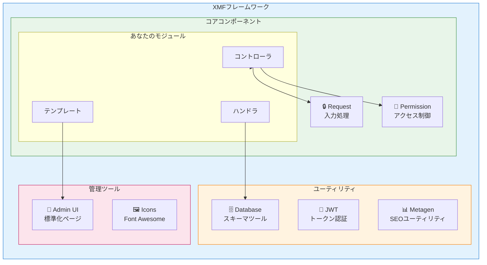
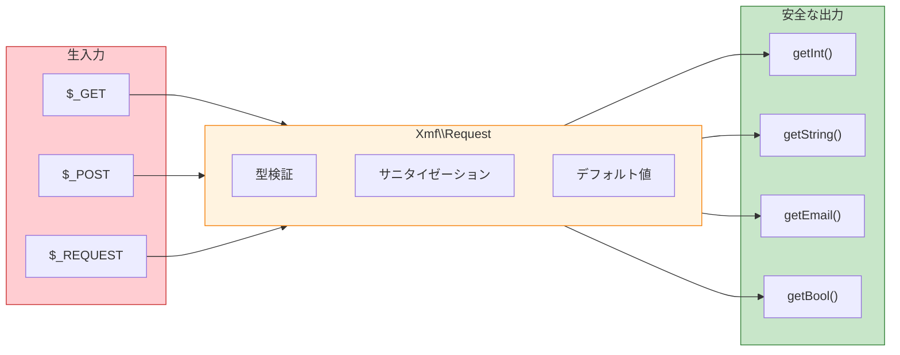

<span class="version-badge version-25x">2.5.x ✅</span> <span class="version-badge version-40x">4.0.x ✅</span>

:::tip[最新のXOOPSへの架け橋]
XMFは**XOOPS 2.5.xとXOOPS 4.0.x の両方で動作**します。今すぐモジュールを最新化しながら、XOOPS 4.0に向けて準備するための推奨される方法です。XMFはPSR-4オートローディング、名前空間、および移行をスムーズにするヘルパーを提供します。
:::

**XOOPS Module Framework (XMF)** は、XOOPS モジュール開発を簡素化および標準化するために設計された強力なライブラリです。XMF は、名前空間、オートロード、および定型的なコードを削減し、保守性を向上させるヘルパークラスの包括的なセットを含む最新のPHP実践をサポートします。

## XMFとは

XMFは以下を提供するクラスおよびユーティリティの集合です:

- **最新のPHPサポート** - PSR-4オートローディング完全対応の名前空間
- **リクエスト処理** - 安全な入力検証とサニタイゼーション
- **モジュールヘルパー** - モジュール設定とオブジェクトへの簡潔なアクセス
- **権限システム** - 使いやすい権限管理
- **データベースユーティリティ** - スキーママイグレーションとテーブル管理ツール
- **JWTサポート** - 安全な認証用のJSON Web Token実装
- **メタデータ生成** - SEOとコンテンツ抽出ユーティリティ
- **管理インターフェース** - 標準化されたモジュール管理ページ

### XMFコンポーネント概要



## 主な機能

### 名前空間とオートロード

すべてのXMFクラスは`Xmf`名前空間に存在します。クラスは参照されたときに自動的にロードされます - 手動で含める必要はありません。

```php
use Xmf\Request;
use Xmf\Module\Helper;

// クラスはよ使用時に自動的にロード
$input = Request::getString('input', '');
$helper = Helper::getHelper('mymodule');
```

### セキュアなリクエスト処理

[Requestクラス](../05-XMF-Framework/Basics/XMF-Request.md) は、組み込みのサニタイゼーション付きHTTPリクエストデータへの型安全なアクセスを提供します:



```php
use Xmf\Request;

$id = Request::getInt('id', 0);
$name = Request::getString('name', '');
$email = Request::getEmail('email', '');
```

### モジュールヘルパーシステム

[モジュールヘルパー](../05-XMF-Framework/Basics/XMF-Module-Helper.md) はモジュール関連機能への便利なアクセスを提供します:

```php
$helper = \Xmf\Module\Helper::getHelper('mymodule');

// モジュール設定にアクセス
$configValue = $helper->getConfig('setting_name', 'default');

// モジュールオブジェクトを取得
$module = $helper->getModule();

// ハンドラにアクセス
$handler = $helper->getHandler('items');
```

### 権限管理

[権限ヘルパー](../05-XMF-Framework/Recipes/Permission-Helper.md) はXOOPS権限処理を簡素化します:

```php
$permHelper = new \Xmf\Module\Helper\Permission();

// ユーザー権限を確認
if ($permHelper->checkPermission('view', $itemId)) {
    // ユーザーは権限を持っている
}
```

## ドキュメント構成

### 基本

- [XMF入門](../05-XMF-Framework/Basics/Getting-Started-with-XMF.md) - インストールと基本的な使用方法
- [XMF-Request](../05-XMF-Framework/Basics/XMF-Request.md) - リクエスト処理と入力検証
- [XMF-Module-Helper](../05-XMF-Framework/Basics/XMF-Module-Helper.md) - モジュールヘルパークラス使用

### レシピ

- [権限ヘルパー](../05-XMF-Framework/Recipes/Permission-Helper.md) - 権限の操作
- [モジュール管理ページ](../05-XMF-Framework/Recipes/Module-Admin-Pages.md) - 標準化された管理インターフェースの作成

### リファレンス

- [JWT](../05-XMF-Framework/Reference/JWT.md) - JSON Web Token実装
- [Database](../05-XMF-Framework/Reference/Database.md) - データベースユーティリティとスキーマ管理
- [Metagen](Reference/Metagen.md) - メタデータとSEOユーティリティ

## 必要条件

- XOOPS 2.5.8以降
- PHP 7.2以降 (PHP 8.x推奨)

## インストール

XMFはXOOPS 2.5.8以降のバージョンに含まれています。以前のバージョンまたは手動インストールの場合:

1. XOOPS リポジトリからXMFパッケージをダウンロード
2. XOOPS `/class/xmf/` ディレクトリに抽出
3. オートローダーがクラスロードを自動的に処理

## クイックスタート例

一般的なXMF使用パターンを示す完全な例を以下に示します:

```php
<?php
use Xmf\Request;
use Xmf\Module\Helper;
use Xmf\Module\Helper\Permission;

// モジュールヘルパーを取得
$helper = Helper::getHelper('mymodule');

// 設定値を読み込む
$itemsPerPage = $helper->getConfig('items_per_page', 10);

// リクエスト入力を処理
$op = Request::getCmd('op', 'list');
$id = Request::getInt('id', 0);

// 権限を確認
$permHelper = new Permission();
if (!$permHelper->checkPermission('view', $id)) {
    redirect_header('index.php', 3, 'アクセスが拒否されました');
}

// 操作に基づいて処理
switch ($op) {
    case 'view':
        $handler = $helper->getHandler('items');
        $item = $handler->get($id);
        // ... アイテムを表示
        break;
    case 'list':
    default:
        // ... アイテムをリスト表示
        break;
}
```

## リソース

- [XMF GitHubリポジトリ](https://github.com/XOOPS/XMF)
- [XOOPSプロジェクトウェブサイト](https://xoops.org)

---

#xmf #xoops #framework #php #module-development
