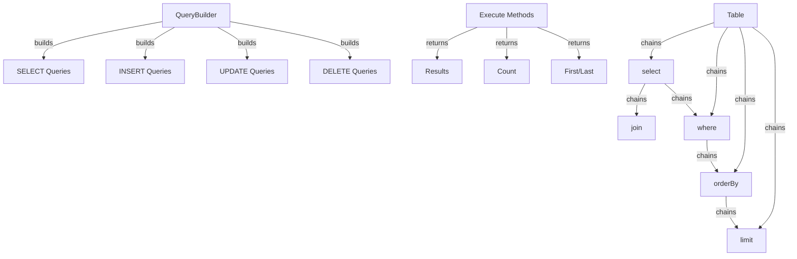

XOOPS 쿼리 빌더는 SQL 쿼리 작성을 위한 현대적이고 유연한 인터페이스를 제공합니다. 이는 SQL 주입을 방지하고, 가독성을 향상시키며, 여러 데이터베이스 시스템에 대한 데이터베이스 추상화를 제공합니다.

## 쿼리 빌더 아키텍처



## 쿼리빌더 클래스

유창한 인터페이스를 갖춘 기본 쿼리 빌더 클래스입니다.

### 클래스 개요

```php
namespace Xoops\Database;

class QueryBuilder
{
    protected string $table = '';
    protected string $type = 'SELECT';
    protected array $selects = [];
    protected array $joins = [];
    protected array $wheres = [];
    protected array $orders = [];
    protected int $limit = 0;
    protected int $offset = 0;
    protected array $bindings = [];
}
```

### 정적 메소드

#### 테이블

테이블에 대한 새 쿼리 빌더를 만듭니다.

```php
public static function table(string $table): QueryBuilder
```

**매개변수:**

| 매개변수 | 유형 | 설명 |
|-----------|------|-------------|
| `$table` | 문자열 | 테이블 이름(접두사 포함 또는 제외) |

**반환:** `QueryBuilder` - 쿼리 빌더 인스턴스

**예:**
```php
$query = QueryBuilder::table('users');
$query = QueryBuilder::table('xoops_users'); // With prefix
```

## 선택 쿼리

### 선택

선택할 열을 지정합니다.

```php
public function select(...$columns): self
```

**매개변수:**

| 매개변수 | 유형 | 설명 |
|-----------|------|-------------|
| `...$columns` | 배열 | 열 이름 또는 표현식 |

**반환:** `self` - 메소드 체이닝의 경우

**예:**
```php
// Simple select
QueryBuilder::table('users')
    ->select('id', 'username', 'email')
    ->get();

// Select with aliases
QueryBuilder::table('users')
    ->select('id as user_id', 'username as name')
    ->get();

// Select all columns
QueryBuilder::table('users')
    ->select('*')
    ->get();

// Select with expressions
QueryBuilder::table('orders')
    ->select('id', 'COUNT(*) as total_items')
    ->groupBy('id')
    ->get();
```

### 어디서

WHERE 조건을 추가합니다.

```php
public function where(string $column, string $operator = '=', mixed $value = null): self
```

**매개변수:**

| 매개변수 | 유형 | 설명 |
|-----------|------|-------------|
| `$column` | 문자열 | 열 이름 |
| `$operator` | 문자열 | 비교 연산자 |
| `$value` | 혼합 | 비교할 값 |

**반환:** `self` - 메소드 체이닝의 경우

**운영자:**

| 운영자 | 설명 | 예 |
|----------|-------------|---------|
| `=` | 같음 | `->where('status', '=', 'active')` |
| `!=` 또는 `<>` | 같지 않음 | `->where('status', '!=', 'deleted')` |
| `>` | 보다 큼 | `->where('price', '>', 100)` |
| `<` | 미만 | `->where('price', '<', 100)` |
| `>=` | 크거나 같음 | `->where('age', '>=', 18)` |
| `<=` | 작거나 같음 | `->where('age', '<=', 65)` |
| `LIKE` | 패턴 일치 | `->where('name', 'LIKE', '%john%')` |
| `IN` | 목록에 | `->where('status', 'IN', ['active', 'pending'])` |
| `NOT IN` | 목록에 없음 | `->where('id', 'NOT IN', [1, 2, 3])` |
| `BETWEEN` | 범위 | `->where('age', 'BETWEEN', [18, 65])` |
| `IS NULL` | null임 | `->where('deleted_at', 'IS NULL')` |
| `IS NOT NULL` | null이 아님 | `->where('deleted_at', 'IS NOT NULL')` |

**예:**
```php
// Single condition
QueryBuilder::table('users')
    ->select('*')
    ->where('status', '=', 'active')
    ->get();

// Multiple conditions (AND)
QueryBuilder::table('users')
    ->select('*')
    ->where('status', '=', 'active')
    ->where('age', '>=', 18)
    ->get();

// IN operator
QueryBuilder::table('products')
    ->select('*')
    ->where('category_id', 'IN', [1, 2, 3])
    ->get();

// LIKE operator
QueryBuilder::table('users')
    ->select('*')
    ->where('email', 'LIKE', '%@example.com')
    ->get();

// NULL check
QueryBuilder::table('users')
    ->select('*')
    ->where('deleted_at', 'IS NULL')
    ->get();
```

### 또는어디

OR 조건을 추가합니다.

```php
public function orWhere(string $column, string $operator = '=', mixed $value = null): self
```

**예:**
```php
QueryBuilder::table('users')
    ->select('*')
    ->where('status', '=', 'active')
    ->orWhere('premium', '=', 1)
    ->get();
    // SELECT * FROM users WHERE status = 'active' OR premium = 1
```

### 어디에 / 어디에 NotIn

IN/NOT IN에 대한 편의 메서드입니다.

```php
public function whereIn(string $column, array $values): self
public function whereNotIn(string $column, array $values): self
```

**예:**
```php
QueryBuilder::table('posts')
    ->select('*')
    ->whereIn('status', ['published', 'scheduled'])
    ->get();

QueryBuilder::table('comments')
    ->select('*')
    ->whereNotIn('spam_score', [8, 9, 10])
    ->get();
```

### whereNull / whereNotNull

NULL 검사를 위한 편리한 방법.

```php
public function whereNull(string $column): self
public function whereNotNull(string $column): self
```

**예:**
```php
QueryBuilder::table('users')
    ->select('*')
    ->whereNotNull('verified_at')
    ->get();
```

### 어디 사이에

값이 두 값 사이에 있는지 확인합니다.

```php
public function whereBetween(string $column, array $values): self
```

**예:**
```php
QueryBuilder::table('products')
    ->select('*')
    ->whereBetween('price', [10, 100])
    ->get();

QueryBuilder::table('orders')
    ->select('*')
    ->whereBetween('created_at', ['2024-01-01', '2024-12-31'])
    ->get();
```

### 가입

INNER JOIN을 추가합니다.

```php
public function join(
    string $table,
    string $first,
    string $operator = '=',
    string $second = null
): self
```

**예:**
```php
QueryBuilder::table('posts')
    ->select('posts.*', 'users.username', 'categories.name')
    ->join('users', 'posts.user_id', '=', 'users.id')
    ->join('categories', 'posts.category_id', '=', 'categories.id')
    ->where('posts.published', '=', 1)
    ->get();
```

### leftJoin / rightJoin

대체 조인 유형.

```php
public function leftJoin(
    string $table,
    string $first,
    string $operator = '=',
    string $second = null
): self

public function rightJoin(
    string $table,
    string $first,
    string $operator = '=',
    string $second = null
): self
```

**예:**
```php
QueryBuilder::table('users')
    ->select('users.*', 'COUNT(posts.id) as post_count')
    ->leftJoin('posts', 'users.id', '=', 'posts.user_id')
    ->groupBy('users.id')
    ->get();
```

### 그룹별

결과를 열별로 그룹화합니다.

```php
public function groupBy(...$columns): self
```

**예:**
```php
QueryBuilder::table('orders')
    ->select('user_id', 'COUNT(*) as order_count', 'SUM(total) as total_spent')
    ->groupBy('user_id')
    ->get();

QueryBuilder::table('sales')
    ->select('department', 'region', 'SUM(amount) as total')
    ->groupBy('department', 'region')
    ->get();
```

### 갖는

HAVING 조건을 추가합니다.

```php
public function having(string $column, string $operator = '=', mixed $value = null): self
```

**예:**
```php
QueryBuilder::table('orders')
    ->select('user_id', 'COUNT(*) as order_count')
    ->groupBy('user_id')
    ->having('order_count', '>', 5)
    ->get();
```

### 주문 기준

주문 결과.

```php
public function orderBy(string $column, string $direction = 'ASC'): self
```

**매개변수:**

| 매개변수 | 유형 | 설명 |
|-----------|------|-------------|
| `$column` | 문자열 | 정렬 기준 |
| `$direction` | 문자열 | `ASC` 또는 `DESC` |

**예:**
```php
// Single order
QueryBuilder::table('users')
    ->select('*')
    ->orderBy('created_at', 'DESC')
    ->get();

// Multiple orders
QueryBuilder::table('posts')
    ->select('*')
    ->orderBy('category_id', 'ASC')
    ->orderBy('created_at', 'DESC')
    ->get();

// Random order
QueryBuilder::table('quotes')
    ->select('*')
    ->orderBy('RAND()')
    ->get();
```

### 한계 / 오프셋

결과를 제한하고 오프셋합니다.

```php
public function limit(int $limit): self
public function offset(int $offset): self
```

**예:**
```php
// Simple limit
QueryBuilder::table('posts')
    ->select('*')
    ->limit(10)
    ->get();

// Pagination
$page = 2;
$perPage = 20;
$offset = ($page - 1) * $perPage;

QueryBuilder::table('posts')
    ->select('*')
    ->limit($perPage)
    ->offset($offset)
    ->get();
```

## 실행 방법

### 얻다

쿼리를 실행하고 모든 결과를 반환합니다.

```php
public function get(): array
```

**반환:** `array` - 결과 행의 배열

**예:**
```php
$users = QueryBuilder::table('users')
    ->select('id', 'username', 'email')
    ->where('status', '=', 'active')
    ->orderBy('username')
    ->get();

foreach ($users as $user) {
    echo $user['username'] . ' (' . $user['email'] . ')' . "\n";
}
```

### 먼저

첫 번째 결과를 가져옵니다.

```php
public function first(): ?array
```

**반환:** `?array` - 첫 번째 행 또는 null

**예:**
```php
$user = QueryBuilder::table('users')
    ->select('*')
    ->where('id', '=', 123)
    ->first();

if ($user) {
    echo 'Found: ' . $user['username'];
}
```

### 마지막

마지막 결과를 가져옵니다.

```php
public function last(): ?array
```

**예:**
```php
$latestPost = QueryBuilder::table('posts')
    ->select('*')
    ->orderBy('created_at', 'DESC')
    ->last();
```

### 개수

결과 개수를 가져옵니다.

```php
public function count(): int
```

**반환:** `int` - 행 수

**예:**
```php
$activeUsers = QueryBuilder::table('users')
    ->where('status', '=', 'active')
    ->count();

echo "Active users: $activeUsers";
```

###이 존재합니다

쿼리가 결과를 반환하는지 확인합니다.

```php
public function exists(): bool
```

**반환:** `bool` - 결과가 존재하면 True입니다.

**예:**
```php
if (QueryBuilder::table('users')->where('email', '=', 'test@example.com')->exists()) {
    echo 'User already exists';
}
```

### 집계

집계 값을 가져옵니다.

```php
public function aggregate(string $function, string $column): mixed
```

**예:**
```php
$maxPrice = QueryBuilder::table('products')
    ->aggregate('MAX', 'price');

$avgAge = QueryBuilder::table('users')
    ->aggregate('AVG', 'age');

$totalSales = QueryBuilder::table('orders')
    ->aggregate('SUM', 'total');
```

## INSERT 쿼리

### 삽입

행을 삽입합니다.

```php
public function insert(array $values): bool
```

**예:**
```php
QueryBuilder::table('users')->insert([
    'username' => 'john',
    'email' => 'john@example.com',
    'password' => password_hash('secret', PASSWORD_BCRYPT),
    'created_at' => date('Y-m-d H:i:s')
]);
```

### insertMany

여러 행을 삽입합니다.

```php
public function insertMany(array $rows): bool
```

**예:**
```php
QueryBuilder::table('log_entries')->insertMany([
    ['action' => 'login', 'user_id' => 1, 'timestamp' => time()],
    ['action' => 'logout', 'user_id' => 2, 'timestamp' => time()],
    ['action' => 'update', 'user_id' => 3, 'timestamp' => time()]
]);
```

## 업데이트 쿼리

### 업데이트

행을 업데이트합니다.

```php
public function update(array $values): int
```

**반환:** `int` - 영향을 받은 행 수

**예:**
```php
// Update single user
QueryBuilder::table('users')
    ->where('id', '=', 123)
    ->update([
        'email' => 'newemail@example.com',
        'updated_at' => date('Y-m-d H:i:s')
    ]);

// Update multiple rows
QueryBuilder::table('posts')
    ->where('status', '=', 'draft')
    ->where('created_at', '<', date('Y-m-d', strtotime('-30 days')))
    ->update([
        'status' => 'archived'
    ]);
```

### 증가/감소

열을 늘리거나 줄입니다.

```php
public function increment(string $column, int $amount = 1): int
public function decrement(string $column, int $amount = 1): int
```

**예:**
```php
// Increment view count
QueryBuilder::table('posts')
    ->where('id', '=', 123)
    ->increment('views');

// Decrement stock
QueryBuilder::table('products')
    ->where('id', '=', 456)
    ->decrement('stock', 5);
```

## 쿼리 삭제

### 삭제

행을 삭제합니다.

```php
public function delete(): int
```

**반환:** `int` - 삭제된 행 수

**예:**
```php
// Delete single record
QueryBuilder::table('comments')
    ->where('id', '=', 789)
    ->delete();

// Delete multiple records
QueryBuilder::table('log_entries')
    ->where('created_at', '<', date('Y-m-d', strtotime('-30 days')))
    ->delete();
```

### 잘림

테이블에서 모든 행을 삭제합니다.

```php
public function truncate(): bool
```

**예:**
```php
// Clear all sessions
QueryBuilder::table('sessions')->truncate();
```

## 고급 기능

### 원시 표현식

```php
QueryBuilder::table('products')
    ->select('id', 'name', QueryBuilder::raw('price * quantity as total'))
    ->get();
```

### 하위 쿼리

```php
$recentPostIds = QueryBuilder::table('posts')
    ->select('id')
    ->where('created_at', '>', date('Y-m-d', strtotime('-7 days')))
    ->toSql();

$comments = QueryBuilder::table('comments')
    ->select('*')
    ->whereIn('post_id', $recentPostIds)
    ->get();
```

### SQL 가져오기

```php
public function toSql(): string
```

**예:**
```php
$sql = QueryBuilder::table('users')
    ->select('id', 'username')
    ->where('status', '=', 'active')
    ->toSql();

echo $sql;
// SELECT id, username FROM xoops_users WHERE status = ?
```

## 완전한 예

### 조인을 사용한 복합 선택

```php
<?php
/**
 * Get posts with author and category info
 */

$posts = QueryBuilder::table('posts')
    ->select(
        'posts.id',
        'posts.title',
        'posts.content',
        'posts.created_at',
        'users.username as author',
        'categories.name as category'
    )
    ->join('users', 'posts.user_id', '=', 'users.id')
    ->join('categories', 'posts.category_id', '=', 'categories.id')
    ->where('posts.published', '=', 1)
    ->orderBy('posts.created_at', 'DESC')
    ->limit(10)
    ->get();

foreach ($posts as $post) {
    echo '<article>';
    echo '<h2>' . htmlspecialchars($post['title']) . '</h2>';
    echo '<p class="meta">By ' . htmlspecialchars($post['author']) . ' in ' . htmlspecialchars($post['category']) . '</p>';
    echo '<p>' . htmlspecialchars($post['content']) . '</p>';
    echo '</article>';
}
```

### QueryBuilder를 사용한 페이지 매김

```php
<?php
/**
 * Paginated results
 */

$page = isset($_GET['page']) ? (int)$_GET['page'] : 1;
$perPage = 20;
$offset = ($page - 1) * $perPage;

// Get total count
$total = QueryBuilder::table('articles')
    ->where('status', '=', 'published')
    ->count();

// Get page results
$articles = QueryBuilder::table('articles')
    ->select('*')
    ->where('status', '=', 'published')
    ->orderBy('created_at', 'DESC')
    ->limit($perPage)
    ->offset($offset)
    ->get();

// Calculate pagination
$pages = ceil($total / $perPage);

// Display results
foreach ($articles as $article) {
    echo '<div class="article">' . htmlspecialchars($article['title']) . '</div>';
}

// Display pagination links
if ($pages > 1) {
    echo '<nav class="pagination">';
    for ($i = 1; $i <= $pages; $i++) {
        if ($i == $page) {
            echo '<span class="current">' . $i . '</span>';
        } else {
            echo '<a href="?page=' . $i . '">' . $i . '</a>';
        }
    }
    echo '</nav>';
}
```

### 집계를 사용한 데이터 분석

```php
<?php
/**
 * Sales analysis
 */

// Total sales by region
$regionSales = QueryBuilder::table('orders')
    ->select('region', QueryBuilder::raw('SUM(total) as total_sales'), QueryBuilder::raw('COUNT(*) as order_count'))
    ->groupBy('region')
    ->orderBy('total_sales', 'DESC')
    ->get();

foreach ($regionSales as $region) {
    echo $region['region'] . ': $' . number_format($region['total_sales'], 2) . ' (' . $region['order_count'] . ' orders)' . "\n";
}

// Average order value
$avgOrderValue = QueryBuilder::table('orders')
    ->aggregate('AVG', 'total');

echo 'Average order value: $' . number_format($avgOrderValue, 2);
```

## 모범 사례

1. **매개변수화된 쿼리 사용** - QueryBuilder는 매개변수 바인딩을 자동으로 처리합니다.
2. **체인 방법** - 읽기 쉬운 코드를 위해 유창한 인터페이스 활용
3. **SQL 출력 테스트** - `toSql()`을 사용하여 생성된 쿼리를 확인합니다.
4. **인덱스 사용** - 자주 쿼리되는 열이 인덱싱되었는지 확인하세요.
5. **결과 제한** - 대규모 데이터 세트에는 항상 `limit()`을 사용합니다.
6. **집계 사용** - 데이터베이스가 PHP 대신 계산/합산을 수행하도록 합니다.
7. **이스케이프 출력** - 표시된 데이터를 항상 `htmlspecialchars()`으로 이스케이프합니다.
8. **인덱스 성능** - 느린 쿼리를 모니터링하고 그에 따라 최적화합니다.

## 관련 문서

- XoopsDatabase - 데이터베이스 계층 및 연결
- Criteria - 레거시 Criteria 기반 쿼리 시스템
-../Core/XoopsObject - 데이터 객체 지속성
-../Module/Module-System - 모듈 데이터베이스 작업

---

*참조: [XOOPS 데이터베이스 API](https://github.com/XOOPS/XoopsCore27/tree/master/htdocs/class)*
