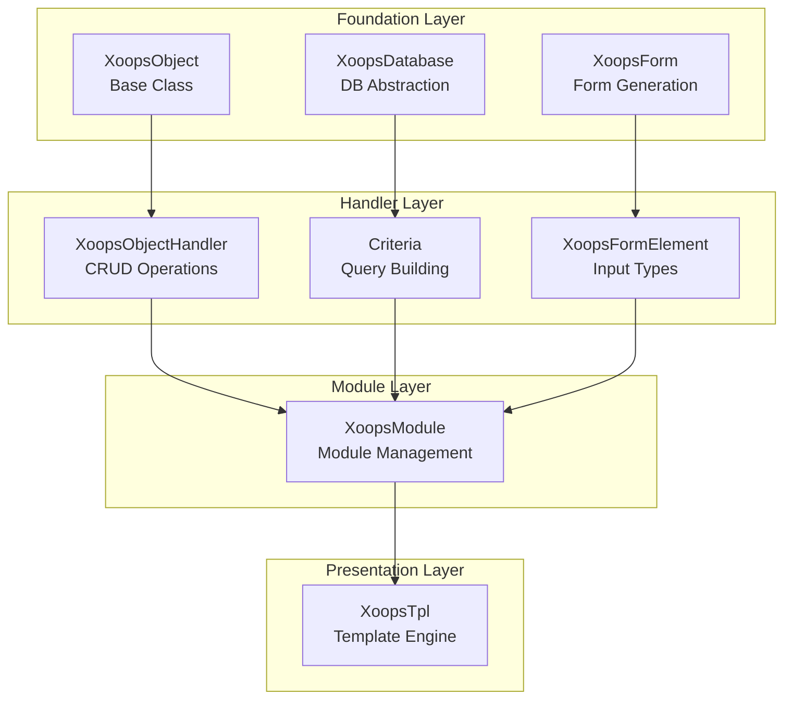
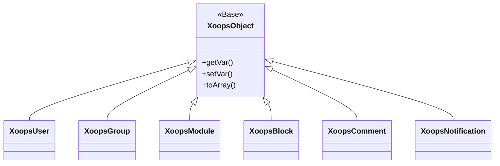
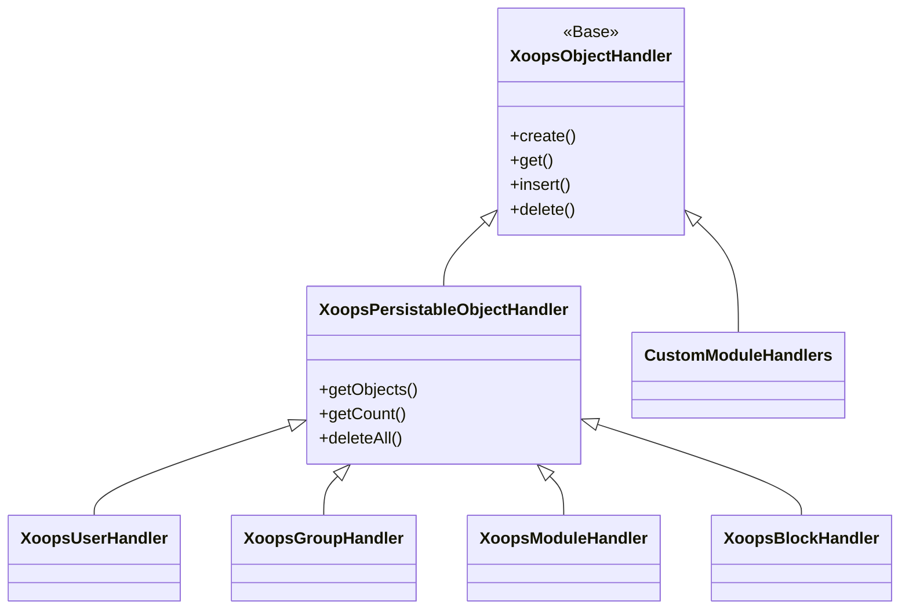
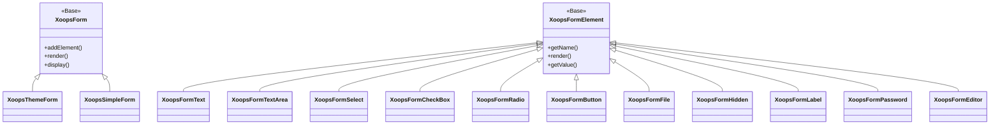

포괄적인 XOOPS API 참조 문서에 오신 것을 환영합니다. 이 섹션에서는 XOOPS 콘텐츠 관리 시스템을 구성하는 모든 핵심 클래스, 메서드 및 시스템에 대한 자세한 문서를 제공합니다.

## 개요

XOOPS API는 각각 CMS 기능의 특정 측면을 담당하는 여러 주요 하위 시스템으로 구성됩니다. XOOPS용 모듈, 테마 및 확장을 개발하려면 이러한 API를 이해하는 것이 필수적입니다.

## API 섹션

### 핵심 클래스

다른 모든 XOOPS 구성 요소가 구축되는 기초 클래스입니다.

| 문서 | 설명 |
|--------------|-------------|
| XoopsObject | XOOPS의 모든 데이터 객체에 대한 기본 클래스 |
| XoopsObjectHandler | CRUD 작업을 위한 핸들러 패턴 |

### 데이터베이스 계층

데이터베이스 추상화 및 쿼리 구축 유틸리티.

| 문서 | 설명 |
|--------------|-------------|
| XoopsDatabase | 데이터베이스 추상화 계층 |
| Criteria 시스템 | 쿼리 기준 및 조건 |
| 쿼리빌더 | 현대적이고 유창한 쿼리 구축 |

### 양식 시스템

HTML 양식 생성 및 유효성 검사.

| 문서 | 설명 |
|--------------|-------------|
| XoopsForm | 양식 컨테이너 및 렌더링 |
| 양식 요소 | 사용 가능한 모든 양식 요소 유형 |

### 커널 클래스

핵심 시스템 구성 요소 및 서비스.

| 문서 | 설명 |
|--------------|-------------|
| 커널 클래스 | 시스템 커널 및 핵심 구성요소 |

### 모듈 시스템

모듈 관리 및 수명주기.

| 문서 | 설명 |
|--------------|-------------|
| 모듈 시스템 | 모듈 로딩, 설치 및 관리 |

### 템플릿 시스템

Smarty 템플릿 통합.

| 문서 | 설명 |
|--------------|-------------|
| 템플릿 시스템 | Smarty 통합 및 템플릿 관리 |

### 사용자 시스템

사용자 관리 및 인증.

| 문서 | 설명 |
|--------------|-------------|
| 사용자 시스템 | 사용자 계정, 그룹 및 권한 |

## 아키텍처 개요



## 클래스 계층

### 객체 모델



### 핸들러 모델



### 양식 모델



## 디자인 패턴

XOOPS API는 잘 알려진 여러 디자인 패턴을 구현합니다.

### 싱글톤 패턴
데이터베이스 연결 및 컨테이너 인스턴스와 같은 글로벌 서비스에 사용됩니다.

```php
$db = XoopsDatabase::getInstance();
$container = XoopsContainer::getInstance();
```

### 팩토리 패턴
개체 처리기는 도메인 개체를 일관되게 생성합니다.

```php
$handler = xoops_getHandler('user');
$user = $handler->create();
```

### 복합 패턴
양식에는 여러 양식 요소가 포함되어 있습니다. 기준에는 중첩된 기준이 포함될 수 있습니다.

```php
$criteria = new CriteriaCompo();
$criteria->add(new Criteria('status', 1));
$criteria->add(new CriteriaCompo(...)); // Nested
```

### 관찰자 패턴
이벤트 시스템은 모듈 간의 느슨한 결합을 허용합니다.

```php
$dispatcher->addListener('module.news.article_published', $callback);
```

## 빠른 시작 예

### 객체 생성 및 저장

```php
// Get the handler
$handler = xoops_getHandler('user');

// Create a new object
$user = $handler->create();
$user->setVar('uname', 'newuser');
$user->setVar('email', 'user@example.com');

// Save to database
$handler->insert($user);
```

### Criteria으로 쿼리

```php
// Build criteria
$criteria = new CriteriaCompo();
$criteria->add(new Criteria('level', 0, '>'));
$criteria->setSort('uname');
$criteria->setOrder('ASC');
$criteria->setLimit(10);

// Get objects
$handler = xoops_getHandler('user');
$users = $handler->getObjects($criteria);
```

### 양식 만들기

```php
$form = new XoopsThemeForm('User Profile', 'userform', 'save.php', 'post', true);
$form->addElement(new XoopsFormText('Username', 'uname', 50, 255, $user->getVar('uname')));
$form->addElement(new XoopsFormTextArea('Bio', 'bio', $user->getVar('bio')));
$form->addElement(new XoopsFormButton('', 'submit', _SUBMIT, 'submit'));
echo $form->render();
```

## API 규칙

### 명명 규칙

| 유형 | 컨벤션 | 예 |
|------|-----------|---------|
| 클래스 | 파스칼케이스 | `XoopsUser`, `CriteriaCompo` |
| 방법 | 낙타 케이스 | `getVar()`, `setVar()` |
| 속성 | camelCase(보호됨) | `$_vars`, `$_handler` |
| 상수 | UPPER_SNAKE_CASE | `XOBJ_DTYPE_INT` |
| 데이터베이스 테이블 | 뱀 케이스 | `users`, `groups_users_link` |

### 데이터 유형

XOOPS는 객체 변수에 대한 표준 데이터 유형을 정의합니다.

| 상수 | 유형 | 설명 |
|----------|------|-------------|
| `XOBJ_DTYPE_TXTBOX` | 문자열 | 텍스트 입력(삭제) |
| `XOBJ_DTYPE_TXTAREA` | 문자열 | 텍스트 영역 콘텐츠 |
| `XOBJ_DTYPE_INT` | 정수 | 숫자 값 |
| `XOBJ_DTYPE_URL` | 문자열 | URL 유효성 검사 |
| `XOBJ_DTYPE_EMAIL` | 문자열 | 이메일 검증 |
| `XOBJ_DTYPE_ARRAY` | 배열 | 직렬화된 배열 |
| `XOBJ_DTYPE_OTHER` | 혼합 | 맞춤 처리 |
| `XOBJ_DTYPE_SOURCE` | 문자열 | 소스 코드(최소한의 삭제) |
| `XOBJ_DTYPE_STIME` | 정수 | 짧은 타임스탬프 |
| `XOBJ_DTYPE_MTIME` | 정수 | 중간 타임스탬프 |
| `XOBJ_DTYPE_LTIME` | 정수 | 긴 타임스탬프 |

## 인증 방법

API는 다양한 인증 방법을 지원합니다.

### API 키 인증
```
X-API-Key: your-api-key
```

### OAuth 전달자 토큰
```
Authorization: Bearer your-oauth-token
```

### 세션 기반 인증
로그인 시 기존 XOOPS 세션을 사용합니다.

## REST API 엔드포인트

REST API가 활성화된 경우:

| 엔드포인트 | 방법 | 설명 |
|----------|--------|-------------|
| `/api.php/rest/users` | 받기 | 사용자 나열 |
| `/api.php/rest/users/{id}` | 받기 | ID로 사용자 찾기 |
| `/api.php/rest/users` | 포스트 | 사용자 생성 |
| `/api.php/rest/users/{id}` | 넣어 | 사용자 업데이트 |
| `/api.php/rest/users/{id}` | 삭제 | 사용자 삭제 |
| `/api.php/rest/modules` | 받기 | 모듈 나열 |

## 관련 문서

- 모듈 개발 가이드
- 테마 개발 가이드
- 시스템 구성
- 보안 모범 사례

## 버전 기록

| 버전 | 변경사항 |
|---------|---------|
| 2.5.11 | 현재 안정 릴리스 |
| 2.5.10 | GraphQL API 지원 추가 |
| 2.5.9 | 향상된 Criteria 시스템 |
| 2.5.8 | PSR-4 자동 로딩 지원 |

---

*이 문서는 XOOPS 기술 자료의 일부입니다. 최신 업데이트를 확인하려면 [XOOPS GitHub 저장소](https://github.com/XOOPS)를 방문하세요.*
