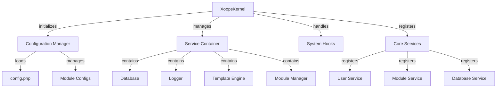

XOOPS 커널은 시스템 부트스트래핑, 구성 관리, 시스템 이벤트 처리 및 핵심 유틸리티 제공을 위한 기본 프레임워크를 제공합니다. 이러한 클래스는 XOOPS 애플리케이션의 백본을 형성합니다.

## 시스템 아키텍처



## XoopsKernel 클래스

XOOPS 시스템을 초기화하고 관리하는 기본 커널 클래스입니다.

### 클래스 개요

```php
namespace Xoops;

class XoopsKernel
{
    private static ?XoopsKernel $instance = null;
    protected ServiceContainer $services;
    protected ConfigurationManager $config;
    protected array $modules = [];
    protected bool $isLoaded = false;
}
```

### 생성자

```php
private function __construct()
```

개인 생성자는 싱글톤 패턴을 적용합니다.

### getInstance

싱글톤 커널 인스턴스를 검색합니다.

```php
public static function getInstance(): XoopsKernel
```

**반환:** `XoopsKernel` - 싱글톤 커널 인스턴스

**예:**
```php
$kernel = XoopsKernel::getInstance();
```

### 부팅 프로세스

커널 부팅 프로세스는 다음 단계를 따릅니다.

1. **초기화** - 오류 처리기 설정, 상수 정의
2. **구성** - 구성 파일 로드
3. **서비스 등록** - 핵심 서비스 등록
4. **모듈 감지** - 활성 모듈을 검색하고 식별합니다.
5. **데이터베이스 초기화** - 데이터베이스에 연결
6. **정리** - 요청 처리 준비

```php
public function boot(): void
```

**예:**
```php
$kernel = XoopsKernel::getInstance();
$kernel->boot();
```

### 서비스 컨테이너 메소드

#### 등록서비스

서비스 컨테이너에 서비스를 등록합니다.

```php
public function registerService(
    string $name,
    callable|object $definition
): void
```

**매개변수:**

| 매개변수 | 유형 | 설명 |
|-----------|------|-------------|
| `$name` | 문자열 | 서비스 식별자 |
| `$definition` | 호출 가능\|객체 | 서비스 팩토리 또는 인스턴스 |

**예:**
```php
$kernel->registerService('custom.handler', function($c) {
    return new CustomHandler();
});
```

#### getService

등록된 서비스를 검색합니다.

```php
public function getService(string $name): mixed
```

**매개변수:**

| 매개변수 | 유형 | 설명 |
|-----------|------|-------------|
| `$name` | 문자열 | 서비스 식별자 |

**반품:** `mixed` - 요청한 서비스

**예:**
```php
$database = $kernel->getService('database');
$logger = $kernel->getService('logger');
```

#### hasService

서비스가 등록되어 있는지 확인합니다.

```php
public function hasService(string $name): bool
```

**예:**
```php
if ($kernel->hasService('cache')) {
    $cache = $kernel->getService('cache');
}
```

## 구성 관리자

애플리케이션 구성 및 모듈 설정을 관리합니다.

### 클래스 개요

```php
namespace Xoops\Core;

class ConfigurationManager
{
    protected array $config = [];
    protected array $defaults = [];
    protected string $configPath;
}
```

### 방법

#### 로드

파일이나 배열에서 구성을 로드합니다.

```php
public function load(string|array $source): void
```

**매개변수:**

| 매개변수 | 유형 | 설명 |
|-----------|------|-------------|
| `$source` | 문자열\|배열 | 구성 파일 경로 또는 배열 |

**예:**
```php
$config = $kernel->getService('config');
$config->load(XOOPS_ROOT_PATH . '/include/config.php');
$config->load(['sitename' => 'My Site', 'admin_email' => 'admin@example.com']);
```

#### 얻다

구성 값을 검색합니다.

```php
public function get(string $key, mixed $default = null): mixed
```

**매개변수:**

| 매개변수 | 유형 | 설명 |
|-----------|------|-------------|
| `$key` | 문자열 | 구성 키(점 표기법) |
| `$default` | 혼합 | 찾을 수 없는 경우 기본값 |

**반환:** `mixed` - 구성 값

**예:**
```php
$siteName = $config->get('sitename');
$adminEmail = $config->get('admin.email', 'admin@example.com');
```

#### 세트

구성 값을 설정합니다.

```php
public function set(string $key, mixed $value): void
```

**매개변수:**

| 매개변수 | 유형 | 설명 |
|-----------|------|-------------|
| `$key` | 문자열 | 구성 키 |
| `$value` | 혼합 | 구성 값 |

**예:**
```php
$config->set('sitename', 'New Site Name');
$config->set('features.cache_enabled', true);
```

#### getModuleConfig

특정 모듈에 대한 구성을 가져옵니다.

```php
public function getModuleConfig(
    string $moduleName
): array
```

**매개변수:**

| 매개변수 | 유형 | 설명 |
|-----------|------|-------------|
| `$moduleName` | 문자열 | 모듈 디렉토리 이름 |

**반환:** `array` - 모듈 구성 배열

**예:**
```php
$publisherConfig = $config->getModuleConfig('publisher');
```

## 시스템 후크

시스템 후크를 사용하면 모듈과 플러그인이 애플리케이션 수명 주기의 특정 지점에서 코드를 실행할 수 있습니다.

### HookManager 클래스

```php
namespace Xoops\Core;

class HookManager
{
    protected array $hooks = [];
    protected array $listeners = [];
}
```

### 방법

#### addHook

훅 포인트를 등록합니다.

```php
public function addHook(string $name): void
```

**매개변수:**

| 매개변수 | 유형 | 설명 |
|-----------|------|-------------|
| `$name` | 문자열 | 후크 식별자 |

**예:**
```php
$hooks = $kernel->getService('hooks');
$hooks->addHook('system.startup');
$hooks->addHook('user.login');
$hooks->addHook('module.install');
```

#### 들어봐

리스너를 후크에 연결합니다.

```php
public function listen(
    string $hookName,
    callable $callback,
    int $priority = 10
): void
```

**매개변수:**

| 매개변수 | 유형 | 설명 |
|-----------|------|-------------|
| `$hookName` | 문자열 | 후크 식별자 |
| `$callback` | 호출 가능 | 실행할 함수 |
| `$priority` | 정수 | 실행 우선순위(높은 실행 우선) |

**예:**
```php
$hooks->listen('user.login', function($user) {
    error_log('User ' . $user->uname . ' logged in');
}, 10);

$hooks->listen('module.install', function($module) {
    // Custom module installation logic
    echo "Installing " . $module->getName();
}, 5);
```

#### 트리거

후크에 대한 모든 리스너를 실행합니다.

```php
public function trigger(
    string $hookName,
    mixed $arguments = null
): array
```

**매개변수:**

| 매개변수 | 유형 | 설명 |
|-----------|------|-------------|
| `$hookName` | 문자열 | 후크 식별자 |
| `$arguments` | 혼합 | 청취자에게 전달할 데이터 |

**반환:** `array` - 모든 청취자의 결과

**예:**
```php
$results = $hooks->trigger('system.startup');
$results = $hooks->trigger('user.created', $newUser);
```

## 핵심 서비스 개요

커널은 부팅 중에 여러 핵심 서비스를 등록합니다.

| 서비스 | 클래스 | 목적 |
|---------|-------|---------|
| `database` | XoopsDatabase | 데이터베이스 추상화 계층 |
| `config` | 구성 관리자 | 구성 관리 |
| `logger` | 로거 | 애플리케이션 로깅 |
| `template` | XoopsTpl | 템플릿 엔진 |
| `user` | 사용자 관리자 | 사용자 관리 서비스 |
| `module` | 모듈관리자 | 모듈 관리 |
| `cache` | 캐시관리자 | 캐싱 레이어 |
| `hooks` | 후크매니저 | 시스템 이벤트 후크 |

## 전체 사용 예

```php
<?php
/**
 * Custom module boot process utilizing kernel
 */

// Get kernel instance
$kernel = XoopsKernel::getInstance();

// Boot the system
$kernel->boot();

// Get services
$config = $kernel->getService('config');
$database = $kernel->getService('database');
$logger = $kernel->getService('logger');
$hooks = $kernel->getService('hooks');

// Access configuration
$siteName = $config->get('sitename');
$adminEmail = $config->get('admin.email');

// Register module-specific hooks
$hooks->listen('user.login', function($user) {
    // Log user login
    $logger->info('User login: ' . $user->uname);

    // Track in database
    $database->query(
        'INSERT INTO ' . $database->prefix('event_log') .
        ' (type, user_id, message, timestamp) VALUES (?, ?, ?, ?)',
        ['login', $user->uid(), 'User login', time()]
    );
});

$hooks->listen('module.install', function($module) {
    $logger->info('Module installed: ' . $module->getName());
});

// Trigger hooks
$hooks->trigger('system.startup');

// Use database service
$result = $database->query(
    'SELECT * FROM ' . $database->prefix('users') .
    ' LIMIT 10'
);

while ($row = $database->fetchArray($result)) {
    echo "User: " . htmlspecialchars($row['uname']) . "\n";
}

// Register custom service
$kernel->registerService('custom.repository', function($c) {
    return new CustomRepository($c->getService('database'));
});

// Later access custom service
$repo = $kernel->getService('custom.repository');
```

## 핵심 상수

커널은 부팅 중에 몇 가지 중요한 상수를 정의합니다.

```php
// System paths
define('XOOPS_ROOT_PATH', '/var/www/xoops');
define('XOOPS_HTDOCS_PATH', XOOPS_ROOT_PATH . '/htdocs');
define('XOOPS_MODULES_PATH', XOOPS_ROOT_PATH . '/htdocs/modules');
define('XOOPS_THEMES_PATH', XOOPS_ROOT_PATH . '/htdocs/themes');

// Web paths
define('XOOPS_URL', 'http://example.com');
define('XOOPS_HTDOCS_URL', XOOPS_URL . '/htdocs');

// Database
define('XOOPS_DB_PREFIX', 'xoops_');
```

## 오류 처리

커널은 부팅 중에 오류 처리기를 설정합니다.

```php
// Set custom error handler
set_error_handler(function($errno, $errstr, $errfile, $errline) {
    $kernel->getService('logger')->error(
        "Error: $errstr in $errfile:$errline"
    );
});

// Set exception handler
set_exception_handler(function($exception) {
    $kernel->getService('logger')->critical(
        "Exception: " . $exception->getMessage()
    );
});
```

## 모범 사례

1. **단일 부팅** - 애플리케이션 시작 중 `boot()`을 한 번만 호출합니다.
2. **서비스 컨테이너 사용** - 커널을 통해 서비스 등록 및 검색
3. **훅 조기 처리** - 후크 리스너를 트리거하기 전에 등록하세요.
4. **중요 이벤트 기록** - 디버깅을 위해 로거 서비스를 사용합니다.
5. **캐시 구성** - 구성을 한 번 로드하고 재사용
6. **오류 처리** - 요청을 처리하기 전에 항상 오류 처리기를 설정합니다.

## 관련 문서

-../Module/Module-System - 모듈 시스템 및 라이프사이클
-../Template/Template-System - 템플릿 엔진 통합
-../User/User-System - 사용자 인증 및 관리
-../Database/XoopsDatabase - 데이터베이스 계층

---

*참조: [XOOPS 커널 소스](https://github.com/XOOPS/XoopsCore27/tree/master/htdocs/class)*
