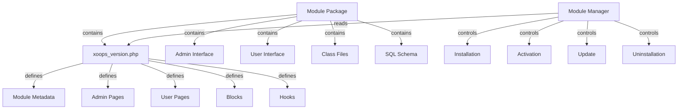

XOOPS 모듈 시스템은 모듈 기능을 개발, 설치, 관리 및 확장하기 위한 완전한 프레임워크를 제공합니다. 모듈은 추가 기능으로 XOOPS를 확장하는 독립형 패키지입니다.

## 모듈 아키텍처



## 모듈 구조

표준 XOOPS 모듈 디렉토리 구조:

```
mymodule/
├── xoops_version.php          # Module manifest and configuration
├── admin.php                  # Admin main page
├── index.php                  # User main page
├── admin/                     # Admin pages directory
│   ├── main.php
│   ├── manage.php
│   └── settings.php
├── class/                     # Module classes
│   ├── Handler/
│   │   ├── ItemHandler.php
│   │   └── CategoryHandler.php
│   └── Objects/
│       ├── Item.php
│       └── Category.php
├── sql/                       # Database schemas
│   ├── mysql.sql
│   └── postgres.sql
├── include/                   # Include files
│   ├── common.inc.php
│   └── functions.php
├── templates/                 # Module templates
│   ├── admin/
│   │   └── main.tpl
│   └── user/
│       ├── index.tpl
│       └── item.tpl
├── blocks/                    # Module blocks
│   └── blocks.php
├── tests/                     # Unit tests
├── language/                  # Language files
│   ├── english/
│   │   └── main.php
│   └── spanish/
│       └── main.php
└── docs/                      # Documentation
```

## XoopsModule 클래스

XoopsModule 클래스는 설치된 XOOPS 모듈을 나타냅니다.

### 클래스 개요

```php
namespace Xoops\Core\Module;

class XoopsModule extends XoopsObject
{
    protected int $moduleid = 0;
    protected string $name = '';
    protected string $dirname = '';
    protected string $version = '';
    protected string $description = '';
    protected array $config = [];
    protected array $blocks = [];
    protected array $adminPages = [];
    protected array $userPages = [];
}
```

### 속성

| 부동산 | 유형 | 설명 |
|----------|------|-------------|
| `$moduleid` | 정수 | 고유 모듈 ID |
| `$name` | 문자열 | 모듈 표시 이름 |
| `$dirname` | 문자열 | 모듈 디렉토리 이름 |
| `$version` | 문자열 | 현재 모듈 버전 |
| `$description` | 문자열 | 모듈 설명 |
| `$config` | 배열 | 모듈 구성 |
| `$blocks` | 배열 | 모듈 블록 |
| `$adminPages` | 배열 | 관리자 패널 페이지 |
| `$userPages` | 배열 | 사용자 대상 페이지 |

### 생성자

```php
public function __construct()
```

새 모듈 인스턴스를 만들고 변수를 초기화합니다.

### 핵심 메소드

#### getName

모듈의 표시 이름을 가져옵니다.

```php
public function getName(): string
```

**반환:** `string` - 모듈 표시 이름

**예:**
```php
$module = new XoopsModule();
$module->setVar('name', 'Publisher');
echo $module->getName(); // "Publisher"
```

#### getDirname

모듈의 디렉터리 이름을 가져옵니다.

```php
public function getDirname(): string
```

**반환:** `string` - 모듈 디렉터리 이름

**예:**
```php
echo $module->getDirname(); // "publisher"
```

#### getVersion

현재 모듈 버전을 가져옵니다.

```php
public function getVersion(): string
```

**반환:** `string` - 버전 문자열

**예:**
```php
echo $module->getVersion(); // "2.1.0"
```

#### getDescription

모듈 설명을 가져옵니다.

```php
public function getDescription(): string
```

**반환:** `string` - 모듈 설명

**예:**
```php
$desc = $module->getDescription();
```

#### getConfig

모듈 구성을 검색합니다.

```php
public function getConfig(string $key = null): mixed
```

**매개변수:**

| 매개변수 | 유형 | 설명 |
|-----------|------|-------------|
| `$key` | 문자열 | 구성 키(모두 null) |

**반환:** `mixed` - 구성 값 또는 배열

**예:**
```php
$config = $module->getConfig();
$itemsPerPage = $module->getConfig('items_per_page');
```

#### setConfig

모듈 구성을 설정합니다.

```php
public function setConfig(string $key, mixed $value): void
```

**매개변수:**

| 매개변수 | 유형 | 설명 |
|-----------|------|-------------|
| `$key` | 문자열 | 구성 키 |
| `$value` | 혼합 | 구성 값 |

**예:**
```php
$module->setConfig('items_per_page', 20);
$module->setConfig('enable_cache', true);
```

#### getPath

모듈에 대한 전체 파일 시스템 경로를 가져옵니다.

```php
public function getPath(): string
```

**반환:** `string` - 절대 모듈 디렉터리 경로

**예:**
```php
$path = $module->getPath(); // "/var/www/xoops/modules/publisher"
$classPath = $module->getPath() . '/class';
```

#### getUrl

모듈의 URL을 가져옵니다.

```php
public function getUrl(): string
```

**반환:** `string` - 모듈 URL

**예:**
```php
$url = $module->getUrl(); // "http://example.com/modules/publisher"
```

## 모듈 설치 과정

### xoops_module_install 함수

`xoops_version.php`에 정의된 모듈 설치 기능:

```php
function xoops_module_install_modulename($module)
{
    // $module is an XoopsModule instance

    // Create database tables
    // Initialize default configuration
    // Create default folders
    // Set up file permissions

    return true; // Success
}
```

**매개변수:**

| 매개변수 | 유형 | 설명 |
|-----------|------|-------------|
| `$module` | XoopsModule | 설치 중인 모듈 |

**반환:** `bool` - 성공하면 True, 실패하면 False

**예:**
```php
function xoops_module_install_publisher($module)
{
    // Get module path
    $modulePath = $module->getPath();

    // Create uploads directory
    $uploadsPath = XOOPS_ROOT_PATH . '/uploads/publisher';
    if (!is_dir($uploadsPath)) {
        mkdir($uploadsPath, 0755, true);
    }

    // Get database connection
    global $xoopsDB;

    // Execute SQL installation script
    $sqlFile = $modulePath . '/sql/mysql.sql';
    if (file_exists($sqlFile)) {
        $sqlQueries = file_get_contents($sqlFile);
        // Execute queries (simplified)
        $xoopsDB->queryFromFile($sqlFile);
    }

    // Set default configuration
    $module->setConfig('items_per_page', 10);
    $module->setConfig('enable_comments', true);

    return true;
}
```

### xoops_module_uninstall 함수

모듈 제거 기능:

```php
function xoops_module_uninstall_modulename($module)
{
    // Drop database tables
    // Remove uploaded files
    // Clean up configuration

    return true;
}
```

**예:**
```php
function xoops_module_uninstall_publisher($module)
{
    global $xoopsDB;

    // Drop tables
    $tables = ['publisher_items', 'publisher_categories', 'publisher_comments'];
    foreach ($tables as $table) {
        $xoopsDB->query('DROP TABLE IF EXISTS ' . $xoopsDB->prefix($table));
    }

    // Remove upload folder
    $uploadsPath = XOOPS_ROOT_PATH . '/uploads/publisher';
    if (is_dir($uploadsPath)) {
        // Recursive directory deletion
        $this->recursiveRemoveDir($uploadsPath);
    }

    return true;
}
```

## 모듈 후크

모듈 후크를 사용하면 모듈을 다른 모듈 및 시스템과 통합할 수 있습니다.

### 후크 선언

`xoops_version.php`에서:

```php
$modversion['hooks'] = [
    'system.page.footer' => [
        'function' => 'publisher_page_footer'
    ],
    'user.profile.view' => [
        'function' => 'publisher_user_articles'
    ],
];
```

### 후크 구현

```php
// In a module file (e.g., include/hooks.php)

function publisher_page_footer()
{
    // Return HTML for footer
    return '<div class="publisher-footer">Publisher Footer Content</div>';
}

function publisher_user_articles($user_id)
{
    global $xoopsDB;

    // Get user's articles
    $result = $xoopsDB->query(
        'SELECT * FROM ' . $xoopsDB->prefix('publisher_articles') .
        ' WHERE author_id = ? ORDER BY published DESC LIMIT 5',
        [$user_id]
    );

    $articles = [];
    while ($row = $xoopsDB->fetchAssoc($result)) {
        $articles[] = $row;
    }

    return $articles;
}
```

### 사용 가능한 시스템 후크

| 후크 | 매개변수 | 설명 |
|------|-----------|-------------|
| `system.page.header` | 없음 | 페이지 헤더 출력 |
| `system.page.footer` | 없음 | 페이지 바닥글 출력 |
| `user.login.success` | $user 객체 | 사용자 로그인 후 |
| `user.logout` | $user 개체 | 사용자 로그아웃 후 |
| `user.profile.view` | $user_id | 사용자 프로필 보기 |
| `module.install` | $module 객체 | 모듈 설치 |
| `module.uninstall` | $module 객체 | 모듈 제거 |

## 모듈 관리자 서비스

ModuleManager 서비스는 모듈 작업을 처리합니다.

### 방법

#### get모듈

이름으로 모듈을 검색합니다.

```php
public function getModule(string $dirname): ?XoopsModule
```

**매개변수:**

| 매개변수 | 유형 | 설명 |
|-----------|------|-------------|
| `$dirname` | 문자열 | 모듈 디렉토리 이름 |

**반환:** `?XoopsModule` - 모듈 인스턴스 또는 null

**예:**
```php
$moduleManager = $kernel->getService('module');
$publisher = $moduleManager->getModule('publisher');
if ($publisher) {
    echo $publisher->getName();
}
```

#### getAllModules

설치된 모든 모듈을 가져옵니다.

```php
public function getAllModules(bool $activeOnly = true): array
```

**매개변수:**

| 매개변수 | 유형 | 설명 |
|-----------|------|-------------|
| `$activeOnly` | 불리언 | 활성 모듈만 반환 |

**반환:** `array` - XoopsModule 객체의 배열

**예:**
```php
$activeModules = $moduleManager->getAllModules(true);
foreach ($activeModules as $module) {
    echo $module->getName() . " - " . $module->getVersion() . "\n";
}
```

#### isModuleActive

모듈이 활성화되어 있는지 확인합니다.

```php
public function isModuleActive(string $dirname): bool
```

**예:**
```php
if ($moduleManager->isModuleActive('publisher')) {
    // Publisher module is active
}
```

#### 활성화모듈

모듈을 활성화합니다.

```php
public function activateModule(string $dirname): bool
```

**예:**
```php
if ($moduleManager->activateModule('publisher')) {
    echo "Publisher activated";
}
```

#### 비활성화모듈

모듈을 비활성화합니다.

```php
public function deactivateModule(string $dirname): bool
```

**예:**
```php
if ($moduleManager->deactivateModule('publisher')) {
    echo "Publisher deactivated";
}
```

## 모듈 구성(xoops_version.php)

전체 모듈 매니페스트 예:

```php
<?php
/**
 * Module manifest for Publisher
 */

$modversion = [
    'name' => 'Publisher',
    'version' => '2.1.0',
    'description' => 'Professional content publishing module',
    'author' => 'XOOPS Community',
    'credits' => 'Based on original work by...',
    'license' => 'GPL v2',
    'official' => 1,
    'image' => 'images/logo.png',
    'dirname' => 'publisher',
    'onInstall' => 'xoops_module_install_publisher',
    'onUpdate' => 'xoops_module_update_publisher',
    'onUninstall' => 'xoops_module_uninstall_publisher',

    // Admin pages
    'hasAdmin' => 1,
    'adminindex' => 'admin/main.php',
    'adminmenu' => [
        [
            'title' => 'Dashboard',
            'link' => 'admin/main.php',
            'icon' => 'dashboard.png'
        ],
        [
            'title' => 'Manage Items',
            'link' => 'admin/items.php',
            'icon' => 'items.png'
        ],
        [
            'title' => 'Settings',
            'link' => 'admin/settings.php',
            'icon' => 'settings.png'
        ]
    ],

    // User pages
    'hasMain' => 1,
    'main_file' => 'index.php',

    // Blocks
    'blocks' => [
        [
            'file' => 'blocks/recent.php',
            'name' => 'Recent Articles',
            'description' => 'Display recent published articles',
            'show_func' => 'publisher_recent_show',
            'edit_func' => 'publisher_recent_edit',
            'options' => '5|0|0',
            'template' => 'publisher_block_recent.tpl'
        ],
        [
            'file' => 'blocks/featured.php',
            'name' => 'Featured Articles',
            'description' => 'Display featured articles',
            'show_func' => 'publisher_featured_show',
            'edit_func' => 'publisher_featured_edit'
        ]
    ],

    // Module hooks
    'hooks' => [
        'system.page.footer' => [
            'function' => 'publisher_page_footer'
        ],
        'user.profile.view' => [
            'function' => 'publisher_user_articles'
        ]
    ],

    // Configuration items
    'config' => [
        [
            'name' => 'items_per_page',
            'title' => '_MI_PUBLISHER_ITEMS_PER_PAGE',
            'description' => '_MI_PUBLISHER_ITEMS_PER_PAGE_DESC',
            'formtype' => 'text',
            'valuetype' => 'int',
            'default' => '10'
        ],
        [
            'name' => 'enable_comments',
            'title' => '_MI_PUBLISHER_ENABLE_COMMENTS',
            'description' => '_MI_PUBLISHER_ENABLE_COMMENTS_DESC',
            'formtype' => 'yesno',
            'valuetype' => 'int',
            'default' => '1'
        ]
    ]
];

function xoops_module_install_publisher($module)
{
    // Installation logic
    return true;
}

function xoops_module_update_publisher($module)
{
    // Update logic
    return true;
}

function xoops_module_uninstall_publisher($module)
{
    // Uninstallation logic
    return true;
}
```

## 모범 사례

1. **클래스 네임스페이스** - 충돌을 방지하려면 모듈별 네임스페이스를 사용하세요.

2. **핸들러 사용** - 데이터베이스 작업에는 항상 핸들러 클래스를 사용합니다.

3. **콘텐츠 국제화** - 사용자가 접하는 모든 문자열에 언어 상수를 사용합니다.

4. **설치 스크립트 생성** - 데이터베이스 테이블에 대한 SQL 스키마 제공

5. **훅 문서화** - 모듈이 제공하는 후크가 무엇인지 명확하게 문서화하세요.

6. **모듈 버전 관리** - 릴리스에 따라 버전 번호 증가

7. **테스트 설치** - 설치/제거 프로세스를 철저히 테스트합니다.

8. **권한 처리** - 작업을 허용하기 전에 사용자 권한을 확인하세요.

## 전체 모듈 예

```php
<?php
/**
 * Custom Article Module Main Page
 */

include __DIR__ . '/include/common.inc.php';

// Get module instance
$module = xoops_getModuleByDirname('mymodule');

// Check if module is active
if (!$module) {
    die('Module not found');
}

// Get module configuration
$itemsPerPage = $module->getConfig('items_per_page');

// Get item handler
$itemHandler = xoops_getModuleHandler('item', 'mymodule');

// Fetch items with pagination
$criteria = new CriteriaCompo();
$criteria->add(new Criteria('status', 1));
$items = $itemHandler->getObjects($criteria, $itemsPerPage);

// Prepare template
$xoopsTpl->assign('items', $items);
$xoopsTpl->assign('module_name', $module->getName());
$xoopsTpl->display($module->getPath() . '/templates/user/index.tpl');
```

## 관련 문서

-../Kernel/Kernel-Classes - 커널 초기화 및 핵심 서비스
-../Template/Template-System - 모듈 템플릿 및 테마 통합
-../Database/QueryBuilder - 데이터베이스 쿼리 작성
-../Core/XoopsObject - 기본 객체 클래스

---

*참조: [XOOPS 모듈 개발 가이드](https://github.com/XOOPS/XoopsCore27/wiki/Module-Development)*
