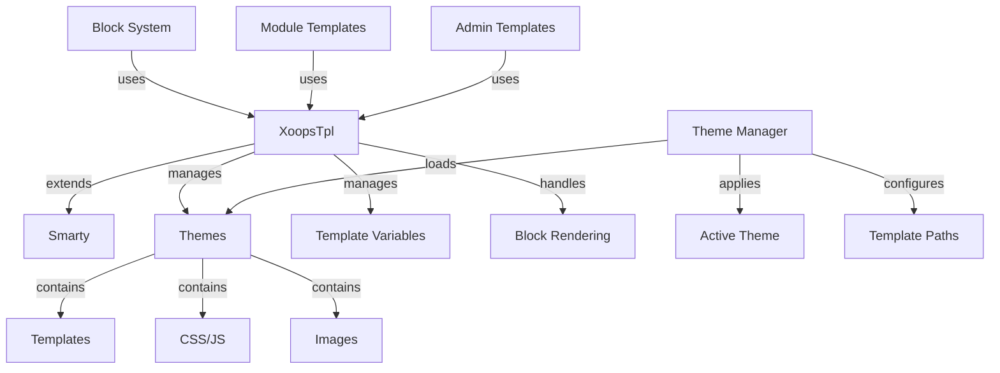

XOOPS 템플릿 시스템은 강력한 Smarty 템플릿 엔진을 기반으로 구축되어 비즈니스 로직에서 프리젠테이션 로직을 분리하는 유연하고 확장 가능한 방법을 제공합니다. 테마, 템플릿 렌더링, 변수 할당 및 동적 콘텐츠 생성을 관리합니다.

## 템플릿 아키텍처



## XoopsTpl 클래스

Smarty을 확장하는 기본 템플릿 엔진 클래스입니다.

### 클래스 개요

```php
namespace Xoops\Core;

class XoopsTpl extends Smarty
{
    protected array $vars = [];
    protected string $currentTheme = '';
    protected array $blocks = [];
    protected bool $isAdmin = false;
}
```

### Smarty 확장

```php
use Xoops\Core\XoopsTpl;

class XoopsTpl extends Smarty
{
    private static ?XoopsTpl $instance = null;

    private function __construct()
    {
        parent::__construct();
        $this->configureDirectories();
        $this->registerPlugins();
    }

    public static function getInstance(): XoopsTpl
    {
        if (!isset(self::$instance)) {
            self::$instance = new self();
        }
        return self::$instance;
    }
}
```

### 핵심 메소드

#### getInstance

싱글톤 템플릿 인스턴스를 가져옵니다.

```php
public static function getInstance(): XoopsTpl
```

**반환:** `XoopsTpl` - 싱글톤 인스턴스

**예:**
```php
$xoopsTpl = XoopsTpl::getInstance();
```

#### 할당

템플릿에 변수를 할당합니다.

```php
public function assign(
    string|array $tplVar,
    mixed $value = null
): void
```

**매개변수:**

| 매개변수 | 유형 | 설명 |
|-----------|------|-------------|
| `$tplVar` | 문자열\|배열 | 변수 이름 또는 연관 배열 |
| `$value` | 혼합 | 변수값 |

**예:**
```php
$xoopsTpl->assign('page_title', 'Welcome');
$xoopsTpl->assign('user_name', 'John Doe');

// Multiple assignments
$xoopsTpl->assign([
    'items' => $items,
    'total_count' => count($items),
    'show_pagination' => true
]);
```

#### 추가 할당

템플릿 배열 변수에 값을 추가합니다.

```php
public function appendAssign(
    string $tplVar,
    mixed $value
): void
```

**매개변수:**

| 매개변수 | 유형 | 설명 |
|-----------|------|-------------|
| `$tplVar` | 문자열 | 변수 이름 |
| `$value` | 혼합 | 추가할 값 |

**예:**
```php
$xoopsTpl->assign('breadcrumbs', ['Home']);
$xoopsTpl->appendAssign('breadcrumbs', 'Blog');
$xoopsTpl->appendAssign('breadcrumbs', 'Posts');
// breadcrumbs = ['Home', 'Blog', 'Posts']
```

#### getAssignedVars

할당된 모든 템플릿 변수를 가져옵니다.

```php
public function getAssignedVars(): array
```

**반환:** `array` - 할당된 변수

**예:**
```php
$vars = $xoopsTpl->getAssignedVars();
foreach ($vars as $name => $value) {
    echo "$name = " . var_export($value, true) . "\n";
}
```

#### 디스플레이

템플릿을 렌더링하고 브라우저에 출력합니다.

```php
public function display(
    string $resource,
    string|array $cache_id = null,
    string $compile_id = null,
    object $parent = null
): void
```

**매개변수:**

| 매개변수 | 유형 | 설명 |
|-----------|------|-------------|
| `$resource` | 문자열 | 템플릿 파일 경로 |
| `$cache_id` | 문자열\|배열 | 캐시 식별자 |
| `$compile_id` | 문자열 | 컴파일 식별자 |
| `$parent` | 개체 | 상위 템플릿 객체 |

**예:**
```php
$xoopsTpl->assign('page_title', 'Home');
$xoopsTpl->display('user:index.tpl');

// With absolute path
$xoopsTpl->display(XOOPS_ROOT_PATH . '/templates/user/index.tpl');
```

#### 가져오기

템플릿을 렌더링하고 문자열로 반환합니다.

```php
public function fetch(
    string $resource,
    string|array $cache_id = null,
    string $compile_id = null,
    object $parent = null
): string
```

**반환:** `string` - 렌더링된 템플릿 콘텐츠

**예:**
```php
$xoopsTpl->assign('message', 'Hello World');
$html = $xoopsTpl->fetch('user:message.tpl');
echo $html;

// Use for email templates
$emailContent = $xoopsTpl->fetch('mail:notification.tpl');
mail($to, $subject, $emailContent);
```

#### 로드테마

특정 테마를 로드합니다.

```php
public function loadTheme(string $themeName): bool
```

**매개변수:**

| 매개변수 | 유형 | 설명 |
|-----------|------|-------------|
| `$themeName` | 문자열 | 테마 디렉토리 이름 |

**반환:** `bool` - 성공 시 True

**예:**
```php
if ($xoopsTpl->loadTheme('bluemoon')) {
    echo "Theme loaded successfully";
}
```

#### getCurrentTheme

현재 활성화된 테마의 이름을 가져옵니다.

```php
public function getCurrentTheme(): string
```

**반환:** `string` - 테마 이름

**예:**
```php
$currentTheme = $xoopsTpl->getCurrentTheme();
echo "Active theme: $currentTheme";
```

#### setOutputFilter

템플릿 출력을 처리하기 위해 출력 필터를 추가합니다.

```php
public function setOutputFilter(string $function): void
```

**매개변수:**

| 매개변수 | 유형 | 설명 |
|-----------|------|-------------|
| `$function` | 문자열 | 필터 기능 이름 |

**예:**
```php
// Remove whitespace from output
$xoopsTpl->setOutputFilter('trim');

// Custom filter
function my_output_filter($output) {
    // Minify HTML
    $output = preg_replace('/\s+/', ' ', $output);
    return trim($output);
}
$xoopsTpl->setOutputFilter('my_output_filter');
```

#### 레지스터 플러그인

사용자 정의 Smarty 플러그인을 등록합니다.

```php
public function registerPlugin(
    string $type,
    string $name,
    callable $callback
): void
```

**매개변수:**

| 매개변수 | 유형 | 설명 |
|-----------|------|-------------|
| `$type` | 문자열 | 플러그인 유형(수정자, 블록, 함수) |
| `$name` | 문자열 | 플러그인 이름 |
| `$callback` | 호출 가능 | 콜백 함수 |

**예:**
```php
// Register custom modifier
$xoopsTpl->registerPlugin('modifier', 'markdown', function($text) {
    return markdown_parse($text);
});

// Use in template: {$content|markdown}

// Register custom block tag
$xoopsTpl->registerPlugin('block', 'permission', function($params, $content, $smarty, &$repeat) {
    if ($repeat) return;

    // Check permission
    if (has_permission($params['name'])) {
        return $content;
    }
    return '';
});

// Use in template: {permission name="admin"}...{/permission}
```

## 테마 시스템

### 테마 구조

표준 XOOPS 테마 디렉토리 구조:

```
bluemoon/
├── style.css              # Main stylesheet
├── admin.css              # Admin stylesheet
├── theme.html             # Main page template
├── admin.html             # Admin page template
├── blocks/                # Block templates
│   ├── block_left.tpl
│   └── block_right.tpl
├── modules/               # Module templates
│   ├── publisher/
│   │   ├── index.tpl
│   │   └── item.tpl
│   └── news/
│       └── index.tpl
├── images/                # Theme images
│   ├── logo.png
│   └── banner.png
├── js/                    # Theme JavaScript
│   └── script.js
└── readme.txt             # Theme documentation
```

### 테마 매니저 클래스

```php
namespace Xoops\Core\Theme;

class ThemeManager
{
    protected array $themes = [];
    protected string $activeTheme = '';
    protected string $themeDirectory = '';

    public function getActiveTheme(): string {}
    public function setActiveTheme(string $theme): bool {}
    public function getThemeList(): array {}
    public function themeExists(string $name): bool {}
}
```

## 템플릿 변수

### 표준 전역 변수

XOOPS는 여러 전역 템플릿 변수를 자동으로 할당합니다.

| 변수 | 유형 | 설명 |
|----------|------|-------------|
| `$xoops_url` | 문자열 | XOOPS 설치 URL |
| `$xoops_user` | XoopsUser\|널 | 현재 사용자 개체 |
| `$xoops_uname` | 문자열 | 현재 사용자 이름 |
| `$xoops_isadmin` | 불리언 | 사용자는 관리자입니다 |
| `$xoops_banner` | 문자열 | 배너 HTML |
| `$xoops_notification` | 문자열 | 알림 마크업 |
| `$xoops_version` | 문자열 | XOOPS 버전 |

### 블록별 변수

블록을 렌더링할 때:

| 변수 | 유형 | 설명 |
|----------|------|-------------|
| `$block` | 배열 | 블록 정보 |
| `$block.title` | 문자열 | 블록 제목 |
| `$block.content` | 문자열 | 콘텐츠 차단 |
| `$block.id` | 정수 | 블록 ID |
| `$block.module` | 문자열 | 모듈 이름 |

### 모듈 템플릿 변수

모듈은 일반적으로 다음을 할당합니다.

| 변수 | 유형 | 설명 |
|----------|------|-------------|
| `$module_name` | 문자열 | 모듈 표시 이름 |
| `$module_dir` | 문자열 | 모듈 디렉토리 |
| `$xoops_module_header` | 문자열 | 모듈 CSS/JS |

## Smarty 구성

### 공통 Smarty 수식어

| 수정자 | 설명 | 예 |
|----------|-------------|---------|
| `capitalize` | 첫 글자를 대문자로 | `{$title\|capitalize}` |
| `count_characters` | 문자수 | `{$text\|count_characters}` |
| `date_format` | 타임스탬프 형식 | `{$timestamp\|date_format:'%Y-%m-%d'}` |
| `escape` | 특수 문자 탈출 | `{$html\|escape:'html'}` |
| `nl2br` | 개행 문자를 `<br>`으로 변환 | `{$text\|nl2br}` |
| `strip_tags` | HTML 태그 제거 | `{$content\|strip_tags}` |
| `truncate` | 문자열 길이 제한 | `{$text\|truncate:100}` |
| `upper` | 대문자로 변환 | `{$name\|upper}` |
| `lower` | 소문자로 변환 | `{$name\|lower}` |

### 제어 구조

```smarty
{* If statement *}
{if $user->isAdmin()}
    <p>Admin content</p>
{else}
    <p>User content</p>
{/if}

{* For loop *}
{foreach $items as $item}
    <div class="item">{$item.title}</div>
{/foreach}

{* For loop with counter *}
{foreach $items as $item name=item_loop}
    {$smarty.foreach.item_loop.iteration}: {$item.title}
{/foreach}

{* While loop *}
{while $condition}
    <!-- content -->
{/while}

{* Switch statement *}
{switch $status}
    {case 'draft'}<span class="draft">Draft</span>{break}
    {case 'published'}<span class="published">Published</span>{break}
    {default}<span class="unknown">Unknown</span>
{/switch}
```

## 완전한 템플릿 예

### PHP 코드

```php
<?php
/**
 * Module Article List Page
 */

include __DIR__ . '/include/common.inc.php';

$xoopsTpl = XoopsTpl::getInstance();

// Check if module is active
$module = xoops_getModuleByDirname('articles');
if (!$module) {
    redirect_header(XOOPS_URL, 3, 'Module not found');
}

// Get item handler
$itemHandler = xoops_getModuleHandler('item', 'articles');

// Get pagination parameters
$page = !empty($_GET['page']) ? (int)$_GET['page'] : 1;
$perPage = $module->getConfig('items_per_page') ?: 10;
$offset = ($page - 1) * $perPage;

// Build criteria
$criteria = new CriteriaCompo();
$criteria->add(new Criteria('status', 1));
$criteria->setSort('published', 'DESC');
$criteria->setLimit($perPage);
$criteria->setStart($offset);

// Fetch items
$items = $itemHandler->getObjects($criteria);
$total = $itemHandler->getCount(new Criteria('status', 1));

// Calculate pagination
$pages = ceil($total / $perPage);

// Assign template variables
$xoopsTpl->assign([
    'module_name' => $module->getName(),
    'items' => $items,
    'total_items' => $total,
    'current_page' => $page,
    'total_pages' => $pages,
    'items_per_page' => $perPage,
    'show_pagination' => $pages > 1
]);

// Add breadcrumbs
$xoopsTpl->assign('xoops_breadcrumbs', [
    ['url' => XOOPS_URL, 'title' => 'Home'],
    ['url' => $module->getUrl(), 'title' => $module->getName()],
    ['title' => 'Articles']
]);

// Display template
$xoopsTpl->display($module->getPath() . '/templates/user/list.tpl');
```

### 템플릿 파일(list.tpl)

```smarty
<div id="articles-list">
    <h1>{$module_name|escape}</h1>

    {if $items}
        <div class="articles-container">
            {foreach $items as $item}
                <article class="article-item">
                    <header>
                        <h2>
                            <a href="{$item.url|escape}">
                                {$item.title|escape}
                            </a>
                        </h2>
                        <div class="meta">
                            <span class="author">By {$item.author|escape}</span>
                            <span class="date">
                                {$item.published|date_format:'%B %d, %Y'}
                            </span>
                        </div>
                    </header>

                    <div class="content">
                        <p>{$item.summary|truncate:150}</p>
                    </div>

                    <footer>
                        <a href="{$item.url|escape}" class="read-more">
                            Read More »
                        </a>
                    </footer>
                </article>
            {/foreach}
        </div>

        {* Pagination *}
        {if $show_pagination}
            <nav class="pagination">
                {if $current_page > 1}
                    <a href="?page=1" class="first">« First</a>
                    <a href="?page={$current_page - 1}" class="prev">‹ Previous</a>
                {/if}

                {for $i=1 to $total_pages}
                    {if $i == $current_page}
                        <span class="current">{$i}</span>
                    {else}
                        <a href="?page={$i}">{$i}</a>
                    {/if}
                {/for}

                {if $current_page < $total_pages}
                    <a href="?page={$current_page + 1}" class="next">Next ›</a>
                    <a href="?page={$total_pages}" class="last">Last »</a>
                {/if}
            </nav>
        {/if}
    {else}
        <p class="no-items">No articles found.</p>
    {/if}
</div>
```

## 사용자 정의 Smarty 함수

### 사용자 정의 블록 기능 만들기

```php
<?php
/**
 * Custom Smarty block function for permission checking
 */

function smarty_block_permission($params, $content, $smarty, &$repeat)
{
    if ($repeat) return;

    if (!isset($params['name'])) {
        return 'Permission name required';
    }

    $permName = $params['name'];
    $user = $GLOBALS['xoopsUser'];

    // Check if user has permission
    if ($user && $user->isAdmin()) {
        return $content;
    }

    if ($user && check_user_permission($user->uid(), $permName)) {
        return $content;
    }

    return '';
}
```

등록하고 사용하세요:

```php
$xoopsTpl->registerPlugin('block', 'permission', 'smarty_block_permission');
```

템플릿:

```smarty
{permission name="edit_articles"}
    <button>Edit Article</button>
{/permission}
```

## 모범 사례

1. **사용자 콘텐츠 이스케이프** - 사용자 생성 콘텐츠에는 항상 `|escape`을 사용하세요.
2. **템플릿 경로 사용** - 테마와 관련된 참조 템플릿
3. **프레젠테이션과 로직 분리** - PHP에서 복잡한 로직 유지
4. **캐시 템플릿** - 프로덕션에서 템플릿 캐싱을 활성화합니다.
5. **수정자를 올바르게 사용** - 상황에 맞는 적절한 필터를 적용하세요.
6. **블록 구성** - 전용 디렉토리에 블록 템플릿 배치
7. **변수 문서화** - PHP의 모든 템플릿 변수를 문서화합니다.

## 관련 문서

-../Module/Module-System - 모듈 시스템 및 후크
-../Kernel/Kernel-Classes - 커널 및 구성
-../Core/XoopsObject - 기본 객체 클래스

---

*참조: [Smarty 문서](https://www.smarty.net/docs) | [XOOPS 템플릿 API](https://github.com/XOOPS/XoopsCore27/tree/master/htdocs/class)*
