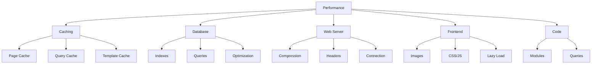

# XOOPS 성능 최적화

최대 속도와 효율성을 위해 XOOPS를 최적화하기 위한 종합 가이드입니다.

## 성능 최적화 개요



## 캐싱 구성

캐싱은 성능을 향상시키는 가장 빠른 방법입니다.

### 페이지 수준 캐싱

XOOPS에서 전체 페이지 캐싱을 활성화합니다.

**관리자 패널 > 시스템 > 기본 설정 > 캐시 설정**

```
Enable Caching: Yes
Cache Type: File Cache (or APCu/Memcache)
Cache Lifetime: 3600 seconds (1 hour)
Cache Module Lists: Yes
Cache Configuration: Yes
Cache Search Results: Yes
```

### 파일 기반 캐싱

파일 캐시 위치 구성:

```bash
# Create cache directory outside web root (more secure)
mkdir -p /var/cache/xoops
chown www-data:www-data /var/cache/xoops
chmod 755 /var/cache/xoops

# Edit mainfile.php
define('XOOPS_CACHE_PATH', '/var/cache/xoops/');
```

### APCu 캐싱

APCu는 인메모리 캐싱을 제공합니다(매우 빠름).

```bash
# Install APCu
apt-get install php-apcu

# Verify installation
php -m | grep apcu

# Configure in php.ini
apc.enabled = 1
apc.memory_size = 128M
apc.ttl = 0
apc.user_ttl = 3600
apc.shm_size = 128
```

XOOPS에서 활성화:

**관리자 패널 > 시스템 > 기본 설정 > 캐시 설정**

```
Cache Type: APCu
```

### Memcache/Redis 캐싱

트래픽이 많은 사이트를 위한 분산 캐싱:

**Memcache 설치:**

```bash
# Install Memcache server
apt-get install memcached

# Start service
systemctl start memcached
systemctl enable memcached

# Verify running
netstat -tlnp | grep memcached
# Should show listening on port 11211
```

**XOOPS에서 구성:**

mainfile.php를 편집합니다:

```php
// Memcache configuration
define('XOOPS_CACHE_TYPE', 'memcache');
define('XOOPS_CACHE_HOST', 'localhost');
define('XOOPS_CACHE_PORT', 11211);
define('XOOPS_CACHE_TIMEOUT', 0);
```

또는 관리자 패널에서:

```
Cache Type: Memcache
Memcache Host: localhost:11211
```

### 템플릿 캐싱

XOOPS 템플릿을 컴파일하고 캐시합니다.

```bash
# Ensure templates_c is writable
chmod 777 /var/www/html/xoops/templates_c/

# Clear old cached templates
rm -rf /var/www/html/xoops/templates_c/*
```

테마로 구성:

```html
<!-- In theme xoops_version.php -->
{smarty.const.XOOPS_VAR_PATH|constant}
<{$xoops_meta}>

<!-- Templates use caching -->
{cache}
    [Cached content here]
{/cache}
```

## 데이터베이스 최적화

### 데이터베이스 색인 추가

적절하게 인덱싱된 데이터베이스는 쿼리 속도가 훨씬 빠릅니다.

```sql
-- Check current indexes
SHOW INDEXES FROM xoops_users;

-- Common indexes to add
ALTER TABLE xoops_users ADD INDEX idx_uname (uname);
ALTER TABLE xoops_users ADD INDEX idx_email (email);
ALTER TABLE xoops_users ADD INDEX idx_uid_active (uid, user_actkey);

-- Add indexes to posts/content tables
ALTER TABLE xoops_posts ADD INDEX idx_post_published (post_published);
ALTER TABLE xoops_posts ADD INDEX idx_post_uid (post_uid);
ALTER TABLE xoops_posts ADD INDEX idx_post_created (post_created);

-- Verify indexes created
SHOW INDEXES FROM xoops_users\G
```

### 테이블 최적화

일반 테이블 최적화로 성능이 향상됩니다.

```sql
-- Optimize all tables
OPTIMIZE TABLE xoops_users;
OPTIMIZE TABLE xoops_posts;
OPTIMIZE TABLE xoops_config;
OPTIMIZE TABLE xoops_comments;

-- Or optimize all at once
REPAIR TABLE xoops_users;
OPTIMIZE TABLE xoops_users;
REPAIR TABLE xoops_posts;
OPTIMIZE TABLE xoops_posts;
```

자동화된 최적화 스크립트 생성:

```bash
#!/bin/bash
# Database optimization script

echo "Optimizing XOOPS database..."

mysql -u xoops_user -p xoops_db << EOF
-- Optimize all tables
OPTIMIZE TABLE xoops_users;
OPTIMIZE TABLE xoops_posts;
OPTIMIZE TABLE xoops_config;
OPTIMIZE TABLE xoops_comments;
OPTIMIZE TABLE xoops_users_online;

-- Show database size
SELECT table_schema,
       ROUND(SUM(data_length + index_length) / 1024 / 1024, 2) as total_mb
FROM information_schema.tables
WHERE table_schema = 'xoops_db'
GROUP BY table_schema;
EOF

echo "Database optimization completed!"
```

cron으로 예약:

```bash
# Weekly optimization
crontab -e
# Add: 0 3 * * 0 /usr/local/bin/optimize-xoops-db.sh
```

### 쿼리 최적화

느린 쿼리 검토:

```sql
-- Enable slow query log
SET GLOBAL slow_query_log = 'ON';
SET GLOBAL long_query_time = 2;

-- View slow queries
SELECT * FROM mysql.slow_log;

-- Or check slow log file
tail -100 /var/log/mysql/slow.log
```

일반적인 최적화 기술:

```php
// SLOW - Avoid unnecessary queries in loops
foreach ($users as $user) {
    $profile = getUserProfile($user['uid']);  // Query in loop!
    echo $profile['name'];
}

// FAST - Get all data at once
$profiles = getAllUserProfiles($user_ids);
foreach ($users as $user) {
    echo $profiles[$user['uid']]['name'];
}
```

### 버퍼 풀 늘리기

더 나은 캐싱을 위해 MySQL을 구성합니다.

`/etc/mysql/mysql.conf.d/mysqld.cnf` 편집:

```ini
# InnoDB Buffer Pool (50-80% of system RAM)
innodb_buffer_pool_size = 1G

# Query Cache (optional, can be disabled in MySQL 5.7+)
query_cache_size = 64M
query_cache_type = 1

# Max Connections
max_connections = 500

# Max Allowed Packet
max_allowed_packet = 256M

# Connection timeout
connect_timeout = 10
```

MySQL을 다시 시작합니다.

```bash
systemctl restart mysql
```

## 웹 서버 최적화

### Gzip 압축 활성화

대역폭을 줄이기 위해 응답을 압축합니다.

**Apache 구성:**

```apache
<IfModule mod_deflate.c>
    AddOutputFilterByType DEFLATE text/html text/plain text/xml text/css text/javascript application/javascript application/json

    # Don't compress images and already compressed files
    SetEnvIfNoCase Request_URI \.(jpg|jpeg|png|gif|zip|gzip)$ no-gzip dont-vary

    # Log compressed responses
    DeflateBufferSize 8096
</IfModule>
```

**Nginx 구성:**

```nginx
gzip on;
gzip_types text/html text/plain text/css text/javascript application/javascript application/json;
gzip_min_length 1000;
gzip_vary on;
gzip_comp_level 6;

# Don't compress already compressed formats
gzip_disable "msie6";
```

압축 확인:

```bash
# Check if response is gzipped
curl -I -H "Accept-Encoding: gzip" http://your-domain.com/xoops/

# Should show:
# Content-Encoding: gzip
```

### 브라우저 캐싱 헤더

정적 자산에 대한 캐시 만료를 설정합니다.

**Apache:**

```apache
<IfModule mod_expires.c>
    ExpiresActive On

    # Cache images for 30 days
    ExpiresByType image/jpeg "access plus 30 days"
    ExpiresByType image/gif "access plus 30 days"
    ExpiresByType image/png "access plus 30 days"
    ExpiresByType image/svg+xml "access plus 30 days"

    # Cache CSS/JS for 30 days
    ExpiresByType text/css "access plus 30 days"
    ExpiresByType application/javascript "access plus 30 days"
    ExpiresByType text/javascript "access plus 30 days"

    # Cache fonts for 1 year
    ExpiresByType font/eot "access plus 1 year"
    ExpiresByType font/ttf "access plus 1 year"
    ExpiresByType font/woff "access plus 1 year"
    ExpiresByType font/woff2 "access plus 1 year"

    # Don't cache HTML
    ExpiresByType text/html "access plus 1 hour"
</IfModule>
```

**엔진엑스:**

```nginx
location ~* \.(jpg|jpeg|png|gif|ico|svg|woff|woff2|ttf|eot)$ {
    expires 30d;
    add_header Cache-Control "public, immutable";
}

location ~* \.(css|js)$ {
    expires 30d;
    add_header Cache-Control "public";
}

location ~ \.html$ {
    expires 1h;
    add_header Cache-Control "public";
}
```

### 연결 유지

지속적인 HTTP 연결을 활성화합니다.

**Apache:**

```apache
<IfModule mod_http.c>
    KeepAlive On
    KeepAliveTimeout 15
    MaxKeepAliveRequests 100
</IfModule>
```

**엔진엑스:**

```nginx
keepalive_timeout 15s;
keepalive_requests 100;
```

## 프론트엔드 최적화

### 이미지 최적화

이미지 파일 크기 줄이기:

```bash
# Batch compress JPEG images
for img in *.jpg; do
    convert "$img" -quality 85 "optimized_$img"
done

# Batch compress PNG images
for img in *.png; do
    optipng -o2 "$img"
done

# Or use imagemin CLI
npm install -g imagemin-cli
imagemin images/ --out-dir=images-optimized
```

### CSS 및 JavaScript 축소

CSS/JS 파일 크기 줄이기:

**Node.js 도구 사용:**

```bash
# Install minifiers
npm install -g uglify-js clean-css-cli

# Minify JavaScript
uglifyjs script.js -o script.min.js

# Minify CSS
cleancss style.css -o style.min.css
```

**온라인 도구 사용:**
- CSS 축소기: https://cssminifier.com/
- JavaScript 축소기: https://www.minifycode.com/javascript-minifier/

### 지연 로드 이미지

필요할 때만 이미지를 로드하세요.

```html
<!-- Add loading="lazy" attribute -->


<!-- Or use JavaScript library for older browsers -->


<script src="https://cdnjs.cloudflare.com/ajax/libs/vanilla-lazyload/17.1.2/lazyload.min.js"></script>
<script>
    var lazyLoad = new LazyLoad({
        elements_selector: ".lazy"
    });
</script>
```

### 렌더링 차단 리소스 줄이기

CSS/JS를 전략적으로 로드:

```html
<!-- Load critical CSS inline -->
<style>
    /* Critical styles for above-the-fold */
</style>

<!-- Defer non-critical CSS -->
<link rel="stylesheet" href="style.css" media="print" onload="this.media='all'">

<!-- Defer JavaScript -->
<script src="script.js" defer></script>

<!-- Or use async for non-critical scripts -->
<script src="analytics.js" async></script>
```

## CDN 통합

더 빠른 글로벌 액세스를 위해 콘텐츠 전달 네트워크를 사용하세요.

### 인기 있는 CDN

| CDN | 비용 | 특징 |
|---|---|---|
| 클라우드플레어 | 무료/유료 | DDoS, DNS, 캐시, 분석 |
| AWS CloudFront | 유료 | 고성능, 글로벌 |
| 토끼 CDN | 저렴한 | 스토리지, 비디오, 캐시 |
| jsDelivr | 무료 | JavaScript 라이브러리 |
| CDNJ | 무료 | 인기 있는 도서관 |

### Cloudflare 설정

1. https://www.cloudflare.com/으로 회원가입
2. 도메인 추가
3. Cloudflare로 이름 서버 업데이트
4. 캐싱 옵션 활성화:
   - 캐시 수준: 공격적
   - 모든 항목에 대한 캐싱: 켜짐
   - 브라우저 캐싱 TTL: 1개월

5. XOOPS에서 Cloudflare DNS를 사용하도록 도메인을 업데이트하세요.

### XOOPS에서 CDN 구성

이미지 URL을 CDN으로 업데이트합니다.

테마 템플릿 편집:

```html
<!-- Original -->


<!-- With CDN -->

```

또는 PHP로 설정:

```php
// In mainfile.php or config
define('XOOPS_CDN_URL', 'https://cdn.your-domain.com');

// In template

```

## 성능 모니터링

### PageSpeed Insights 테스트

사이트 성능을 테스트하십시오.

1. Google PageSpeed Insights를 방문하세요: https://pagespeed.web.dev/
2. XOOPS URL을 입력하세요
3. 권장사항 검토
4. 제안된 개선사항 구현

### 서버 성능 모니터링

실시간 서버 측정항목을 모니터링합니다.

```bash
# Install monitoring tools
apt-get install htop iotop nethogs

# Monitor CPU and memory
htop

# Monitor disk I/O
iotop

# Monitor network
nethogs
```

### PHP 성능 프로파일링

느린 PHP 코드를 식별합니다.

```php
<?php
// Use Xdebug for profiling
xdebug_start_trace('profile');

// Your code here
$result = someExpensiveFunction();

xdebug_stop_trace();
?>
```

### MySQL 쿼리 모니터링

느린 쿼리 추적:

```bash
# Enable query logging
mysql -u root -p

SET GLOBAL general_log = 'ON';
SET GLOBAL log_output = 'FILE';
SET GLOBAL general_log_file = '/var/log/mysql/query.log';

# Review slow queries
tail -f /var/log/mysql/slow.log

# Analyze query with EXPLAIN
EXPLAIN SELECT * FROM xoops_users WHERE uid = 1\G
```

## 성능 최적화 체크리스트

최상의 성능을 얻으려면 다음을 구현하십시오.

- [ ] **캐싱:** 파일/APCu/Memcache 캐싱 활성화
- [ ] **데이터베이스:** 인덱스 추가, 테이블 최적화
- [ ] **압축:** Gzip 압축 활성화
- [ ] **브라우저 캐시:** 캐시 헤더 설정
- [ ] **이미지:** 최적화 및 압축
- [ ] **CSS/JS:** 파일 축소
- [ ] **지연 로딩:** 이미지 구현
- [ ] **CDN:** 정적 자산에 사용
- [ ] **Keep-Alive:** 영구 연결 활성화
- [ ] **모듈:** 사용하지 않는 모듈 비활성화
- [ ] **테마:** 가볍고 최적화된 테마를 사용하세요.
- [ ] **모니터링:** 성과 지표 추적
- [ ] **정기 점검:** 캐시 삭제, DB 최적화

## 성능 최적화 스크립트

자동화된 최적화:

```bash
#!/bin/bash
# Performance optimization script

echo "=== XOOPS Performance Optimization ==="

# Clear cache
echo "Clearing cache..."
rm -rf /var/www/html/xoops/cache/*
rm -rf /var/www/html/xoops/templates_c/*

# Optimize database
echo "Optimizing database..."
mysql -u xoops_user -p xoops_db << EOF
OPTIMIZE TABLE xoops_users;
OPTIMIZE TABLE xoops_posts;
OPTIMIZE TABLE xoops_config;
OPTIMIZE TABLE xoops_comments;
EOF

# Check file permissions
echo "Verifying file permissions..."
find /var/www/html/xoops -type f -exec chmod 644 {} \;
find /var/www/html/xoops -type d -exec chmod 755 {} \;
chmod 777 /var/www/html/xoops/cache
chmod 777 /var/www/html/xoops/templates_c
chmod 777 /var/www/html/xoops/uploads
chmod 777 /var/www/html/xoops/var

# Generate performance report
echo "Performance Optimization Complete!"
echo ""
echo "Next steps:"
echo "1. Test site at https://pagespeed.web.dev/"
echo "2. Monitor performance in admin panel"
echo "3. Consider CDN for static assets"
echo "4. Review slow queries in MySQL"
```

## 측정항목 전후

개선 사항 추적:

```
Before Optimization:
- Page Load Time: 3.5 seconds
- Database Queries: 45
- Cache Hit Rate: 0%
- Database Size: 250MB

After Optimization:
- Page Load Time: 0.8 seconds (77% faster)
- Database Queries: 8 (cached)
- Cache Hit Rate: 85%
- Database Size: 120MB (optimized)
```

## 다음 단계

1. 기본 구성 검토
2. 보안 조치 보장
3. 캐싱 구현
4. 도구를 사용하여 성능 모니터링
5. 측정항목을 기반으로 조정

---

**태그:** #성능 #최적화 #캐싱 #데이터베이스 #cdn

**관련 기사:**
-../../06-Publisher-Module/User-Guide/Basic-Configuration
- 시스템 설정
- 보안 구성
-../설치/서버-요구사항
