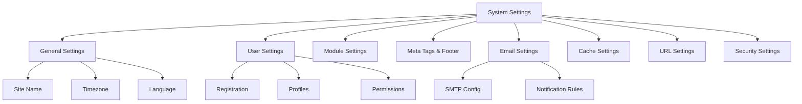

# XOOPS 시스템 설정

이 가이드는 XOOPS 관리자 패널에서 사용할 수 있는 전체 시스템 설정을 범주별로 정리하여 다룹니다.

## 시스템 설정 아키텍처



## 시스템 설정에 액세스하기

### 위치

**관리자 패널 > 시스템 > 기본 설정**

또는 직접 탐색:

```
http://your-domain.com/xoops/admin/index.php?fct=preferences
```

### 권한 요구 사항

- 관리자(웹마스터)만 시스템 설정에 접근할 수 있습니다.
- 변경사항은 전체 사이트에 영향을 미칩니다.
- 대부분의 변경사항은 즉시 적용됩니다.

## 일반 설정

XOOPS 설치를 위한 기본 구성입니다.

### 기본정보

```
Site Name: [Your Site Name]
Default Description: [Brief description of your site]
Site Slogan: [Catchy slogan]
Admin Email: admin@your-domain.com
Webmaster Name: Administrator Name
Webmaster Email: admin@your-domain.com
```

### 외모 설정

```
Default Theme: [Select theme]
Default Language: English (or preferred language)
Items Per Page: 15 (typically 10-25)
Words in Snippet: 25 (for search results)
Theme Upload Permission: Disabled (security)
```

### 지역 설정

```
Default Timezone: [Your timezone]
Date Format: %Y-%m-%d (YYYY-MM-DD format)
Time Format: %H:%M:%S (HH:MM:SS format)
Daylight Saving Time: [Auto/Manual/None]
```

**시간대 형식 표:**

| 지역 | 시간대 | UTC 오프셋 |
|---|---|---|
| 미국 동부 | 아메리카/뉴욕 | -5 / -4 |
| 미국 중부 | 아메리카/시카고 | -6 / -5 |
| 미국 산 | 아메리카/덴버 | -7 / -6 |
| 미국 태평양 | 아메리카/로스앤젤레스 | -8 / -7 |
| 영국/런던 | 유럽/런던 | 0 / +1 |
| 프랑스/독일 | 유럽/파리 | +1 / +2 |
| 일본 | 아시아/도쿄 | +9 |
| 중국 | 아시아/상하이 | +8 |
| 호주/시드니 | 호주/시드니 | +10 / +11 |

### 검색 구성

```
Enable Search: Yes
Search Admin Pages: Yes/No
Search Archives: Yes
Default Search Type: All / Pages only
Words Excluded from Search: [Comma-separated list]
```

**일반적으로 제외되는 단어:** the, a, an, and, or, but, in, on, at, by, to, from

## 사용자 설정

사용자 계정 동작 및 등록 프로세스를 제어합니다.

### 사용자 등록

```
Allow User Registration: Yes/No
Registration Type:
  ☐ Auto-activate (Instant access)
  ☐ Admin approval (Admin must approve)
  ☐ Email verification (User must verify email)

Notification to Users: Yes/No
User Email Verification: Required/Optional
```

### 새 사용자 구성

```
Auto-login New Users: Yes/No
Assign Default User Group: Yes
Default User Group: [Select group]
Create User Avatar: Yes/No
Initial User Avatar: [Select default]
```

### 사용자 프로필 설정

```
Allow User Profiles: Yes
Show Member List: Yes
Show User Statistics: Yes
Show Last Online Time: Yes
Allow User Avatar: Yes
Avatar Max File Size: 100KB
Avatar Dimensions: 100x100 pixels
```

### 사용자 이메일 설정

```
Allow Users to Hide Email: Yes
Show Email on Profile: Yes
Notification Email Interval: Immediately/Daily/Weekly/Never
```

### 사용자 활동 추적

```
Track User Activity: Yes
Log User Logins: Yes
Log Failed Logins: Yes
Track IP Address: Yes
Clear Activity Logs Older Than: 90 days
```

### 계정 한도

```
Allow Duplicate Email: No
Minimum Username Length: 3 characters
Maximum Username Length: 15 characters
Minimum Password Length: 6 characters
Require Special Characters: Yes
Require Numbers: Yes
Password Expiration: 90 days (or Never)
Accounts Inactive Days to Delete: 365 days
```

## 모듈 설정

개별 모듈 동작을 구성합니다.

### 공통 모듈 옵션

설치된 각 모듈에 대해 다음을 설정할 수 있습니다.

```
Module Status: Active/Inactive
Display in Menu: Yes/No
Module Weight: [1-999] (higher = lower in display)
Homepage Default: This module shows when visiting /
Admin Access: [Allowed user groups]
User Access: [Allowed user groups]
```

### 시스템 모듈 설정

```
Show Homepage as: Portal / Module / Static Page
Default Homepage Module: [Select module]
Show Footer Menu: Yes
Footer Color: [Color selector]
Show System Stats: Yes
Show Memory Usage: Yes
```

### 모듈별 구성

각 모듈에는 모듈별 설정이 있을 수 있습니다.

**예 - 페이지 모듈:**
```
Enable Comments: Yes/No
Moderate Comments: Yes/No
Comments Per Page: 10
Enable Ratings: Yes
Allow Anonymous Ratings: Yes
```

**예 - 사용자 모듈:**
```
Avatar Upload Folder: ./uploads/
Maximum Upload Size: 100KB
Allow File Upload: Yes
Allowed File Types: jpg, gif, png
```

모듈별 설정에 액세스:
- **관리자 > 모듈 > [모듈 이름] > 기본 설정**

## 메타 태그 및 SEO 설정

검색 엔진 최적화를 위한 메타 태그를 구성합니다.

### 글로벌 메타 태그

```
Meta Keywords: xoops, cms, content management system
Meta Description: A powerful content management system for building dynamic websites
Meta Author: Your Name
Meta Copyright: Copyright 2025, Your Company
Meta Robots: index, follow
Meta Revisit: 30 days
```

### 메타 태그 모범 사례

| 태그 | 목적 | 추천 |
|---|---|---|
| 키워드 | 검색어 | 5~10개의 관련 키워드(쉼표로 구분) |
| 설명 | 목록 검색 | 150-160자 |
| 작성자 | 페이지 작성자 | 귀하의 이름 또는 회사 |
| 저작권 | 법적 | 귀하의 저작권 고지 |
| 로봇 | 크롤러 지침 | 색인, 팔로우(인덱싱 허용) |

### 바닥글 설정

```
Show Footer: Yes
Footer Color: Dark/Light
Footer Background: [Color code]
Footer Text: [HTML allowed]
Additional Footer Links: [URL and text pairs]
```

**샘플 바닥글 HTML:**
```html
<p>Copyright &copy; 2025 Your Company. All rights reserved.</p>
<p><a href="/privacy">Privacy Policy</a> | <a href="/terms">Terms of Use</a></p>
```

### 소셜 메타 태그(오픈 그래프)

```
Enable Open Graph: Yes
Facebook App ID: [App ID]
Twitter Card Type: summary / summary_large_image / player
Default Share Image: [Image URL]
```

## 이메일 설정

이메일 전달 및 알림 시스템을 구성합니다.

### 이메일 전달 방법

```
Use SMTP: Yes/No

If SMTP:
  SMTP Host: smtp.gmail.com
  SMTP Port: 587 (TLS) or 465 (SSL)
  SMTP Security: TLS / SSL / None
  SMTP Username: [email@example.com]
  SMTP Password: [password]
  SMTP Authentication: Yes/No
  SMTP Timeout: 10 seconds

If PHP mail():
  Sendmail Path: /usr/sbin/sendmail -t -i
```

### 이메일 구성

```
From Address: noreply@your-domain.com
From Name: Your Site Name
Reply-To Address: support@your-domain.com
BCC Admin Emails: Yes/No
```

### 알림 설정

```
Send Welcome Email: Yes/No
Welcome Email Subject: Welcome to [Site Name]
Welcome Email Body: [Custom message]

Send Password Reset Email: Yes/No
Include Random Password: Yes/No
Token Expiration: 24 hours
```

### 관리자 알림

```
Notify Admin on Registration: Yes
Notify Admin on Comments: Yes
Notify Admin on Submissions: Yes
Notify Admin on Errors: Yes
```

### 사용자 알림

```
Notify User on Registration: Yes
Notify User on Comments: Yes
Notify User on Private Messages: Yes
Allow Users to Disable Notifications: Yes
Default Notification Frequency: Immediately
```

### 이메일 템플릿

관리자 패널에서 알림 이메일을 맞춤설정하세요.

**경로:** 시스템 > 이메일 템플릿

사용 가능한 템플릿:
- 사용자 등록
- 비밀번호 재설정
- 댓글 알림
- 비공개 메시지
- 시스템 경고
- 모듈별 이메일

## 캐시 설정

캐싱을 통해 성능을 최적화합니다.

### 캐시 구성

```
Enable Caching: Yes/No
Cache Type:
  ☐ File Cache
  ☐ APCu (Alternative PHP Cache)
  ☐ Memcache (Distributed caching)
  ☐ Redis (Advanced caching)

Cache Lifetime: 3600 seconds (1 hour)
```

### 유형별 캐시 옵션

**파일 캐시:**
```
Cache Directory: /var/www/html/xoops/cache/
Clear Interval: Daily
Maximum Cache Files: 1000
```

**APCu 캐시:**
```
Memory Allocation: 128MB
Fragmentation Level: Low
```

**멤캐시/Redis:**
```
Server Host: localhost
Server Port: 11211 (Memcache) / 6379 (Redis)
Persistent Connection: Yes
```

### 캐시되는 내용

```
Cache Module Lists: Yes
Cache Configuration Data: Yes
Cache Template Data: Yes
Cache User Session Data: Yes
Cache Search Results: Yes
Cache Database Queries: Yes
Cache RSS Feeds: Yes
Cache Images: Yes
```

## URL 설정

URL 재작성 및 형식을 구성합니다.

### 친숙한 URL 설정

```
Enable Friendly URLs: Yes/No
Friendly URL Type:
  ☐ Path Info: /page/about
  ☐ Query String: /index.php?p=about

Trailing Slash: Include / Omit
URL Case: Lower case / Case sensitive
```

### URL 재작성 규칙

```
.htaccess Rules: [Display current]
Nginx Rules: [Display current if Nginx]
IIS Rules: [Display current if IIS]
```

## 보안 설정

보안 관련 구성을 제어합니다.

### 비밀번호 보안

```
Password Policy:
  ☐ Require uppercase letters
  ☐ Require lowercase letters
  ☐ Require numbers
  ☐ Require special characters

Minimum Password Length: 8 characters
Password Expiration: 90 days
Password History: Remember last 5 passwords
Force Password Change: On next login
```

### 로그인 보안

```
Lock Account After Failed Attempts: 5 attempts
Lock Duration: 15 minutes
Log All Login Attempts: Yes
Log Failed Logins: Yes
Admin Login Alert: Send email on admin login
Two-Factor Authentication: Disabled/Enabled
```

### 파일 업로드 보안

```
Allow File Uploads: Yes/No
Maximum File Size: 128MB
Allowed File Types: jpg, gif, png, pdf, zip, doc, docx
Scan Uploads for Malware: Yes (if available)
Quarantine Suspicious Files: Yes
```

### 세션 보안

```
Session Management: Database/Files
Session Timeout: 1800 seconds (30 min)
Session Cookie Lifetime: 0 (until browser closes)
Secure Cookie: Yes (HTTPS only)
HTTP Only Cookie: Yes (prevent JavaScript access)
```

### CORS 설정

```
Allow Cross-Origin Requests: No
Allowed Origins: [List domains]
Allow Credentials: No
Allowed Methods: GET, POST
```

## 고급 설정

고급 사용자를 위한 추가 구성 옵션입니다.

### 디버그 모드

```
Debug Mode: Disabled/Enabled
Log Level: Error / Warning / Info / Debug
Debug Log File: /var/log/xoops_debug.log
Display Errors: Disabled (production)
```

### 성능 튜닝

```
Optimize Database Queries: Yes
Use Query Cache: Yes
Compress Output: Yes
Minify CSS/JavaScript: Yes
Lazy Load Images: Yes
```

### 콘텐츠 설정

```
Allow HTML in Posts: Yes/No
Allowed HTML Tags: [Configure]
Strip Harmful Code: Yes
Allow Embed: Yes/No
Content Moderation: Automatic/Manual
Spam Detection: Yes
```

## 설정 내보내기/가져오기

### 백업 설정

현재 설정 내보내기:

**관리자 패널 > 시스템 > 도구 > 내보내기 설정**

```bash
# Settings exported as JSON file
# Download and store securely
```

### 설정 복원

이전에 내보낸 설정 가져오기:

**관리자 패널 > 시스템 > 도구 > 가져오기 설정**

```bash
# Upload JSON file
# Verify changes before confirming
```

## 구성 계층

XOOPS 설정 계층 구조(위에서 아래로 - 첫 번째 일치 승리):

```
1. mainfile.php (Constants)
2. Module-specific config
3. Admin System Settings
4. Theme configuration
5. User preferences (for user-specific settings)
```

## 설정 백업 스크립트

현재 설정의 백업을 만듭니다.

```php
<?php
// Backup script: /var/www/html/xoops/backup-settings.php
require_once __DIR__ . '/mainfile.php';

$config_handler = xoops_getHandler('config');
$configs = $config_handler->getConfigs();

$backup = [
    'exported_date' => date('Y-m-d H:i:s'),
    'xoops_version' => XOOPS_VERSION,
    'php_version' => PHP_VERSION,
    'settings' => []
];

foreach ($configs as $config) {
    $backup['settings'][$config->getVar('conf_name')] = [
        'value' => $config->getVar('conf_value'),
        'description' => $config->getVar('conf_desc'),
        'type' => $config->getVar('conf_type'),
    ];
}

// Save to JSON file
file_put_contents(
    '/backups/xoops_settings_' . date('YmdHis') . '.json',
    json_encode($backup, JSON_PRETTY_PRINT)
);

echo "Settings backed up successfully!";
?>
```

## 일반적인 설정 변경 사항

### 사이트 이름 변경

1. 관리 > 시스템 > 환경설정 > 일반 설정
2. "사이트 이름" 수정
3. '저장'을 클릭하세요.

### 등록 활성화/비활성화

1. 관리 > 시스템 > 환경설정 > 사용자 설정
2. "사용자 등록 허용"을 전환합니다.
3. 등록 유형 선택
4. '저장'을 클릭하세요.

### 기본 테마 변경

1. 관리 > 시스템 > 환경설정 > 일반 설정
2. '기본 테마'를 선택하세요.
3. '저장'을 클릭하세요.
4. 변경 사항을 적용하려면 캐시를 지웁니다.

### 연락처 이메일 업데이트

1. 관리 > 시스템 > 환경설정 > 일반 설정
2. "관리자 이메일" 수정
3. '웹마스터 이메일' 수정
4. '저장'을 클릭하세요.

## 확인 체크리스트

시스템 설정을 구성한 후 다음을 확인하십시오.

- [ ] 사이트 이름이 올바르게 표시됩니다.
- [ ] 시간대가 정확한 시간을 표시합니다.
- [ ] 이메일 알림이 제대로 전송됩니다.
- [ ] 사용자 등록은 구성된 대로 작동합니다.
- [ ] 홈페이지에는 선택된 기본값이 표시됩니다.
- [ ] 검색 기능이 작동합니다.
- [ ] 캐시가 페이지 로드 시간을 향상시킵니다.
- [ ] 친숙한 URL이 작동합니다(활성화된 경우)
- [ ] 메타 태그가 페이지 소스에 나타납니다.
- [ ] 관리자 알림이 수신됨
- [ ] 보안 설정이 시행되었습니다.

## 문제 해결 설정

### 설정이 저장되지 않음

**해결책:**
```bash
# Check file permissions on config directory
chmod 755 /var/www/html/xoops/var/

# Verify database writable
# Try saving again in admin panel
```

### 변경사항이 적용되지 않음

**해결책:**
```bash
# Clear cache
rm -rf /var/www/html/xoops/cache/*
rm -rf /var/www/html/xoops/templates_c/*

# If still not working, restart web server
systemctl restart apache2
```

### 이메일이 전송되지 않음

**해결책:**
1. 이메일 설정에서 SMTP 자격 증명 확인
2. "테스트 이메일 보내기" 버튼으로 테스트
3. 오류 로그 확인
4. SMTP 대신 PHP mail()을 사용해 보세요.

## 다음 단계

시스템 설정 구성 후:

1. 보안 설정 구성
2. 성능 최적화
3. 관리자 패널 기능 살펴보기
4. 사용자 관리 설정

---

**태그:** #시스템 설정 #구성 #기본 설정 #관리 패널

**관련 기사:**
-../../06-Publisher-Module/User-Guide/Basic-Configuration
- 보안 구성
- 성능 최적화
-../첫 번째 단계/관리자 패널 개요
