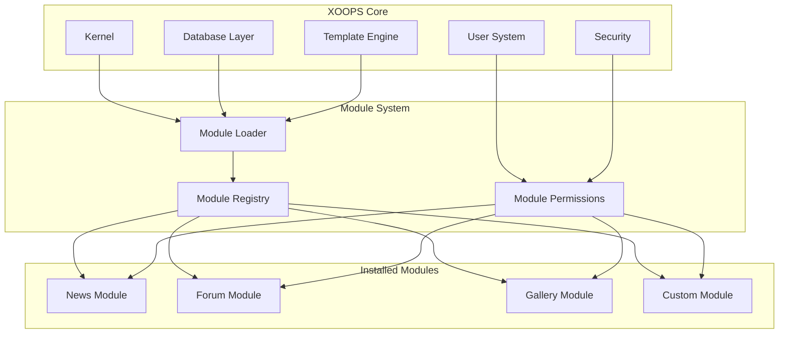
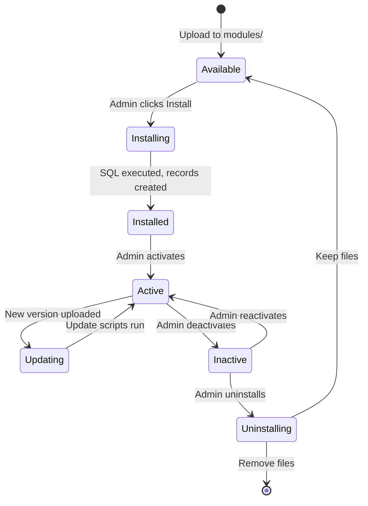

# ADR-001: 모듈형 아키텍처

> XOOPS의 핵심 모듈형 설계 철학에 대한 아키텍처 결정 기록입니다.

---

## 상태

**수락됨** - XOOPS 창립 이후의 기본 결정

---

## 컨텍스트

XOOPS(eXtensible Object-Oriented Portal System)에는 다음과 같은 아키텍처가 필요했습니다.

1. 타사 개발자가 기능을 확장할 수 있도록 허용
2. 사이트 관리자가 코딩 없이 사용자 정의할 수 있습니다.
3. 독립적인 개발 및 업데이트 지원
4. 다양한 기능 간의 격리 제공
5. 간단한 블로그에서 복잡한 포털로 확장

2000년대 초반 CMS 환경은 맞춤화 및 확장이 어려운 모놀리식 시스템을 제공했습니다.

---

## 결정 다이어그램



---

## 결정

우리는 다음과 같은 **모듈형 아키텍처**를 구현할 것입니다.

### 1. 코어는 인프라를 제공합니다
- 데이터베이스 추상화
- 사용자 인증 및 권한
- 템플릿 렌더링(Smarty)
- 보안 유틸리티
- 양식 생성
- 공통 유틸리티

### 2. 모듈은 독립적입니다.
각 모듈:
- 자체 디렉토리 구조를 가지고 있습니다.
- 자체 클래스, 템플릿, SQL 포함
- 자체 구성을 정의합니다.
- 독립적으로 설치/제거 가능
- 버전 추적 기능이 있습니다

### 3. 표준 모듈 구조
```
modules/modulename/
├── admin/                  # Admin interface
│   ├── index.php
│   └── menu.php
├── class/                  # PHP classes
├── include/                # Include files
├── language/               # Translations
├── sql/                    # Database schema
├── templates/              # Smarty templates
├── blocks/                 # Block definitions
├── xoops_version.php       # Module manifest
├── index.php               # Entry point
└── header.php              # Module bootstrap
```

### 4. 모듈 매니페스트(xoops_version.php)
```php
<?php
$modversion['name']        = 'Module Name';
$modversion['version']     = '1.0.0';
$modversion['description'] = 'Module description';
$modversion['dirname']     = basename(__DIR__);
$modversion['hasMain']     = 1;
$modversion['hasAdmin']    = 1;
$modversion['sqlfile']['mysql'] = 'sql/mysql.sql';
$modversion['tables']      = ['modulename_table1'];
$modversion['templates']   = [...];
$modversion['config']      = [...];
$modversion['blocks']      = [...];
```

### 5. 모듈 통신
- 핵심 API(핸들러, 이벤트)를 통해
- 데이터베이스 관계
- 예압 후크
- 공유 서비스

---

## 모듈 수명주기



---

## 결과

### 긍정적

1. **확장성**: 커뮤니티에서 생성한 수천 개의 모듈
2. **독립성**: 모듈을 별도로 개발할 수 있습니다.
3. **유연성**: 사이트에서 다양한 기능을 조합할 수 있습니다.
4. **유지관리성**: 업데이트는 다른 모듈에 영향을 주지 않습니다.
5. **마켓플레이스**: 모듈 생태계 등장
6. **학습 곡선**: 개발자는 하나의 패턴을 학습합니다.

### 부정적

1. **오버헤드**: 각 모듈에는 부트스트랩 비용이 있습니다.
2. **중복**: 공통코드가 반복될 수 있음
3. **통합**: 교차 모듈 기능에는 신중한 설계가 필요합니다.
4. **버전 관리**: 모듈 호환성 관리 필요
5. **품질 차이**: 타사 모듈 품질은 다양합니다.

### 중립

1. **데이터베이스**: 각 모듈은 자체 테이블을 관리합니다.
2. **템플릿**: 테마는 다양한 모듈을 수용해야 합니다.
3. **업데이트**: 코어 및 모듈은 독립적으로 업데이트됩니다.

---

## 고려되는 대안

### 1. 모놀리식 아키텍처
**거부됨** - 너무 단단하여 맞춤설정이 어렵습니다.

### 2. 플러그인 아키텍처(WordPress 스타일)
**부분적으로 채택됨** - 블록 및 사전 로드는 모듈 내에서 플러그인과 유사한 후크를 제공합니다.

### 3. 구성 요소 아키텍처(Joomla 스타일)
**거부됨** - 더 복잡하고 개발자 친화적이지 않음

### 4. 마이크로서비스
**해당 사항 없음** - 공유 호스팅 시대에는 너무 복잡함

---

## 관련 결정

- ADR-002: 객체 지향 데이터베이스 액세스
- ADR-003: Smarty 템플릿 엔진
- ADR-005: 권한 시스템

---

## 참고자료

- XOOPS 프로젝트 연혁
- PHP 애플리케이션 아키텍처 패턴
- CMS 비교 연구(2001-2005)

---

#xoops #아키텍처 #adr #모듈 #디자인 결정
