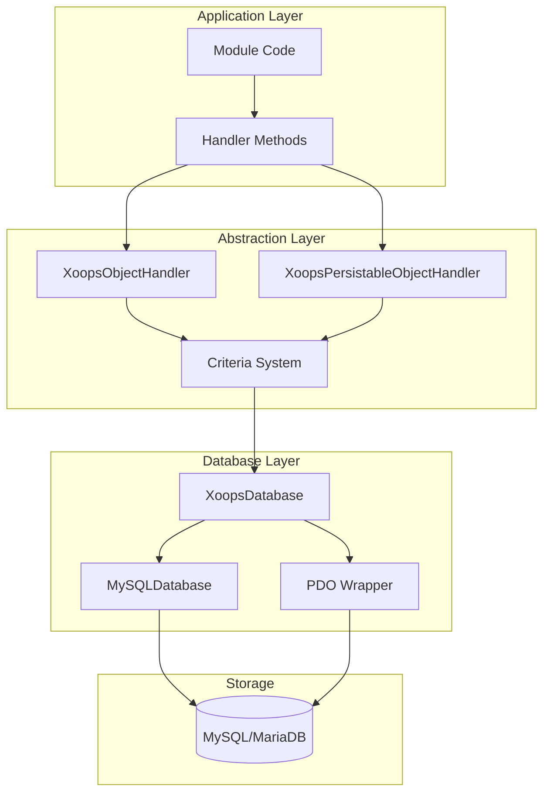
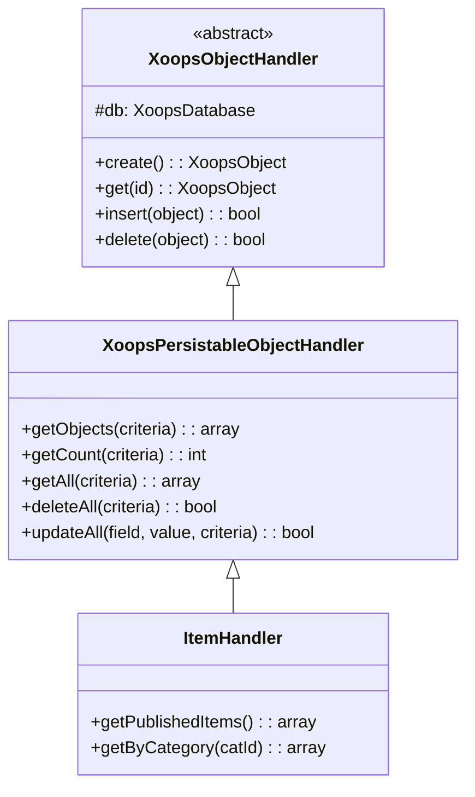
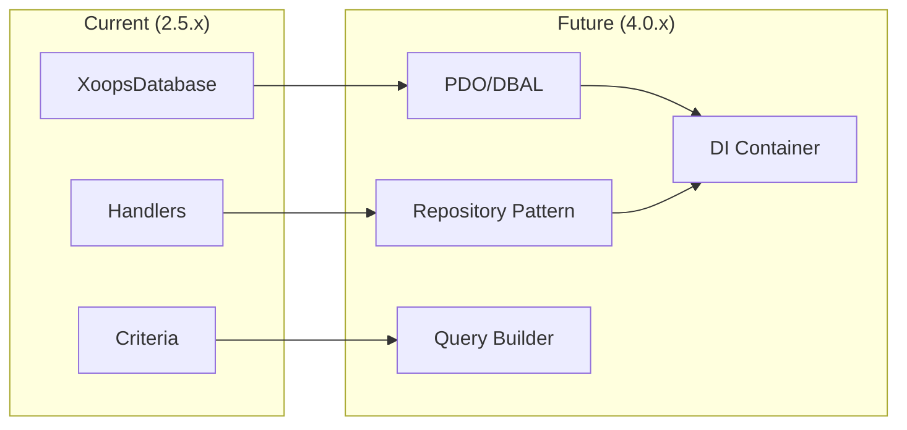

# ADR-002: 데이터베이스 추상화

> XOOPS의 객체지향 데이터베이스 접근 패턴에 대한 아키텍처 결정 기록입니다.

---

## 상태

**승인됨** - XOOPS 2.0 이후의 핵심 패턴

---

## 컨텍스트

XOOPS에는 다음과 같은 데이터베이스 상호 작용 전략이 필요했습니다.

1. 데이터베이스별 SQL 구문을 추상화합니다.
2. 모든 모듈에서 일관된 CRUD 작업 제공
3. 자동 데이터 삭제 및 탈출 활성화
4. 향후 데이터베이스 엔진 변경 지원
5. 개발자를 위한 일반적인 작업 단순화

대안은 다음과 같습니다.
- 코드베이스 전반에 걸친 원시 SQL
- 전체 ORM(교리, Eloquent)
- 맞춤형 경량 추상화

---

## 결정 다이어그램



---

## 결정

다음을 사용하여 **핸들러 패턴**을 구현합니다.

### 1. XoopsObject - 데이터 컨테이너

각 데이터 엔터티는 XoopsObject을 확장합니다.

```php
class Item extends XoopsObject
{
    public function __construct()
    {
        $this->initVar('id', XOBJ_DTYPE_INT, null, false);
        $this->initVar('title', XOBJ_DTYPE_TXTBOX, '', true, 255);
        $this->initVar('content', XOBJ_DTYPE_TXTAREA, '', false);
        $this->initVar('status', XOBJ_DTYPE_INT, 0, false);
    }
}
```

### 2. 핸들러 - 운영 관리자

각 객체에는 해당 핸들러가 있습니다.

```php
class ItemHandler extends XoopsPersistableObjectHandler
{
    public function __construct($db)
    {
        parent::__construct($db, 'mymodule_items', Item::class, 'id', 'title');
    }

    // CRUD methods inherited:
    // - create(), get(), insert(), delete()
    // - getObjects(), getCount(), getAll()
}
```

### 3. Criteria - 쿼리 빌더

객체 지향 쿼리 조건:

```php
$criteria = new CriteriaCompo();
$criteria->add(new Criteria('status', 1));
$criteria->add(new Criteria('created', time() - 86400, '>='));
$criteria->setSort('created');
$criteria->setOrder('DESC');
$criteria->setLimit(10);

$items = $handler->getObjects($criteria);
```

---

## 데이터 유형 상수

```php
// Variable types with automatic sanitization
XOBJ_DTYPE_INT       // Integer
XOBJ_DTYPE_TXTBOX    // Single-line text (escaped)
XOBJ_DTYPE_TXTAREA   // Multi-line text (escaped)
XOBJ_DTYPE_EMAIL     // Email validation
XOBJ_DTYPE_URL       // URL validation
XOBJ_DTYPE_ARRAY     // Serialized array
XOBJ_DTYPE_OTHER     // No processing
XOBJ_DTYPE_FLOAT     // Floating point
```

---

## 핸들러 상속



---

## 결과

### 긍정적

1. **일관성**: 모든 모듈은 동일한 패턴을 사용합니다.
2. **보안**: 자동 이스케이프를 통해 SQL 주입을 방지합니다.
3. **단순성**: 일반적인 작업에는 최소한의 코드가 필요합니다.
4. **유지관리성**: 데이터베이스 계층에 대한 변경 사항은 모듈에 영향을 미치지 않습니다.
5. **테스트 가능성**: 테스트를 위해 핸들러를 모의할 수 있습니다.

### 부정적

1. **성능**: 추가 추상화 오버헤드
2. **복잡성**: 신규 개발자를 위한 학습 곡선
3. **제한사항**: 복잡한 쿼리에는 원시 SQL이 필요할 수 있습니다.
4. **N+1 문제**: 내장된 즉시 로딩이 없습니다.

### 완화

- **성능**: 자주 액세스하는 개체를 캐시합니다.
- **복잡한 쿼리**: 필요할 때 원시 SQL을 허용합니다.
- **N+1**: 적절한 기준으로 getAll()을 사용하세요.

---

## XOOPS 4.0으로의 진화



XOOPS 4.0 계획:
- 데이터베이스 추상화를 위한 DBAL 교리
- 리포지토리 패턴 대체 핸들러
- 복잡한 쿼리를 위한 쿼리 빌더
- 전체 PSR-11 컨테이너 통합

---

## 코드 예

### 기본 CRUD

```php
$helper = Helper::getInstance();
$handler = $helper->getHandler('Item');

// Create
$item = $handler->create();
$item->setVar('title', 'New Item');
$handler->insert($item);

// Read
$item = $handler->get($id);
$title = $item->getVar('title');

// Update
$item->setVar('title', 'Updated Title');
$handler->insert($item);

// Delete
$handler->delete($item);
```

### 복잡한 쿼리

```php
$criteria = new CriteriaCompo();
$criteria->add(new Criteria('status', 'published'));
$criteria->add(new Criteria('category_id', '(1,2,3)', 'IN'));
$criteria->add(new Criteria('created', strtotime('-30 days'), '>='));
$criteria->setSort('views');
$criteria->setOrder('DESC');
$criteria->setLimit(10);
$criteria->setStart(0);

$items = $handler->getObjects($criteria);
$total = $handler->getCount($criteria);
```

---

## 관련 결정

- ADR-001: 모듈형 아키텍처
- ADR-003: Smarty 템플릿 엔진

---

## 참고자료

- 마틴 파울러 - 엔터프라이즈 애플리케이션 아키텍처의 패턴
- 도메인 중심 디자인 개념
- 활성 레코드와 데이터 매퍼 패턴

---

#xoops #아키텍처 #adr #데이터베이스 #핸들러 #설계 결정
