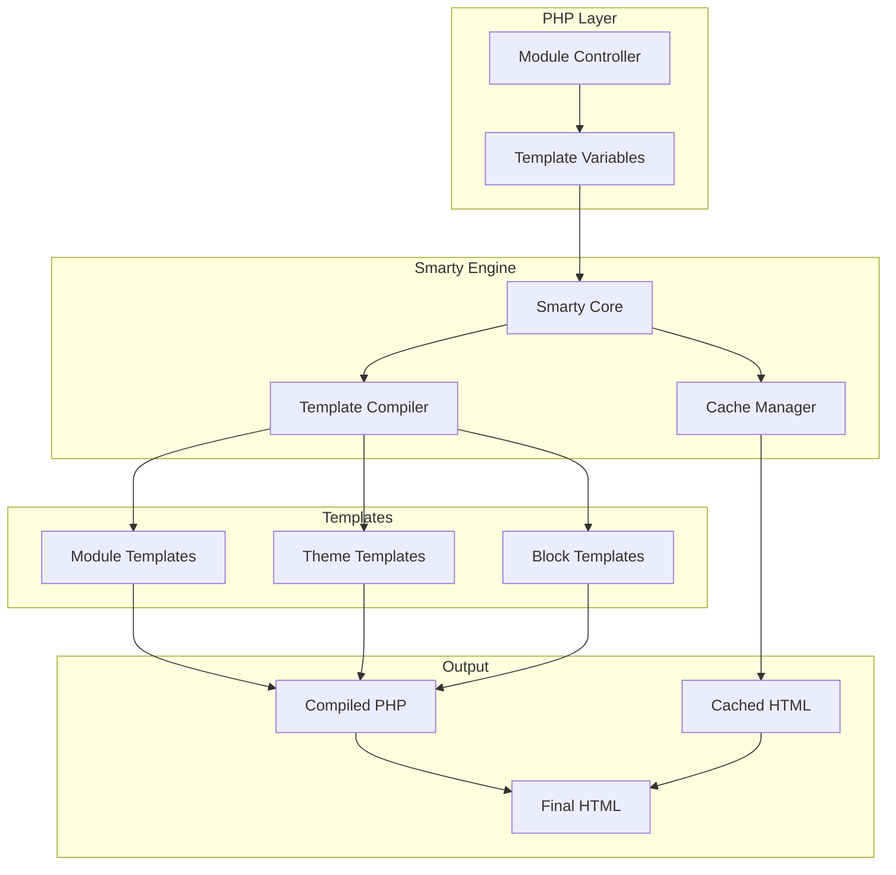
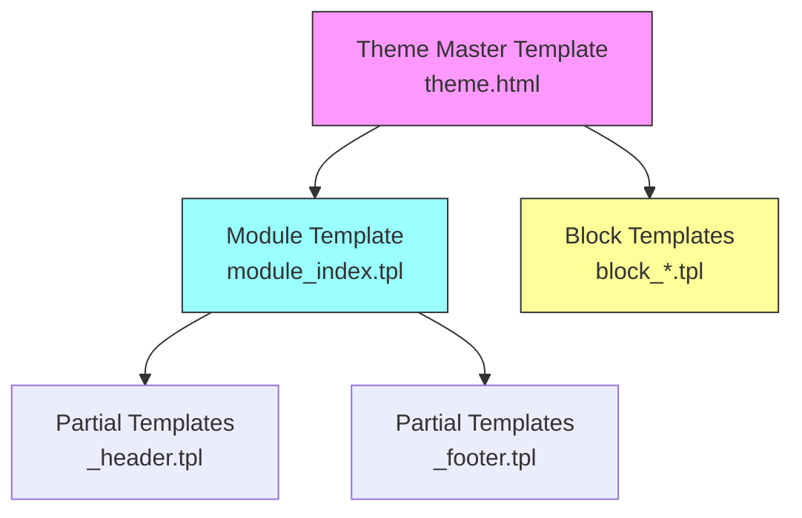
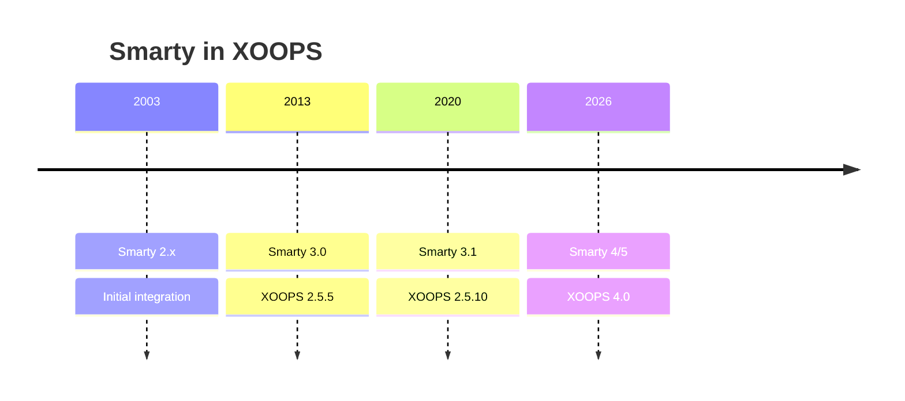

# ADR-003: 템플릿 엔진(Smarty)

> XOOPS의 Smarty 템플릿 엔진 채택을 위한 아키텍처 결정 기록입니다.

---

## 상태

**수락됨** - XOOPS 2.0 이후 핵심 결정

**진화 중** - XOOPS 4.0에 대해 Smarty 4/5로 마이그레이션 예정

---

## 컨텍스트

XOOPS에는 다음과 같은 템플릿 솔루션이 필요했습니다.

1. 비즈니스 로직과 별도의 프리젠테이션
2. 테마 디자이너가 PHP 지식 없이도 작업할 수 있도록 허용
3. 템플릿 상속 지원 및 포함
4. 성능을 위한 캐싱 제공
5. 사용자 정의 가능한 템플릿 활성화
6. 국제화 지원

---

## 결정 다이어그램



---

## 결정

다음과 같은 이유로 **Smarty**를 템플릿 엔진으로 사용합니다.

### 1. 우려 사항의 분리

```php
// PHP (Controller) - Business logic
$items = $itemHandler->getPublishedItems();
$xoopsTpl->assign('items', $items);

// Smarty (View) - Presentation
// templates/items.tpl
```

```smarty
{* Smarty template - No PHP logic *}
<{foreach item=item from=$items}>
    <article>
        <h2><{$item.title}></h2>
        <p><{$item.summary}></p>
    </article>
<{/foreach}>
```

### 2. XOOPS 구분 기호

XOOPS는 표준 `{` `}` 대신 `<{` 및 `}>`을 사용합니다.

```smarty
{* Standard Smarty *}
{$variable}

{* XOOPS Smarty - Avoids JavaScript conflicts *}
<{$variable}>
```

### 3. 템플릿 계층 구조



### 4. 템플릿 저장

- **데이터베이스**: 되돌리기 기능을 위해 저장된 사용자 정의 템플릿
- **파일 시스템**: 모듈 디렉터리의 원본 템플릿
- **캐시**: 성능을 위해 컴파일된 템플릿

---

## Smarty 구성

```php
// XOOPS Smarty initialization
$xoopsTpl = new XoopsTpl();

// Custom delimiters
$xoopsTpl->left_delim = '<{';
$xoopsTpl->right_delim = '}>';

// Caching
$xoopsTpl->caching = XOOPS_TEMPLATE_CACHE;
$xoopsTpl->cache_lifetime = 3600;

// Security
$xoopsTpl->security_policy = new Smarty_Security($xoopsTpl);
$xoopsTpl->security_policy->php_functions = [];
$xoopsTpl->security_policy->php_modifiers = ['escape', 'count'];
```

---

## 사용된 템플릿 기능

### 변수

```smarty
{* Simple variable *}
<{$title}>

{* Object property *}
<{$item.title}>

{* With modifier *}
<{$content|truncate:200:'...'}>

{* Escaped output *}
<{$userInput|escape:'html'}>
```

### 제어 구조

```smarty
{* Conditional *}
<{if $isAdmin}>
    <a href="admin.php">Admin</a>
<{elseif $isUser}>
    <a href="profile.php">Profile</a>
<{else}>
    <a href="login.php">Login</a>
<{/if}>

{* Loop *}
<{foreach item=item from=$items name=itemloop}>
    <{$smarty.foreach.itemloop.index}>: <{$item.title}>
<{/foreach}>
```

### 포함

```smarty
{* Include another template *}
<{include file="db:mymodule_header.tpl"}>

{* Include with variables *}
<{include file="db:mymodule_item.tpl" item=$currentItem}>

{* Include from theme *}
<{include file="file:$theme_path/partials/sidebar.tpl"}>
```

---

## 결과

### 긍정적

1. **디자이너 친화적**: HTML과 유사한 구문
2. **캐싱**: 내장 템플릿 캐싱
3. **보안**: PHP 코드 격리
4. **유연성**: 수정자, 기능, 플러그인
5. **사용자 정의**: 사용자가 템플릿을 수정할 수 있습니다.
6. **커뮤니티**: 대규모 Smarty 생태계

### 부정적

1. **학습 곡선**: Smarty 특정 구문
2. **오버헤드**: 컴파일 단계가 필요합니다.
3. **디버깅**: 템플릿 오류는 난해할 수 있습니다.
4. **버전 문제**: 버전 간의 주요 변경 사항

### 완화

- **학습**: 종합 문서
- **성능**: 적극적인 캐싱
- **디버깅**: 디버그 콘솔, 오류 메시지 지우기
- **버전**: XOOPS의 호환성 레이어

---

## 버전 기록



---

## 마이그레이션: Smarty 3에서 4/5

### 주요 변경 사항

```smarty
{* Smarty 3 - Deprecated *}
<{php}>echo date('Y');<{/php}>

{* Smarty 4+ - Use modifiers or assign from PHP *}
<{$current_year}>

{* Smarty 3 - {section} deprecated *}
<{section name=i loop=$items}>
    <{$items[i].title}>
<{/section}>

{* Smarty 4+ - Use {foreach} *}
<{foreach $items as $item}>
    <{$item.title}>
<{/foreach}>
```

### 호환성 레이어

XOOPS는 원활한 전환을 위해 호환성 레이어를 제공합니다.

```php
// XoopsTpl extends Smarty with compatibility methods
class XoopsTpl extends Smarty
{
    public function assign($tpl_var, $value = null)
    {
        // Handles both Smarty 3 and 4 syntax
        return parent::assign($tpl_var, $value);
    }
}
```

---

## 고려되는 대안

### 1. 나뭇가지
**장점**: 현대적인 Symfony 생태계
**단점**: 다른 구문, 마이그레이션 노력
**결정**: XOOPS 3.x에 가능한 향후 옵션

### 2. 블레이드(라라벨)
**장점**: 깔끔한 구문, 인기 있음
**단점**: Laravel 관련
**결정**: 독립형 사용에는 적합하지 않습니다.

### 3. 기본 PHP 템플릿
**장점**: 학습 곡선이 없고 빠릅니다.
**단점**: 보안 위험, 분리 불가
**결정**: 유지보수성 문제로 거부됨

---

## 관련 결정

- ADR-001: 모듈형 아키텍처
- ADR-002: 데이터베이스 추상화

---

## 참고자료

- Smarty 문서: https://www.smarty.net/docs/en/
- XOOPS 템플릿 시스템 가이드
- 웹 애플리케이션의 MVC 패턴

---

#xoops #아키텍처 #adr #smarty #템플릿 #디자인 결정
