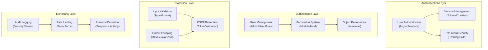

# ADR-004: 보안 시스템 아키텍처

> 최신 위협으로부터 보호하는 XOOPS CMS를 위한 포괄적인 보안 아키텍처입니다.

---

## 상태

**수락됨** - XOOPS 2.5 이후의 핵심 보안 계층

---

## 컨텍스트

### 문제 설명

XOOPS에는 다음과 같은 강력한 보안 시스템이 필요합니다.

1. **일반적인 웹 취약성으로부터 보호**(OWASP 상위 10개)
2. 모듈 전반에 걸쳐 **세부적인 권한 제어 제공**
3. 최신 표준으로 **보안 사용자 인증 가능**
4. **데이터 침해** 및 무단 액세스를 방지합니다.
5. **다단계 접근 제어 지원** (관리자, 중재자, 사용자, 손님)
6. **모든 모듈과 원활하게 통합**

### 현재 위협

최신 웹 공격에는 다음이 포함됩니다.

- **SQL 인젝션** - 사용자 입력에 악성 SQL 삽입
- **XSS(교차 사이트 스크립팅)** - 페이지에 JavaScript 삽입
- **CSRF(Cross-Site Request Forgery)** - 승인되지 않은 양식 제출
- **인증 우회** - 취약한 세션/비밀번호 처리
- **승인 우회** - 권한 승격
- **데이터 노출** - URL, 로그, 캐시의 민감한 데이터

### XOOPS 보안 요구 사항

1. 사용자 인증 및 세션 관리
2. 역할 기반 액세스 제어(RBAC)
3. 모듈 및 객체에 대한 권한 시스템
4. 입력 검증 및 출력 이스케이프
5. 일반적인 공격으로부터 보호
6. 보안 이벤트의 감사 로깅
7. 안전한 비밀번호 처리
8. CSRF 토큰 보호

---

## 결정

### 핵심 보안 아키텍처



---

## 보안 구성요소

### 1. 인증 시스템

**사용자 로그인 프로세스:**

```php
<?php
// 1. Validate credentials
$user = $userHandler->findByLogin($username);
if (!$user || !password_verify($password, $user->getVar('pass'))) {
    throw new AuthenticationException('Invalid credentials');
}

// 2. Check if account is active
if (!$user->getVar('uactive')) {
    throw new AuthenticationException('Account inactive');
}

// 3. Create secure session
session_regenerate_id(true);
$_SESSION['uid'] = $user->getVar('uid');
$_SESSION['token'] = bin2hex(random_bytes(32));
$_SESSION['created'] = time();

// 4. Log the login
$this->auditLog('USER_LOGIN', $user->getVar('uid'));
```

**비밀번호 보안:**

```php
<?php
// Use password_hash (not MD5 or SHA1)
$hashed = password_hash($password, PASSWORD_BCRYPT, [
    'cost' => 12, // High cost = slow brute force
]);

// Verify password
if (!password_verify($inputPassword, $hashed)) {
    throw new Exception('Invalid password');
}

// Rehash if algorithm or cost changed
if (password_needs_rehash($hashed, PASSWORD_BCRYPT, ['cost' => 12])) {
    $newHash = password_hash($password, PASSWORD_BCRYPT, ['cost' => 12]);
    $user->setVar('pass', $newHash);
    $userHandler->insert($user);
}
```

### 2. 세션 관리

**보안 세션 처리:**

```php
<?php
// Session configuration
ini_set('session.cookie_httponly', true);  // No JS access
ini_set('session.cookie_secure', true);     // HTTPS only
ini_set('session.cookie_samesite', 'Strict'); // CSRF protection
ini_set('session.gc_maxlifetime', 3600);   // 1 hour timeout
ini_set('session.sid_length', 64);         // 64-char session ID

// Validate session
function validateSession() {
    // Check timeout
    if (time() - $_SESSION['created'] > 3600) {
        session_destroy();
        throw new SessionExpiredException();
    }

    // Validate user agent (prevent session hijacking)
    if ($_SESSION['user_agent'] !== $_SERVER['HTTP_USER_AGENT']) {
        throw new SessionInvalidException();
    }

    // Validate IP (optional, can be too strict)
    if (!in_array($_SERVER['REMOTE_ADDR'], $_SESSION['ips'])) {
        $_SESSION['ips'][] = $_SERVER['REMOTE_ADDR'];
    }
}
```

### 3. 승인(RBAC)

**역할 기반 액세스 제어:**

```php
<?php
class XoopsUser {
    public function hasPermission(string $permissionName): bool
    {
        // Get user groups
        $groups = $this->getGroups();

        // Check if any group has permission
        foreach ($groups as $groupId) {
            if ($this->checkGroupPermission($groupId, $permissionName)) {
                return true;
            }
        }

        return false;
    }

    /**
     * User groups and their permissions
     * Admin: Full access
     * Moderator: Content management
     * User: Create own content
     * Guest: Read-only access
     */
    private function checkGroupPermission(int $groupId, string $permission): bool
    {
        $permissions = [
            1 => ['admin_access'],                 // Admin group
            2 => ['moderate_content', 'edit_own'], // Moderator group
            3 => ['create_content', 'edit_own'],   // User group
            4 => [],                               // Guest group (no permissions)
        ];

        return in_array($permission, $permissions[$groupId] ?? []);
    }
}
```

### 4. 입력 유효성 검사

**SQL 삽입 및 유형 오류 방지:**

```php
<?php
// Always use prepared statements
$sql = 'SELECT * FROM users WHERE id = ?';
$result = $db->query($sql, [$userId]); // ✅ Safe

// Input validation
function validateUserInput(array $data): array
{
    return [
        'email' => filter_var($data['email'] ?? '', FILTER_VALIDATE_EMAIL),
        'age' => filter_var($data['age'] ?? 0, FILTER_VALIDATE_INT),
        'website' => filter_var($data['website'] ?? '', FILTER_VALIDATE_URL),
        'title' => substr(trim($data['title'] ?? ''), 0, 255),
    ];
}

// XOOPS Safe Input class
$safe = \Xmf\Request::getHtmlRequest('var_name', '');
$int = \Xmf\Request::getInt('page', 1);
```

### 5. 출력 이스케이프

**XSS 공격 방지:**

```php
<?php
// In PHP templates
echo htmlspecialchars($userInput, ENT_QUOTES, 'UTF-8');

// In Smarty templates (automatic escaping)
<{$user_input}>  {* Escaped by default *}
<{$html|escape:false}>  {* Only when needed *}

// JavaScript context
<script>
var message = "<{$userMessage|escape:'javascript'}>";
</script>

// URL context
<a href="<{$url|escape:'url'}>">Link</a>
```

### 6. CSRF 보호

**사이트 간 요청 위조 방지:**

```php
<?php
// Generate CSRF token
session_start();
if (empty($_SESSION['csrf_token'])) {
    $_SESSION['csrf_token'] = bin2hex(random_bytes(32));
}

// In forms
<form method="POST">
    <input type="hidden" name="csrf_token" value="<{$csrf_token}>">
    <button type="submit">Submit</button>
</form>

// Validate token
if ($_SERVER['REQUEST_METHOD'] === 'POST') {
    if (hash_equals($_SESSION['csrf_token'], $_POST['csrf_token'] ?? '')) {
        // Process form
    } else {
        throw new InvalidTokenException('CSRF token invalid');
    }
}
```

---

## 결과

### 긍정적인 효과

1. **포괄적 보호** - 주요 취약성 클래스를 포괄합니다.
2. **계층형 보안** - 여러 계층의 방어
3. **유연한 RBAC** - 세분화된 권한 제어
4. **감사 추적** - 보안 이벤트 추적
5. **업계 표준** - OWASP 권장 사항에 부합
6. **모듈 통합** - 모듈에서 보안 API를 쉽게 사용할 수 있습니다.

### 부정적인 영향

1. **복잡성** - 더 많은 코드와 구성이 필요함
2. **성능** - 해싱 및 검증으로 인해 오버헤드가 추가됩니다.
3. **사용자 경험** - 보안이 때때로 불편함
4. **유지관리** - 지속적인 보안 업데이트가 필요합니다.
5. **교육 필요** - 개발자는 관행을 따라야 합니다.

### 위험 및 완화

| 위험 | 심각도 | 완화 |
|------|----------|-----------|
| 개발자가 보안을 무시합니다 | 높음 | 코드 검토, 보안 교육 |
| 새로운 취약점 발견 | 중간 | 정기 보안 감사, 업데이트 |
| 성능 영향 | 낮음 | 핫 경로, 캐싱 최적화 |
| 지나치게 복잡한 권한 | 중간 | 명확한 문서, 예시 |

---

## 보안 모범 사례

### 모듈 개발자용

```php
<?php
// ✅ DO: Use prepared statements
$result = $db->prepare('SELECT * FROM table WHERE id = ?')->execute([$id]);

// ❌ DON'T: Concatenate queries
$result = $db->query("SELECT * FROM table WHERE id = $id");

// ✅ DO: Escape output
echo htmlspecialchars($user_input, ENT_QUOTES, 'UTF-8');

// ❌ DON'T: Output raw user data
echo $user_input;

// ✅ DO: Check permissions
if (!$user->hasPermission('edit_content')) {
    throw new PermissionException();
}

// ❌ DON'T: Trust user roles directly
if ($_POST['is_admin']) {
    // Make user admin - SECURITY HOLE!
}

// ✅ DO: Validate input types
$page = (int)$_GET['page'];

// ❌ DON'T: Use untrusted values directly
$sql .= " LIMIT " . $_GET['limit'];
```

---

## 고려되는 대안

### OAuth/OpenID Connect

**처음에 선택하지 않은 이유:** 공유 호스팅 환경에는 너무 복잡하지만 향후 외부 인증 시스템과의 통합에는 좋습니다.

### 2단계 인증(2FA)

**상태:** 핵심 요구 사항이 아닌 확장으로 승인됨, ADR-006 참조

### HTTP 전용 세션 쿠키

**상태:** 구현됨 - 세션 데이터에 대한 JavaScript 액세스를 방지합니다.

---

## 관련 결정

- ADR-001: 모듈형 아키텍처 - 모듈이 보안을 구현합니다.
- ADR-005: 모듈 권한 시스템
- ADR-006: 2단계 인증(향후)

---

## 참고자료

### 보안 표준

- [OWASP 상위 10위](https://owasp.org/www-project-top-ten/)
- [NIST 사이버 보안 프레임워크](https://www.nist.gov/cyberframework)
- [CWE 톱 25](https://cwe.mitre.org/top25/)

### PHP 보안

- [PHP 보안 매뉴얼](https://www.php.net/manual/en/security.php)
- [password_hash() 문서](https://www.php.net/manual/en/function.password-hash.php)
- [세션 보안](https://www.php.net/manual/en/session.security.php)

### 도구

- [OWASP ZAP](https://www.zaproxy.org/) - 보안 테스트
- [Snyk](https://snyk.io/) - 취약점 스캔
- [SonarQube](https://www.sonarqube.org/) - 코드 품질

---

## 구현 체크리스트

- [ ] 사용자 인증 시스템
- [ ] 세션 관리
- [ ] 비밀번호 해싱(bcrypt)
- [ ] 역할 기반 액세스 제어
- [ ] 모듈 권한
- [ ] 입력 검증 프레임워크
- [ ] 출력 이스케이프(PHP + Smarty)
- [ ] CSRF 토큰 보호
- [ ] 보안 감사 로깅
- [ ] 속도 제한
- [ ] 보안 헤더

---

## 버전 기록

| 버전 | 날짜 | 변경사항 |
|---------|------|---------|
| 1.0.0 | 2024-01-28 | 초기 문서 |

---

#xoops #adr #보안 #아키텍처 #인증 #승인 #rbac
