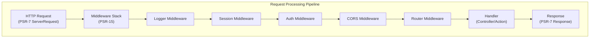

# ADR-005: XOOPS 4.0용 PSR-15 미들웨어 패턴

> 향상된 요청 처리 파이프라인을 위해 PSR-15 HTTP 서버 요청 핸들러(미들웨어)를 채택합니다.

:::주의[XOOPS 4.0 제안 - 2.5.x에서는 사용할 수 없음]
이 ADR은 **XOOPS 4.0에 대해 제안된 아키텍처**를 설명합니다. PSR-15 미들웨어는 **XOOPS 2.5.x에서는 사용할 수 없습니다**. 현재 2.5.x 모듈은 `mainfile.php` 부트스트랩과 함께 페이지 컨트롤러 패턴을 사용합니다. 현재 요청 수명주기는 XOOPS 아키텍처를 참조하세요.
:::

---

## 상태

**제안됨** - XOOPS 4.0 릴리스에 대한 평가 중

---

## 컨텍스트

### 현재 접근 방식

XOOPS 2.5는 모놀리식 요청 처리 접근 방식을 사용합니다.

```php
// Current: Sequential processing
require_once 'mainfile.php';
// → Kernel initialization
// → User authentication
// → Module loading
// → Page rendering

// All in one flow, mixed concerns
```

### 현재 접근 방식의 문제점

1. **혼합적인 우려** - 인증, 로깅, 라우팅이 모두 얽혀 있습니다.
2. **테스트 어려움** - 개별 요청 처리 단계에 대한 단위 테스트가 어려움
3. **확장하기 어려움** - 모듈은 사전 로드/이벤트를 통해서만 연결할 수 있습니다.
4. **분리 불량** - 요청 처리 논리가 코드베이스 전체에 분산되어 있음
5. **구성 불가능** - 처리 단계를 쉽게 연결하거나 재정렬할 수 없습니다.

### PSR-15 미들웨어란 무엇입니까?

PSR-15는 HTTP 미들웨어에 대한 표준 인터페이스를 정의합니다.

```php
<?php
interface RequestHandlerInterface {
    public function handle(ServerRequestInterface $request): ResponseInterface;
}

interface MiddlewareInterface {
    public function process(
        ServerRequestInterface $request,
        RequestHandlerInterface $handler
    ): ResponseInterface;
}
```

**미들웨어 체인:**

```
Request
  ↓
[Logger] → logs request
  ↓
[Auth] → validates user session
  ↓
[CORS] → checks cross-origin
  ↓
[Router] → dispatches to handler
  ↓
[Handler] → generates response
  ↓
Response
```

---

## 결정

### XOOPS 4.0용 PSR-15 미들웨어 스택 채택

PSR-15 표준을 따르는 미들웨어 기반 요청 처리 파이프라인을 구현합니다.

### 아키텍처 개요



### 핵심 미들웨어 구성요소

#### 1. 애플리케이션 미들웨어(코어 레이어)

```php
<?php
declare(strict_types=1);

namespace XoopsCore;

use Psr\Http\Message\ResponseInterface;
use Psr\Http\Message\ServerRequestInterface;
use Psr\Http\Server\MiddlewareInterface;
use Psr\Http\Server\RequestHandlerInterface;

class SessionMiddleware implements MiddlewareInterface
{
    public function process(
        ServerRequestInterface $request,
        RequestHandlerInterface $handler
    ): ResponseInterface {
        // 1. Retrieve session (or start new)
        $sessionId = $request->getCookieParams()['PHPSESSID'] ?? null;
        $session = $this->sessionManager->load($sessionId);

        // 2. Attach session to request
        $request = $request->withAttribute('session', $session);

        // 3. Pass to next middleware
        $response = $handler->handle($request);

        // 4. Set session cookie if needed
        if ($session->isModified()) {
            $response = $response->withAddedHeader(
                'Set-Cookie',
                'PHPSESSID=' . $session->getId() . '; HttpOnly; SameSite=Strict'
            );
        }

        return $response;
    }
}
```

#### 2. 인증 미들웨어

```php
<?php
class AuthMiddleware implements MiddlewareInterface
{
    public function process(
        ServerRequestInterface $request,
        RequestHandlerInterface $handler
    ): ResponseInterface {
        // Get session from previous middleware
        $session = $request->getAttribute('session');

        // Authenticate user from session
        $user = $this->authenticate($session);

        // Attach user to request
        $request = $request->withAttribute('user', $user);

        return $handler->handle($request);
    }

    private function authenticate(?Session $session): User
    {
        if ($session && $session->has('uid')) {
            return $this->userRepository->findById($session->get('uid'));
        }

        return new AnonymousUser();
    }
}
```

#### 3. 인증 미들웨어

```php
<?php
class AuthorizationMiddleware implements MiddlewareInterface
{
    public function __construct(private AuthorizationChecker $checker)
    {
    }

    public function process(
        ServerRequestInterface $request,
        RequestHandlerInterface $handler
    ): ResponseInterface {
        $user = $request->getAttribute('user');
        $route = $request->getAttribute('route');

        // Check if user has permission for this route
        if (!$this->checker->isGranted($user, $route)) {
            return new JsonResponse(
                ['error' => 'Unauthorized'],
                403
            );
        }

        return $handler->handle($request);
    }
}
```

#### 4. 모듈 미들웨어

```php
<?php
// Modules can provide their own middleware
class PublisherAccessMiddleware implements MiddlewareInterface
{
    public function process(
        ServerRequestInterface $request,
        RequestHandlerInterface $handler
    ): ResponseInterface {
        $user = $request->getAttribute('user');

        // Module-specific access control
        if (!$user->hasPermission('publisher_view')) {
            return new HtmlResponse('Access denied', 403);
        }

        return $handler->handle($request);
    }
}
```

### 구현 예

```php
<?php
// bootstrap.php - Application setup

use Psr\Http\Message\ServerRequestInterface;
use Psr\Http\Server\RequestHandlerInterface;
use Xoops\Core\Middleware\{
    LoggerMiddleware,
    SessionMiddleware,
    AuthMiddleware,
    CorsMiddleware,
    ErrorHandlingMiddleware
};

// Create middleware pipeline
$middlewareStack = [
    // 1. Error handling (outermost)
    new ErrorHandlingMiddleware(),

    // 2. Logging
    new LoggerMiddleware($logger),

    // 3. CORS handling
    new CorsMiddleware($corsConfig),

    // 4. Session management
    new SessionMiddleware($sessionManager),

    // 5. Authentication
    new AuthMiddleware($userRepository),

    // 6. Authorization
    new AuthorizationMiddleware($authChecker),

    // 7. Routing and dispatching
    new RoutingMiddleware($router),

    // 8. Module middleware (dynamic)
    ...$this->loadModuleMiddleware(),
];

// Process request through middleware stack
$request = ServerRequestFactory::fromGlobals();
$dispatcher = new MiddlewareDispatcher($middlewareStack);
$response = $dispatcher->dispatch($request);

// Send response
http_response_code($response->getStatusCode());
foreach ($response->getHeaders() as $name => $values) {
    foreach ($values as $value) {
        header("$name: $value", false);
    }
}
echo $response->getBody();
```

### 모듈 통합

모듈은 미들웨어를 제공할 수 있습니다.

```php
<?php
// Publisher module - xoops_version.php

$modversion['middleware'] = [
    'PublisherAccessMiddleware' => true,      // Auto-load
    'PublisherLogMiddleware' => true,
];

// Or custom:
$modversion['middleware_factory'] = function() {
    return [
        new PublisherCacheMiddleware(),
        new PublisherPermissionMiddleware(),
    ];
};
```

---

## 결과

### 긍정적인 효과

1. **관심사 분리** - 각 미들웨어는 하나의 책임을 처리합니다.
2. **테스트 가능성** - 개별 미들웨어 구성 요소의 단위 테스트가 용이합니다.
3. **구성성** - 미들웨어를 혼합하고 재정렬할 수 있습니다.
4. **표준 준수** - PSR-15 및 PSR-7 표준을 사용합니다.
5. **확장성** - 모듈에서 맞춤형 미들웨어를 쉽게 추가할 수 있습니다.
6. **디버깅** - 파이프라인을 통한 요청 흐름 지우기
7. **성능** - 특정 미들웨어 레이어를 최적화할 수 있습니다.
8. **상호 운용성** - 타사 PSR-15 미들웨어 사용 가능

### 부정적인 영향

1. **학습 곡선** - 개발자는 PSR-15를 이해해야 합니다.
2. **성능 오버헤드** - 파이프라인에서 더 많은 함수 호출
3. **복잡성** - 모놀리식 접근 방식보다 움직이는 부분이 더 많습니다.
4. **마이그레이션 노력** - 기존 코드 리팩토링 필요
5. **종속성** - PSR-7 HTTP 라이브러리 필요

### 위험 및 완화

| 위험 | 심각도 | 완화 |
|------|----------|-----------|
| 복잡한 미들웨어 체인 | 중간 | 명확한 문서, 예시 |
| 성능 저하 | 중간 | 벤치마크, 핫 경로 최적화 |
| 개발자 오용 | 중간 | 코드 검토, 모범 사례 가이드 |
| 마이그레이션 주요 변경 사항 | 높음 | 지원 중단 기간, 도우미 |
| 미들웨어 주문 문제 | 중간 | 종속성 그래프 지우기 |

---

## 구현 계획

### 1단계: 기초(2026년 2분기)

- [ ] PSR-7 HTTP 메시지 래퍼 구현
- [ ] MiddlewareDispatcher 생성
- [ ] 핵심 미들웨어 구현(세션, 인증)
- [ ] 미들웨어를 사용하도록 커널 업데이트

### 2단계: 통합(2026년 3분기)

- [ ] 기존 기능을 미들웨어로 마이그레이션
- [ ] 모듈 미들웨어 지원 추가
- [ ] 미들웨어 테스트 유틸리티 생성
- [ ] 포괄적인 문서 작성

### 3단계: 마이그레이션(2026년 4분기)

- [ ] 이전 코드에 대한 호환성 레이어 제공
- [ ] 새로운 미들웨어로 업데이트되는 도움말 모듈
- [ ] 성능 최적화
- [ ] 보안 감사

### 4단계: 출시(2027년 1분기)

- [ ] 미들웨어가 포함된 XOOPS 4.0 릴리스
- [ ] 기존 프리로드/후크 시스템 지원 중단
- [ ] 커뮤니티 피드백 및 업데이트

---

## 성공 Criteria

- [ ] 모든 핵심 기능이 미들웨어로 마이그레이션됨
- [ ] 미들웨어에 대한 90% 이상의 테스트 적용 범위
- [ ] 예제가 포함된 문서
- [ ] 이전 버전 대비 10% 이내의 성능
- [ ] 모듈이 새로운 미들웨어 시스템을 성공적으로 사용함
- [ ] 커뮤니티 채택률 >80%

---

## 미들웨어 모범 사례

### 하세요

- 미들웨어에 집중하세요(단일 책임)
- 불변성 사용(새 요청/응답 생성)
- 오류를 정상적으로 처리
- 문서 의존성
- 유형 힌트 추가
- 미들웨어 테스트 작성
- 표준 PSR-15 인터페이스 사용

### 하지 마세요

- 공유된 요청/응답 개체를 수정하지 마세요.
- 전역 변수에 직접 접근하지 마세요
- 미들웨어 순서에 대한 종속성을 만들지 마세요.
- 모든 예외를 잡아내지 마세요
- 비즈니스 로직과 미들웨어를 혼합하지 마세요.
- 미들웨어가 너무 많은 일을 하도록 만들지 마세요.

---

## 예

### 맞춤형 미들웨어

```php
<?php
// Example: Rate limiting middleware

use Psr\Http\Message\ResponseInterface;
use Psr\Http\Message\ServerRequestInterface;
use Psr\Http\Server\MiddlewareInterface;
use Psr\Http\Server\RequestHandlerInterface;

class RateLimitMiddleware implements MiddlewareInterface
{
    public function __construct(
        private RateLimiter $limiter,
        private int $limit = 100,
        private int $window = 3600
    ) {
    }

    public function process(
        ServerRequestInterface $request,
        RequestHandlerInterface $handler
    ): ResponseInterface {
        $user = $request->getAttribute('user');
        $identifier = $user->getId() ?? $request->getClientIp();

        // Check rate limit
        $remaining = $this->limiter->check($identifier, $this->limit, $this->window);

        if ($remaining < 0) {
            return new JsonResponse(
                ['error' => 'Rate limit exceeded'],
                429
            );
        }

        // Add rate limit headers
        $response = $handler->handle($request);
        return $response
            ->withAddedHeader('X-RateLimit-Limit', (string)$this->limit)
            ->withAddedHeader('X-RateLimit-Remaining', (string)$remaining);
    }
}
```

---

## 관련 결정

- ADR-001: 모듈형 아키텍처 - 기초
- ADR-004: 보안 시스템 - 인증을 위해 미들웨어를 사용합니다.
- ADR-006: 2단계 인증 - 미들웨어일 수 있음

---

## 참고자료

### PSR 표준

- [PSR-7: HTTP 메시지 인터페이스](https://www.php-fig.org/psr/psr-7/)
- [PSR-15: HTTP 서버 요청 핸들러](https://www.php-fig.org/psr/psr-15/)

### 미들웨어 프레임워크

- [슬림 프레임워크](https://www.slimframework.com/) - 미들웨어 예제
- [Zend Expressive](https://docs.zendframework.com/zend-expressive/) - PSR-15 프레임워크
- [Guzzle](https://docs.guzzlephp.org/) - HTTP 클라이언트 미들웨어

### 도구

- [RelayPHP](https://relayphp.com/) - 미들웨어 라이브러리
- [PSR-15 미들웨어](https://github.com/middlewares) - 미들웨어 모음

---

## 버전 기록

| 버전 | 날짜 | 변경사항 |
|---------|------|---------|
| 1.0.0 | 2024-01-28 | 초기제안 |

---

#xoops #adr #psr-15 #미들웨어 #아키텍처 #psr-7
