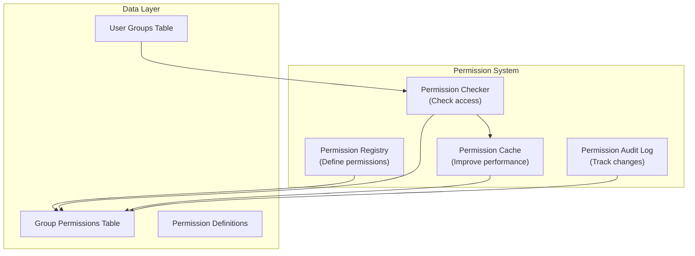

# ADR-006: 모듈 허가 시스템

> 세분화된 액세스 제어를 가능하게 하는 XOOPS 모듈을 위한 세분화된 계층적 권한 시스템입니다.

---

## 상태

**승인됨** - XOOPS 2.5.x에서 구현되고 XOOPS 4.0에서 확장되었습니다.

---

## 컨텍스트

### 문제 설명

XOOPS 모듈에는 다음을 허용하는 유연한 권한 제어가 필요합니다.

1. **모듈 수준 권한** - 사용자가 이 모듈에 액세스할 수 있습니까?
2. **개체 수준 권한** - 사용자가 이 특정 항목에 액세스할 수 있습니까?
3. **작업 수준 권한** - 사용자가 이 작업을 수행할 수 있습니까?
4. **맞춤 권한** - 모듈이 자체 권한을 정의할 수 있나요?

### 현재 상태

XOOPS 2.5는 XoopsGroupPermission 시스템을 사용합니다.

```php
<?php
$perm_handler = xoops_getHandler('groupperm');
$isAllowed = $perm_handler->checkRight(
    'modulename',
    'action',
    $itemId,
    $groupId
);
```

### 챌린지

1. **복잡한 쿼리** - 권한 확인에는 데이터베이스 조인이 필요합니다.
2. **제한된 계층 구조** - 권한 그룹을 생성하기 어려움
3. **캐싱 불량** - 권한 캐싱이 내장되어 있지 않음
4. **모듈 변형** - 각 모듈은 다르게 구현됩니다.
5. **성능** - 권한 확인을 위한 다중 DB 쿼리

---

## 결정

### 계층적 권한 시스템 구현

다음을 지원하는 표준화되고 캐시된 권한 시스템을 만듭니다.

1. **계층적 권한** - 상위 그룹에서 상속
2. **역할 기반 액세스** - 역할(관리자, 중재자, 사용자, 게스트)에 권한 매핑
3. **개체 권한** - 항목별로 세분화된 제어
4. **캐싱** - 쿼리를 줄이기 위한 캐시 권한
5. **사용자 정의 권한** - 모듈은 자체적으로 정의합니다.
6. **감사 추적** - 권한 변경 로그

### 권한 계층 구조

```
User
  └── Group 1 (Admin)
      └── Permission: admin_module
      └── Permission: edit_all_items
      └── Permission: delete_all_items
  └── Group 2 (Moderator)
      └── Permission: moderate_comments
      └── Permission: edit_own_items
  └── Group 3 (User)
      └── Permission: view_published_items
      └── Permission: edit_own_items
  └── Group 4 (Guest)
      └── Permission: view_published_items
```

### 아키텍처



---

## 핵심 구성요소

### 1. 권한 정의

```php
<?php
// Module defines its permissions in xoops_version.php

$modversion['permissions'] = [
    [
        'name' => 'module_view',
        'description' => 'Can view module',
        'level' => 'module',
    ],
    [
        'name' => 'item_view',
        'description' => 'Can view items',
        'level' => 'item',
    ],
    [
        'name' => 'item_create',
        'description' => 'Can create items',
        'level' => 'item',
    ],
    [
        'name' => 'item_edit',
        'description' => 'Can edit items',
        'level' => 'item',
    ],
    [
        'name' => 'item_delete',
        'description' => 'Can delete items',
        'level' => 'item',
    ],
    [
        'name' => 'admin_manage',
        'description' => 'Can manage module',
        'level' => 'admin',
    ],
];

// Default permissions by group
$modversion['group_permissions'] = [
    // Admin group gets all permissions
    '1' => [
        'module_view' => 1,
        'item_view' => 1,
        'item_create' => 1,
        'item_edit' => 1,
        'item_delete' => 1,
        'admin_manage' => 1,
    ],
    // User group
    '3' => [
        'module_view' => 1,
        'item_view' => 1,
        'item_create' => 1,
        'item_edit' => 0,
        'item_delete' => 0,
        'admin_manage' => 0,
    ],
    // Guest group
    '4' => [
        'module_view' => 1,
        'item_view' => 1,
        'item_create' => 0,
        'item_edit' => 0,
        'item_delete' => 0,
        'admin_manage' => 0,
    ],
];
```

### 2. 권한 검사기

```php
<?php
declare(strict_types=1);

namespace XoopsCore\Permission;

class PermissionChecker
{
    private PermissionCache $cache;
    private PermissionRepository $repository;

    public function hasPermission(
        User $user,
        string $permissionName,
        ?int $itemId = null
    ): bool {
        // Check cache first
        $cacheKey = "perm_{$user->getId()}_{$permissionName}_{$itemId}";
        if ($this->cache->has($cacheKey)) {
            return $this->cache->get($cacheKey);
        }

        $hasPermission = false;

        // Check all user groups
        foreach ($user->getGroups() as $group) {
            if ($this->checkGroupPermission($group, $permissionName, $itemId)) {
                $hasPermission = true;
                break;
            }
        }

        // Cache result
        $this->cache->set($cacheKey, $hasPermission, 3600);

        // Log high-level access checks
        if ($hasPermission && $this->shouldAuditLog($permissionName)) {
            $this->auditLog('PERMISSION_CHECKED', [
                'user_id' => $user->getId(),
                'permission' => $permissionName,
                'item_id' => $itemId,
                'result' => 'ALLOWED',
            ]);
        }

        return $hasPermission;
    }

    private function checkGroupPermission(
        Group $group,
        string $permissionName,
        ?int $itemId = null
    ): bool {
        $sql = 'SELECT COUNT(*) FROM ' . $this->table . '
                WHERE groupid = ?
                AND permission = ?
                AND itemid = ?
                AND granted = 1';

        $stmt = $this->db->prepare($sql);
        $stmt->execute([$group->getId(), $permissionName, $itemId ?? 0]);

        return $stmt->fetchColumn() > 0;
    }
}
```

### 3. 권한 수준

```php
<?php
// Different permission levels with different scopes

class PermissionLevel
{
    // Module-level: Affects entire module
    public const LEVEL_MODULE = 'module';

    // Admin-level: Admin panel access
    public const LEVEL_ADMIN = 'admin';

    // Item-level: Specific objects/items
    public const LEVEL_ITEM = 'item';

    // Field-level: Specific object fields
    public const LEVEL_FIELD = 'field';

    // Action-level: Specific actions/operations
    public const LEVEL_ACTION = 'action';
}
```

### 4. 개체 수준 권한

```php
<?php
// Fine-grained control for specific items

class Item extends XoopsObject
{
    /**
     * Check if user can view this item
     */
    public function canView(User $user): bool
    {
        // Public items anyone can view
        if ($this->getVar('status') === 'published') {
            return true;
        }

        // Owner can always view their items
        if ($this->getVar('user_id') === $user->getId()) {
            return true;
        }

        // Check group permissions
        $permChecker = xoops_getActiveModule()->getPermissionChecker();
        return $permChecker->hasPermission(
            $user,
            'item_view',
            $this->getVar('id')
        );
    }

    public function canEdit(User $user): bool
    {
        // Owner can edit their items
        if ($this->getVar('user_id') === $user->getId()) {
            return $permChecker->hasPermission($user, 'item_edit', $this->getVar('id'));
        }

        // Check if user can edit all items
        return $permChecker->hasPermission($user, 'item_edit_all', $this->getVar('id'));
    }

    public function canDelete(User $user): bool
    {
        return $permChecker->hasPermission($user, 'item_delete', $this->getVar('id'));
    }
}
```

### 5. 컨트롤러에서의 사용법

```php
<?php
// Example: Article controller

class ArticleController
{
    private PermissionChecker $permChecker;

    public function view(int $id, User $user): Response
    {
        $article = $this->repository->find($id);

        // Check permission
        if (!$article->canView($user)) {
            throw new AccessDeniedException('Cannot view this article');
        }

        return new HtmlResponse($this->renderArticle($article));
    }

    public function edit(int $id, User $user): Response
    {
        $article = $this->repository->find($id);

        // Check permission
        if (!$article->canEdit($user)) {
            throw new AccessDeniedException('Cannot edit this article');
        }

        // Handle form submission
        if ($this->request->isMethod('POST')) {
            $article->setVar('title', $this->request->getPost('title'));
            $article->setVar('content', $this->request->getPost('content'));
            $this->repository->insert($article);

            $this->auditLog('ARTICLE_EDITED', ['id' => $id, 'user_id' => $user->getId()]);

            // Invalidate permission cache
            $this->permChecker->clearCache($user->getId());

            return new RedirectResponse('/article/' . $id);
        }

        return new HtmlResponse($this->renderForm($article));
    }

    public function delete(int $id, User $user): Response
    {
        $article = $this->repository->find($id);

        if (!$article->canDelete($user)) {
            throw new AccessDeniedException('Cannot delete this article');
        }

        $this->repository->delete($article);

        $this->auditLog('ARTICLE_DELETED', ['id' => $id, 'user_id' => $user->getId()]);

        // Invalidate cache
        $this->permChecker->clearCache($user->getId());

        return new JsonResponse(['success' => true]);
    }
}
```

---

## 결과

### 긍정적인 효과

1. **세밀한 제어** - 미세 조정된 권한 관리
2. **표준화** - 모듈 전체에서 일관됨
3. **캐시됨** - 캐싱으로 성능이 향상되었습니다.
4. **감사 가능** - 누가 무엇을 변경했는지 추적
5. **유연함** - 맞춤 권한 지원
6. **확장 가능** - 복잡한 권한 계층 처리
7. **테스트 가능** - 단위 테스트가 용이함

### 부정적인 영향

1. **복잡성** - 관리해야 할 코드가 더 많습니다.
2. **데이터베이스 오버헤드** - 테이블 및 조인 증가
3. **캐시 무효화** - 변경 시 캐시를 지워야 함
4. **학습 곡선** - 개발자는 시스템을 이해해야 합니다.
5. **성능** - 캐시가 제대로 구성되지 않은 경우

### 위험 및 완화

| 위험 | 심각도 | 완화 |
|------|----------|-----------|
| 지나치게 복잡한 권한 | 중간 | 좋은 기본값, 문서 |
| 오래된 데이터 캐시 | 높음 | TTL, 스마트 무효화 |
| 성능 회귀 | 중간 | 벤치마크, 쿼리 최적화 |
| 권한 우회 | 높음 | 보안 감사, 테스트 |

---

## 권한 디자인 패턴

### 패턴 1: 소유자 기반 권한

```php
<?php
// User can edit their own items but not others'

public function canEdit(User $user): bool
{
    // Owner can always edit
    if ($this->isOwner($user)) {
        return true;
    }

    // Check group permissions for editing others' items
    return $this->permChecker->hasPermission($user, 'edit_all_items');
}

private function isOwner(User $user): bool
{
    return $this->getVar('user_id') === $user->getId();
}
```

### 패턴 2: 상태 기반 권한

```php
<?php
// Different permissions based on status

public function canView(User $user): bool
{
    switch ($this->getVar('status')) {
        case 'published':
            // Anyone with module permission can view
            return $this->permChecker->hasPermission($user, 'item_view');

        case 'draft':
            // Only owner or admin can view
            return $this->isOwner($user) ||
                   $this->permChecker->hasPermission($user, 'admin_manage');

        case 'archived':
            // Only admin can view
            return $this->permChecker->hasPermission($user, 'admin_manage');

        default:
            return false;
    }
}
```

### 패턴 3: 역할 기반 권한

```php
<?php
// Check against specific roles

public function hasAdminRole(User $user): bool
{
    return $user->getGroups()->contains('admin_group');
}

public function hasModeratorRole(User $user): bool
{
    return $user->getGroups()->contains('moderator_group') ||
           $this->hasAdminRole($user);
}

public function canModerate(User $user): bool
{
    return $this->hasModeratorRole($user);
}
```

---

## 관련 결정

- ADR-001: 모듈형 아키텍처 - 모듈이 권한을 정의합니다.
- ADR-004: 보안 시스템 - 보안을 위한 기반
- ADR-005: 미들웨어 - 권한을 적용할 수 있음

---

## 참고자료

### 권한 모델

- [RBAC(역할 기반 접근 제어)](https://en.wikipedia.org/wiki/Role-based_access_control)
- [ABAC(속성 기반 접근 제어)](https://en.wikipedia.org/wiki/Attribute-based_access_control)
- [ACL(액세스 제어 목록)](https://en.wikipedia.org/wiki/Access-control_list)

### 구현

- [심포니 시큐리티](https://symfony.com/doc/current/security.html)
- [라라벨 인증](https://laravel.com/docs/authorization)

---

## 구현 체크리스트

- [ ] 표준 권한 수준 정의
- [ ] PermissionChecker 클래스 생성
- [ ] 캐싱 전략 구현
- [ ] 감사 로깅 추가
- [ ] 도우미 함수 생성
- [ ] 포괄적인 테스트 작성
- [ ] 개발자용 문서
- [ ] 모든 모듈 업데이트
- [ ] 성능 최적화
- [ ] 보안 검토

---

## 버전 기록

| 버전 | 날짜 | 변경사항 |
|---------|------|---------|
| 1.0.0 | 2024-01-28 | 초기 문서 |

---

#xoops #adr #permissions #authorization #rbac #security
