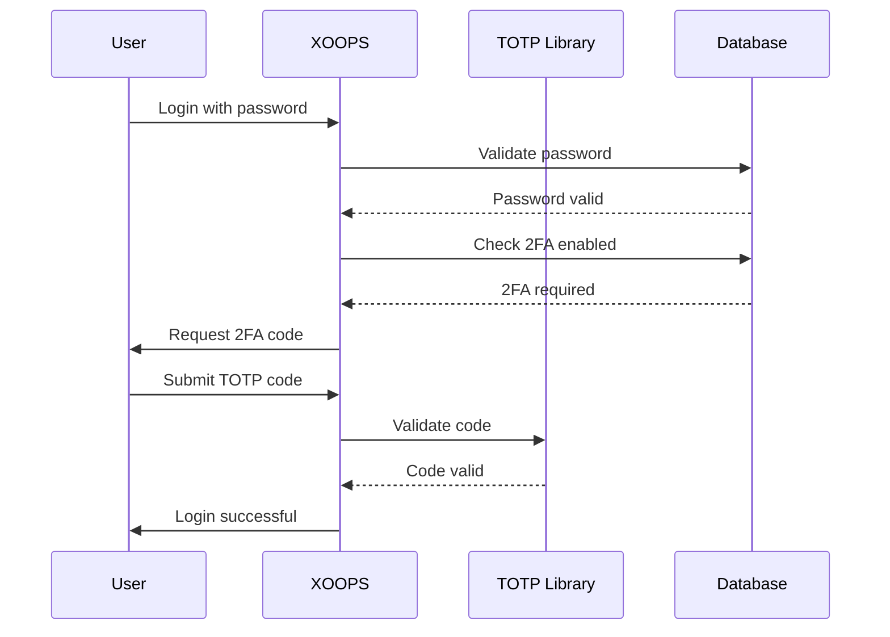

## 상태

제안됨

## 컨텍스트

XOOPS는 사용자 인증을 위해 강화된 보안이 필요합니다. 2단계 인증(2FA)은 비밀번호 이상의 추가 보안 계층을 제공하여 비밀번호가 유출되더라도 계정을 보호합니다.

주요 고려사항:
- 기존 인증과의 하위 호환성
- 다양한 2FA 방법 지원
- 설정 및 로그인 중 사용자 경험
- 분실된 장치에 대한 복구 메커니즘
- 기존 권한 시스템과의 통합

## 결정

백업 코드를 지원하는 기본 2FA 방법으로 TOTP(Time-based One-Time Password)를 구현할 예정입니다.

### 구현 접근 방식



### 데이터베이스 스키마

```sql
CREATE TABLE `{PREFIX}_users_2fa` (
    `user_id` INT(11) NOT NULL,
    `secret` VARCHAR(32) NOT NULL,
    `enabled` TINYINT(1) DEFAULT 0,
    `backup_codes` TEXT,
    `last_used` INT(11),
    `created` INT(11) NOT NULL,
    PRIMARY KEY (`user_id`),
    FOREIGN KEY (`user_id`) REFERENCES `{PREFIX}_users`(`uid`)
);
```

### 서비스 인터페이스

```php
interface TwoFactorAuthInterface
{
    public function enable(int $userId): TwoFactorSetup;
    public function disable(int $userId): void;
    public function verify(int $userId, string $code): bool;
    public function generateBackupCodes(int $userId): array;
    public function isEnabled(int $userId): bool;
}
```

### 미들웨어 통합

```php
class TwoFactorMiddleware implements MiddlewareInterface
{
    public function process(
        ServerRequestInterface $request,
        RequestHandlerInterface $handler
    ): ResponseInterface {
        $session = $request->getAttribute('session');

        if ($session->has('pending_2fa_user_id')) {
            // User needs to complete 2FA
            if ($this->isVerificationRequest($request)) {
                return $handler->handle($request);
            }
            return new RedirectResponse('/2fa/verify');
        }

        return $handler->handle($request);
    }
}
```

## 결과

### 긍정적

- 계정 보안이 대폭 향상되었습니다.
- 업계 표준 TOTP 호환성(Google Authenticator, Authy 등)
- 백업 코드로 계정 잠금 방지
- 사용자별 선택 사항 - 채택을 강요하지 않음
- PSR-15 미들웨어로 깔끔한 통합 가능

### 부정적

- 추가 로그인 단계가 사용자 경험에 영향을 미칩니다.
- 사용자는 인증 앱을 관리해야 합니다.
- 분실한 기기에는 복구 절차가 필요합니다.
- 추가 데이터베이스 저장 및 쿼리
- 암호화 라이브러리 종속성이 필요합니다.

### 마이그레이션 경로

1. 2FA 데이터에 대한 데이터베이스 테이블 추가
2. 라이브러리 종속성을 사용하여 TOTP 서비스 구현
3. 인증 체인에 미들웨어 추가
4. 설정 및 확인 UI 생성
5. 특정 그룹에 대해 2FA를 요구하는 관리 옵션

## 고려되는 대안

### SMS 기반 OTP

거부된 이유:
- SIM 교환 취약점
- SMS 게이트웨이 비용
- 전화번호 확인의 복잡성
- 개인 정보 보호 문제

### 하드웨어 보안 키(WebAuthn)

향후 ADR을 위해 연기됨:
- 더욱 복잡한 구현
- 역사적으로 제한된 브라우저 지원
- 높은 사용자 비용
- 나중에 TOTP와 함께 추가될 수 있습니다.

### 이메일 기반 OTP

거부된 이유:
- 이메일 계정 손상으로 인해 목적이 무산됨
- 배송 지연이 UX에 영향을 미침
- 스팸 필터 문제

## 참고자료

- [RFC 6238 - TOTP](https://tools.ietf.org/html/rfc6238)
- [Google OTP 키 형식](https://github.com/google/google-authenticator/wiki/Key-Uri-Format)
-../../02-핵심 개념/보안/보안-모범 사례 - 보안 지침
-../../02-Core-Concepts/Users-Permissions/Authentication - 인증 시스템 문서
