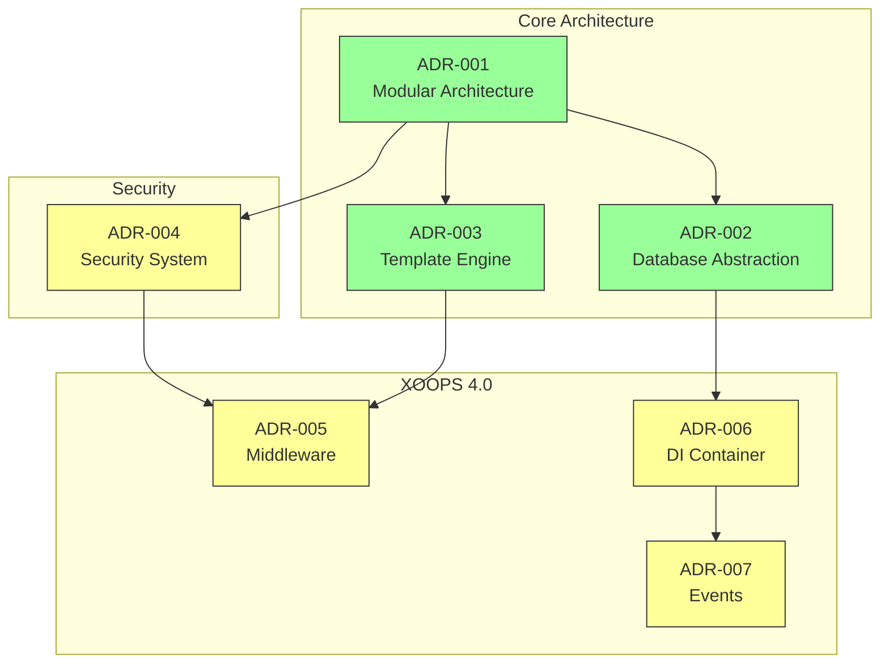
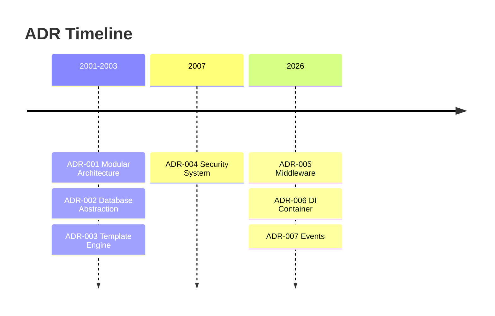

# 📋 아키텍처 결정 기록 색인

> XOOPS CMS를 형성한 아키텍처 결정의 포괄적인 색인입니다.

---

## ADR이란 무엇입니까?

ADR(아키텍처 결정 기록)은 XOOPS 개발 중에 내려진 중요한 아키텍처 결정을 문서화합니다. 이는 각 선택의 맥락, 결정 및 결과를 포착하여 관리자와 기여자에게 귀중한 역사적 맥락을 제공합니다.

---

## ADR 상태 범례

| 상태 | 의미 |
|--------|---------|
| **제안됨** | 논의 중, 아직 승인되지 않음 |
| **수락됨** | 결정이 채택되었습니다 |
| **지원 중단됨** | 더 이상 권장되지 않음 |
| **대체됨** | 다른 ADR로 대체됨 |

---

## 현재 ADR

### 기본 결정

| ADR | 제목 | 상태 | 영향 |
|-----|-------|--------|--------|
| ADR-001 | 모듈형 아키텍처 | 수락됨 | 코어 |
| ADR-002 | 객체 지향 데이터베이스 액세스 | 수락됨 | 코어 |
| ADR-003 | Smarty 템플릿 엔진 | 수락됨 | 코어 |

### 계획된 ADR(XOOPS 4.0)

| ADR | 제목 | 상태 | 영향 |
|-----|-------|--------|--------|
| ADR-004 | 보안 시스템 설계 | 제안 | 보안 |
| ADR-005 | PSR-15 미들웨어 | 제안 | 건축 |
| ADR-006 | 종속성 주입 컨테이너 | 제안 | 건축 |
| ADR-007 | 이벤트 시스템 재설계 | 제안 | 건축 |

---

## ADR 관계



---

## 타임라인



---

## 새 ADR 생성

새로운 아키텍처 결정을 제안할 때:

1. ADR 템플릿 복사
2. 모든 섹션을 작성하세요
3. 풀 요청(Pull Request)으로 제출
4. GitHub 문제에서 토론
5. 결정 후 상태 업데이트

### ADR 템플릿 구조

```markdown
# ADR-XXX: Title

## Status
Proposed | Accepted | Deprecated | Superseded

## Context
What is the issue motivating this decision?

## Decision
What is the change that we're proposing?

## Consequences
What becomes easier or harder as a result?

## Alternatives Considered
What other options were evaluated?
```

---

## 🔗 관련 문서

- 핵심 개념
- 기여 지침
- XOOPS 4.0 로드맵

---

#xoops #adr #아키텍처 #색인 #결정
