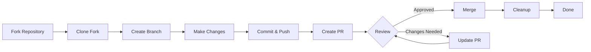

> 이 가이드는 초기 설정부터 병합된 풀 요청까지 XOOPS에 기여하는 전체 프로세스를 안내합니다.

---

## 전제 조건

기여를 시작하기 전에 다음 사항을 확인하세요.

- **Git** 설치 및 구성
- **GitHub 계정**(무료)
- XOOPS 개발을 위한 **PHP 7.4+**
- 종속성 관리를 위한 **Composer**
- Git 워크플로에 대한 기본 지식
- 행동강령에 대한 숙지

---

## 1단계: 저장소 포크

### GitHub 웹 인터페이스에서

1. 저장소(예: `XOOPS/XoopsCore27`)로 이동합니다.
2. 오른쪽 상단에 있는 **포크** 버튼을 클릭하세요.
3. 포크할 위치(개인 계정)를 선택하세요.
4. 포크가 완료될 때까지 기다리세요

### 왜 포크인가?

- 작업할 사본을 직접 얻습니다.
- 유지관리자는 많은 지점을 관리할 필요가 없습니다.
- 포크를 완전히 제어할 수 있습니다.
- 풀 요청은 포크와 업스트림 저장소를 참조합니다.

---

## 2단계: 로컬에서 포크 복제

```bash
# Clone your fork (replace YOUR_USERNAME)
git clone https://github.com/YOUR_USERNAME/XoopsCore27.git
cd XoopsCore27

# Add upstream remote to track original repository
git remote add upstream https://github.com/XOOPS/XoopsCore27.git

# Verify remotes are set correctly
git remote -v
# origin    https://github.com/YOUR_USERNAME/XoopsCore27.git (fetch)
# origin    https://github.com/YOUR_USERNAME/XoopsCore27.git (push)
# upstream  https://github.com/XOOPS/XoopsCore27.git (fetch)
# upstream  https://github.com/XOOPS/XoopsCore27.git (nofetch)
```

---

## 3단계: 개발 환경 설정

### 설치 종속성

```bash
# Install Composer dependencies
composer install

# Install development dependencies
composer install --dev

# For module development
cd modules/mymodule
composer install
```

### Git 구성

```bash
# Set your Git identity
git config user.name "Your Name"
git config user.email "your.email@example.com"

# Optional: Set global Git config
git config --global user.name "Your Name"
git config --global user.email "your.email@example.com"
```

### 테스트 실행

```bash
# Make sure tests pass in clean state
./vendor/bin/phpunit

# Run specific test suite
./vendor/bin/phpunit --testsuite unit
```

---

## 4단계: 기능 분기 생성

### 지점 명명 규칙

다음 패턴을 따르세요: `<type>/<description>`

**유형:**
- `feature/` - 새로운 기능
- `fix/` - 버그 수정
- `docs/` - 문서 전용
- `refactor/` - 코드 리팩토링
- `test/` - 테스트 추가사항
- `chore/` - 유지보수, 툴링

**예:**
```bash
# Feature branch
git checkout -b feature/add-two-factor-auth

# Bug fix branch
git checkout -b fix/prevent-xss-in-forms

# Documentation branch
git checkout -b docs/update-api-guide

# Always branch from upstream/main (or develop)
git checkout -b feature/my-feature upstream/main
```

### Branch를 최신 상태로 유지하세요

```bash
# Before you start work, sync with upstream
git fetch upstream
git merge upstream/main

# Later, if upstream has changed
git fetch upstream
git rebase upstream/main
```

---

## 5단계: 변경하기

### 개발 관행

1. PHP 표준에 따라 **코드 작성**
2. 새로운 기능에 대한 **테스트 작성**
3. 필요한 경우 **문서 업데이트**
4. **린터 실행** 및 코드 포맷터

### 코드 품질 검사

```bash
# Run all tests
./vendor/bin/phpunit

# Run with coverage
./vendor/bin/phpunit --coverage-html coverage/

# Run PHP CS Fixer
./vendor/bin/php-cs-fixer fix --dry-run

# Run PHPStan static analysis
./vendor/bin/phpstan analyse class/ src/
```

### 좋은 변경 사항 커밋

```bash
# Check what you changed
git status
git diff

# Stage specific files
git add class/MyClass.php
git add tests/MyClassTest.php

# Or stage all changes
git add .

# Commit with descriptive message
git commit -m "feat(auth): add two-factor authentication support"
```

---

## 6단계: Branch를 동기화 상태로 유지

기능을 작업하는 동안 기본 분기가 다음과 같이 발전할 수 있습니다.

```bash
# Fetch latest changes from upstream
git fetch upstream

# Option A: Rebase (preferred for clean history)
git rebase upstream/main

# Option B: Merge (simpler but adds merge commits)
git merge upstream/main

# If conflicts occur, resolve them then:
git add .
git rebase --continue  # or git merge --continue
```

---

## 7단계: 포크로 푸시

```bash
# Push your branch to your fork
git push origin feature/my-feature

# On subsequent pushes
git push

# If you rebased, you might need force push (use carefully!)
git push --force-with-lease origin feature/my-feature
```

---

## 8단계: 풀 요청 생성

### GitHub 웹 인터페이스에서

1. GitHub의 포크로 이동합니다.
2. 지점에서 PR을 생성하라는 알림이 표시됩니다.
3. **"비교 및 풀 요청"**을 클릭하세요.
4. 또는 **"새 끌어오기 요청"**을 수동으로 클릭하고 지점을 선택하세요.

### 홍보 제목 및 설명

**제목 형식:**
```
<type>(<scope>): <subject>
```

예:
```
feat(auth): add two-factor authentication
fix(forms): prevent XSS in text input
docs: update installation guide
refactor(core): improve performance
```

**설명 템플릿:**

```markdown
## Description
Brief explanation of what this PR does.

## Changes
- Changed X from A to B
- Added feature Y
- Fixed bug Z

## Type of Change
- [ ] New feature (adds new functionality)
- [ ] Bug fix (fixes an issue)
- [ ] Breaking change (API/behavior change)
- [ ] Documentation update

## Testing
- [ ] Added tests for new functionality
- [ ] All existing tests pass
- [ ] Manual testing performed

## Screenshots (if applicable)
Include before/after screenshots for UI changes.

## Related Issues
Closes #123
Related to #456

## Checklist
- [ ] Code follows style guidelines
- [ ] Self-reviewed own code
- [ ] Commented complex code
- [ ] Updated documentation
- [ ] No new warnings generated
- [ ] Tests pass locally
```

### PR 리뷰 체크리스트

제출하기 전에 다음을 확인하세요.

- [ ] 코드는 PHP 표준을 따릅니다.
- [ ] 테스트가 포함되어 있으며 통과합니다.
- [ ] 문서 업데이트됨(필요한 경우)
- [ ] 병합 충돌 없음
- [ ] 커밋 메시지가 명확합니다.
- [ ] 관련 이슈가 참조됨
- [ ] 홍보설명이 상세함
- [ ] 디버그 코드 또는 콘솔 로그 없음

---

## 9단계: 피드백에 응답

### 코드 검토 중

1. **댓글을 주의 깊게 읽으세요** - 피드백을 이해하세요
2. **질문하기** - 명확하지 않은 경우 설명을 요청하세요.
3. **대안 토론** - 정중하게 접근 방식에 대해 토론합니다.
4. **요청된 변경** - 지점 업데이트
5. **업데이트된 커밋 강제 푸시** - 기록을 다시 쓰는 경우

```bash
# Make changes
git add .
git commit --amend  # Modify last commit
git push --force-with-lease origin feature/my-feature

# Or add new commits
git commit -m "Address feedback on PR review"
git push origin feature/my-feature
```

### 반복 기대

- 대부분의 PR에는 여러 번의 검토가 필요합니다.
- 인내심을 갖고 건설적인 태도를 취하세요.
- 피드백을 학습 기회로 봅니다.
- 유지관리자는 리팩터링을 제안할 수 있습니다.

---

## 10단계: 병합 및 정리

### 승인 후

관리자가 승인하고 병합하면:

1. **GitHub 자동 병합** 또는 관리자 클릭 병합
2. **브랜치가 삭제됩니다**(대개 자동)
3. **변경 사항은 업스트림에 있습니다**

### 로컬 정리

```bash
# Switch to main branch
git checkout main

# Update main with merged changes
git fetch upstream
git merge upstream/main

# Delete local feature branch
git branch -d feature/my-feature

# Delete from your fork (if not auto-deleted)
git push origin --delete feature/my-feature
```

---

## 작업 흐름 다이어그램



---

## 일반적인 시나리오

### 시작하기 전에 동기화 중

```bash
# Always start fresh
git fetch upstream
git checkout -b feature/new-thing upstream/main
```

### 더 많은 커밋 추가하기

```bash
# Just push again
git add .
git commit -m "feat: additional changes"
git push origin feature/new-thing
```

### 실수 수정

```bash
# Last commit has wrong message
git commit --amend -m "Correct message"
git push --force-with-lease

# Revert to previous state (careful!)
git reset --soft HEAD~1  # Keep changes
git reset --hard HEAD~1  # Discard changes
```

### 병합 충돌 처리

```bash
# Rebase and resolve conflicts
git fetch upstream
git rebase upstream/main

# Edit conflicted files to resolve
# Then continue
git add .
git rebase --continue
git push --force-with-lease
```

---

## 모범 사례

### 하세요

- 지점이 단일 문제에 집중하도록 유지
- 작고 논리적인 커밋을 하세요.
- 설명적인 커밋 메시지 작성
- 지점을 자주 업데이트하세요
- 밀기 전 테스트
- 문서 변경
- 피드백에 반응하라

### 하지 마세요

- 메인/마스터 브랜치에서 직접 작업
- 하나의 PR에 관련 없는 변경 사항을 혼합합니다.
- 생성된 파일 또는 node_modules 커밋
- PR이 공개된 후 강제 푸시(--force-with-lease 사용)
- 코드 리뷰 피드백을 무시하세요
- 대규모 PR 생성(더 작은 PR로 분할)
- 민감한 데이터 커밋(API 키, 비밀번호)

---

## 성공을 위한 팁

### 소통하다

- 업무 시작 전 이슈에 대해 질문하기
- 복잡한 변화에 대한 안내를 요청하세요.
- PR 설명에서 접근 방식을 논의합니다.
- 피드백에 신속하게 응답

### 표준 준수

- PHP 표준 검토
- 이슈 보고 가이드라인 확인
- 기여 개요 읽기
- 풀 리퀘스트 지침을 따르세요.

### 코드베이스 알아보기

- 기존 코드 패턴 읽기
- 유사한 구현 연구
- 아키텍처를 이해한다
- 핵심 개념 확인

---

## 관련 문서

- 행동강령
- 풀 리퀘스트 지침
- 이슈 보고
- PHP 코딩 표준
- 기여 개요

---

#xoops #git #github #기여 #작업 흐름 #풀 요청
