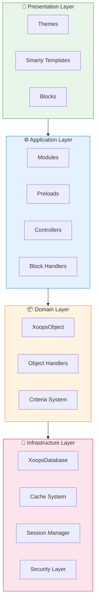
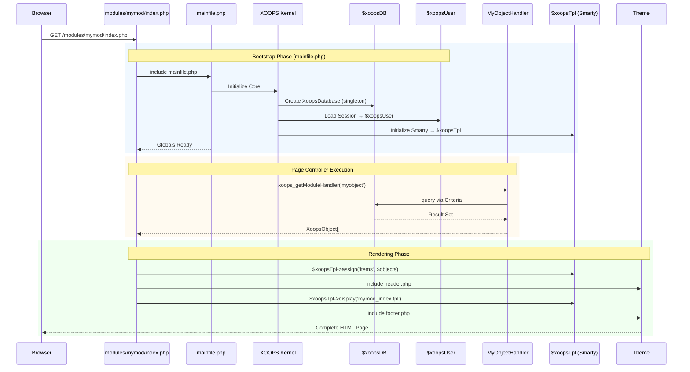

:::note[이 문서에 대하여]
이 페이지에서는 현재(2.5.x) 및 향후(4.0.x) 버전 모두에 적용되는 XOOPS의 **개념적 아키텍처**에 대해 설명합니다. 일부 다이어그램은 계층화된 디자인 비전을 보여줍니다.

**버전별 세부정보:**
- **XOOPS 2.5.x 현재:** `mainfile.php`, 전역(`$xoopsDB`, `$xoopsUser`), 사전 로드 및 핸들러 패턴을 사용합니다.
- **XOOPS 4.0 대상:** PSR-15 미들웨어, DI 컨테이너, 라우터 - [로드맵](../../07-XOOPS-4.0/XOOPS-4.0-Roadmap.md) 참조
:::

이 문서는 XOOPS 시스템 아키텍처에 대한 포괄적인 개요를 제공하고 다양한 구성 요소가 함께 작동하여 유연하고 확장 가능한 콘텐츠 관리 시스템을 만드는 방법을 설명합니다.

## 개요

XOOPS는 문제를 별개의 레이어로 분리하는 모듈식 아키텍처를 따릅니다. 시스템은 다음과 같은 몇 가지 핵심 원칙을 기반으로 구축되었습니다.

- **모듈화**: 기능이 독립적이고 설치 가능한 모듈로 구성됩니다.
- **확장성**: 핵심 코드 수정 없이 시스템 확장 가능
- **추상화**: 데이터베이스 및 프레젠테이션 레이어가 비즈니스 로직에서 추상화됩니다.
- **보안**: 내장된 보안 메커니즘은 일반적인 취약점으로부터 보호합니다.

## 시스템 레이어



### 1. 프리젠테이션 레이어

프리젠테이션 계층은 Smarty 템플릿 엔진을 사용하여 사용자 인터페이스 렌더링을 처리합니다.

**주요 구성 요소:**
- **테마**: 시각적 스타일 및 레이아웃
- **Smarty 템플릿**: 동적 콘텐츠 렌더링
- **블록**: 재사용 가능한 콘텐츠 위젯

### 2. 애플리케이션 계층

애플리케이션 계층에는 비즈니스 로직, 컨트롤러 및 모듈 기능이 포함되어 있습니다.

**주요 구성 요소:**
- **모듈**: 자체 포함된 기능 패키지
- **핸들러**: 데이터 조작 클래스
- **사전 로드**: 이벤트 리스너 및 후크

### 3. 도메인 레이어

도메인 계층에는 핵심 비즈니스 개체와 규칙이 포함되어 있습니다.

**주요 구성 요소:**
- **XoopsObject**: 모든 도메인 객체에 대한 기본 클래스
- **핸들러**: 도메인 개체에 대한 CRUD 작업

### 4. 인프라 계층

인프라 계층은 데이터베이스 액세스 및 캐싱과 같은 핵심 서비스를 제공합니다.

## 요청 수명 주기

효과적인 XOOPS 개발을 위해서는 요청 수명주기를 이해하는 것이 중요합니다.

### XOOPS 2.5.x 페이지 컨트롤러 흐름

현재 XOOPS 2.5.x는 각 PHP 파일이 자체 요청을 처리하는 **페이지 컨트롤러** 패턴을 사용합니다. 전역(`$xoopsDB`, `$xoopsUser`, `$xoopsTpl` 등)은 부트스트랩 중에 초기화되고 실행 전반에 걸쳐 사용할 수 있습니다.



### 2.5.x의 주요 전역 변수

| 글로벌 | 유형 | 초기화됨 | 목적 |
|--------|------|-------------|---------|
| `$xoopsDB` | `XoopsDatabase` | 부트스트랩 | 데이터베이스 연결(싱글톤) |
| `$xoopsUser` | `XoopsUser\|null` | 세션 로드 | 현재 로그인된 사용자 |
| `$xoopsTpl` | `XoopsTpl` | 템플릿 초기화 | Smarty 템플릿 엔진 |
| `$xoopsModule` | `XoopsModule` | 모듈 로드 | 현재 모듈 컨텍스트 |
| `$xoopsConfig` | `array` | 구성 로드 | 시스템 구성 |

:::참고[XOOPS 4.0 비교]
XOOPS 4.0에서는 페이지 컨트롤러 패턴이 **PSR-15 미들웨어 파이프라인** 및 라우터 기반 디스패칭으로 대체되었습니다. 전역은 종속성 주입으로 대체됩니다. 마이그레이션 중 호환성 보장은 [하이브리드 모드 계약](../../07-XOOPS-4.0/Specifications/Hybrid-Mode-Contract.md)을 참조하세요.
:::

### 1. 부트스트랩 단계

```php
// mainfile.php is the entry point
include_once XOOPS_ROOT_PATH . '/mainfile.php';

// Core initialization
$xoops = Xoops::getInstance();
$xoops->boot();
```

**단계:**
1. 로드 구성(`mainfile.php`)
2. 오토로더 초기화
3. 오류 처리 설정
4. 데이터베이스 연결 설정
5. 사용자 세션 로드
6. Smarty 템플릿 엔진 초기화

### 2. 라우팅 단계

```php
// Request routing to appropriate module
$module = $GLOBALS['xoopsModule'];
$controller = $module->getController();
$controller->dispatch($request);
```

**단계:**
1. 요청 URL 분석
2. 대상 모듈 식별
3. 모듈 구성 로드
4. 권한 확인
5. 적절한 핸들러에게 전달

### 3. 실행 단계

```php
// Controller execution
$data = $handler->getObjects($criteria);
$xoopsTpl->assign('items', $data);
```

**단계:**
1. 컨트롤러 로직 실행
2. 데이터 레이어와 상호작용
3. 비즈니스 규칙 처리
4. 뷰 데이터 준비

### 4. 렌더링 단계

```php
// Template rendering
include XOOPS_ROOT_PATH . '/header.php';
$xoopsTpl->display('db:module_template.tpl');
include XOOPS_ROOT_PATH . '/footer.php';
```

**단계:**
1. 테마 레이아웃 적용
2. 렌더 모듈 템플릿
3. 프로세스 블록
4. 출력 응답

## 핵심 구성요소

### XoopsObject

XOOPS의 모든 데이터 객체에 대한 기본 클래스입니다.

```php
<?php
class MyModuleItem extends XoopsObject
{
    public function __construct()
    {
        $this->initVar('id', XOBJ_DTYPE_INT, null, false);
        $this->initVar('title', XOBJ_DTYPE_TXTBOX, '', true, 255);
        $this->initVar('content', XOBJ_DTYPE_TXTAREA, '', false);
        $this->initVar('created', XOBJ_DTYPE_INT, time(), false);
    }
}
```

**주요 방법:**
- `initVar()` - 객체 속성 정의
- `getVar()` - 속성 값 검색
- `setVar()` - 속성 값 설정
- `assignVars()` - 어레이에서 대량 할당

### XoopsPersistableObjectHandler

XoopsObject 인스턴스에 대한 CRUD 작업을 처리합니다.

```php
<?php
class MyModuleItemHandler extends XoopsPersistableObjectHandler
{
    public function __construct(\XoopsDatabase $db)
    {
        parent::__construct($db, 'mymodule_items', 'MyModuleItem', 'id', 'title');
    }

    public function getActiveItems($limit = 10)
    {
        $criteria = new CriteriaCompo();
        $criteria->add(new Criteria('status', 1));
        $criteria->setSort('created');
        $criteria->setOrder('DESC');
        $criteria->setLimit($limit);

        return $this->getObjects($criteria);
    }
}
```

**주요 방법:**
- `create()` - 새 개체 인스턴스 만들기
- `get()` - ID로 객체 검색
- `insert()` - 데이터베이스에 개체 저장
- `delete()` - 데이터베이스에서 개체 제거
- `getObjects()` - 여러 개체 검색
- `getCount()` - 일치하는 개체 수 계산

### 모듈 구조

모든 XOOPS 모듈은 표준 디렉터리 구조를 따릅니다.

```
modules/mymodule/
├── class/                  # PHP classes
│   ├── MyModuleItem.php
│   └── MyModuleItemHandler.php
├── include/                # Include files
│   ├── common.php
│   └── functions.php
├── templates/              # Smarty templates
│   ├── mymodule_index.tpl
│   └── mymodule_item.tpl
├── admin/                  # Admin area
│   ├── index.php
│   └── menu.php
├── language/               # Translations
│   └── english/
│       ├── main.php
│       └── modinfo.php
├── sql/                    # Database schema
│   └── mysql.sql
├── xoops_version.php       # Module info
├── index.php               # Module entry
└── header.php              # Module header
```

## 의존성 주입 컨테이너

최신 XOOPS 개발에서는 더 나은 테스트 가능성을 위해 종속성 주입을 활용할 수 있습니다.

### 기본 컨테이너 구현

```php
<?php
class XoopsDependencyContainer
{
    private array $services = [];

    public function register(string $name, callable $factory): void
    {
        $this->services[$name] = $factory;
    }

    public function resolve(string $name): mixed
    {
        if (!isset($this->services[$name])) {
            throw new \InvalidArgumentException("Service not found: $name");
        }

        $factory = $this->services[$name];

        if (is_callable($factory)) {
            return $factory($this);
        }

        return $factory;
    }

    public function has(string $name): bool
    {
        return isset($this->services[$name]);
    }
}
```

### PSR-11 호환 컨테이너

```php
<?php
namespace Xmf\Di;

use Psr\Container\ContainerInterface;

class BasicContainer implements ContainerInterface
{
    protected array $definitions = [];

    public function set(string $id, mixed $value): void
    {
        $this->definitions[$id] = $value;
    }

    public function get(string $id): mixed
    {
        if (!$this->has($id)) {
            throw new \InvalidArgumentException("Service not found: $id");
        }

        $entry = $this->definitions[$id];

        if (is_callable($entry)) {
            return $entry($this);
        }

        return $entry;
    }

    public function has(string $id): bool
    {
        return isset($this->definitions[$id]);
    }
}
```

### 사용 예

```php
<?php
// Service registration
$container = new XoopsDependencyContainer();

$container->register('database', function () {
    return XoopsDatabaseFactory::getDatabaseConnection();
});

$container->register('userHandler', function ($c) {
    return new XoopsUserHandler($c->resolve('database'));
});

// Service resolution
$userHandler = $container->resolve('userHandler');
$user = $userHandler->get($userId);
```

## 확장 포인트

XOOPS는 여러 확장 메커니즘을 제공합니다.

### 1. 사전 로드

미리 로드를 사용하면 모듈이 핵심 이벤트에 연결될 수 있습니다.

```php
<?php
// modules/mymodule/preloads/core.php
class MymoduleCorePreload extends XoopsPreloadItem
{
    public static function eventCoreHeaderEnd($args)
    {
        // Execute when header processing ends
    }

    public static function eventCoreFooterStart($args)
    {
        // Execute when footer processing starts
    }
}
```

### 2. 플러그인

플러그인은 모듈 내의 특정 기능을 확장합니다.

```php
<?php
// modules/mymodule/plugins/notify.php
class MymoduleNotifyPlugin
{
    public function onItemCreate($item)
    {
        // Send notification when item is created
    }
}
```

### 3. 필터

필터는 데이터가 시스템을 통과할 때 데이터를 수정합니다.

```php
<?php
// Content filter example
$myts = MyTextSanitizer::getInstance();
$content = $myts->displayTarea($rawContent, 1, 1, 1);
```

## 모범 사례

### 코드 구성

1. 새 코드에 **네임스페이스 사용**:
   ```php
   namespace XoopsModules\MyModule;

   class Item extends \XoopsObject
   {
       // Implementation
   }
   ```

2. **PSR-4 자동 로딩을 따르세요**:
   ```json
   {
       "autoload": {
           "psr-4": {
               "XoopsModules\\MyModule\\": "class/"
           }
       }
   }
   ```

3. **별도의 우려사항**:
   - `class/`의 도메인 로직
   - `templates/`으로 발표
   - 모듈 루트의 컨트롤러

### 성능

1. 비용이 많이 드는 작업에 **캐싱 사용**
2. 가능한 경우 **지연 로드** 리소스
3. 기준 일괄 처리를 사용하여 **데이터베이스 쿼리 최소화**
4. 복잡한 로직을 피하여 **템플릿 최적화**

### 보안

1. `Xmf\Request`을 사용하여 **모든 입력의 유효성을 검사**합니다.
2. 템플릿의 **이스케이프 출력**
3. 데이터베이스 쿼리에 **준비된 문 사용**
4. 민감한 작업 전 **권한 확인**

## 관련 문서

- [Design-Patterns](Design-Patterns.md) - XOOPS에서 사용되는 디자인 패턴
- [데이터베이스 계층](../Database/Database-Layer.md) - 데이터베이스 추상화 세부정보
- [Smarty 기본](../Templates/Smarty-Basics.md) - 템플릿 시스템 문서
- [보안 모범 사례](../Security/Security-Best-Practices.md) - 보안 지침

---

#xoops #아키텍처 #코어 #디자인 #시스템 디자인
