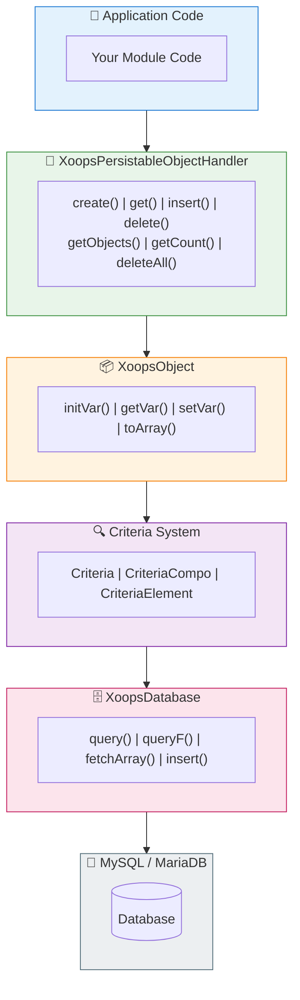

# 🗄️ 데이터베이스 레이어

<span class="version-badge version-25x">2.5.x ✅</span> <span class="version-badge version-40x">4.0.x ✅</span>

> XOOPS 데이터베이스 추상화, 개체 지속성 및 쿼리 작성을 이해합니다.

:::tip[미래에 대비한 데이터 액세스]
handler/Criteria 패턴은 두 버전 모두에서 작동합니다. XOOPS 4.0을 준비하려면 더 나은 테스트 가능성을 위해 [리포지토리 클래스](../../03-Module-Development/Patterns/Repository-Pattern.md)에 핸들러를 래핑하는 것을 고려하세요. [데이터 액세스 패턴 선택](../../03-Module-Development/Choosing-Data-Access-Pattern.md)을 참조하세요.
:::

---

## 개요

XOOPS 데이터베이스 계층은 다음 기능을 통해 MySQL/MariaDB에 대한 강력한 추상화를 제공합니다.

- **공장 패턴** - 중앙 집중식 데이터베이스 연결 관리
- **객체 관계형 매핑** - XoopsObject 및 핸들러
- **쿼리 빌딩** - 복잡한 쿼리를 위한 Criteria 시스템
- **연결 재사용** - 싱글톤 팩토리를 통한 단일 연결(풀링 아님)

---

## 🏗️ 건축



---

## 🔌 데이터베이스 연결

### 연결하기

```php
// Recommended: Use the global database instance
$db = \XoopsDatabaseFactory::getDatabaseConnection();

// Legacy: Global variable (still works)
global $xoopsDB;
```

### XoopsDatabaseFactory

팩토리 패턴은 단일 데이터베이스 연결이 재사용되도록 보장합니다.

```php
<?php

class XoopsDatabaseFactory
{
    private static ?XoopsDatabase $instance = null;

    public static function getDatabaseConnection(): XoopsDatabase
    {
        if (self::$instance === null) {
            self::$instance = new XoopsMySQLDatabase();
        }
        return self::$instance;
    }
}
```

---

## 📦 XoopsObject

XOOPS의 모든 데이터 객체에 대한 기본 클래스입니다.

### 객체 정의

```php
<?php

namespace XoopsModules\MyModule;

class Article extends \XoopsObject
{
    public function __construct()
    {
        $this->initVar('article_id', \XOBJ_DTYPE_INT, null, false);
        $this->initVar('category_id', \XOBJ_DTYPE_INT, 0, true);
        $this->initVar('title', \XOBJ_DTYPE_TXTBOX, '', true, 255);
        $this->initVar('content', \XOBJ_DTYPE_TXTAREA, '', false);
        $this->initVar('author_id', \XOBJ_DTYPE_INT, 0, true);
        $this->initVar('status', \XOBJ_DTYPE_TXTBOX, 'draft', true, 20);
        $this->initVar('views', \XOBJ_DTYPE_INT, 0, false);
        $this->initVar('created', \XOBJ_DTYPE_INT, time(), false);
        $this->initVar('updated', \XOBJ_DTYPE_INT, 0, false);
    }
}
```

### 데이터 유형

| 상수 | 유형 | 설명 |
|----------|------|-------------|
| `XOBJ_DTYPE_INT` | 정수 | 숫자 값 |
| `XOBJ_DTYPE_TXTBOX` | 문자열 | 짧은 텍스트(< 255자) |
| `XOBJ_DTYPE_TXTAREA` | 텍스트 | 긴 텍스트 콘텐츠 |
| `XOBJ_DTYPE_EMAIL` | 이메일 | 이메일 주소 |
| `XOBJ_DTYPE_URL` | URL | 웹 주소 |
| `XOBJ_DTYPE_FLOAT` | 플로트 | 소수 |
| `XOBJ_DTYPE_ARRAY` | 배열 | 직렬화된 배열 |
| `XOBJ_DTYPE_OTHER` | 혼합 | 원시 데이터 |

### 객체 작업

```php
// Create new object
$article = new Article();

// Set values
$article->setVar('title', 'My Article');
$article->setVar('content', 'Article content here...');
$article->setVar('category_id', 5);
$article->setVar('author_id', $xoopsUser->getVar('uid'));

// Get values
$title = $article->getVar('title');           // Raw value
$titleDisplay = $article->getVar('title', 'e'); // For editing (HTML entities)
$titleShow = $article->getVar('title', 's');    // For display (sanitized)

// Bulk assign from array
$article->assignVars([
    'title' => 'New Title',
    'status' => 'published'
]);

// Convert to array
$data = $article->toArray();
```

---

## 🔧 객체 핸들러

### XoopsPersistableObjectHandler

핸들러 클래스는 XoopsObject 인스턴스에 대한 CRUD 작업을 관리합니다.

```php
<?php

namespace XoopsModules\MyModule;

class ArticleHandler extends \XoopsPersistableObjectHandler
{
    public function __construct(\XoopsDatabase $db = null)
    {
        parent::__construct(
            $db,
            'mymodule_articles',  // Table name
            Article::class,       // Object class
            'article_id',         // Primary key
            'title'               // Identifier field
        );
    }
}
```

### 핸들러 메서드

```php
// Get handler instance
$articleHandler = xoops_getModuleHandler('article', 'mymodule');

// Create new object
$article = $articleHandler->create();

// Get by ID
$article = $articleHandler->get(123);

// Insert (create or update)
$success = $articleHandler->insert($article);

// Delete
$success = $articleHandler->delete($article);

// Get multiple objects
$articles = $articleHandler->getObjects($criteria);

// Get count
$count = $articleHandler->getCount($criteria);

// Get as array (key => value)
$list = $articleHandler->getList($criteria);

// Delete multiple
$deleted = $articleHandler->deleteAll($criteria);
```

### 사용자 정의 핸들러 메소드

```php
<?php

namespace XoopsModules\MyModule;

class ArticleHandler extends \XoopsPersistableObjectHandler
{
    // ... constructor

    /**
     * Get published articles
     */
    public function getPublished(int $limit = 10, int $start = 0): array
    {
        $criteria = new \CriteriaCompo();
        $criteria->add(new \Criteria('status', 'published'));
        $criteria->setSort('created');
        $criteria->setOrder('DESC');
        $criteria->setLimit($limit);
        $criteria->setStart($start);

        return $this->getObjects($criteria);
    }

    /**
     * Get articles by category
     */
    public function getByCategory(int $categoryId, int $limit = 10): array
    {
        $criteria = new \CriteriaCompo();
        $criteria->add(new \Criteria('category_id', $categoryId));
        $criteria->add(new \Criteria('status', 'published'));
        $criteria->setSort('created');
        $criteria->setOrder('DESC');
        $criteria->setLimit($limit);

        return $this->getObjects($criteria);
    }

    /**
     * Get articles by author
     */
    public function getByAuthor(int $authorId): array
    {
        $criteria = new \Criteria('author_id', $authorId);
        return $this->getObjects($criteria);
    }

    /**
     * Increment view count
     */
    public function incrementViews(int $articleId): bool
    {
        $sql = sprintf(
            'UPDATE %s SET views = views + 1 WHERE article_id = %d',
            $this->table,
            $articleId
        );
        return $this->db->queryF($sql) !== false;
    }

    /**
     * Get popular articles
     */
    public function getPopular(int $limit = 5): array
    {
        $criteria = new \CriteriaCompo();
        $criteria->add(new \Criteria('status', 'published'));
        $criteria->setSort('views');
        $criteria->setOrder('DESC');
        $criteria->setLimit($limit);

        return $this->getObjects($criteria);
    }
}
```

---

## 🔍 Criteria 시스템

Criteria 시스템은 SQL WHERE 절을 작성하는 강력한 객체 지향 방법을 제공합니다.

### 기본 Criteria

```php
// Simple equality
$criteria = new \Criteria('status', 'published');

// With operator
$criteria = new \Criteria('views', 100, '>=');

// Column comparison
$criteria = new \Criteria('updated', 'created', '>');
```

### CriteriaCompo (Criteria 결합)

```php
$criteria = new \CriteriaCompo();

// AND conditions (default)
$criteria->add(new \Criteria('status', 'published'));
$criteria->add(new \Criteria('category_id', 5));

// OR conditions
$criteria->add(new \Criteria('featured', 1), 'OR');

// Nested conditions
$subCriteria = new \CriteriaCompo();
$subCriteria->add(new \Criteria('author_id', 1));
$subCriteria->add(new \Criteria('author_id', 2), 'OR');
$criteria->add($subCriteria);
```

### 정렬 및 페이지 매김

```php
$criteria = new \CriteriaCompo();
$criteria->add(new \Criteria('status', 'published'));

// Sorting
$criteria->setSort('created');
$criteria->setOrder('DESC');

// Multiple sort fields
$criteria->setSort('category_id, created');
$criteria->setOrder('ASC, DESC');

// Pagination
$criteria->setLimit(10);    // Items per page
$criteria->setStart(20);    // Offset

// Group by
$criteria->setGroupby('category_id');
```

### 연산자

| 운영자 | 예 | SQL 출력 |
|----------|---------|------------|
| `=` | `new Criteria('status', 'published')` | `status = 'published'` |
| `!=` | `new Criteria('status', 'draft', '!=')` | `status != 'draft'` |
| `>` | `new Criteria('views', 100, '>')` | `views > 100` |
| `>=` | `new Criteria('views', 100, '>=')` | `views >= 100` |
| `<` | `new Criteria('views', 100, '<')` | `views < 100` |
| `<=` | `new Criteria('views', 100, '<=')` | `views <= 100` |
| `LIKE` | `new Criteria('title', '%php%', 'LIKE')` | `title LIKE '%php%'` |
| `NOT LIKE` | `new Criteria('title', '%test%', 'NOT LIKE')` | `title NOT LIKE '%test%'` |
| `IN` | `new Criteria('id', '(1,2,3)', 'IN')` | `id IN (1,2,3)` |
| `NOT IN` | `new Criteria('id', '(1,2,3)', 'NOT IN')` | `id NOT IN (1,2,3)` |

### 복잡한 예

```php
// Find published articles in specific categories,
// with search term in title, sorted by views
$criteria = new \CriteriaCompo();

// Status must be published
$criteria->add(new \Criteria('status', 'published'));

// In categories 1, 2, or 3
$criteria->add(new \Criteria('category_id', '(1, 2, 3)', 'IN'));

// Title contains search term
$searchTerm = '%' . $db->escape($searchQuery) . '%';
$criteria->add(new \Criteria('title', $searchTerm, 'LIKE'));

// Created in last 30 days
$thirtyDaysAgo = time() - (30 * 24 * 60 * 60);
$criteria->add(new \Criteria('created', $thirtyDaysAgo, '>='));

// Sort by views descending
$criteria->setSort('views');
$criteria->setOrder('DESC');

// Paginate
$criteria->setLimit(10);
$criteria->setStart($page * 10);

$articles = $articleHandler->getObjects($criteria);
$totalCount = $articleHandler->getCount($criteria);
```

---

## 📝 직접 쿼리

Criteria으로는 불가능한 복잡한 쿼리의 경우 직접 SQL을 사용하세요.

### 안전한 쿼리(읽기)

```php
$db = \XoopsDatabaseFactory::getDatabaseConnection();

$sql = sprintf(
    'SELECT a.*, c.category_name
     FROM %s a
     LEFT JOIN %s c ON a.category_id = c.category_id
     WHERE a.status = %s
     ORDER BY a.created DESC
     LIMIT %d',
    $db->prefix('mymodule_articles'),
    $db->prefix('mymodule_categories'),
    $db->quoteString('published'),
    10
);

$result = $db->query($sql);

while ($row = $db->fetchArray($result)) {
    // Process row
    echo $row['title'];
}
```

### 쿼리 작성

```php
// Insert
$sql = sprintf(
    "INSERT INTO %s (title, content, created) VALUES (%s, %s, %d)",
    $db->prefix('mymodule_articles'),
    $db->quoteString($title),
    $db->quoteString($content),
    time()
);
$db->queryF($sql);
$newId = $db->getInsertId();

// Update
$sql = sprintf(
    "UPDATE %s SET views = views + 1 WHERE article_id = %d",
    $db->prefix('mymodule_articles'),
    $articleId
);
$db->queryF($sql);
$affectedRows = $db->getAffectedRows();

// Delete
$sql = sprintf(
    "DELETE FROM %s WHERE article_id = %d",
    $db->prefix('mymodule_articles'),
    $articleId
);
$db->queryF($sql);
```

### 값 이스케이프

```php
// String escaping
$safeString = $db->quoteString($userInput);
// or
$safeString = $db->escape($userInput);

// Integer (no escaping needed, just cast)
$safeInt = (int) $userInput;
```

---

## ⚠️ 보안 모범 사례

### 항상 사용자 입력을 피하세요

```php
// NEVER do this
$sql = "SELECT * FROM articles WHERE title = '$_GET[title]'"; // SQL Injection!

// DO this
$title = $db->escape($_GET['title']);
$sql = "SELECT * FROM articles WHERE title = '$title'";

// Or better, use Criteria
$criteria = new \Criteria('title', $db->escape($_GET['title']));
```

### 매개변수화된 쿼리(XMF) 사용

```php
use Xmf\Database\TableLoad;

// Safe bulk insert
$tableLoad = new TableLoad('mymodule_articles');
$tableLoad->insert([
    ['title' => 'Article 1', 'content' => 'Content 1'],
    ['title' => 'Article 2', 'content' => 'Content 2'],
]);
```

### 입력 유형 확인

```php
use Xmf\Request;

$id = Request::getInt('id', 0, 'GET');
$title = Request::getString('title', '', 'POST');
```

---

## 📊 데이터베이스 스키마 예

```sql
-- sql/mysql.sql

CREATE TABLE `{PREFIX}_mymodule_articles` (
    `article_id` INT(11) UNSIGNED NOT NULL AUTO_INCREMENT,
    `category_id` INT(11) UNSIGNED NOT NULL DEFAULT 0,
    `title` VARCHAR(255) NOT NULL DEFAULT '',
    `content` TEXT,
    `author_id` INT(11) UNSIGNED NOT NULL DEFAULT 0,
    `status` VARCHAR(20) NOT NULL DEFAULT 'draft',
    `views` INT(11) UNSIGNED NOT NULL DEFAULT 0,
    `created` INT(11) UNSIGNED NOT NULL DEFAULT 0,
    `updated` INT(11) UNSIGNED NOT NULL DEFAULT 0,
    PRIMARY KEY (`article_id`),
    KEY `category_id` (`category_id`),
    KEY `author_id` (`author_id`),
    KEY `status` (`status`),
    KEY `created` (`created`)
) ENGINE=InnoDB DEFAULT CHARSET=utf8mb4;
```

---

## 🔗 관련 문서

- [Criteria 시스템 심층 분석](../../04-API-Reference/Kernel/Criteria.md)
- [디자인 패턴 - 공장](../Architecture/Design-Patterns.md)
- [SQL 주입 방지](../Security/SQL-Injection-Prevention.md)
- [XoopsDatabase API 참조](../../04-API-Reference/Database/XoopsDatabase.md)

---

#xoops #데이터베이스 #orm #criteria #핸들러 #mysql
