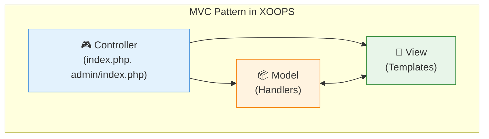

<span class="version-badge version-25x">2.5.x ✅</span> <span class="version-badge version-40x">4.0.x ✅</span>

디자인 패턴은 일반적인 소프트웨어 디자인 문제에 대한 재사용 가능한 솔루션입니다. XOOPS는 코드 품질을 유지하고 테스트 가능성을 개선하며 시스템 유연성을 향상시키는 데 도움이 되는 몇 가지 잘 확립된 패턴을 사용합니다.

:::note[빠른 패턴 선택]
어떤 패턴을 사용해야 할지 모르시나요? 참조:
- [데이터 액세스 패턴 선택](../../03-Module-Development/Choosing-Data-Access-Pattern.md) — 핸들러 vs 리포지토리 vs 서비스 vs CQRS
- [이벤트 시스템 선택](../Choosing-Event-System.md) — 사전 로드 대 PSR-14 이벤트
:::

## 개요

유지 관리 가능한 XOOPS 모듈을 만들려면 디자인 패턴을 이해하고 적절하게 구현하는 것이 중요합니다. 이 가이드는 XOOPS 개발에서 가장 일반적으로 사용되는 패턴을 다룹니다.

| 패턴 | 목적 | 일반적인 사용 사례 |
|---------|---------|------------------|
| MVC | 우려의 분리 | 모듈 구조 |
| 싱글톤 | 단일 인스턴스 보장 | 데이터베이스 연결 |
| 공장 | 객체 생성 추상화 | 핸들러, 데이터베이스 |
| 관찰자 | 이벤트 알림 | 사전 로드, 알림 |
| 데코레이터 | 동적 행동 확장 | 양식 요소, 필터 |
| 전략 | 알고리즘 교환 | 인증, 검증 |
| 어댑터 | 인터페이스 호환성 | 레거시 코드 통합 |
| 저장소 | 데이터 액세스 추상화 | 데이터 지속성 |

## 모델-뷰-컨트롤러(MVC)

MVC 패턴은 애플리케이션을 세 개의 상호 연결된 구성 요소로 분리하여 코드베이스를 더욱 체계화하고 테스트 가능하게 만듭니다.

### 아키텍처



### 모델(데이터 영역)

```php
<?php
namespace XoopsModules\MyModule;

class Article extends \XoopsObject
{
    public function __construct()
    {
        $this->initVar('article_id', XOBJ_DTYPE_INT, null, false);
        $this->initVar('title', XOBJ_DTYPE_TXTBOX, '', true, 255);
        $this->initVar('content', XOBJ_DTYPE_TXTAREA, '', true);
        $this->initVar('author_id', XOBJ_DTYPE_INT, 0, true);
        $this->initVar('status', XOBJ_DTYPE_INT, 1, false);
        $this->initVar('created', XOBJ_DTYPE_INT, time(), false);
        $this->initVar('modified', XOBJ_DTYPE_INT, time(), false);
    }

    public function isPublished(): bool
    {
        return $this->getVar('status') === 1;
    }

    public function getFormattedDate(): string
    {
        return formatTimestamp($this->getVar('created'));
    }
}

class ArticleHandler extends \XoopsPersistableObjectHandler
{
    public function __construct(\XoopsDatabase $db)
    {
        parent::__construct($db, 'mymodule_articles', Article::class, 'article_id', 'title');
    }

    public function getPublishedArticles(int $limit = 10): array
    {
        $criteria = new \CriteriaCompo();
        $criteria->add(new \Criteria('status', 1));
        $criteria->setSort('created');
        $criteria->setOrder('DESC');
        $criteria->setLimit($limit);

        return $this->getObjects($criteria);
    }
}
```

### 보기(프레젠테이션 레이어)

```smarty
{* templates/article_list.tpl *}
<div class="article-list">
    <h2>{$smarty.const._MD_MYMODULE_ARTICLES}</h2>

    {foreach from=$articles item=article}
        <article class="article-item">
            <h3>
                <a href="{$xoops_url}/modules/mymodule/article.php?id={$article.article_id}">
                    {$article.title|escape}
                </a>
            </h3>
            <p class="meta">
                {$smarty.const._MD_MYMODULE_POSTED}: {$article.formatted_date}
            </p>
            <div class="content">
                {$article.content|truncate:200}
            </div>
        </article>
    {/foreach}
</div>
```

### 컨트롤러(로직 레이어)

```php
<?php
// index.php
require_once dirname(__DIR__, 2) . '/mainfile.php';

use XoopsModules\MyModule\Helper;

$helper = Helper::getInstance();
$articleHandler = $helper->getHandler('Article');

// Get action from request
$op = \Xmf\Request::getString('op', 'list');

switch ($op) {
    case 'view':
        $articleId = \Xmf\Request::getInt('id', 0);
        $article = $articleHandler->get($articleId);

        if (!$article) {
            redirect_header(XOOPS_URL, 3, _MD_MYMODULE_NOT_FOUND);
        }

        $GLOBALS['xoopsOption']['template_main'] = 'mymodule_article_view.tpl';
        require_once XOOPS_ROOT_PATH . '/header.php';

        $xoopsTpl->assign('article', $article->toArray());
        break;

    case 'list':
    default:
        $articles = $articleHandler->getPublishedArticles(10);

        $GLOBALS['xoopsOption']['template_main'] = 'mymodule_article_list.tpl';
        require_once XOOPS_ROOT_PATH . '/header.php';

        $xoopsTpl->assign('articles', array_map(fn($a) => $a->toArray(), $articles));
        break;
}

require_once XOOPS_ROOT_PATH . '/footer.php';
```

## 싱글톤 패턴

싱글톤 패턴은 클래스에 인스턴스가 하나만 있도록 보장하고 이에 대한 전역 액세스를 제공합니다.

### 사용 시기

- 데이터베이스 연결
- 구성 관리자
- 로거 인스턴스
- 캐시 관리자

### 구현

```php
<?php
namespace XoopsModules\MyModule;

class ConfigurationManager
{
    private static ?self $instance = null;
    private array $config = [];

    private function __construct()
    {
        // Load configuration
        $this->loadConfiguration();
    }

    // Prevent cloning
    private function __clone() {}

    // Prevent unserialization
    public function __wakeup()
    {
        throw new \Exception("Cannot unserialize singleton");
    }

    public static function getInstance(): self
    {
        if (self::$instance === null) {
            self::$instance = new self();
        }

        return self::$instance;
    }

    private function loadConfiguration(): void
    {
        $helper = Helper::getInstance();
        $this->config = [
            'items_per_page' => $helper->getConfig('items_per_page', 10),
            'allow_comments' => $helper->getConfig('allow_comments', true),
            'date_format' => $helper->getConfig('date_format', 'Y-m-d'),
        ];
    }

    public function get(string $key, mixed $default = null): mixed
    {
        return $this->config[$key] ?? $default;
    }
}

// Usage
$config = ConfigurationManager::getInstance();
$itemsPerPage = $config->get('items_per_page');
```

### XOOPS 핵심 예

```php
<?php
// XoopsDatabaseFactory uses Singleton pattern
$db = XoopsDatabaseFactory::getDatabaseConnection();

// XMF Module Helper uses Singleton
$helper = \Xmf\Module\Helper::getHelper('mymodule');

// Xoops main instance
$xoops = \Xoops::getInstance();
```

## 팩토리 패턴

팩토리 패턴은 정확한 클래스를 지정하지 않고 객체를 생성하므로 유연한 객체 생성이 가능합니다.

### 사용 시기

- 동적으로 핸들러 생성
- 다양한 데이터베이스에 대한 데이터베이스 연결
- 인증 제공자
- 양식 요소 생성

### 구현

```php
<?php
namespace XoopsModules\MyModule;

interface ContentInterface
{
    public function render(): string;
}

class ArticleContent implements ContentInterface
{
    private array $data;

    public function __construct(array $data)
    {
        $this->data = $data;
    }

    public function render(): string
    {
        return "<article><h2>{$this->data['title']}</h2><p>{$this->data['body']}</p></article>";
    }
}

class NewsContent implements ContentInterface
{
    private array $data;

    public function __construct(array $data)
    {
        $this->data = $data;
    }

    public function render(): string
    {
        return "<div class='news'><h3>{$this->data['headline']}</h3><p>{$this->data['summary']}</p></div>";
    }
}

class ContentFactory
{
    public static function create(string $type, array $data): ContentInterface
    {
        return match ($type) {
            'article' => new ArticleContent($data),
            'news' => new NewsContent($data),
            default => throw new \InvalidArgumentException("Unknown content type: $type"),
        };
    }
}

// Usage
$article = ContentFactory::create('article', ['title' => 'Hello', 'body' => 'World']);
echo $article->render();
```

### XOOPS 데이터베이스 공장

```php
<?php
class XoopsDatabaseFactory
{
    public static function getDatabaseConnection()
    {
        static $instance;

        if (!isset($instance)) {
            $dbType = XOOPS_DB_TYPE ?? 'mysql';
            $className = 'XoopsDatabase' . ucfirst($dbType);

            if (!class_exists($className)) {
                $file = XOOPS_ROOT_PATH . '/class/database/' . strtolower($dbType) . '.php';
                if (file_exists($file)) {
                    require_once $file;
                }
            }

            $instance = new $className();

            if (!$instance->connect()) {
                trigger_error('Unable to connect to database', E_USER_ERROR);
            }
        }

        return $instance;
    }
}
```

## 관찰자 패턴

관찰자 패턴을 사용하면 객체가 주체의 상태 변경에 대한 알림을 받을 수 있으므로 이벤트 기반 동작이 가능합니다.

### 사용 시기

- 이벤트 처리
- 알림 시스템
- 플러그인 아키텍처
- 로깅 및 감사

### 구현

```php
<?php
namespace XoopsModules\MyModule;

interface ObserverInterface
{
    public function update(string $event, array $data): void;
}

class EventDispatcher
{
    private array $observers = [];

    public function attach(string $event, ObserverInterface $observer): void
    {
        if (!isset($this->observers[$event])) {
            $this->observers[$event] = [];
        }

        $this->observers[$event][] = $observer;
    }

    public function detach(string $event, ObserverInterface $observer): void
    {
        if (isset($this->observers[$event])) {
            $key = array_search($observer, $this->observers[$event], true);
            if ($key !== false) {
                unset($this->observers[$event][$key]);
            }
        }
    }

    public function notify(string $event, array $data = []): void
    {
        if (isset($this->observers[$event])) {
            foreach ($this->observers[$event] as $observer) {
                $observer->update($event, $data);
            }
        }
    }
}

class EmailNotifier implements ObserverInterface
{
    public function update(string $event, array $data): void
    {
        if ($event === 'article.published') {
            // Send email notification
            $this->sendEmail($data['article']);
        }
    }

    private function sendEmail($article): void
    {
        $xoopsMailer = xoops_getMailer();
        $xoopsMailer->setSubject('New Article Published: ' . $article->getVar('title'));
        $xoopsMailer->setBody('A new article has been published.');
        $xoopsMailer->send();
    }
}

// Usage
$dispatcher = new EventDispatcher();
$dispatcher->attach('article.published', new EmailNotifier());

// When article is published
$dispatcher->notify('article.published', ['article' => $article]);
```

### XOOPS 사전 로드(관찰자 구현)

```php
<?php
// modules/mymodule/preloads/core.php
class MymoduleCorePreload extends XoopsPreloadItem
{
    public static function eventCoreIncludeCommonEnd($args)
    {
        // React to core common include completing
        $GLOBALS['xoopsLogger']->addExtra('MyModule', 'Initialized');
    }

    public static function eventCoreHeaderEnd($args)
    {
        // Add custom headers
        $GLOBALS['xoTheme']->addStylesheet('modules/mymodule/assets/css/custom.css');
    }

    public static function eventCoreFooterStart($args)
    {
        // Execute before footer renders
    }
}
```

## 데코레이터 패턴

데코레이터 패턴은 동일한 클래스의 다른 객체에 영향을 주지 않고 동적으로 객체에 동작을 추가합니다.

### 사용 시기

- 양식 요소 사용자 정의
- 출력 형식
- 권한 확인
- 캐싱 레이어

### 구현

```php
<?php
namespace XoopsModules\MyModule;

interface FormElementInterface
{
    public function render(): string;
}

class TextInput implements FormElementInterface
{
    private string $name;
    private string $value;

    public function __construct(string $name, string $value = '')
    {
        $this->name = $name;
        $this->value = $value;
    }

    public function render(): string
    {
        return sprintf(
            '<input type="text" name="%s" value="%s">',
            htmlspecialchars($this->name),
            htmlspecialchars($this->value)
        );
    }
}

abstract class FormElementDecorator implements FormElementInterface
{
    protected FormElementInterface $element;

    public function __construct(FormElementInterface $element)
    {
        $this->element = $element;
    }

    public function render(): string
    {
        return $this->element->render();
    }
}

class RequiredDecorator extends FormElementDecorator
{
    public function render(): string
    {
        return $this->element->render() . '<span class="required">*</span>';
    }
}

class LabelDecorator extends FormElementDecorator
{
    private string $label;

    public function __construct(FormElementInterface $element, string $label)
    {
        parent::__construct($element);
        $this->label = $label;
    }

    public function render(): string
    {
        return sprintf(
            '<label>%s</label>%s',
            htmlspecialchars($this->label),
            $this->element->render()
        );
    }
}

class HelpTextDecorator extends FormElementDecorator
{
    private string $helpText;

    public function __construct(FormElementInterface $element, string $helpText)
    {
        parent::__construct($element);
        $this->helpText = $helpText;
    }

    public function render(): string
    {
        return $this->element->render() . sprintf(
            '<small class="help-text">%s</small>',
            htmlspecialchars($this->helpText)
        );
    }
}

// Usage - decorators can be stacked
$input = new TextInput('username');
$input = new RequiredDecorator($input);
$input = new LabelDecorator($input, 'Username');
$input = new HelpTextDecorator($input, 'Enter your username');

echo $input->render();
// Output: <label>Username</label><input type="text" name="username" value=""><span class="required">*</span><small class="help-text">Enter your username</small>
```

## 전략 패턴

전략 패턴은 일련의 알고리즘을 정의하고 각 알고리즘을 캡슐화하며 상호 교환 가능하게 만듭니다.

### 사용 시기

- 다양한 인증 방법
- 다양한 정렬 알고리즘
- 다양한 내보내기 형식
- 유연한 검증 규칙

### 구현

```php
<?php
namespace XoopsModules\MyModule;

interface AuthStrategyInterface
{
    public function authenticate(string $username, string $password): bool;
}

class DatabaseAuthStrategy implements AuthStrategyInterface
{
    public function authenticate(string $username, string $password): bool
    {
        $memberHandler = xoops_getHandler('member');
        $user = $memberHandler->loginUser($username, $password);

        return $user !== false;
    }
}

class LdapAuthStrategy implements AuthStrategyInterface
{
    private string $ldapHost;
    private int $ldapPort;

    public function __construct(string $host, int $port = 389)
    {
        $this->ldapHost = $host;
        $this->ldapPort = $port;
    }

    public function authenticate(string $username, string $password): bool
    {
        $ldap = ldap_connect($this->ldapHost, $this->ldapPort);

        if (!$ldap) {
            return false;
        }

        $bind = @ldap_bind($ldap, "uid=$username,ou=users,dc=example,dc=com", $password);

        ldap_close($ldap);

        return $bind;
    }
}

class AuthService
{
    private AuthStrategyInterface $strategy;

    public function __construct(AuthStrategyInterface $strategy)
    {
        $this->strategy = $strategy;
    }

    public function setStrategy(AuthStrategyInterface $strategy): void
    {
        $this->strategy = $strategy;
    }

    public function login(string $username, string $password): bool
    {
        return $this->strategy->authenticate($username, $password);
    }
}

// Usage
$authService = new AuthService(new DatabaseAuthStrategy());

// Can switch strategies at runtime
if ($useLdap) {
    $authService->setStrategy(new LdapAuthStrategy('ldap.example.com'));
}

$authenticated = $authService->login($username, $password);
```

## 저장소 패턴

리포지토리 패턴은 데이터 액세스 논리와 비즈니스 논리 사이에 추상화 계층을 제공합니다.

### 사용 시기

- 복잡한 데이터 액세스 요구 사항
- 여러 데이터 소스
- 테스트 가능한 데이터 레이어
- 도메인 중심 디자인

### 구현

```php
<?php
namespace XoopsModules\MyModule\Repository;

use XoopsModules\MyModule\Entity\Article;

interface ArticleRepositoryInterface
{
    public function find(int $id): ?Article;
    public function findBySlug(string $slug): ?Article;
    public function findPublished(int $limit = 10, int $offset = 0): array;
    public function save(Article $article): bool;
    public function delete(Article $article): bool;
}

class ArticleRepository implements ArticleRepositoryInterface
{
    private \XoopsPersistableObjectHandler $handler;

    public function __construct(\XoopsPersistableObjectHandler $handler)
    {
        $this->handler = $handler;
    }

    public function find(int $id): ?Article
    {
        $obj = $this->handler->get($id);
        return $obj ?: null;
    }

    public function findBySlug(string $slug): ?Article
    {
        $criteria = new \Criteria('slug', $slug);
        $objects = $this->handler->getObjects($criteria);

        return !empty($objects) ? $objects[0] : null;
    }

    public function findPublished(int $limit = 10, int $offset = 0): array
    {
        $criteria = new \CriteriaCompo();
        $criteria->add(new \Criteria('status', 'published'));
        $criteria->setSort('published_at');
        $criteria->setOrder('DESC');
        $criteria->setLimit($limit);
        $criteria->setStart($offset);

        return $this->handler->getObjects($criteria);
    }

    public function save(Article $article): bool
    {
        return $this->handler->insert($article);
    }

    public function delete(Article $article): bool
    {
        return $this->handler->delete($article);
    }
}
```

## 의존성 주입

DI(종속성 주입)를 사용하면 개체를 내부적으로 생성하는 대신 종속성을 사용하여 생성할 수 있습니다.

### 혜택

- 테스트 가능성 향상
- 느슨한 결합
- 유연한 구성
- 더 나은 코드 구성

### 구현

```php
<?php
namespace XoopsModules\MyModule;

class ArticleService
{
    private Repository\ArticleRepositoryInterface $repository;
    private CacheInterface $cache;
    private LoggerInterface $logger;

    public function __construct(
        Repository\ArticleRepositoryInterface $repository,
        CacheInterface $cache,
        LoggerInterface $logger
    ) {
        $this->repository = $repository;
        $this->cache = $cache;
        $this->logger = $logger;
    }

    public function getArticle(int $id): ?Entity\Article
    {
        $cacheKey = "article_{$id}";

        // Try cache first
        if ($this->cache->has($cacheKey)) {
            $this->logger->debug("Article {$id} loaded from cache");
            return $this->cache->get($cacheKey);
        }

        // Load from repository
        $article = $this->repository->find($id);

        if ($article) {
            $this->cache->set($cacheKey, $article, 3600);
            $this->logger->debug("Article {$id} loaded from database");
        }

        return $article;
    }
}

// Service container setup
$container = new DependencyContainer();

$container->register('db', fn() => XoopsDatabaseFactory::getDatabaseConnection());

$container->register('articleHandler', fn($c) =>
    new ArticleHandler($c->resolve('db'))
);

$container->register('articleRepository', fn($c) =>
    new Repository\ArticleRepository($c->resolve('articleHandler'))
);

$container->register('cache', fn() => new FileCache(XOOPS_VAR_PATH . '/caches'));

$container->register('logger', fn() => new XoopsLogger());

$container->register('articleService', fn($c) =>
    new ArticleService(
        $c->resolve('articleRepository'),
        $c->resolve('cache'),
        $c->resolve('logger')
    )
);

// Usage
$articleService = $container->resolve('articleService');
$article = $articleService->getArticle(1);
```

## 모범 사례

### 패턴 선택 지침

1. 예상되는 패턴이 아닌 **실제 필요에 따라 패턴을 선택하세요**
2. **구현을 단순하게 유지** - 과도한 엔지니어링을 하지 마십시오.
3. 팀 이해를 위한 **문서 패턴 활용**
4. 적절한 경우 **패턴 결합**(예: Factory + Singleton)
5. 패턴 선택 시 **테스트 가능성 고려**

### 피해야 할 일반적인 안티패턴

| 안티 패턴 | 문제 | 솔루션 |
|--------------|---------|----------|
| 신 개체 | 클래스이 너무 많아 | 단일 책임 |
| 스파게티 코드 | 명확한 구조 없음 | MVC 패턴 사용 |
| 복사-붙여넣기 | 코드 복제 | 공통코드 추출 |
| 매직넘버 | 불분명한 상수 | 명명된 상수 사용 |
| 타이트 커플링 | 테스트/유지 관리가 어려움 | 의존성 주입 사용 |

### 테스트 패턴

```php
<?php
// Unit testing with dependency injection
class ArticleServiceTest extends \PHPUnit\Framework\TestCase
{
    private $repository;
    private $cache;
    private $logger;
    private $service;

    protected function setUp(): void
    {
        $this->repository = $this->createMock(ArticleRepositoryInterface::class);
        $this->cache = $this->createMock(CacheInterface::class);
        $this->logger = $this->createMock(LoggerInterface::class);

        $this->service = new ArticleService(
            $this->repository,
            $this->cache,
            $this->logger
        );
    }

    public function testGetArticleFromCache(): void
    {
        $article = new Article();
        $article->setVar('article_id', 1);

        $this->cache->expects($this->once())
            ->method('has')
            ->with('article_1')
            ->willReturn(true);

        $this->cache->expects($this->once())
            ->method('get')
            ->with('article_1')
            ->willReturn($article);

        $result = $this->service->getArticle(1);

        $this->assertSame($article, $result);
    }
}
```

## 관련 문서

- [XOOPS-Architecture](XOOPS-Architecture.md) - 전체 시스템 아키텍처
- [데이터베이스 계층](../Database/Database-Layer.md) - 데이터 지속성 패턴
- [보안 모범 사례](../Security/Security-Best-Practices.md) - 보안 패턴 구현

---

#xoops #디자인 패턴 #아키텍처 #mvc #싱글턴 #팩토리 #관찰자
