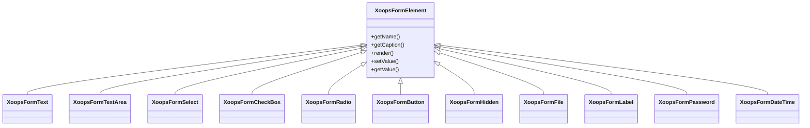

## 개요

XOOPS는 `XoopsFormElement` 클래스 계층을 통해 포괄적인 양식 요소 세트를 제공합니다. 이러한 요소는 웹 양식의 렌더링, 유효성 검사 및 데이터 처리를 처리합니다.

## 양식 요소 계층 구조



## 텍스트 입력 요소

### XoopsFormText

한 줄 텍스트 입력:

```php
use XoopsFormText;

$element = new XoopsFormText(
    caption: 'Username',
    name: 'username',
    size: 30,
    maxlength: 50,
    value: $currentValue
);
```

### XoopsFormPassword

마스킹을 통한 비밀번호 입력:

```php
use XoopsFormPassword;

$element = new XoopsFormPassword(
    caption: 'Password',
    name: 'password',
    size: 30,
    maxlength: 100
);
```

### XoopsFormTextArea

여러 줄 텍스트 입력:

```php
use XoopsFormTextArea;

$element = new XoopsFormTextArea(
    caption: 'Description',
    name: 'description',
    value: $currentValue,
    rows: 5,
    cols: 50
);
```

## 선택 요소

### XoopsFormSelect

드롭다운 선택:

```php
use XoopsFormSelect;

$element = new XoopsFormSelect(
    caption: 'Category',
    name: 'category_id',
    value: $selected,
    size: 1,
    multiple: false
);

$element->addOption(1, 'Category 1');
$element->addOption(2, 'Category 2');
$element->addOptionArray([
    3 => 'Category 3',
    4 => 'Category 4'
]);
```

### XoopsFormCheckBox

체크박스 입력:

```php
use XoopsFormCheckBox;

$element = new XoopsFormCheckBox(
    caption: 'Features',
    name: 'features',
    value: $selected
);

$element->addOption('comments', 'Enable Comments');
$element->addOption('ratings', 'Enable Ratings');
```

### XoopsFormRadio

라디오 버튼 그룹:

```php
use XoopsFormRadio;

$element = new XoopsFormRadio(
    caption: 'Status',
    name: 'status',
    value: $currentValue
);

$element->addOption('draft', 'Draft');
$element->addOption('published', 'Published');
$element->addOption('archived', 'Archived');
```

## 파일 업로드

### XoopsFormFile

파일 업로드 입력:

```php
use XoopsFormFile;

$element = new XoopsFormFile(
    caption: 'Upload Image',
    name: 'image'
);

$element->setMaxFileSize(2 * 1024 * 1024); // 2MB
```

## 날짜 및 시간

### XoopsFormDateTime

날짜/시간 선택기:

```php
use XoopsFormDateTime;

$element = new XoopsFormDateTime(
    caption: 'Publish Date',
    name: 'publish_date',
    size: 15,
    value: time()
);
```

## 특수 요소

### XoopsFormHidden

숨겨진 필드:

```php
use XoopsFormHidden;

$element = new XoopsFormHidden('article_id', $articleId);
```

### XoopsFormLabel

표시 전용 라벨:

```php
use XoopsFormLabel;

$element = new XoopsFormLabel(
    caption: 'Created By',
    value: $authorName
);
```

### XoopsFormButton

양식 버튼:

```php
use XoopsFormButton;

// Submit button
$submit = new XoopsFormButton('', 'submit', 'Save', 'submit');

// Reset button
$reset = new XoopsFormButton('', 'reset', 'Reset', 'reset');
```

## 요소 사용자 정의

### CSS 클래스 추가

```php
$element->setExtra('class="form-control custom-class"');
```

### 맞춤 속성 추가

```php
$element->setExtra('data-validate="required" placeholder="Enter text..."');
```

### 설정 설명

```php
$element->setDescription('Enter a unique username (3-20 characters)');
```

## 관련 문서

- 양식 개요
- 양식 유효성 검사
- 맞춤형 렌더러
