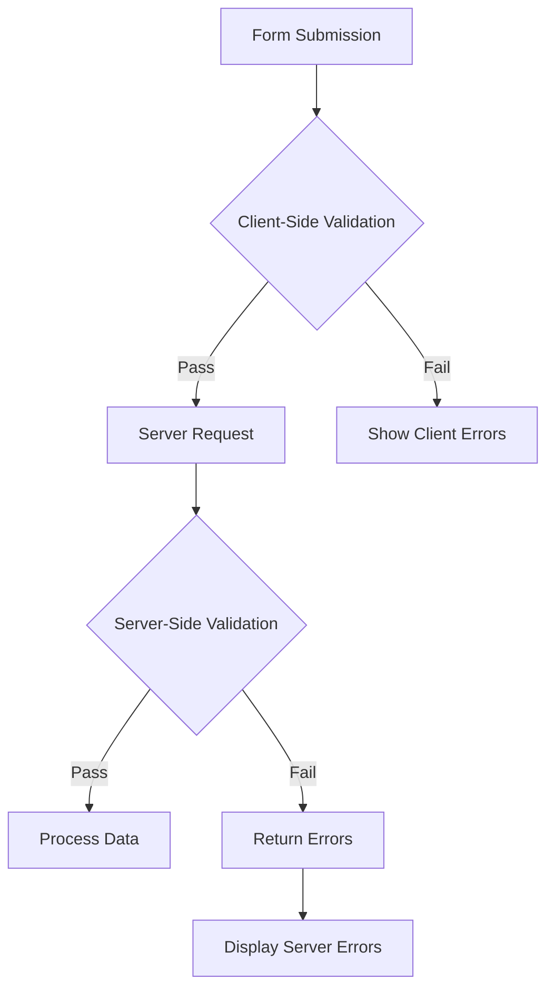

## 개요

XOOPS는 양식 입력에 대해 클라이언트측 및 서버측 유효성 검사를 모두 제공합니다. 이 가이드에서는 유효성 검사 기술, 내장 유효성 검사기 및 사용자 정의 유효성 검사 구현을 다룹니다.

## 검증 아키텍처



## 서버측 검증

### XoopsFormValidator 사용

```php
use Xoops\Core\Form\Validator;

$validator = new Validator();

$validator->addRule('username', 'required', 'Username is required');
$validator->addRule('username', 'minLength:3', 'Username must be at least 3 characters');
$validator->addRule('username', 'maxLength:50', 'Username cannot exceed 50 characters');
$validator->addRule('email', 'email', 'Please enter a valid email address');
$validator->addRule('password', 'minLength:8', 'Password must be at least 8 characters');

if (!$validator->validate($_POST)) {
    $errors = $validator->getErrors();
    // Handle errors
}
```

### 내장된 검증 규칙

| 규칙 | 설명 | 예 |
|------|-------------|---------|
| `required` | 필드는 비워둘 수 없습니다 | `required` |
| `email` | 유효한 이메일 형식 | `email` |
| `url` | 유효한 URL 형식 | `url` |
| `numeric` | 숫자값만 | `numeric` |
| `integer` | 정수값만 | `integer` |
| `minLength` | 최소 문자열 길이 | `minLength:3` |
| `maxLength` | 최대 문자열 길이 | `maxLength:100` |
| `min` | 최소 숫자 값 | `min:1` |
| `max` | 최대 수치 | `max:100` |
| `regex` | 사용자 정의 정규식 패턴 | `regex:/^[a-z]+$/` |
| `in` | 목록의 값 | `in:draft,published,archived` |
| `date` | 유효한 날짜 형식 | `date` |
| `alpha` | 편지만 | `alpha` |
| `alphanumeric` | 문자와 숫자 | `alphanumeric` |

### 사용자 정의 유효성 검사 규칙

```php
$validator->addCustomRule('unique_username', function($value) {
    $memberHandler = xoops_getHandler('member');
    $criteria = new \CriteriaCompo();
    $criteria->add(new \Criteria('uname', $value));
    return $memberHandler->getUserCount($criteria) === 0;
}, 'Username already exists');

$validator->addRule('username', 'unique_username');
```

## 요청 유효성 검사

### 입력 삭제 중

```php
use Xoops\Core\Request;

// Get sanitized values
$username = Request::getString('username', '', 'POST');
$email = Request::getEmail('email', '', 'POST');
$age = Request::getInt('age', 0, 'POST');
$price = Request::getFloat('price', 0.0, 'POST');
$tags = Request::getArray('tags', [], 'POST');

// With validation
$username = Request::getString('username', '', 'POST', [
    'minLength' => 3,
    'maxLength' => 50
]);
```

### XSS 예방

```php
use Xoops\Core\Text\Sanitizer;

$sanitizer = Sanitizer::getInstance();

// Sanitize HTML content
$cleanContent = $sanitizer->sanitizeForDisplay($userContent);

// Strip all HTML
$plainText = $sanitizer->stripHtml($userContent);

// Allow specific tags
$content = $sanitizer->sanitizeForDisplay($userContent, [
    'allowedTags' => '<p><br><strong><em><a>'
]);
```

## 클라이언트측 검증

### HTML5 유효성 검사 속성

```php
// Required field
$element->setExtra('required');

// Pattern validation
$element->setExtra('pattern="[a-zA-Z0-9]+" title="Alphanumeric only"');

// Length constraints
$element->setExtra('minlength="3" maxlength="50"');

// Numeric constraints
$element->setExtra('min="1" max="100"');
```

### JavaScript 검증

```javascript
document.getElementById('myForm').addEventListener('submit', function(e) {
    const username = document.getElementById('username').value;
    const errors = [];

    if (username.length < 3) {
        errors.push('Username must be at least 3 characters');
    }

    if (!/^[a-zA-Z0-9_]+$/.test(username)) {
        errors.push('Username can only contain letters, numbers, and underscores');
    }

    if (errors.length > 0) {
        e.preventDefault();
        displayErrors(errors);
    }
});
```

## CSRF 보호

### 토큰 생성

```php
// Generate token in form
$form->addElement(new \XoopsFormHiddenToken());

// This adds a hidden field with security token
```

### 토큰 검증

```php
use Xoops\Core\Security;

if (!Security::checkReferer()) {
    die('Invalid request origin');
}

if (!Security::checkToken()) {
    die('Invalid security token');
}
```

## 파일 업로드 유효성 검사

```php
use Xoops\Core\Uploader;

$uploader = new Uploader(
    uploadDir: XOOPS_UPLOAD_PATH . '/images/',
    allowedMimeTypes: ['image/jpeg', 'image/png', 'image/gif'],
    maxFileSize: 2 * 1024 * 1024, // 2MB
    maxWidth: 1920,
    maxHeight: 1080
);

if ($uploader->fetchMedia('image_upload')) {
    if ($uploader->upload()) {
        $savedFile = $uploader->getSavedFileName();
    } else {
        $errors[] = $uploader->getErrors();
    }
}
```

## 오류 표시

### 오류 수집

```php
$errors = [];

if (empty($username)) {
    $errors['username'] = 'Username is required';
}

if (!filter_var($email, FILTER_VALIDATE_EMAIL)) {
    $errors['email'] = 'Invalid email format';
}

if (!empty($errors)) {
    // Store in session for display after redirect
    $_SESSION['form_errors'] = $errors;
    $_SESSION['form_data'] = $_POST;
    header('Location: ' . $_SERVER['HTTP_REFERER']);
    exit;
}
```

### 오류 표시

```smarty
{if $errors}
<div class="alert alert-danger">
    <ul>
        {foreach $errors as $field => $message}
        <li>{$message}</li>
        {/foreach}
    </ul>
</div>
{/if}
```

## 모범 사례

1. **항상 서버측 유효성 검사** - 클라이언트측 유효성 검사를 우회할 수 있습니다.
2. **매개변수화된 쿼리 사용** - SQL 삽입 방지
3. **출력 삭제** - XSS 공격 방지
4. **파일 업로드 유효성 검사** - MIME 유형 및 크기 확인
5. **CSRF 토큰 사용** - 교차 사이트 요청 위조 방지
6. **비율 제한 제출** - 남용 방지

## 관련 문서

- 양식 요소 참조
- 양식 개요
- 보안 모범 사례
