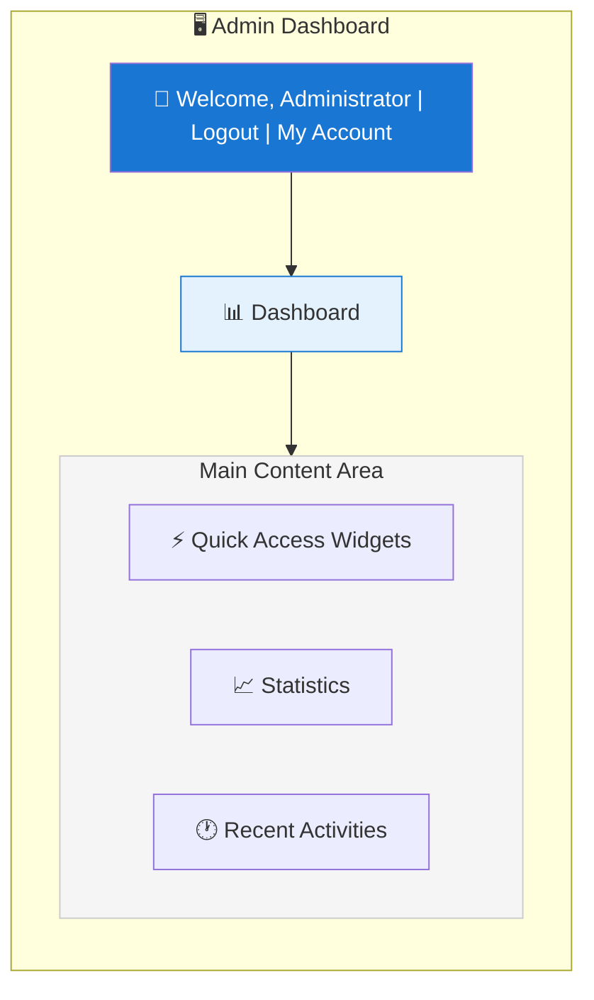
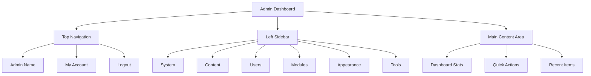

# XOOPS 관리자 패널 개요

XOOPS 관리자 대시보드 탐색 및 사용에 대한 전체 가이드입니다.

## 관리자 패널에 액세스하기

### 관리자 로그인

브라우저를 열고 다음으로 이동하십시오.

```
http://your-domain.com/xoops/admin/
```

또는 XOOPS가 루트에 있는 경우:

```
http://your-domain.com/admin/
```

관리자 자격 증명을 입력하세요:

```
Username: [Your admin username]
Password: [Your admin password]
```

### 로그인 후

기본 관리 대시보드가 표시됩니다.



## 관리자 패널 레이아웃



## 대시보드 구성요소

### 상단 바

상단 표시줄에는 필수 컨트롤이 포함되어 있습니다.

| 요소 | 목적 |
|---|---|
| **관리자 로고** | 대시보드로 돌아가려면 클릭하세요 |
| **환영 메시지** | 로그인한 관리자 이름 표시 |
| **내 계정** | 관리자 프로필 및 비밀번호 편집 |
| **도움말** | 문서 액세스 |
| **로그아웃** | 관리자 패널에서 로그아웃 |

### 왼쪽 탐색 사이드바

기능별로 구성된 메인 메뉴:

```
├── System
│   ├── Dashboard
│   ├── Preferences
│   ├── Admin Users
│   ├── Groups
│   ├── Permissions
│   ├── Modules
│   └── Tools
├── Content
│   ├── Pages
│   ├── Categories
│   ├── Comments
│   └── Media Manager
├── Users
│   ├── Users
│   ├── User Requests
│   ├── Online Users
│   └── User Groups
├── Modules
│   ├── Modules
│   ├── Module Settings
│   └── Module Updates
├── Appearance
│   ├── Themes
│   ├── Templates
│   ├── Blocks
│   └── Images
└── Tools
    ├── Maintenance
    ├── Email
    ├── Statistics
    ├── Logs
    └── Backups
```

### 주요 콘텐츠 영역

선택한 섹션에 대한 정보 및 컨트롤을 표시합니다.

- 구성 양식
- 목록이 포함된 데이터 테이블
- 차트 및 통계
- 빠른 동작 버튼
- 도움말 텍스트 및 도구 설명

### 대시보드 위젯

주요 정보에 대한 빠른 액세스:

- **시스템 정보:** PHP 버전, MySQL 버전, XOOPS 버전
- **빠른 통계:** 사용자 수, 총 게시물, 설치된 모듈
- **최근 활동:** 최근 로그인, 콘텐츠 변경, 오류
- **서버 상태:** CPU, 메모리, 디스크 사용량
- **알림:** 시스템 경고, 보류 중인 업데이트

## 핵심 관리 기능

### 시스템 관리

**위치:** 시스템 > [다양한 옵션]

#### 환경설정

기본 시스템 설정 구성:

```
System > Preferences > [Settings Category]
```

카테고리:
- 일반 설정(사이트 이름, 시간대)
- 사용자 설정(등록, 프로필)
- 이메일 설정(SMTP 구성)
- 캐시 설정(캐싱 옵션)
- URL 설정(친숙한 URL)
- 메타태그(SEO 설정)

기본 구성 및 시스템 설정을 참조하세요.

#### 관리 사용자

관리자 계정 관리:

```
System > Admin Users
```

기능:
- 새로운 관리자 추가
- 관리자 프로필 편집
- 관리자 비밀번호 변경
- 관리자 계정 삭제
- 관리자 권한 설정

### 콘텐츠 관리

**위치:** 콘텐츠 > [다양한 옵션]

#### 페이지/기사

사이트 콘텐츠 관리:

```
Content > Pages (or your module)
```

기능:
- 새 페이지 만들기
- 기존 콘텐츠 편집
- 페이지 삭제
- 게시/게시 취소
- 카테고리 설정
- 개정 관리

#### 카테고리

콘텐츠 정리:

```
Content > Categories
```

기능:
- 카테고리 계층 생성
- 카테고리 편집
- 카테고리 삭제
- 페이지에 할당

#### 댓글

사용자 댓글 검토:

```
Content > Comments
```

기능:
- 모든 댓글 보기
- 댓글 승인
- 댓글 편집
- 스팸 삭제
- 댓글 작성자 차단

### 사용자 관리

**위치:** 사용자 > [다양한 옵션]

#### 사용자

사용자 계정 관리:

```
Users > Users
```

기능:
- 모든 사용자 보기
- 새로운 사용자 생성
- 사용자 프로필 편집
- 계정 삭제
- 비밀번호 재설정
- 사용자 상태 변경
- 그룹에 할당

#### 온라인 사용자

활성 사용자 모니터링:

```
Users > Online Users
```

쇼:
- 현재 온라인 사용자
- 마지막 활동 시간
- IP 주소
- 사용자 위치(구성된 경우)

#### 사용자 그룹

사용자 역할 및 권한 관리:

```
Users > Groups
```

기능:
- 맞춤 그룹 만들기
- 그룹 권한 설정
- 사용자를 그룹에 할당
- 그룹 삭제

### 모듈 관리

**위치:** 모듈 > [다양한 옵션]

#### 모듈

모듈 설치 및 구성:

```
Modules > Modules
```

기능:
- 설치된 모듈 보기
- 모듈 활성화/비활성화
- 모듈 업데이트
- 모듈 설정 구성
- 새 모듈 설치
- 모듈 세부정보 보기

#### 업데이트 확인

```
Modules > Modules > Check for Updates
```

디스플레이:
- 사용 가능한 모듈 업데이트
- 변경 내역
- 다운로드 및 설치 옵션

### 외모관리

**위치:** 외형 > [다양한 옵션]

#### 테마

사이트 테마 관리:

```
Appearance > Themes
```

기능:
- 설치된 테마 보기
- 기본 테마 설정
- 새로운 테마 업로드
- 테마 삭제
- 테마 미리보기
- 테마 구성

#### 블록

콘텐츠 블록 관리:

```
Appearance > Blocks
```

기능:
- 맞춤 블록 만들기
- 블록 내용 편집
- 페이지에 블록 정렬
- 블록 가시성 설정
- 블록 삭제
- 블록 캐싱 구성

#### 템플릿

템플릿 관리(고급):

```
Appearance > Templates
```

고급 사용자 및 개발자용.

### 시스템 도구

**위치:** 시스템 > 도구

#### 유지 관리 모드

유지 관리 중 사용자 액세스 방지:

```
System > Maintenance Mode
```

구성:
- 유지 관리 활성화/비활성화
- 맞춤 유지보수 메시지
- 허용된 IP 주소(테스트용)

#### 데이터베이스 관리

```
System > Database
```

기능:
- 데이터베이스 일관성 확인
- 데이터베이스 업데이트 실행
- 테이블 수리
- 데이터베이스 최적화
- 데이터베이스 구조 내보내기

#### 활동 로그

```
System > Logs
```

모니터:
- 사용자 활동
- 관리적 조치
- 시스템 이벤트
- 오류 로그

## 빠른 작업

대시보드에서 액세스할 수 있는 일반 작업:

```
Quick Links:
├── Create New Page
├── Add New User
├── Create Content Block
├── Upload Image
├── Send Mass Email
├── Update All Modules
└── Clear Cache
```

## 관리자 패널 키보드 단축키

빠른 탐색:

| 바로가기 | 액션 |
|---|---|
| `Ctrl+H` | 도움말로 이동 |
| `Ctrl+D` | 대시보드로 이동 |
| `Ctrl+Q` | 빠른 검색 |
| `Ctrl+L` | 로그아웃 |

## 사용자 계정 관리

### 내 계정

관리자 프로필에 액세스하세요.

1. 오른쪽 상단의 '내 계정'을 클릭하세요.
2. 프로필 정보 편집:
   - 이메일 주소
   - 실명
   - 사용자 정보
   - 아바타

### 비밀번호 변경

관리자 비밀번호를 변경하세요:

1. **내 계정**으로 이동합니다.
2. '비밀번호 변경'을 클릭하세요.
3. 현재 비밀번호를 입력하세요
4. 새로운 비밀번호 입력(2회)
5. '저장'을 클릭하세요.

**보안 팁:**
- 강력한 비밀번호(16자 이상)를 사용하세요.
- 대문자, 소문자, 숫자, 기호 포함
- 90일마다 비밀번호 변경
- 관리자 자격 증명을 절대 공유하지 마세요.

### 로그아웃

관리자 패널에서 로그아웃:

1. 오른쪽 상단의 '로그아웃'을 클릭하세요.
2. 로그인 페이지로 리디렉션됩니다

## 관리자 패널 통계

### 대시보드 통계

사이트 측정항목에 대한 간략한 개요:

| 미터법 | 가치 |
|--------|-------|
| 온라인 사용자 | 12 |
| 총 사용자 | 256 |
| 총 게시물 | 1,234 |
| 총 댓글 | 5,678 |
| 총 모듈 | 8 |

### 시스템 상태

서버 및 성능 정보:

| 구성요소 | 버전/값 |
|-----------|---------------|
| XOOPS 버전 | 2.5.11 |
| PHP 버전 | 8.2.x |
| MySQL 버전 | 8.0.x |
| 서버 로드 | 0.45, 0.42 |
| 가동시간 | 45일 |

### 최근 활동

최근 사건의 타임라인:

```
12:45 - Admin login
12:30 - New user registered
12:15 - Page published
12:00 - Comment posted
11:45 - Module updated
```

## 알림 시스템

### 관리자 알림

다음에 대한 알림 수신:

- 신규 사용자 등록
- 검토를 기다리는 댓글
- 로그인 시도 실패
- 시스템 오류
- 모듈 업데이트 가능
- 데이터베이스 문제
- 디스크 공간 경고

경고 구성:

**시스템 > 환경설정 > 이메일 설정**

```
Notify Admin on Registration: Yes
Notify Admin on Comments: Yes
Notify Admin on Errors: Yes
Alert Email: admin@your-domain.com
```

## 일반적인 관리 작업

### 새 페이지 만들기

1. **콘텐츠 > 페이지**(또는 관련 모듈)로 이동합니다.
2. "새 페이지 추가"를 클릭하세요.
3. 다음 내용을 입력하세요.
   - 제목
   - 내용
   - 설명
   - 카테고리
   - 메타데이터
4. '게시'를 클릭하세요.

### 사용자 관리

1. **사용자 > 사용자**로 이동합니다.
2. 다음을 사용하여 사용자 목록을 봅니다.
   - 사용자 이름
   - 이메일
   - 등록일
   - 마지막 로그인
   - 현황

3. 사용자 이름을 클릭하여 다음을 수행합니다.
   - 프로필 수정
   - 비밀번호 변경
   - 그룹 편집
   - 사용자 차단/차단 해제

### 모듈 구성

1. **모듈 > 모듈**로 이동합니다.
2. 목록에서 모듈 찾기
3. 모듈 이름을 클릭하세요.
4. "기본 설정" 또는 "설정"을 클릭하세요.
5. 모듈 옵션 구성
6. 변경 사항 저장

### 새 블록 만들기

1. **모양 > 블록**으로 이동합니다.
2. "새 블록 추가"를 클릭하세요.
3. 입력:
   - 블록 제목
   - 콘텐츠 차단(HTML 허용)
   - 페이지에서의 위치
   - 가시성(모든 페이지 또는 특정 페이지)
   - 모듈(해당하는 경우)
4. '제출'을 클릭하세요.

## 관리자 패널 도움말

### 내장 문서

관리자 패널에서 도움말에 액세스하세요.

1. 상단 표시줄에서 '도움말' 버튼을 클릭하세요.
2. 현재 페이지에 대한 상황에 맞는 도움말
3. 문서 링크
4. 자주 묻는 질문

### 외부 리소스

- XOOPS 공식 사이트 : https://xoops.org/
- 커뮤니티 포럼 : https://xoops.org/modules/newbb/
- 모듈 저장소: https://xoops.org/modules/repository/
- 버그/이슈: https://github.com/XOOPS/XoopsCore/issues

## 관리자 패널 사용자 정의

### 관리 테마

관리 인터페이스 테마를 선택하세요:

**시스템 > 기본 설정 > 일반 설정**

```
Admin Theme: [Select theme]
```

사용 가능한 테마:
- 기본값(밝음)
- 다크 모드
- 맞춤 테마

### 대시보드 사용자 정의

표시할 위젯을 선택하세요.

**대시보드 > 맞춤설정**

선택:
- 시스템 정보
- 통계
- 최근 활동
- 빠른 링크
- 맞춤 위젯

## 관리자 패널 권한

관리자 수준에 따라 권한이 다릅니다.

| 역할 | 기능 |
|---|---|
| **웹마스터** | 모든 관리 기능에 대한 전체 액세스 |
| **관리자** | 제한된 관리 기능 |
| **사회자** | 콘텐츠 조정 전용 |
| **편집자** | 콘텐츠 생성 및 편집 |

권한 관리:

**시스템 > 권한**

## 관리자 패널을 위한 보안 모범 사례

1. **강력한 비밀번호:** 16자 이상의 비밀번호를 사용하세요.
2. **정기 변경:** 90일마다 비밀번호 변경
3. **액세스 모니터링:** "관리자" 로그를 정기적으로 확인하세요.
4. **액세스 제한:** 추가 보안을 위해 관리 폴더 이름 바꾸기
5. **HTTPS 사용:** 항상 HTTPS를 통해 관리자에 액세스합니다.
6. **IP 화이트리스트:** 특정 IP에 대한 관리자 액세스를 제한합니다.
7. **정기 로그아웃:** 완료 후 로그아웃
8. **브라우저 보안:** 정기적으로 브라우저 캐시 지우기

보안 구성을 참조하세요.

## 문제 해결 관리자 패널

### 관리자 패널에 액세스할 수 없습니다

**해결책:**
1. 로그인 자격 증명 확인
2. 브라우저 캐시 및 쿠키 지우기
3. 다른 브라우저를 사용해 보세요
4. 관리 폴더 경로가 올바른지 확인하세요.
5. 관리 폴더에 대한 파일 권한 확인
6. mainfile.php에서 데이터베이스 연결을 확인하세요.

### 빈 관리 페이지

**해결책:**
```bash
# Check PHP errors
tail -f /var/log/apache2/error.log

# Enable debug mode temporarily
sed -i "s/define('XOOPS_DEBUG', 0)/define('XOOPS_DEBUG', 1)/" /var/www/html/xoops/mainfile.php

# Check file permissions
ls -la /var/www/html/xoops/admin/
```

### 느린 관리 패널

**해결책:**
1. 캐시 지우기: **시스템 > 도구 > 캐시 지우기**
2. 데이터베이스 최적화: **시스템 > 데이터베이스 > 최적화**
3. 서버 리소스 확인 : `htop`
4. MySQL의 느린 쿼리 검토

### 모듈이 표시되지 않음

**해결책:**
1. 설치된 모듈 확인: **모듈 > 모듈**
2. 모듈이 활성화되어 있는지 확인하십시오.
3. 할당된 권한 확인
4. 모듈 파일이 있는지 확인하세요.
5. 오류 로그 검토

## 다음 단계

관리자 패널에 익숙해진 후:

1. 첫 번째 페이지 만들기
2. 사용자 그룹 설정
3. 추가 모듈 설치
4. 기본 설정 구성
5. 보안 구현

---

**태그:** #관리 패널 #대시보드 #탐색 #시작하기

**관련 기사:**
-../구성/기본-구성
-../구성/시스템 설정
- 첫 페이지 만들기
- 관리-사용자
- 모듈 설치
