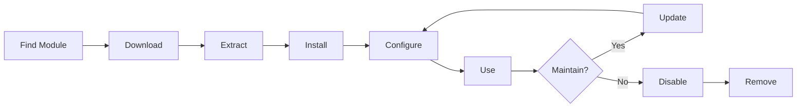

# XOOPS 모듈 설치 및 관리

모듈을 설치하고 구성하여 XOOPS 기능을 확장하는 방법을 알아보세요.

## XOOPS 모듈 이해

### 모듈이란 무엇입니까?

모듈은 XOOPS에 기능을 추가하는 확장입니다.

| 유형 | 목적 | 예 |
|---|---|---|
| **콘텐츠** | 특정 콘텐츠 유형 관리 | 뉴스, 블로그, 티켓 |
| **커뮤니티** | 사용자 상호작용 | 포럼, 의견, 리뷰 |
| **전자상거래** | 판매상품 | 쇼핑, 장바구니, 결제 |
| **미디어** | 파일/이미지 처리 | 갤러리, 다운로드, 비디오 |
| **유틸리티** | 도구 및 도우미 | 이메일, 백업, 분석 |

### 코어 및 옵션 모듈

| 모듈 | 유형 | 포함됨 | 이동식 |
|---|---|---|---|
| **시스템** | 코어 | 예 | 아니요 |
| **사용자** | 코어 | 예 | 아니요 |
| **프로필** | 추천 | 예 | 예 |
| **PM(개인 메시지)** | 추천 | 예 | 예 |
| **WF-채널** | 선택사항 | 자주 | 예 |
| **뉴스** | 선택사항 | 아니요 | 예 |
| **포럼** | 선택사항 | 아니요 | 예 |

## 모듈 수명주기



## 모듈 찾기

### XOOPS 모듈 저장소

공식 XOOPS 모듈 저장소:

**방문:** https://xoops.org/modules/repository/

```
Directory > Modules > [Browse Categories]
```

카테고리별로 찾아보기:
- 콘텐츠 관리
- 커뮤니티
- 전자상거래
- 멀티미디어
- 개발
- 사이트 관리

### 모듈 평가

설치하기 전에 다음을 확인하십시오.

| Criteria | 무엇을 찾아야 할까요 |
|---|---|
| **호환성** | XOOPS 버전에서 작동 |
| **평점** | 좋은 사용자 리뷰 및 평가 |
| **업데이트** | 최근 유지관리 |
| **다운로드** | 대중적이고 널리 사용됨 |
| **요구사항** | 귀하의 서버와 호환 가능 |
| **라이센스** | GPL 또는 유사한 오픈 소스 |
| **지원** | 활동적인 개발자 및 커뮤니티 |

### 모듈 정보 읽기

각 모듈 목록에는 다음이 표시됩니다.

```
Module Name: [Name]
Version: [X.X.X]
Requires: XOOPS [Version]
Author: [Name]
Last Update: [Date]
Downloads: [Number]
Rating: [Stars]
Description: [Brief description]
Compatibility: PHP [Version], MySQL [Version]
```

## 모듈 설치

### 방법 1: 관리자 패널 설치

**1단계: 모듈 섹션에 액세스**

1. 관리자 패널에 로그인
2. **모듈 > 모듈**로 이동합니다.
3. **"새 모듈 설치"** 또는 **"모듈 찾아보기"**를 클릭하세요.

**2단계: 모듈 업로드**

옵션 A - 직접 업로드:
1. **"파일 선택"**을 클릭하세요.
2. 컴퓨터에서 모듈.zip 파일을 선택합니다.
3. **"업로드"**를 클릭하세요.

옵션 B - URL 업로드:
1. 모듈 URL 붙여넣기
2. **"다운로드 및 설치"**를 클릭하세요.

**3단계: 모듈 정보 검토**

```
Module Name: [Name shown]
Version: [Version]
Author: [Author info]
Description: [Full description]
Requirements: [PHP/MySQL versions]
```

검토 후 **"설치 진행"**을 클릭하세요.

**4단계: 설치 유형 선택**

```
☐ Fresh Install (New installation)
☐ Update (Upgrade existing)
☐ Delete Then Install (Replace existing)
```

적절한 옵션을 선택하십시오.

**5단계: 설치 확인**

최종 확인 검토:
```
Module will be installed to: /modules/modulename/
Database: xoops_db
Proceed? [Yes] [No]
```

**"예"**를 클릭하여 확인하세요.

**6단계: 설치 완료**

```
Installation successful!

Module: [Module Name]
Version: [Version]
Tables created: [Number]
Files installed: [Number]

[Go to Module Settings]  [Return to Modules]
```

### 방법 2: 수동 설치(고급)

수동 설치 또는 문제 해결:

**1단계: 모듈 다운로드**

1. 저장소에서 모듈.zip을 다운로드합니다.
2. `/var/www/html/xoops/modules/modulename/`으로 추출

```bash
# Extract module
unzip module_name.zip
cp -r module_name /var/www/html/xoops/modules/

# Set permissions
chmod -R 755 /var/www/html/xoops/modules/module_name
```

**2단계: 설치 스크립트 실행**

```
Visit: http://your-domain.com/xoops/modules/module_name/admin/index.php?op=install
```

또는 관리자 패널(시스템 > 모듈 > DB 업데이트)을 통해.

**3단계: 설치 확인**

1. 관리자 메뉴에서 **모듈 > 모듈**로 이동합니다.
2. 목록에서 모듈을 찾으세요.
3. "활성"으로 표시되는지 확인하세요.

## 모듈 구성

### 액세스 모듈 설정

1. **모듈 > 모듈**로 이동합니다.
2. 모듈 찾기
3. 모듈 이름을 클릭하세요.
4. **"기본 설정"** 또는 **"설정"**을 클릭하세요.

### 공통 모듈 설정

대부분의 모듈은 다음을 제공합니다.

```
Module Status: [Enabled/Disabled]
Display in Menu: [Yes/No]
Module Weight: [1-999] (display order)
Visible To Groups: [Checkboxes for user groups]
```

### 모듈별 옵션

각 모듈에는 고유한 설정이 있습니다. 예:

**뉴스 모듈:**
```
Items Per Page: 10
Show Author: Yes
Allow Comments: Yes
Moderation Required: Yes
```

**포럼 모듈:**
```
Topics Per Page: 20
Posts Per Page: 15
Maximum Attachment Size: 5MB
Enable Signatures: Yes
```

**갤러리 모듈:**
```
Images Per Page: 12
Thumbnail Size: 150x150
Maximum Upload: 10MB
Watermark: Yes/No
```

특정 옵션에 대해서는 모듈 문서를 검토하세요.

### 구성 저장

설정을 조정한 후:

1. **"제출"** 또는 **"저장"**을 클릭하세요.
2. 확인 메시지가 표시됩니다.
   ```
   Settings saved successfully!
   ```

## 모듈 블록 관리

많은 모듈은 위젯과 같은 콘텐츠 영역인 "블록"을 생성합니다.

### 모듈 블록 보기

1. **모양 > 블록**으로 이동합니다.
2. 모듈에서 블록을 찾으세요.
3. 대부분의 모듈에는 "[모듈 이름] - [블록 설명]"이 표시됩니다.

### 블록 구성

1. 블록 이름을 클릭하세요.
2. 조정:
   - 블록 제목
   - 가시성(모든 페이지 또는 특정 페이지)
   - 페이지 위치(왼쪽, 가운데, 오른쪽)
   - 볼 수 있는 사용자 그룹
3. **"제출"**을 클릭하세요.

### 홈페이지에 표시 차단

1. **모양 > 블록**으로 이동합니다.
2. 원하는 블록을 찾아보세요
3. **"수정"**을 클릭하세요.
4. 설정:
   - **공개 대상:** 그룹 선택
   - **위치:** 열 선택(왼쪽/가운데/오른쪽)
   - **페이지:** 홈페이지 또는 전체 페이지
5. **"제출"**을 클릭하세요.

## 특정 모듈 설치 예

### 뉴스 모듈 설치

**완벽한 용도:** 블로그 게시물, 공지사항

1. 저장소에서 뉴스 모듈을 다운로드합니다.
2. **모듈 > 모듈 > 설치**를 통해 업로드하세요.
3. **모듈 > 뉴스 > 기본 설정**에서 구성합니다.
   - 페이지당 스토리 수: 10
   - 댓글 허용 : 있음
   - 게시 전 승인: 예
4. 최신 뉴스 블록 생성
5. 스토리 게시를 시작하세요!

### 포럼 모듈 설치

**완벽한 용도:** 커뮤니티 토론

1. 포럼 모듈 다운로드
2. 관리자 패널을 통해 설치
3. 모듈에서 포럼 카테고리 생성
4. 설정 구성:
   - 주제/페이지: 20
   - 게시물/페이지: 15
   - 조정 활성화: 예
5. 사용자 그룹 권한 할당
6. 최신 주제에 대한 블록 생성

### 갤러리 모듈 설치

**완벽한 용도:** 이미지 쇼케이스

1. 갤러리 모듈 다운로드
2. 설치 및 구성
3. 사진 앨범 만들기
4. 이미지 업로드
5. 보기/업로드 권한 설정
6. 웹사이트에 갤러리 표시

## 모듈 업데이트

### 업데이트 확인

```
Admin Panel > Modules > Modules > Check for Updates
```

이는 다음을 보여줍니다.
- 사용 가능한 모듈 업데이트
- 현재 버전과 새 버전
- 변경 내역/릴리스 노트

### 모듈 업데이트

1. **모듈 > 모듈**로 이동합니다.
2. 사용 가능한 업데이트가 있는 모듈을 클릭합니다.
3. **"업데이트"** 버튼을 클릭하세요
4. 설치 유형에서 **"업데이트"를 선택**
5. 설치 마법사를 따르세요.
6. 모듈이 업데이트되었습니다!

### 중요 업데이트 참고 사항

업데이트 전:

- [ ] 백업 데이터베이스
- [ ] 백업 모듈 파일
- [ ] 변경 로그 검토
- [ ] 먼저 스테이징 서버에서 테스트
- [ ] 사용자 정의 수정 사항을 기록합니다.

업데이트 후:
- [ ] 기능 확인
- [ ] 모듈 설정 확인
- [ ] 경고/오류 검토
- [ ] 캐시 지우기

## 모듈 권한

### 사용자 그룹 액세스 할당

모듈에 액세스할 수 있는 사용자 그룹을 제어합니다.

**위치:** 시스템 > 권한

각 모듈에 대해 다음을 구성합니다.

```
Module: [Module Name]

Admin Access: [Select groups]
User Access: [Select groups]
Read Permission: [Groups allowed to view]
Write Permission: [Groups allowed to post]
Delete Permission: [Administrators only]
```

### 일반적인 권한 수준

```
Public Content (News, Pages):
├── Admin Access: Webmaster
├── User Access: All logged-in users
└── Read Permission: Everyone

Community Features (Forum, Comments):
├── Admin Access: Webmaster, Moderators
├── User Access: All logged-in users
└── Write Permission: All logged-in users

Admin Tools:
├── Admin Access: Webmaster only
└── User Access: Disabled
```

## 모듈 비활성화 및 제거

### 모듈 비활성화(파일 유지)

모듈을 유지하지만 사이트에서는 숨깁니다.

1. **모듈 > 모듈**로 이동합니다.
2. 모듈 찾기
3. 모듈 이름을 클릭하세요.
4. **"비활성화"**를 클릭하거나 상태를 비활성으로 설정하세요.
5. 모듈은 숨겨져 있지만 데이터는 보존됩니다.

언제든지 다시 활성화하세요.
1. 모듈을 클릭하세요.
2. **"활성화"**를 클릭하세요.

### 모듈을 완전히 제거

모듈 및 해당 데이터 삭제:

1. **모듈 > 모듈**로 이동합니다.
2. 모듈 찾기
3. **"제거"** 또는 **"삭제"**를 클릭하세요.
4. 확인: "모듈과 모든 데이터를 삭제하시겠습니까?"
5. **"예"**를 클릭하여 확인하세요.

**경고:** 제거하면 모든 모듈 데이터가 삭제됩니다!

### 제거 후 다시 설치

모듈을 제거하는 경우:
- 모듈 파일이 삭제되었습니다.
- 데이터베이스 테이블이 삭제되었습니다.
- 모든 데이터가 손실되었습니다.
- 다시 사용하려면 다시 설치해야 합니다.
- 백업에서 복원 가능

## 모듈 설치 문제 해결

### 설치 후 모듈이 표시되지 않음

**증상:** 모듈이 나열되었으나 사이트에 표시되지 않음

**해결책:**
```
1. Check module is "Active" (Modules > Modules)
2. Enable module blocks (Appearance > Blocks)
3. Verify user permissions (System > Permissions)
4. Clear cache (System > Tools > Clear Cache)
5. Check .htaccess doesn't block module
```

### 설치 오류: "테이블이 이미 존재합니다."

**증상:** 모듈 설치 중 오류 발생

**해결책:**
```
1. Module partially installed before
2. Try "Delete then Install" option
3. Or uninstall first, then install fresh
4. Check database for existing tables:
   mysql> SHOW TABLES LIKE 'xoops_module%';
```

### 모듈 누락 종속성

**증상:** 모듈이 설치되지 않음 - 다른 모듈이 필요함

**해결책:**
```
1. Note required modules from error message
2. Install required modules first
3. Then install the module
4. Install in correct order
```

### 모듈에 접근할 때 빈 페이지

**증상:** 모듈이 로드되지만 아무것도 표시되지 않습니다.

**해결책:**
```
1. Enable debug mode in mainfile.php:
   define('XOOPS_DEBUG', 1);

2. Check PHP error log:
   tail -f /var/log/php_errors.log

3. Verify file permissions:
   chmod -R 755 /var/www/html/xoops/modules/modulename

4. Check database connection in module config

5. Disable module and reinstall
```

### 모듈 중단 사이트

**증상:** 모듈을 설치하면 웹사이트가 중단됩니다.

**해결책:**
```
1. Disable the problematic module immediately:
   Admin > Modules > [Module] > Disable

2. Clear cache:
   rm -rf /var/www/html/xoops/cache/*
   rm -rf /var/www/html/xoops/templates_c/*

3. Restore from backup if needed

4. Check error logs for root cause

5. Contact module developer
```

## 모듈 보안 고려 사항

### 신뢰할 수 있는 소스에서만 설치

```
✓ Official XOOPS Repository
✓ GitHub official XOOPS modules
✓ Trusted module developers
✗ Unknown websites
✗ Unverified sources
```

### 모듈 권한 확인

설치 후:

1. 의심스러운 활동에 대한 모듈 코드 검토
2. 데이터베이스 테이블에 이상이 있는지 확인하세요.
3. 파일 변경 사항 모니터링
4. 모듈을 최신 상태로 유지하세요
5. 사용하지 않는 모듈 제거

### 권한 모범 사례

```
Module directory: 755 (readable, not writable by web server)
Module files: 644 (readable only)
Module data: Protected by database
```

## 모듈 개발 리소스

### 모듈 개발 알아보기

- 공식 문서: https://xoops.org/
- GitHub 저장소: https://github.com/XOOPS/
- 커뮤니티 포럼 : https://xoops.org/modules/newbb/
- 개발자 가이드: docs 폴더에 있음

## 모듈 모범 사례

1. **한 번에 하나씩 설치:** 충돌 모니터링
2. **설치 후 테스트:** 기능 확인
3. **사용자 정의 구성 문서화:** 설정을 기록해 두십시오.
4. **업데이트 유지:** 모듈 업데이트를 즉시 설치합니다.
5. **사용하지 않는 모듈 제거:** 필요하지 않은 모듈 삭제
6. **이전 백업:** 설치 전 항상 백업
7. **문서 읽기:** 모듈 지침을 확인하세요.
8. **커뮤니티 가입:** 필요한 경우 도움을 요청하세요.

## 모듈 설치 체크리스트

각 모듈 설치에 대해:

- [ ] 조사 및 리뷰 읽기
- [ ] XOOPS 버전 호환성 확인
- [ ] 데이터베이스 및 파일 백업
- [ ] 최신 버전 다운로드
- [ ] 관리자 패널을 통해 설치
- [ ] 설정 구성
- [ ] 블록 생성/위치 지정
- [ ] 사용자 권한 설정
- [ ] 테스트 기능
- [ ] 문서 구성
- [ ] 업데이트 일정

## 다음 단계

모듈을 설치한 후:

1. 모듈용 콘텐츠 만들기
2. 사용자 그룹 설정
3. 관리 기능 살펴보기
4. 성능 최적화
5. 필요에 따라 추가 모듈을 설치합니다.

---

**태그:** #모듈 #설치 #확장 #관리

**관련 기사:**
- 관리자 패널 개요
- 관리-사용자
- 첫 페이지 만들기
-../구성/시스템 설정
