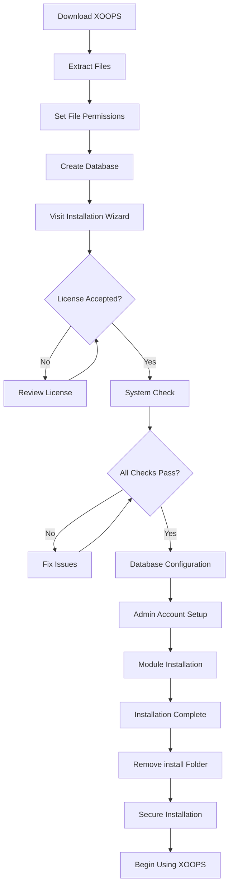

# 완전한 XOOPS 설치 가이드

이 가이드는 설치 마법사를 사용하여 처음부터 XOOPS를 설치하는 방법에 대한 포괄적인 연습을 제공합니다.

## 전제 조건

설치를 시작하기 전에 다음 사항을 확인하십시오.

- FTP 또는 SSH를 통해 웹 서버에 액세스
- 데이터베이스 서버에 대한 관리자 액세스
- 등록된 도메인 이름
- 서버 요구 사항 확인
- 사용 가능한 백업 도구

## 설치 과정



## 단계별 설치

### 1단계: XOOPS 다운로드

[https://xoops.org/](https://xoops.org/)에서 최신 버전을 다운로드하세요.

```bash
# Using wget
wget https://xoops.org/download/xoops-2.5.8.zip

# Using curl
curl -O https://xoops.org/download/xoops-2.5.8.zip
```

### 2단계: 파일 추출

XOOPS 아카이브를 웹 루트로 추출합니다.

```bash
# Navigate to web root
cd /var/www/html

# Extract XOOPS
unzip xoops-2.5.8.zip

# Rename folder (optional, but recommended)
mv xoops-2.5.8 xoops
cd xoops
```

### 3단계: 파일 권한 설정

XOOPS 디렉터리에 대한 적절한 권한을 설정합니다.

```bash
# Make directories writable (755 for dirs, 644 for files)
find . -type d -exec chmod 755 {} \;
find . -type f -exec chmod 644 {} \;

# Make specific directories writable by web server
chmod 777 uploads/
chmod 777 templates_c/
chmod 777 var/
chmod 777 cache/

# Secure mainfile.php after installation
chmod 644 mainfile.php
```

### 4단계: 데이터베이스 생성

MySQL을 사용하여 XOOPS용 새 데이터베이스를 만듭니다.

```sql
-- Create database
CREATE DATABASE xoops_db CHARACTER SET utf8mb4 COLLATE utf8mb4_unicode_ci;

-- Create user
CREATE USER 'xoops_user'@'localhost' IDENTIFIED BY 'secure_password_here';

-- Grant privileges
GRANT ALL PRIVILEGES ON xoops_db.* TO 'xoops_user'@'localhost';
FLUSH PRIVILEGES;
```

또는 phpMyAdmin을 사용하여:

1. phpMyAdmin에 로그인하세요.
2. "데이터베이스" 탭을 클릭하세요.
3. 데이터베이스 이름을 입력하세요: `xoops_db`
4. "utf8mb4_unicode_ci" 데이터 정렬을 선택합니다.
5. "만들기"를 클릭하세요
6. 데이터베이스와 동일한 이름을 가진 사용자를 생성합니다.
7. 모든 권한 부여

### 5단계: 설치 마법사 실행

브라우저를 열고 다음으로 이동하십시오.

```
http://your-domain.com/xoops/install/
```

#### 시스템 점검 단계

마법사는 서버 구성을 확인합니다.

- PHP 버전 >= 5.6.0
- MySQL/MariaDB 사용 가능
- 필수 PHP 확장(GD, PDO 등)
- 디렉토리 권한
- 데이터베이스 연결

**검사에 실패한 경우:**

해결 방법은 #공통 설치 문제 섹션을 참조하세요.

#### 데이터베이스 구성

데이터베이스 자격 증명을 입력하세요:

```
Database Host: localhost
Database Name: xoops_db
Database User: xoops_user
Database Password: [your_secure_password]
Table Prefix: xoops_
```

**중요 사항:**
- 데이터베이스 호스트가 로컬 호스트(예: 원격 서버)와 다른 경우 올바른 호스트 이름을 입력하세요.
- 하나의 데이터베이스에서 여러 XOOPS 인스턴스를 실행하는 경우 테이블 접두사가 도움이 됩니다.
- 대소문자, 숫자, 기호가 혼합된 강력한 비밀번호를 사용하세요.

#### 관리자 계정 설정

관리자 계정을 만드세요:

```
Admin Username: admin (or choose custom)
Admin Email: admin@your-domain.com
Admin Password: [strong_unique_password]
Confirm Password: [repeat_password]
```

**모범 사례:**
- "admin"이 아닌 고유한 사용자 이름을 사용하십시오.
- 16자 이상의 비밀번호를 사용하세요
- 안전한 비밀번호 관리자에 자격 증명 저장
- 관리자 자격 증명을 절대 공유하지 마세요.

#### 모듈 설치

설치할 기본 모듈을 선택하세요:

- **시스템 모듈**(필수) - 핵심 XOOPS 기능
- **사용자 모듈**(필수) - 사용자 관리
- **프로필 모듈**(권장) - 사용자 프로필
- **PM(개인 메시지) 모듈**(권장) - 내부 메시징
- **WF-채널 모듈**(선택 사항) - 콘텐츠 관리

전체 설치를 위해 권장 모듈을 모두 선택하세요.

### 6단계: 설치 완료

모든 단계를 마치면 확인 화면이 표시됩니다.

```
Installation Complete!

Your XOOPS installation is ready to use.
Admin Panel: http://your-domain.com/xoops/admin/
User Panel: http://your-domain.com/xoops/
```

### 7단계: 설치 보안

#### 설치 폴더 제거

```bash
# Remove the install directory (CRITICAL for security)
rm -rf /var/www/html/xoops/install/

# Or rename it
mv /var/www/html/xoops/install/ /var/www/html/xoops/install.bak
```

**경고:** 프로덕션 환경에서 설치 폴더에 액세스할 수 있도록 두지 마십시오!

#### 보안 mainfile.php

```bash
# Make mainfile.php read-only
chmod 644 /var/www/html/xoops/mainfile.php

# Set ownership
chown www-data:www-data /var/www/html/xoops/mainfile.php
```

#### 적절한 파일 권한 설정

```bash
# Recommended production permissions
find . -type f -name "*.php" -exec chmod 644 {} \;
find . -type d -exec chmod 755 {} \;

# Writable directories for web server
chmod 777 uploads/ var/ cache/ templates_c/
```

#### HTTPS/SSL 활성화

웹 서버(nginx 또는 Apache)에서 SSL을 구성합니다.

**Apache의 경우:**
```apache
<VirtualHost *:443>
    ServerName your-domain.com
    DocumentRoot /var/www/html/xoops

    SSLEngine on
    SSLCertificateFile /etc/ssl/certs/your-cert.crt
    SSLCertificateKeyFile /etc/ssl/private/your-key.key

    # Force HTTPS redirect
    <IfModule mod_rewrite.c>
        RewriteEngine On
        RewriteCond %{HTTPS} off
        RewriteRule ^(.*)$ https://%{HTTP_HOST}%{REQUEST_URI} [L,R=301]
    </IfModule>
</VirtualHost>
```

## 설치 후 구성

### 1. 관리자 패널에 접속하세요

다음으로 이동하세요:
```
http://your-domain.com/xoops/admin/
```

관리자 자격 증명으로 로그인하세요.

### 2. 기본 설정 구성

다음을 구성합니다.

- 사이트 이름 및 설명
- 관리자 이메일 주소
- 시간대 및 날짜 형식
- 검색 엔진 최적화

### 3. 테스트 설치

- [ ] 홈페이지 방문
- [ ] 모듈 로드 확인
- [ ] 사용자 등록이 작동하는지 확인
- [ ] 관리자 패널 기능 테스트
- [ ] SSL/HTTPS 작동 확인

### 4. 백업 예약

자동 백업 설정:

```bash
# Create backup script (backup.sh)
#!/bin/bash
DATE=$(date +%Y%m%d_%H%M%S)
BACKUP_DIR="/backups/xoops"
XOOPS_DIR="/var/www/html/xoops"

# Backup database
mysqldump -u xoops_user -p[password] xoops_db > $BACKUP_DIR/db_$DATE.sql

# Backup files
tar -czf $BACKUP_DIR/files_$DATE.tar.gz $XOOPS_DIR

echo "Backup completed: $DATE"
```

cron으로 예약:
```bash
# Daily backup at 2 AM
0 2 * * * /usr/local/bin/backup.sh
```

## 일반적인 설치 문제

### 문제: 권한 거부 오류

**증상:** 파일을 업로드하거나 생성할 때 "권한이 거부되었습니다"

**해결책:**
```bash
# Check web server user
ps aux | grep apache  # For Apache
ps aux | grep nginx   # For Nginx

# Fix permissions (replace www-data with your web server user)
chown -R www-data:www-data /var/www/html/xoops
chmod -R 755 /var/www/html/xoops
chmod 777 uploads/ var/ cache/ templates_c/
```

### 문제: 데이터베이스 연결 실패

**증상:** "데이터베이스 서버에 연결할 수 없습니다."

**해결책:**
1. 설치 마법사에서 데이터베이스 자격 증명을 확인합니다.
2. MySQL/MariaDB가 실행 중인지 확인합니다.
   ```bash
   service mysql status  # or mariadb
   ```
3. 데이터베이스가 있는지 확인합니다.
   ```sql
   SHOW DATABASES;
   ```
4. 명령줄에서 연결을 테스트합니다.
   ```bash
   mysql -h localhost -u xoops_user -p xoops_db
   ```

### 문제: 빈 흰색 화면

**증상:** XOOPS를 방문하면 빈 페이지가 표시됩니다.

**해결책:**
1. PHP 오류 로그를 확인하세요.
   ```bash
   tail -f /var/log/apache2/error.log
   ```
2. mainfile.php에서 디버그 모드를 활성화합니다:
   ```php
   define('XOOPS_DEBUG', 1);
   ```
3. mainfile.php 및 구성 파일에 대한 파일 권한을 확인하세요.
4. PHP-MySQL 확장이 설치되어 있는지 확인

### 문제: 업로드 디렉터리에 쓸 수 없습니다.

**증상:** 업로드 기능이 실패하고 "업로드에 쓸 수 없습니다/"

**해결책:**
```bash
# Check current permissions
ls -la uploads/

# Fix permissions
chmod 777 uploads/
chown www-data:www-data uploads/

# For specific files
chmod 644 uploads/*
```

### 문제: PHP 확장이 누락되었습니다.

**증상:** 확장 프로그램(GD, MySQL 등)이 누락되어 시스템 검사가 실패합니다.

**솔루션(Ubuntu/Debian):**
```bash
# Install PHP GD library
apt-get install php-gd

# Install PHP MySQL support
apt-get install php-mysql

# Restart web server
systemctl restart apache2  # or nginx
```

**솔루션(CentOS/RHEL):**
```bash
# Install PHP GD library
yum install php-gd

# Install PHP MySQL support
yum install php-mysql

# Restart web server
systemctl restart httpd
```

### 문제: 느린 설치 프로세스

**증상:** 설치 마법사 시간이 초과되거나 매우 느리게 실행됩니다.

**해결책:**
1. php.ini에서 PHP 시간 제한을 늘립니다.
   ```ini
   max_execution_time = 300  # 5 minutes
   ```
2. MySQL max_allowed_packet을 늘립니다.
   ```sql
   SET GLOBAL max_allowed_packet = 256M;
   ```
3. 서버 리소스를 확인합니다.
   ```bash
   free -h  # Check RAM
   df -h    # Check disk space
   ```

### 문제: 관리자 패널에 액세스할 수 없음

**증상:** 설치 후 관리자 패널에 액세스할 수 없습니다.

**해결책:**
1. 데이터베이스에 관리 사용자가 있는지 확인합니다.
   ```sql
   SELECT * FROM xoops_users WHERE uid = 1;
   ```
2. 브라우저 캐시 및 쿠키 지우기
3. 세션 폴더에 쓰기 가능한지 확인하십시오.
   ```bash
   chmod 777 var/
   ```
4. htaccess 규칙이 관리자 액세스를 차단하지 않는지 확인

## 확인 체크리스트

설치 후 다음을 확인하십시오.

- [x] XOOPS 홈페이지가 올바르게 로드됩니다.
- [x] 관리자 패널은 /xoops/admin/에서 액세스할 수 있습니다.
- [x] SSL/HTTPS가 작동 중입니다.
- [x] 설치 폴더가 제거되었거나 액세스할 수 없습니다.
- [x] 파일 권한이 안전합니다(파일의 경우 644, 디렉토리의 경우 755).
- [x] 데이터베이스 백업이 예약되었습니다.
- [x] 오류 없이 모듈이 로드됩니다.
- [x] 사용자 등록 시스템이 작동합니다.
- [x] 파일 업로드 기능이 작동합니다.
- [x] 이메일 알림이 제대로 전송됩니다.

## 다음 단계

설치가 완료되면:

1. 기본 구성 가이드를 읽어보세요.
2. 설치 보안
3. 관리자 패널 탐색
4. 추가 모듈 설치
5. 사용자 그룹 및 권한 설정

---

**태그:** #설치 #설정 #시작하기 #문제해결

**관련 기사:**
- 서버 요구 사항
- 업그레이드-XOOPS
-../구성/보안-구성
